# 00 · 文档总索引（系统导航）

> 本文件是 WildSpatial 教学文档的**总目录与阅读地图**。先看它，再决定读哪篇、按什么顺序读。
> 目标读者：想系统学「空间感知 / SLAM / 3D 视觉」、并最终能落地的**初学者 → 专业人员**。
> 本仓库明确服务两类起点：① 零基础；② **已懂机器学习/深度学习/一般 CS，想转 3D 视觉**（见 `F4`）。

---

## 一、文档分三层、两种难度

| 类型 | 文件 | 难度 | 适合谁 |
|---|---|---|---|
| **入门 / 总纲**（`00_` 开头） | `00_PRIMER` / `00_QUICKSTART` / `00_LANDSCAPE` / `00_ROADMAP` | 大白话、零公式 | 所有人，尤其零基础 |
| **数据台账** | `DATASETS` | **详解 + 真实样例图** | 想了解"每个数据集是什么、能做什么任务" |
| **基础篇**（`F0`–`F9`） | 见下表 | 初学者友好、一般场景 | **已懂 ML/DL 的转行者的主入口**；零基础补地基 |
| **模块文档**（`M0`–`M9`） | 见下表 | 分两派 ↓ | — |

模块文档有**两种写法并存**（项目强制「四段式」+ 初学者友好双轨）：

- **专家笔记版**（含公式推导、需一定基础）：`M0` `M1` `M3`
- **初学者版**（类比 + 零公式 + 钉真实图/数）：`M2` `M4` `M5` `M6` `M7` `M8` `M9`

> ⚠️ **关键顺序提醒**：M0/M1/M3 是地基但写成了专家笔记。**零基础/转行者请先读 `00_PRIMER` + `F0–F4` 基础篇 + M2/M4/M5/M6/M7/M8/M9 初学者版**，建立直觉后再回头啃 M0/M1/M3 的公式——不要一上来撞李群。

---

## 二、各模块七维覆盖一览

你关心的「系统 / 易懂 / 实例 / 效果 / 原理 / 作用 / 应用」是否齐备：

| 文档 | 原理 | 实例讲解 | 效果展示 | 作用介绍 | 实际应用 |
|---|---|---|---|---|---|
| `00_PRIMER` | ✅概念词典 | ✅生活类比 | 引真实图 | ✅M0–M9 映射 | ◐路线图 |
| `00_QUICKSTART` | ◐ | ✅跑命令+图 | ✅6 图 | ✅项目定位 | ◐ |
| `00_LANDSCAPE` | ✅四段 | ✅ | ✅ | ✅ | ✅端侧切入 |
| `F0 相机投影` | ✅ | ✅numpy 可跑 | ✅引 M0 图 | ✅ | ✅已补 |
| `F1 场景表示` | ✅全家桶 | ✅类比+选型 | ✅引 M2/M4 图 | ✅ | ✅已补 |
| `F2 深度基础` | ✅ | ✅公式自洽 | ✅引 M4 图 | ✅ | ✅已补 |
| `F3 正常流程` | ✅标准流水线 | ✅拼图类比 | ✅引 M1/M2 图 | ✅全栈目录 | ✅已补 |
| `F4 ML/DL 桥接` | ✅映射表 | ✅心智模型 | ✅引 M4/M7 图 | ✅ | ✅竞争力 |
| `F5 视觉+雷达融合` | ✅标定/投影/3 架构 | ✅鉴定师×卷尺类比 | ✅可跑投影 demo 图 | ✅量产范式 | ✅自动驾驶/AMR/水下 |
| `F6 决策与控制` | ✅WorldModel/costmap/规划/控制/兜底 | ✅轮椅坦克×PID 类比 | ✅引 P1/P2 图 | ✅感知控制后半段 | ✅Nav2/AMR/兜底 |
| `F7 硬件扫盲` | ✅器官清单/选型口诀/数据形态 | ✅五官×大脑×手脚×神经类比 | ✅引 P2/KITTI 图 | ✅硬件→算法衔接 | ✅园区机器人选型清单 |
| `F8 全栈贯通` | ✅同一任务串全栈/9 时刻/真实图 | ✅一镜到底×器官地图类比 | ✅引 P2/KITTI/M1/M7 等真实图 | ✅碎片→一条线 | ✅园区夜间配送全链路 |
| `F9 方法选型与工程清单` | ✅单目/双目/检测/雷达/表示 逐族选型 | ✅四联表（定位/精度/算力/数据量） | ✅钉本项目实测（M5/M10/P4/M8） | ✅「该不该用、用得起吗」 | ✅数据量·类别·OOD·算力·工程坑 |
| `M0 几何地基` | ✅✅公式 | ✅6 图 | ✅ | ✅ | ⬜（基础，通用） |
| `M1 SfM/VO` | ✅✅ | ✅10+ 图 | ✅ | ✅ | ⬜（基础，通用） |
| `M2 深度与重建` | ✅ | ✅三级跳类比 | ✅recon.png | ✅ | ✅已补 |
| `M3 失效归因` | ✅四段 | ✅ | ✅3 图 | ✅ | ◐ |
| `M4 前馈 3D 模型` | ✅ | ✅一体化类比 | ✅depth 图 | ✅ | ✅已补 |
| `M5 压力测试` | ✅ | ✅热力图 | ✅ | ✅ | ✅已补 |
| `M7 语义层` | ✅ | ✅ | ✅ | ✅ | ✅已补 |
| `M8 端侧部署` | ✅ | ✅（本机缩预算仿真 + INT8 PTQ 真跑） | ✅（量级+真实验证） | ✅ | ✅已补（三维表 + PTQ 已实测） |
| `M6 多模态融合` | ✅ | ✅融合对照表 | ✅guard 图 | ✅ | ✅已补（低光救援区 96%） |
| `M9 综合闭环` | ✅ | ✅场景图 | ✅scene_graph 图 | ✅ | ✅已补（VO 9.8 fps @ CPU） |
| `P0 实战项目` | ✅ | ✅多场景数据集×M-module | ✅overview 图 | ✅ | ✅已补（4 项目跑通，逻辑自洽可复现） |
| `P1 工程叙事` | ✅ | ✅四场景 + 初学者常漏环节 | ✅map_plan/control_cmd | ✅ | ✅已补（感知→规划→控制 闭环实跑） |
| `P2 闭环仿真` | ✅ | ✅表示谱系 + 成熟度谱系 | ✅navfn_vs_p1 图 | ✅ | ✅已补（ROS2+Nav2 已装并跑通） |
| `P3 面试旗舰项目` | ✅ | ✅恶劣环境鲁棒感知+融合兜底+闭环 | ✅robustness/map/control/avoid 4 图 | ✅ | ✅已补（VGGT 托底实跑，可讲解完整项目） |
| `P4 真实驾驶动态建图` | ✅ | ✅真实RGB+真实LiDAR→VGGT定位→定标→BEV 增量建图 | ✅dualview GIF/米制终图 | ✅ | ✅已补（KITTI 真实数据零下载实跑，双视角回放） |
| `P5 真实驾驶端到端闭环` | ✅ | ✅复用P4建图→inflation膨胀→A*→差速轮控制→VO避障 | ✅占据/代价地图/规划/控制/避障 5 图 + 闭环 GIF | ✅ | ✅已补（同一份 KITTI 真实驾驶数据上跑通感知→控制全链路） |
| `P6 新场景从零起步方法论` | ✅ | ✅控制契约为反推→场景拆子任务→工具箱选型→数据三路径→复用P5改写→量化+诚实边界 | ✅（方法论，无图；含 USV 伪代码骨架） | ✅ | ✅已补（「感知为主控制为辅」泛化成 6 步脚手架，以无人船为例） |

---

## 三、三条推荐阅读路径

### 路径 A · 零基础（转行 / 在校生 / 没碰过 SLAM）
```
00_PRIMER（概念+经典理念，零公式）
   → F0（相机投影）→ F1（场景表示）→ F2（深度）→ F3（正常流程）→ F4（ML人桥接，若你有ML背景必看）
   → M2 → M4 → M5 → M7（初学者版，建立完整直觉）
   →（想深究原理）M0 → M1 → M3（专家笔记，此时公式已不吓人）
```

### 路径 B · 已懂 ML / DL / 一般 CS（本文档系列的主目标读者）
```
F4（你的知识地图，先建立信心）→ F0 → F1 → F2 → F3（4 篇补"一般场景+基础知识"地基）→ F5（视觉+雷达融合）→ F7（硬件扫盲：摄像头/激光雷达/雷达/电机/选型，建议与 F0/F5 同读）
   → F6（决策与控制：WorldModel→costmap→规划→控制→兜底，补齐"感知控制"后半段）
   → F9（方法选型与工程清单：单目/双目/检测/雷达用什么、要多少数据、多少类、没见过怎么办、要什么卡）
   → M4（前馈模型，你最熟悉的"网络出几何"）→ M2（重建）→ M7（语义）→ M8（端侧）
   → M0 → M1 → M3（专家笔记，按需补严谨）
   →（恶劣场景）M5（压力测试）→ M6（多模态融合）→ M9（综合闭环）
   → P1（实战：感知→规划→控制 闭环）/ P2（闭环仿真：Nav2 + FPV 真实相机）
```

### 路径 C · 做项目 / 写简历 / 端侧落地
```
00_LANDSCAPE §4（你的差异化切入）
   → F3（正常流程打底）→ F5（视觉+激光雷达融合，量产主流范式）→ F9（方法选型四联表 + 数据/算力/长尾/OOD 工程清单）→ M5（失效图谱=选型依据）
   → M4（前馈模型）→ M7（语义+责任切分）
   → M8（端侧部署，初学者版已写，三维表已用本机缩预算实测）→ M9（综合闭环，已写）→ P0（实战项目整合层，已写）
   → **P3（面试旗舰：恶劣环境鲁棒感知+融合兜底+闭环，所有模块收敛点）**
   → P4（真实数据动态建图：真实 RGB+LiDAR → VGGT 定位 → 定标 → BEV 双视角回放）
   → P5（真实驾驶端到端闭环：把 P4 的建图接 inflation→A*→差速轮控制→避障，感知→控制全链路）
   → **P6（新场景从零起步方法论：用「控制契约反推」把感知为主控制为辅策略泛化成 6 步脚手架，以无人船为例，回答「什么都没有怎么做感知给控制当输入」）**
```

### 路径 D · 成为「感知控制专业人士」（感知 + 控制 + 落地，本教程终极目标）
```
00_PRIMER（概念地基）
   → F0–F9（基础篇全栈：投影→表示→深度→流程→ML桥接→融合→【硬件扫盲】→【决策与控制】→【全栈贯通】→【方法选型与工程清单】）
   → M0–M3（几何与失效地基）→ M4–M7（前馈/压力测试/融合/语义）→ M8（端侧）→ M9（综合闭环）
   → P1（感知→规划→控制 真实闭环）/ P2（仿真实验台 + 真实相机 FPV + Nav2）
   → **P3（面试旗舰：把上述全部收口成一个可讲解的完整项目：恶劣环境鲁棒感知+融合兜底+闭环）**
   → P4（真实传感器数据闭环：真实 RGB+LiDAR 输入 → 场景构建 → 双视角回放全程）
   → P5（真实驾驶端到端闭环：同一份真实驾驶数据上的 感知→建图→规划→控制，把 P4 接上 P3 的闭环）
   → **P6（新场景从零起步方法论：任意新场景的「感知→控制输入」可复用脚手架，6 步，以无人船贯穿）**
   → 回头吃透 P2_simulation.md §3.7（感知-决策解耦 + WorldModel 接口 + 兜底分层）
      ——这是"能交付机器人的专业人士"与"只会跑 demo"的分水岭
```

---

## 四、真实实验图索引（效果展示都在哪）

| 实验图 | 路径 | 出现在 |
|---|---|---|
| 针孔投影 / 对极线 / 纯旋转退化等 6 图 | `experiments/M0_geometry_foundation/figs/` | M0, QUICKSTART, PRIMER, **F0** |
| 相机投影/表示对比/深度视差/三角化 4 图 | `experiments/foundations/figs/` | **F0, F1, F2, F3**（程序生成概念演示） |
| 轨迹 / 诊断 / ATE 漂移 + BA 对比 | `experiments/M1_vo_fr1_desk/figs/` | M1, QUICKSTART, **F3**, F8 |
| 特征/匹配/对极/重建/条件对比 5 图 | `experiments/M1_showcase/figs/` | M1 §6, **F3** |
| TSDF 重建网格 | `experiments/M2_recon/figs/recon.png` | M2, **F1/F3** |
| 失效图谱 / 样本图 / 状态分布 | `experiments/M3_degradation_sweep/figs/` | M3 |
| 深度随退化曲线 | `experiments/M4_depth_atlas/figs/depth_vs_degradation.png` | M4, LANDSCAPE, **F2** |
| 四方法 ATE 热力图 | `experiments/M5_method_atlas/figs/atlas_ate.png` | M5, LANDSCAPE, **PRIMER** |
| 开放词汇检测 | `experiments/M7_semantic/figs/open_vocab_detection.png` | M7, LANDSCAPE, **F4** |
| 退化监控 guard 图（干净/低光） | `experiments/M6_fusion_guard/figs/` | **M6** |
| 端侧算力预算权衡图 | `experiments/M8_edge/figs/tradeoff.png` | **M8** |
| INT8 PTQ 精度/延迟对比图 | `experiments/M8_edge/figs/ptq.png` | **M8** |
| 场景图解构（3D 物体散点） | `experiments/M9_closed_loop/figs/scene_graph.png` | **M9** |
| 场景图语义增强（带真实 class 标签） | `experiments/M9_closed_loop/figs/scene_graph_semantic.png` | **M9, M7** |
| 实战项目总览（轨迹/场景图/端侧预算） | `experiments/projects/*/figs/overview.png` | **P0** |
| P1 占据栅格 + A* 规划（感知→规划） | `experiments/P1_service_robot/figs/map_plan.png` | **P1, F6** |
| P1 动态避障（速度障碍法 VO 减速） | `experiments/P1_service_robot/figs/dynamic_avoid.png` | **P1, F6, F8** |
| P1 差速轮控制指令序列（规划→控制） | `experiments/P1_service_robot/figs/control_cmd.png` | **P1, F6, F8** |
| P1 3D 场景图（语义版） | `experiments/P1_service_robot/figs/scene_graph.png` | **P1** |
| 公开数据集 / 输入样例拼图 | `experiments/projects/figs/dataset_samples.png` | **P0** |
| 视觉+深度/LiDAR 融合几何示意 | `experiments/projects/figs/vision_lidar_fusion.png` | **P0, F5** |
| 点云↔图像投影闭环（按距离着色） | `experiments/M10_lidar_fusion/figs/lidar_projection.png` | **F5, F8** |
| **KITTI 真实 LiDAR + 相机融合**（真实传感器） | `experiments/M10_kitti_lidar/figs/kitti_lidar_fusion.png` | **F5** |
| D1 · 真实水下开放词汇检测（GT 对比） | `experiments/D1_real_world/figs/underwater_det.png` | **DATASETS, M7** |
| D1 · 真实夜间城市驾驶检测 | `experiments/D1_real_world/figs/night_det.png` | **DATASETS, M7, F7, F8** |
| DETR 封闭集 / GrabCut 分割 | `experiments/landscape_showcase/figs/` | LANDSCAPE |
| **数据集真实样例图集**（夜/室内深度/停车场/点云/驾驶） | `experiments/datasets_showcase/figs/` | **DATASETS** |
| SUN RGB-D 深度真值反投影 | `experiments/SUNRGBD_depth/figs/sunrgbd_scene.png` | **DATASETS** |
| **真实遥感变化检测（光学+SAR+变化真值）** | `experiments/remote_sensing_cd/figs/remote_sensing_cd.png` | **DATASETS, M6, M9** |
| **NDISPark 昼夜实例分割真值** | `experiments/ndispark_night_day/figs/ndispark_seg.png` | **DATASETS, M6, M7** |
| 点云退化图库 + Chamfer 曲线 | `experiments/ModelNet40C_corruption/figs/` | **DATASETS** |
| **P1 四场景真实数据样例**（扫地/行人/无人船） | `experiments/p1_datasets_showcase/figs/p1_scene_samples.png` | **DATASETS, P1** |
| **P2 工业级 Nav2 规划器 vs P1 手搓 A\*** | `experiments/P2_ros2/figs/navfn_vs_p1.png` | **P2, F6, F8** |
| **P2 TB3 无头闭环：LiDAR→膨胀→costmap** | `experiments/P2_tb3_nav2/figs/costmap_concept.png` | **P2, F6, F7** |
| **P2 感知实验台：仿真相机→真值深度** | `experiments/P2_gz_perception/figs/gazebo_rgbd.png` | **P2, M4, F7, F8** |
| **P2 仿真 RGB-D 多帧采集（边走边采）** | `experiments/P2_gz_sense_degrade/figs/gz_rgbd_frames.png` | **P2** |
| **P2 可控退化图库（低光/雾/噪声）** | `experiments/P2_gz_sense_degrade/figs/degradation_gallery.png` | **P2, M5, F8** |
| **P2 VGGT 重建 vs 仿真真值深度** | `experiments/P2_gz_vggt/figs/vggt_vs_gt_depth.png` | **P2, M4** |
| **P2 物理级退化（光照/雾 4 条件）** | `experiments/P2_gz_physical/figs/physical_conditions.png` | **P2, M5, F8** |
| **P2 物理级 vs 事后P图 对比** | `experiments/P2_gz_physical/figs/physical_vs_synthetic.png` | **P2, M5** |
| **P2 仿真真值轨迹（ATE 免费参考）** | `experiments/P2_gz_physical/figs/gt_trajectory.png` | **P2, M1** |
| **P2 移动操作：A\*(2D) vs OMPL(高维关节空间)** | `experiments/P2_mobile_manipulation/figs/planner_compare.png` | **P2** |
| **P2 RRT/PRM 撒点连线可视化** | `experiments/P2_mobile_manipulation/figs/rrt_prm.png` | **P2** |
| **P2 多传感器同步（相机+LiDAR+IMU）** | `experiments/P2_gz_multisensor/figs/sensor_fusion.png` | **P2, M6, F5** |
| **P2 动态障碍五层闭环（感知→决策→控制）** | `experiments/P2_dynamic_obstacle/figs/pipeline.png` | **P2, P1, F8** |
| **P2 动态障碍：行人距离 vs 避障指令** | `experiments/P2_dynamic_obstacle/figs/ped_tracking.png` | **P2, P1, F6, F7, F8** |
| **P2 动态障碍闭环俯视动图** | `experiments/P2_dynamic_obstacle/figs/closed_loop.gif` | **P2, P1, F8** |
| **P2 第一视角送货关键帧（合成版）** | `experiments/P2_delivery_fpv/figs/keyframes.png` | **P2** |
| **P2 第一视角送货动图（合成版）** | `experiments/P2_delivery_fpv/figs/delivery_fpv.gif` | **P2** |
| **P2 第一视角送货关键帧（Gazebo 真实相机）** | `experiments/P2_delivery_fpv_gazebo/figs/keyframes.png` | **P2, F8** |
| **P2 第一视角送货动图（Gazebo 真实相机）** | `experiments/P2_delivery_fpv_gazebo/figs/delivery_fpv_gazebo.gif` | **P2** |
| **P3 鲁棒性对比：方法 × 退化（传统法塌缩 vs VGGT 稳）** | `experiments/P3_flagship_delivery/figs/robustness_contrast.png` | **P3** |
| **P3 托底轨迹建图 + A\* 规划** | `experiments/P3_flagship_delivery/figs/map_plan.png` | **P3, F6, F8** |
| **P3 差速轮控制指令** | `experiments/P3_flagship_delivery/figs/control_cmd.png` | **P3, F6** |
| **P3 动态障碍速度障碍法避让** | `experiments/P3_flagship_delivery/figs/dynamic_avoid.png` | **P3, F6** |
| **4Seasons 真实夜间：VGGT 轨迹紧贴 GNSS 真值** | `experiments/M5_4seasons_oldtown_night/figs/traj_vggt.png` | **P3, M5, D1** |
| **P4 真实驾驶双视角回放（真实 RGB+LiDAR → BEV 建图随车生长）** | `experiments/P4_real_driving/figs/driving_dualview.gif` | **P4, F5, F8** |
| **P4 真实驾驶 BEV 终图（125m 轨迹，米制坐标）** | `experiments/P4_real_driving/figs/bev_final_map.png` | **P4, F5** |
| **P5 真实 LiDAR 累积占据栅格（剔除移动目标）** | `experiments/P5_real_driving_closed_loop/figs/bev_occupancy.png` | **P5, F1** |
| **P5 inflation 膨胀前后对比（原始栅格→代价地图）** | `experiments/P5_real_driving_closed_loop/figs/costmap_inflated.png` | **P5, F6** |
| **P5 真实驾驶数据上的 A\* 规划（代价地图+路径）** | `experiments/P5_real_driving_closed_loop/figs/map_plan.png` | **P5, F6** |
| **P5 差速轮控制指令序列（真实驾驶）** | `experiments/P5_real_driving_closed_loop/figs/control_cmd.png` | **P5, F6, F7** |
| **P5 动态避障（真实移动目标→减速让行）** | `experiments/P5_real_driving_closed_loop/figs/dynamic_avoid.png` | **P5, F6** |
| **P5 真实驾驶闭环俯视回放** | `experiments/P5_real_driving_closed_loop/figs/closed_loop.gif` | **P5** |

### 📷 一屏看懂本项目做了什么（精选图墙，按主线顺序）

*① 相机投影：3D 世界 → 2D 像素（F0）*
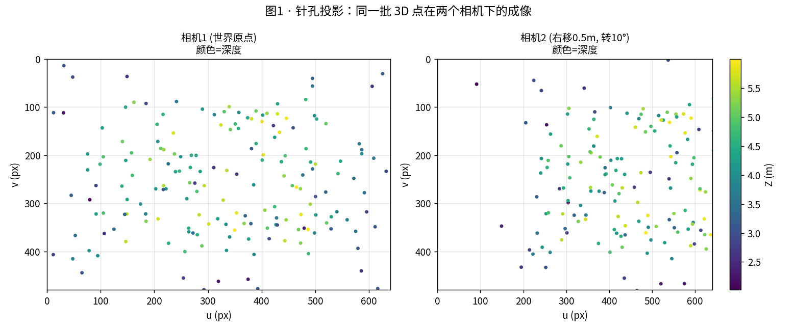

*② 正常流程：一段视频 → 3D 轨迹与地图（F3/M1）*
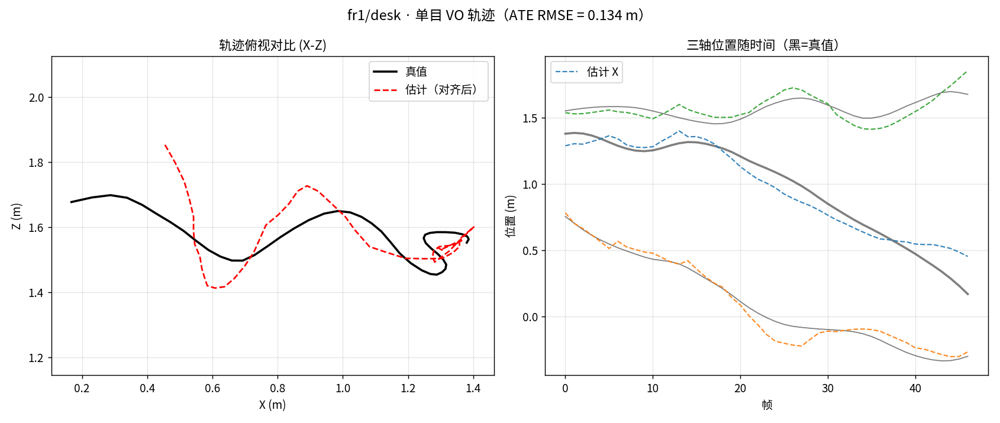

*③ 深度 → 网格：真实重建出的 3D 模型（M2，84 万顶点）*
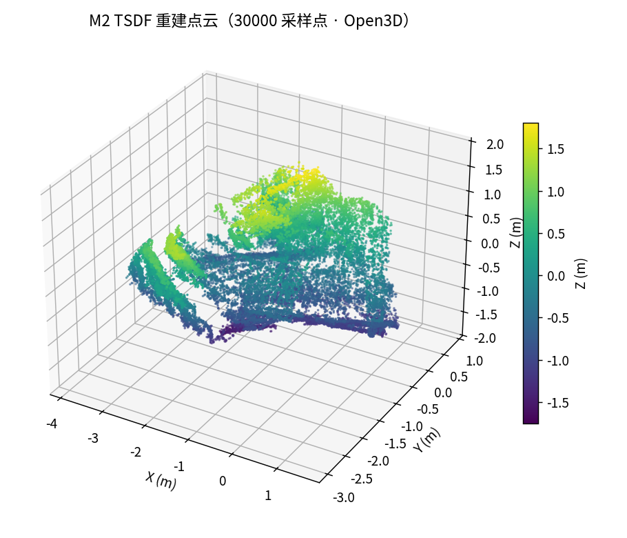

*④ 方法动物园：谁在什么条件下崩（M5，四方法 × 13 退化 ATE 热力图）*
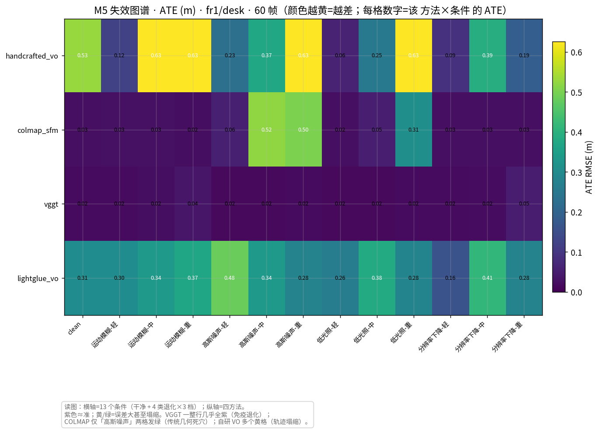

*⑤ 前馈 3D 基础模型：VGGT 深度在退化下几乎不退化（M4）*
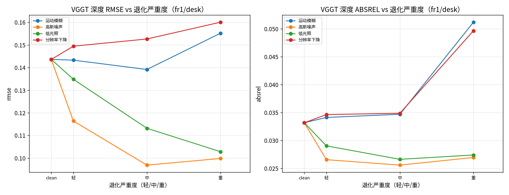

*⑥ 语义层：开放词汇检测（M7 OWL-ViT，自然语言查询）*
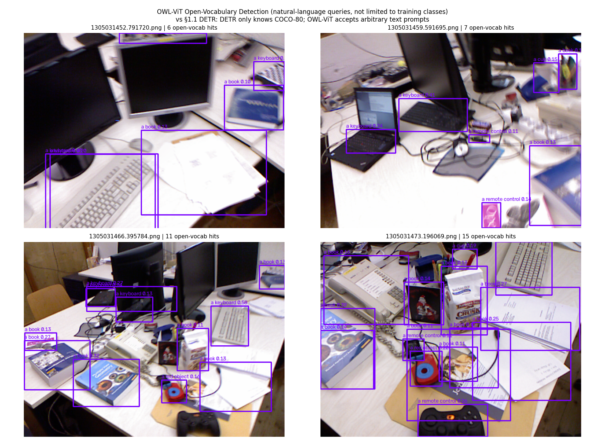

*⑦ 解构世界：把场景变成带 3D 坐标的物体（M9 场景图）*
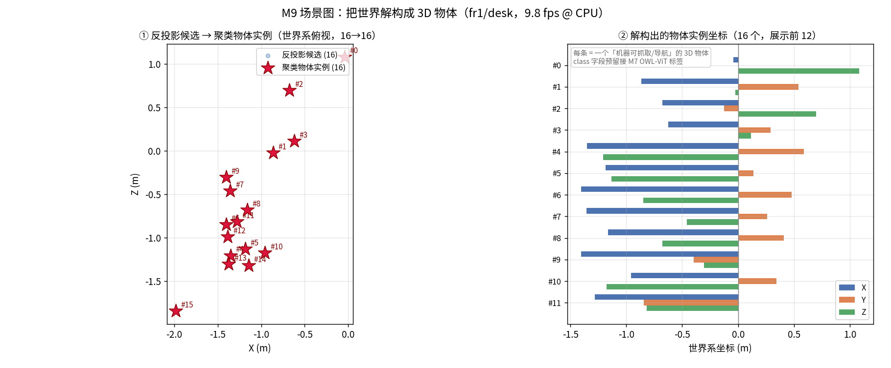

*⑧ 端侧权衡：算力预算 vs 精度（M8）*
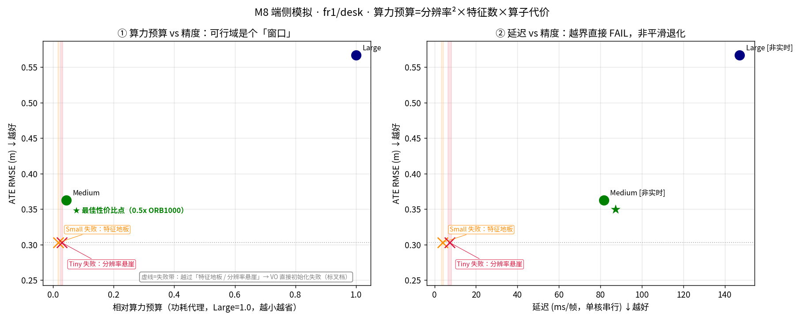

*⑨ 视觉+激光雷达融合：KITTI 真实 LiDAR + 相机融合（F5）*
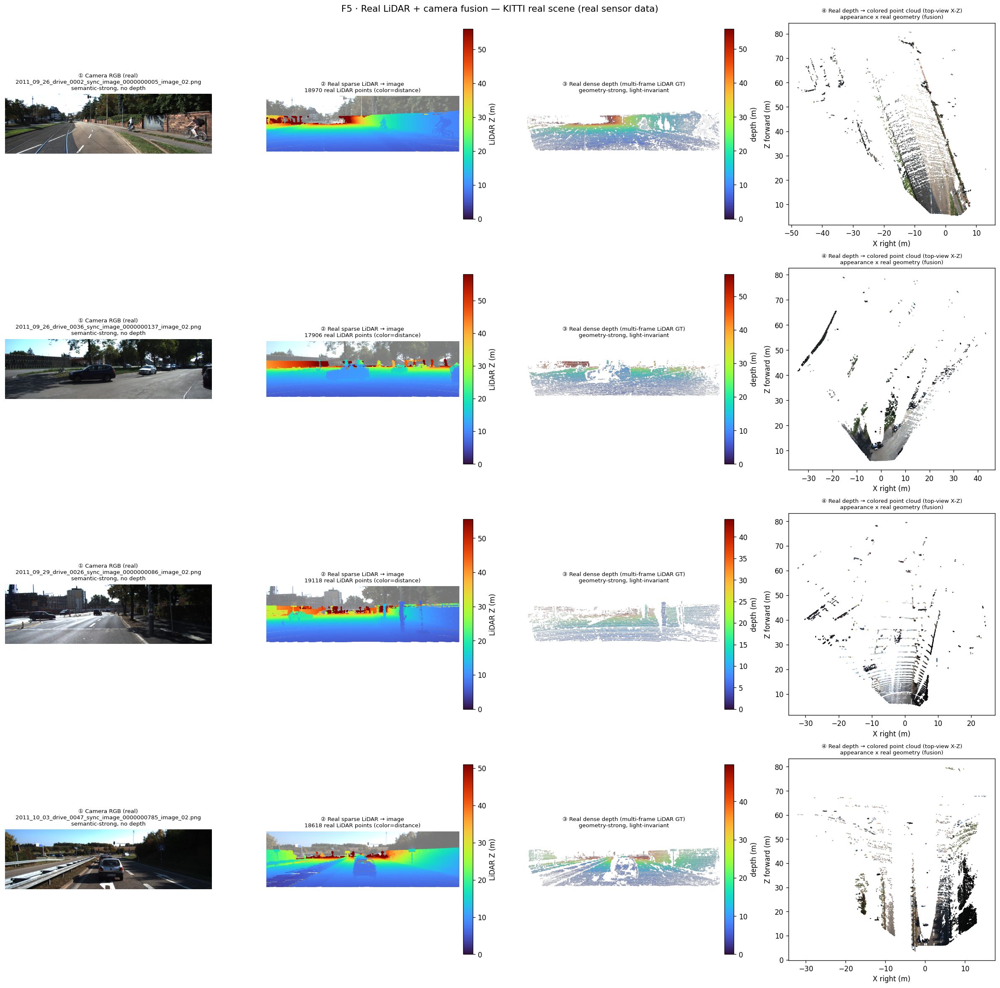

*⑩ TUM 几何自洽：点云↔图像投影闭环（重投影残差 0.0000 px，F5）*
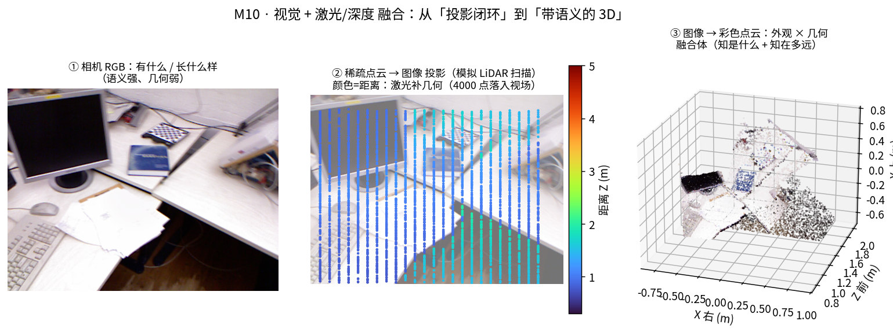

*⑪ 实战整合：多场景公开数据集串成可落地工程（P0）*
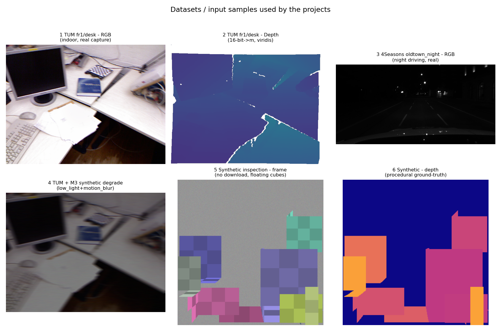

*⑫ 真实昼夜感知：NDISPark 停车场实例分割真值在夜间与白天都成立（M6/M7）*
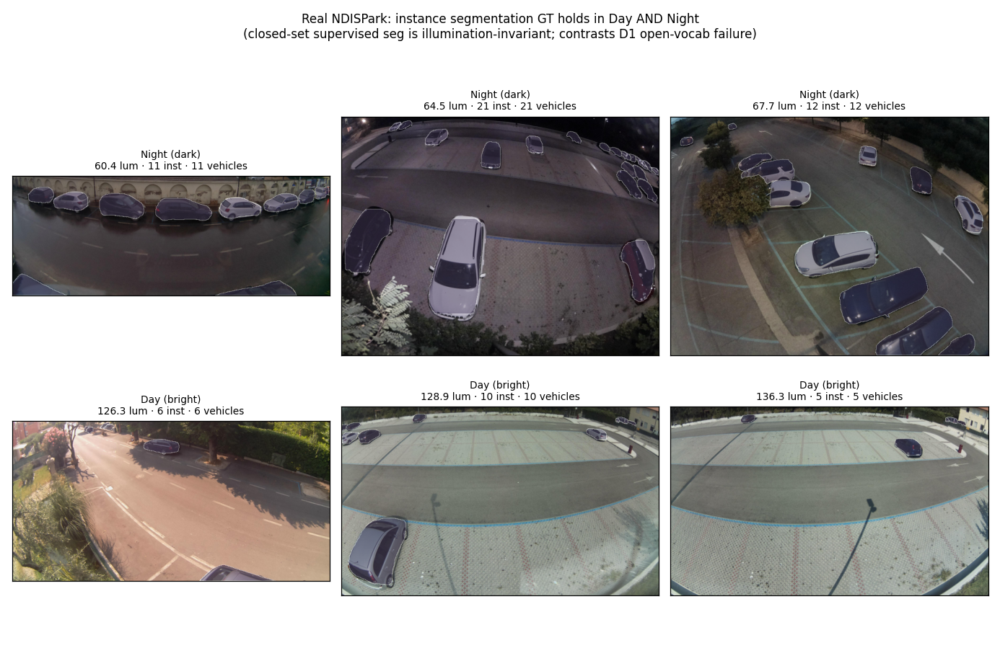

---

## 五、覆盖状态确认（诚实标注，不假装系统已完整）

截至 2026-09-14，M0–M9 + F0–F5 教学文档已全部就位，无结构性缺口；2026-09-15 新增 `F6` 决策与控制基础（补齐"感知控制"后半段，与 §3.7 呼应）+ `F7` 硬件扫盲（摄像头/激光雷达/毫米波雷达/深度相机/IMU/编码器/电机驱动/计算平台/同步标定 选型清单）+ `F8` 全栈贯通（用「园区夜间配送」一趟任务把 硬件→感知→WorldModel→规划→控制→兜底 串成一条线，每步配真实图，把碎片拼成可 replay 的全栈），使本教程从"纯感知算法"升级为"硬件→感知→控制 全栈"，且所有篇章都能在同一个真实场景里被"看见"。且**真实数据闭环已跑通**（D1 真实语义评测、F5 真实 LiDAR、D3 数据台账）。下表为差异化路线的收口模块状态：

| 模块 | 状态 | 必含的 7 维度 | 现有素材 |
|---|---|---|---|
| **M6 多模态融合** | ✅ 初学者版 | 诊断驱动切换：何时、用谁（RGB-D/IMU/VGGT） | 退化监控脚本已跑（低光救援区 96%） |
| **M9 综合闭环** | ✅ 初学者版 | 感知→语义→规划→执行 demo（场景图解构） | VO+深度反投影脚本已跑（9.8 fps @ CPU，16 物体候选） |
| **F5 视觉+激光雷达** | ✅ 双证据 | TUM 数学自洽（0px 残差）+ **KITTI 真实雷达验证** | 真实 LiDAR 4 帧、每帧 ~1.8 万点、3.0–79.7 m |
| **D1 真实恶劣语义** | ✅ 已实跑 | 真实水下（YOLO 真值）+ 夜间定量评测 | OWL-ViT 水下 recall≈0.001、夜间≈7 命中/图 |
| **D3 数据扩充** | ✅ 已落地 | 11 个真实多模态数据集台账；**遥感/NDISPark 已可视化** | 水下/夜间/遥感/KITTI/SUN RGB-D/ModelNet40-C |

> ⚠️ **仍待补（非结构性 / gate 项）**：① `M8` 端侧 RKNN/ACL **真机交叉编译**（本机缩预算三维表已给出可移植结论，非卡点）；② **真实视频序列 VO 评测**（4Seasons/SubT-MRS/DUO，受本机网络限制，脚本已就绪，换机/本地路径即可消费）。详见 `PROGRESS.md §2.2`。
> ✅ **本次已补**：**视觉+激光雷达融合系统专章 `F5`**（标定 / 投影公式 / 前中后融合 / 3D 检测 + 可跑投影闭环 demo）——补齐此前"仅 `P0 §4` 一节"的缺口。
> ✅ **本次已补**：**方法选型与工程清单 `F9`**（单目/双目/2D·3D 检测/点云配准/场景表示/融合 逐族**四联表**：一句话定位 + 精度量级 + 算力·显存 + 需要的数据量，全部钉本项目实测数字；并补 §7 训练数据量·类别数·长尾·**未见物体 OOD**、§8 算力设备、§9 初学者想不到的工程清单）——补齐此前"选型 / 数据 / 算力 / 长尾"层的缺口。
> ✅ **本次已补**：**真实驾驶端到端闭环 `P5`**（把 `P4` 的真实驾驶建图接上 `P3`/`F6` 的 规划→控制：占据栅格 → **inflation 膨胀** → **A\* 规划** → **差速轮控制 (v,ω)** → **VO 动态避障**，全程跑在同一份 KITTI 真实驾驶数据上）——
> 补齐此前"**有真实感知但没接闭环、有闭环但只用室内/仿真数据**"的结构性缺口。同时 `P4` 补齐三块：§⑧ 诚实边界新增"**不含自动驾驶栈后半段**"、新增 §⑨ **硬件对应**（KITTI 实车 PointGrey 相机 + Velodyne 64 线 + 算力，与 `F7` 双向引用）、新增 §⑩ **参数与规则设置**（每个阈值的取值理由 + 失效判据/降级规则）。

> ✅ **已补齐（本次）**：基础篇 `F0`–`F4`（相机投影 / 场景表示 / 深度基础 / 正常流程 / ML 人桥接），专门补足「一般场景 + 基础知识」地基，让初学者→专业人员有连续成长路径。
> ✅ `M6` 多模态融合、`M9` 综合闭环初学者版已写（均含可跑脚本与实测数字）。`M8` 端侧部署初学者版已写（三维表已用本机缩算力预算模拟实测，无需真机；RKNN/ACL 真机编译仍待真机但非卡点）。`P0` 实战项目整合层已写（`wildspatial/projects/` + `scripts/run_project.py`，4 个多场景项目端到端跑通、逻辑自洽、可复现）。

> 写作规范（项目强制·四段式）：每个知识点都要讲 **① 目的 → ② 方法原理（专业）→ ③ 直白讲解 → ④ 真实数据验证 + 效果图**，并补「🏭 实际应用」小节。基础篇（F 系列）额外强调「一般场景、零公式门槛、引用领域标准而非编造项目数字」。

---

*下一篇建议*：零基础从 `00_PRIMER.md` 开始；**已懂 ML/DL 从 `F4_ml_to_3d_bridge.md` 开始**；想直接看项目产出跳 `M5_stress_test.md`。
