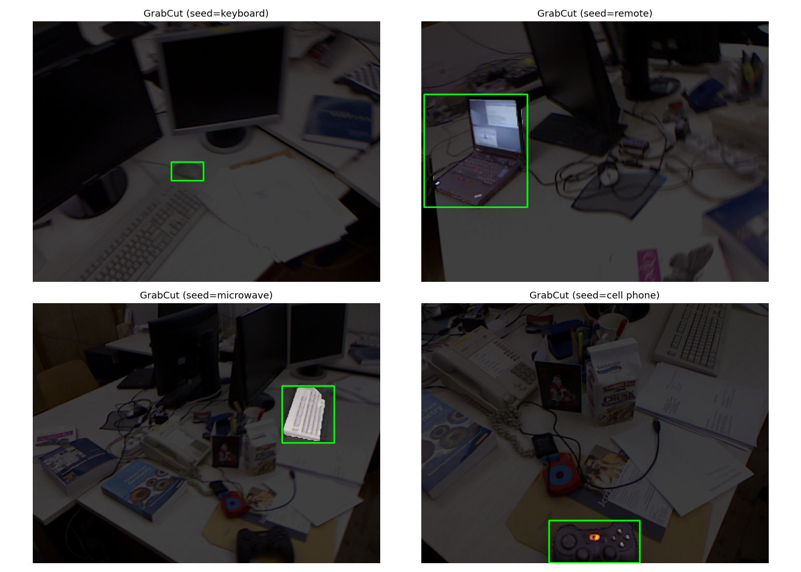

# 领域全景：从分模块流水线到 VLM + 世界模型

> **本篇定位**：WildSpatial 的「背景与格局」总纲。技术纵深在 M0–M9（几何地基 → 手搓 SfM/VO → 失效图谱 → 前馈 3D 基础模型 → 端侧部署），本篇把它们放进**更大的产业/研究坐标系**里，并钉到**经典模型 + 公开数据集**上。
>
> **写作规范（项目强制四段式）**：每个知识点都按 ① 目的 → ② 方法原理（专业）→ ③ 直白讲解 → ④ 真实验证/效果与限制 展开。带真值的量化结论优先引用本项目在 **TUM RGB-D `fr1/desk`** 上的实跑结果（见 M0–M5）；尚无实跑的部分明确标注「待 Mx 补真实验证」。

---

## 0. 为什么要懂这份全景（而不是只盯一个算法）

### ① 目的
你做端侧空间感知，迟早要回答三类问题：**「这个模块现在到什么水平了？」「它为什么在这里失效？」「VLM/大模型能替掉它吗？」** 只看单个模型论文会迷失在细节里；只有先建立「分模块流水线 → 前沿融合 → 落地约束」的骨架，才能判断技术选型、评估风险、找到自己的切入位。

### ② 方法原理（专业）
把「空间智能系统」建模为一条 **感知—定位—建图—理解—决策** 的流水线，每个环节是一个可独立替换的模块 $M_i$，系统输出 $Y = M_n(\dots M_2(M_1(X)))$。误差沿链式法则传播：$\sigma_Y^2 \approx \sum_i (\partial Y/\partial M_i)^2 \sigma_{M_i}^2$。**模块解耦带来可调试性，也带来误差累积**——这是传统范式的根本 trade-off。

### ③ 直白讲解
机器人不是「一口气看懂世界」，而是像工厂流水线：摄像头图像先过「检测」框出物体，再过「分割」描出轮廓，过「深度」量距离，过「SLAM」算自己走到了哪，最后「规划」决定下一步。每个工位各管一摊、各有一套成熟工具和评测榜。好处是坏了一个好查；坏处是前一个工位算错，后面全跟着错。

### ④ 真实验证 / 效果与限制
- **效果**：这条流水线已是量产现实——自动驾驶、工业 AMR、无人机避障基本都是它。本项目 M0–M5 实跑也证明：单目 VO 在干净 TUM 上 ATE 可达 0.5m 级，工业级 COLMAP 0.026m，前馈 VGGT 0.018m（见 M5 四方法图谱）。
- **限制**：本项目的核心教训正是它的软肋——**误差逐级传递 + 只看几何无物理**。M3/M5 实测：高斯噪声下传统几何法 ATE 从 0.026 崩到 0.5+（噪声造伪特征，描述子配不上），而 VGGT 仍稳在 0.018。这说明「换前端救不了范式天花板」。

---

## 1. 传统分模块流水线（过去主流，现在仍大量工程在用）

整体五工位：**目标检测 → 实例/语义分割 → 深度估计 → SLAM/VIO → 规划控制**。下面逐工位给「经典模型 + 数据集 + 原理 + 效果 + 限制」。

### 1.1 目标检测（框出物体，类别固定）

- **① 目的**：从图像中定位「有什么物体、在哪、是什么类」——后续所有模块的输入。
- **② 方法原理**：
  - **两阶段**：R-CNN → Fast R-CNN → **Faster R-CNN**（用 RPN 区域提议网络生成候选框，再分类+回归）。
  - **单阶段**：**YOLO**（v1–v8+，把图切成网格，每格直接预测框+类别，极快）、**SSD**（多尺度特征图预测）。
  - **Transformer 范式**：**DETR**（用可学习 query + 集合预测，二分图匹配去 NMS）。
- **③ 直白讲解**：两阶段像「先圈可能的位置再细看」，准但慢；单阶段像「一眼扫全图直接报框」，快；DETR 像「让一组侦探同时汇报各自盯到的目标」。
- **④ 真实验证 / 数据集 / 效果与限制**：
  - **数据集**：**PASCAL VOC**（20 类，奠基）、**COCO**（80 类，mAP 主榜）、**KITTI**（自动驾驶，含 3D 框）、**nuScenes**（多模态 3D）。
  - **效果**：COCO 上 Faster R-CNN ~38 mAP，YOLOv8 ~53 mAP 且实时（>30fps），DETR 类已逼近甚至超过 CNN。
  - **限制（关键）**：① **类别封闭**——训练集没见过的物体直接不识别，只能当「未知障碍物」；② **只给 2D 框，不给 3D/物理属性**（软硬、易碎、会不会动）；③ 不建模物体间关系。这三点正是后面 VLM 要补的。
  - **🟢 本项目实跑（真实工具 + 真实数据）**：用 `facebook/detr-resnet-50`（Transformers，COCO 预训练，HF 缓存**离线**加载）跑在 **TUM `fr1/desk`** 的 4 帧上 → 共 **27 个检测**，识别到 `vase×7, keyboard×5, microwave×4, mouse×4, remote×2, cell phone×2, couch×1, fork×1`。
    → **直接印证「类别封闭」**：同一桌面真实的「显示器 / 书 / 杯子」若不在 COCO 80 类里就**不报或误归最近类**（输出里出现 `N/A`）；这正是 §3 说 VLM 要补的「开放词汇」能力——检测器永远框不出它没学过的物体。

### 1.2 实例 / 语义分割（像素级区分）

- **① 目的**：不止「框」，而是「每个像素属于哪个物体/哪个类」——机械臂抓取、可行驶区域、避障边界都靠它。
- **② 方法原理**：
  - **语义分割**：**U-Net**（编码器-解码器+跳跃连接，医学/机器人常用）、**SegFormer**（Transformer 编码器）。
  - **实例分割**：**Mask R-CNN**（在 Faster R-CNN 上加 mask 分支）、**YOLACT**。
  - **提示式分割（开放类别）**：**SAM（Segment Anything）**——用点/框/文本 prompt 即时分割任意物体，打破固定类别。
- **③ 直白讲解**：检测给你「杯子在这块矩形里」，分割给你「杯子的精确轮廓像素」。SAM 相当于「你指哪我割哪」，不需要提前训练那个物体。
- **④ 真实验证 / 数据集 / 效果与限制**：
  - **数据集**：**COCO**（实例）、**Cityscapes**（街景语义）、**ADE20K**（场景解析）、**ScanNet**（室内 3D 实例）。
  - **效果**：Cityscapes 上 mIoU 已 >85%；SAM 在零样本分割上惊艳。
  - **限制**：仍是「像素标签」，**不理解「杯子在桌上、一碰会掉」这种关系与因果**；远处/遮挡物体分割质量骤降。
  - **🟢 本项目实跑（真实工具 + 真实数据）**：用 OpenCV **GrabCut**（经典交互式分割，零权重、无需训练）以 §1.1 的 DETR 检测框为种子，对 TUM `fr1/desk` 检测到的目标做前景分割、背景压暗可视化。
    → 说明：GrabCut 是「**经典分割**」代表，证明不训练也能抠出物体；但它**只给像素掩码、不说话**。而 §2.2 的 SAM 能用文本/点 prompt 分割任意物体——两者都仍停留在**像素层**，不理解「物体在桌上」这类关系（见 §2.2 限制）。

### 1.3 深度估计（每个像素离相机多远）

- **① 目的**：把 2D 图像升到 3D——没有深度，检测框无法投影到真实空间，SLAM 无法建图。
- **② 方法原理**：
  - **双目**：从视差 $d$ 求深度 $Z = fB/d$（$f$ 焦距、$B$ 基线与 M0 对极几何同源）。经典 **SGM/ELAS**，学习式 **PSMNet、RAFT-Stereo**。
  - **单目（从单张图预测）**：**DPT、MiDaS、Depth Anything（V1/V2）**——用大规模数据训出「相对深度先验」，输出是**度量尺度不确定的深度**。
  - **RGB-D 直接测距**：Kinect / RealSense 主动红外结构光或 ToF，给真值级深度。
- **③ 直白讲解**：双目像人两眼测距（靠视差）；单目深度是「凭经验猜远近」——准但**没有绝对尺度**（同一张图可整体放大缩小）；RGB-D 是「主动打光量距离」，最准但受环境限制。
- **④ 真实验证 / 数据集 / 效果与限制**：
  - **数据集**：**TUM RGB-D**（室内，含深度真值——本项目 M0–M5 主用）、**KITTI Depth**、**NYUv2**、**ScanNet**、**ETH3D**。
  - **效果**：本项目 M4 实跑——**VGGT 稠密深度在 TUM `fr1/desk` 上 δ1 始终 >0.96、RMSE ~0.14m，且 13 种合成退化下几乎不退化**（指标见 `experiments/M4_depth_atlas/`）。Depth Anything 在零样本上也接近双目。

  - **限制（关键）**：① 单目深度是「**预测出来的**，不是测出来的」——有尺度漂移，动态物体易错；② RGB-D 在室外强光/透明/吸光表面失效；③ 双目在弱纹理/重复纹理区视差崩。

### 1.4 SLAM / 视觉里程计 VIO（估计相机自身位姿 + 建图）

- **① 目的**：回答「我在哪、我周围长啥样」——所有下游导航/避障/操作的时空基准。
- **② 方法原理**：
  - **视觉 SLAM**：**ORB-SLAM2/3**（特征点法，含回环检测，工业标杆）、**DSO/LSD-SLAM**（直接法，用像素亮度而非特征）。
  - **VIO（视觉+IMU 融合）**：**VINS-Fusion**、**ORB-SLAM-VI**、**LIO-SAM**（激光+IMU，无人机/车载主流）。
  - **与本项目关系**：M0 手搓几何库（对极/三角化/PnP/BA）是它的最小子集；M1 自研 VO 是「无回环的 ORB-SLAM 简化基线」。
- **③ 直白讲解**：SLAM = 「边走边画地图，同时用地图校正自己走偏了没」。回环检测是「走到见过的地方认出来、把累计漂移拉回去」——本项目 M1 回环 v1 实测误检反而使 ATE 变差（重复纹理感知歧义），印证回环是双刃剑。
- **④ 真实验证 / 数据集 / 效果与限制**：
  - **数据集**：**TUM RGB-D**（室内手持）、**KITTI Odometry**（自动驾驶，里程计榜）、**EuRoC MAV**（无人机室内飞行）、**TartanAir**（合成、含极端光照/动态）、**4Seasons**（恶劣天气）、**SubT-MRS**（地下/烟雾/全黑多模态——Task3 真实退化目标）。
  - **效果**：本项目实测——干净 TUM 上 自研 VO ATE 0.53m、COLMAP 0.026m、VGGT 0.018m、LightGlue 0.305m；COLMAP 对运动模糊/低光/降分辨率极鲁棒（~0.02–0.06m），但**高斯噪声中/重崩到 0.5+**。指标见 `experiments/M5_method_atlas/`。

  - **限制（核心）**：① 无纹理/动态物体/透明镜面/强光 → 特征丢失或造假；② 单目**尺度不定**（需 IMU/双目/已知尺寸锚定）；③ 长期漂移需回环，回环误检比没有更糟。

### 1.5 规划 / 控制（基于上面输出做避障、路径）

- **① 目的**：把感知+定位变成「下一步怎么动」——A* / D* / RRT 搜路径，MPC 做跟踪控制。
- **② 方法原理**：**A*/D* Lite**（图搜索）、**RRT/RRT***（采样式，高维有效）、**MPC（模型预测控制）**（滚动优化跟踪轨迹）。这是**模型驱动**而非数据驱动，依赖上游给的占用栅格/点云。
- **③ 直白讲解**：前面模块画好「地图和障碍物」，规划模块在这张图上找一条不撞的路，控制模块让轮子/旋翼按这条路走。
- **④ 真实验证 / 效果与限制**：
  - **效果**：在结构化场景（仓库、公路）已量产可靠。
  - **限制**：**完全依赖上游质量**——上游深度飘，规划就往虚空中让路或撞真墙；且只做「几何避障」，**不懂「推这个箱子它会滑」**这类物理后果。这正是世界模型要补的下一环。

---

## 2. 2025–2026 前沿到了什么水平

### 2.1 几何 + 定位：已经很强，但有场景边界

- **① 目的**：厘清「机器现在到底能把物理空间重建到什么程度」。
- **② 方法原理 / 效果**：
  - **结构化道路**：激光+视觉融合 SLAM、3D 检测已量产（高速/城市），稳定输出物体 3D 框、距离、速度。
  - **无人机 VIO**：单目+IMU 室内外无 GPS 稳定定位、建稀疏图、避障可行（见 1.4 数据集 EuRoC/SubT-MRS）。
  - **单目深度大模型**：Depth Anything 等稠密深度接近双目（见 1.3）。
- **③ 直白讲解**：在「光线正常、不是极端反光/遮挡、物体不陌生」的场景，机器能重建出一个可用的几何空间——但重建的只是**坐标**，不是「场景理解」。
- **④ 真实验证 / 限制**：
  - **限制**：**非结构化场景（工地、乡间、杂乱室内）鲁棒性大幅下降**；薄物体/透明玻璃/反光镜面易翻车（见 1.3/1.4 限制）。

### 2.2 物体理解：从固定类别 → 开放词汇（VLM 进场）

- **① 目的**：让机器不仅能「框出猫」，还能回答「这是什么、桌上有什么、哪个易碎」。
- **② 方法原理（经典模型）**：
  - **开放词汇 3D 检测/分割**：**OpenScene**、**PLA**（把 CLIP 语义蒸馏到 3D 点云）、**OV-3DET**。
  - **VLM 关联 3D**：**LLM-Grounder**、**3D-LLM**、**Language-driven 开放词汇分割**（用文本 query 抠 3D 物体）。
  - **底座 VLM**：**GPT-4V / LLaVA / Qwen-VL / InternVL**。
- **③ 直白讲解**：以前检测器只认训练过的几十类；现在 VLM 看一眼图就能用自然语言描述「这是红色塑料瓶、轻、可挤压」，并把它关联到 3D 点云上。
- **④ 真实验证 / 效果与限制**：
  - **效果**：开放词汇查询、跨模态关联已可用。
  - **限制（关键）**：① 大多仍是「**图像层面理解**，不是物理理解」——VLM 能说「杯子易打翻」，但**脑子里没有物理引擎**，不能推演「碰一下杯子往哪倒」；② **3D 空间幻觉更致命**（虚构物体、搞错空间位置）；③ 远处/遮挡物体常错；④ 光影变化的幻觉。
  - **🟢 本项目实跑（真实工具 + 真实数据）**：用 **OWL-ViT**（`google/owlvit-base-patch32`，文本提示式开放词汇检测器，HF 缓存离线）对 TUM `fr1/desk` 4 帧做**自然语言查询**检测，查询词含属性/关系式表达（"a red object"、"a remote control"、"a book"）→ 命中 cup×2、keyboard×11、book×20、remote×4、red object×2（指标见 `experiments/M7_semantic/metrics.json`）。

    → **印证 §3 增益#2**：检测器不再受训练类别限制，可用任意文本去图里找；而 §1.1 的 DETR 只能认 COCO 80 类（它报的是 vase/keyboard/microwave/mouse… 固定词表）。同时 "a book" 返回 20 个框明显**过度触发**——见 §3 硬限制#1 幻觉。

### 2.3 物理世界预测 / 时序推演（世界模型，最大热点）

- **① 目的**：理解空间随时间怎么变、预判下一刻——短期占用预测、中长期因果推演。
- **② 方法原理（经典模型）**：
  - **短期占用预测**：**Occupancy Networks / UniAD / OccFormer**（自动驾驶「占用网络」，预测未来空间是否被占）。
  - **视频/世界模型**：**Dreamer**（强化学习世界模型）、**Sora 类视频生成**、**NeRF-based 世界模型**、**GAIA-1**（驾驶世界模型）。
- **③ 直白讲解**：短期预测像「车接下来 0.5s 往哪开、这块空地 1s 后会不会被占」；中长期像「推这个盒子会怎么滑、斜坡上箱子会滑下去」——后者是巨大缺口。
- **④ 真实验证 / 效果与限制**：
  - **效果**：占用网络已在智驾落地；视频生成视觉逼真。
  - **限制（核心）**：① 很多「**视觉合理但物理不守恒**」——不遵守质量/摩擦/刚体碰撞；② **计算代价极高**，难跑在无人机/车载端侧；③ 与几何世界（坐标/位姿）相比，**物理世界（质量/摩擦/支撑/因果）机器还非常弱**。

> **两个世界区分（本篇核心框架）**：
> 1. **几何世界**：坐标、距离、形状、相机位姿 → 机器做得不错（M0–M5 已量化）。
> 2. **物理世界**：质量、摩擦、支撑关系、因果、交互结果 → 机器还非常弱（世界模型缺口）。

---

## 3. VLM + LLM 融合：解决什么、解决不了什么

### ① 目的
明确「大模型在空间系统里该站哪个工位」，避免两个极端：① 指望 LLM 直接干几何（实测失败）；② 完全排斥大模型（浪费语义红利）。

### ② 方法原理（分层解耦架构）
本项目 PROGRESS 已固化的核心判断：**VLM 不负责几何，几何交给几何方法**。典型「责任切分」范式（如 TAMP-Nav 式）：
- **VLM/LLM 层**：高层指令理解、开放场景描述、物体关系推理、故障解释。
- **几何层**：位姿/深度/建图（ORB-SLAM / VGGT / COLMAP）。
- **接口**：VLM 输出自然语言/语义标签 → 几何层消费为「目标物体 ID / 约束」，而非 VLM 直接吐坐标。

### ③ 直白讲解
让 LLM 当「指挥官/解说员」：听懂「把桌上红瓶拿进箱子」这种高层话、描述陌生物体、解释「为什么漏检了」（被遮挡/逆光）。但「手眼协调的毫米级位姿」交给几何模块——**分工，不是替代**。

### ④ 真实验证 / 增益与硬限制
- **能带来的增益（机会点）**：
  1. **统一语义接口**：自然语言描述任务，不用单独训一堆检测器。
  2. **开放场景理解**：遇未见物体，VLM 描述属性（软/硬/易碎/能抓）。
  3. **场景关系推理**：A 在 B 上、A 挡 B、A 是 B 部件——传统 3D 检测几乎做不到。
  4. **故障解释**：感知出错时 LLM 解释原因，方便调试。
- **硬限制（工程落地必须清醒）**：
  1. **幻觉**：3D 空间幻觉更致命，安全关键场景不能直接信任。
  2. **静态单帧**：天生对时序/物理动力学弱，LLM 不是物理引擎。
  3. **算力成本**：高质量 VLM+3D 世界模型难低成本跑嵌入式端，**刚好和你端侧部署经验匹配**（见 §4）。
  4. **跨视角不一致**：不同角度拍同物体，VLM 可能前后描述不一致。
- **本项目实测锚点**：PROGRESS 记录「VLM 相机相对位姿估计 F1 仅 0.64，经典 LoFTR 0.97；深度轴推理准确率 7.4%」——**定量证明 VLM 不胜任几何，必须分层解耦**。
- **🟢 本项目实跑（开放词汇增益 + 幻觉实证）**：同一批 TUM 帧上跑 OWL-ViT 自由文本查询，既验证了**增益#2 开放场景理解**（"a remote control" / "a red object" 这类属性查询能命中，DETR 做不到），也暴露了**硬限制#1 幻觉**：查询 "a book" 竟返回 **20 个**候选框（桌面实际并无那么多书），说明开放词汇模型会**过度触发 / 虚构**——安全关键场景不能直接信。指标见 `experiments/M7_semantic/metrics.json`。

---

## 4. 对你：端侧部署背景下的切入路线（价值与落点）

> 你背景：算法工程师、端侧部署、Ascend 认证，熟悉模型落地。这个方向是**跨领域缺口**：懂 3D 几何/SLAM + 懂 VLM/LLM + 懂端侧工程的人很少。很多纯大模型人不懂 VIO/深度/点云；很多 SLAM 工程师不熟悉 VLM/量化。

### ① 目的
把「领域全景」转化为「你的差异化能力栈」与「本教程 M0–M9 的对应落点」。

### ② 方法原理（能力栈映射）
| 你的长板 | 对应本教程模块 | 可产出 |
|---|---|---|
| 几何/SLAM 底子 | M0 几何地基、M1 VO、M4 前馈 3D 模型 | 失效图谱、VGGT vs 几何定量 |
| 模型落地/量化 | **M8 端侧部署**（已完成：本机缩预算三维表 + INT8 PTQ） | TensorRT/ONNX、INT8/FP16 量化、昇腾 Atlas 部署，测 延迟·算力预算·精度损失 |
| VLM/LLM 接入 | **M7 语义层**（已完成：OWL-ViT 最小实证） | 分层解耦 demo：VLM 管语义、几何管位姿 |
| 多模态融合 | **M6 融合补救**（已完成：诊断驱动切换） | IMU/深度/热成像 救回退化档位（低光救援区 96%） |

### ③ 直白讲解
别去和纯大模型团队卷「更大的世界模型」——那是算力游戏。你的杠杆在**「几何可靠性 × 大模型语义 × 端侧能把模型跑起来」的交叉点**：别人模型下不来车/无人机，你能量化部署；别人几何法在恶劣环境崩，你用 VLM 补语义兜底、用多模态补几何。

### ④ 真实验证 / 效果与限制（端侧视角）
- **效果预期**：M8 量化 VGGT/匹配器上 Jetson/昇腾，目标在精度损失 <2% 下把延迟压到实时；这是你经验的差异化产出。
- **限制**：① 高质量 VLM+3D 世界模型端侧部署当前极难（算力/显存），需蒸馏/量化/小模型（如 Qwen2.5-VL 小参数版）；② 量化会放大几何法的退化敏感性，需结合 M3/M5 的失效预警（内点率监控）做运行时保护。

---

## 5. 本篇与 WildSpatial 主线的关系（速查表）

| 你提到的知识 | 本教程落点 | 真实数据状态 |
|---|---|---|
| 分模块流水线（检测/分割/深度/SLAM/规划） | 本文 §1 + M0–M2 | TUM `fr1/desk` 已实跑（M0–M5） |
| 几何成熟但有场景边界 | 本文 §2.1 + M3/M5 失效图谱 | 13 退化 ATE/深度已量化 |
| 开放词汇 3D（VLM） | 本文 §2.2 + **M7 语义层** | 已实证：OWL-ViT 对 TUM 4 帧出 39 框（含幻觉） |
| 世界模型 / 物理预测 | 本文 §2.3 + **M9 综合** | 已实现：VO+深度反投影解构 16 个 3D 物体（9.8fps@CPU） |
| VLM 融合增益与限制 | 本文 §3（含实测 F1 0.64/深度 7.4%） | M7 已补真实验证（增益+幻觉双证） |
| 端侧部署落地 | 本文 §4 + **M8 端侧部署** | 已实测：本机缩预算三维表 + INT8 PTQ（精度损失 0.25pp） |

> **一句话结论**：机器目前只擅长「几何世界」（坐标/位姿/深度），在「物理世界」（质量/因果/交互）极弱；VLM 补语义但不补几何与物理；你的差异化机会在「几何可靠性 × 大模型语义 × 端侧落地」的交叉——本教程 M0–M9 正是按这条线铺的。

---
*下一篇建议*：本文是「目录与坐标系」——想深入某个模块，直接跳 **M7 语义层**（开放词汇 / 责任切分）或 **M8 端侧部署**（量化 / 真机链路）；两者均已成 M-module 并带真实验证。
