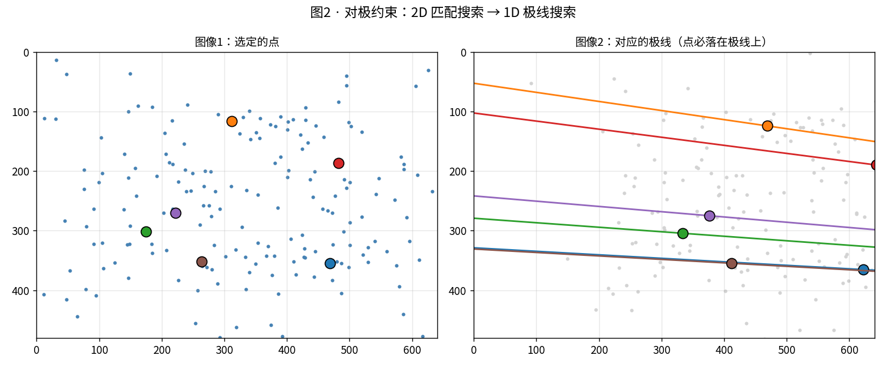

# 00 · 新手讲义：从「一张照片」到「理解三维世界」

> **这篇是给谁看的**：如果你刚接触「空间感知 / SLAM / 3D 视觉」，看到 `M0_geometry_foundation.md` 里的李群、对极几何就头大——**先读这篇**。
> 它不追求严谨推导，只追求让你「建立直觉」：每个概念到底是什么、为什么需要它、经典方法在解决什么「原始问题」。
> 读完你再去翻 `M0`/`M1`/`M3`，会发现自己已经能看懂大半。
>
> **和另外两篇的关系**：
> - `00_ROADMAP.md` = 全局学习计划（告诉你要学什么）
> - `00_QUICKSTART.md` = 3 分钟看懂项目在跑什么
> - **`00_PRIMER.md`（本篇）= 给零基础的概念词典 + 经典理念讲解** ← 你该从这儿开始

---

## 0. 先说人话：这门手艺在干嘛？

想象你蒙着眼睛被放到一个陌生房间，手里只有一台相机（能拍照，但看不到画面）。

你的任务：
1. **边走边拍**，最后能说出「我刚才走的路线」（相机轨迹）
2. 能画出「房间长什么样」（3D 场景）

人靠两只眼睛 + 大脑天生会做这件事。但**电脑看到的是一堆数字（像素）**，它没有「空间感」。我们这门手艺，就是**教电脑从无意义的像素里，重建出有意义的三维世界**。

```
相机拍的照片（2D 像素）  ──算法──>  相机在哪 + 场景长啥样（3D）
```

整个过程，行业里叫 **SLAM / VO / SfM**（名字不同，内核相通，后面会讲区别）。

---

## 1. 最基础的概念（一个一个讲，配大白话 + 类比）

### 1.1 像素、图像、相机

- **像素（pixel）**：照片的最小格子。一张 640×480 的照片 = 30 万个小格子，每个格子一个颜色值。
- **图像（image）**：像素拼成的二维阵列。
- **相机**：把「三维世界」压扁成「二维照片」的 device。

**🎯 直觉类比**：相机像一台「投影仪倒过来」——真实世界是立体的，镜头把它**投影**到一张平面上（胶片/传感器），立体的「深度」信息在这一压扁的过程中**丢掉了**。

> 这是整门手艺的「原罪」：**照片只记录「往哪看」，没记录「离多远」**。后面所有方法，本质上都在「把丢掉的深度找回来」。

### 1.2 2D 与 3D：照片是「压扁」的世界

- **2D**：照片里一个点用 `(u, v)` 表示（横向第几列、纵向第几行）。
- **3D**：真实世界里一个点用 `(X, Y, Z)` 表示（前后、左右、上下）。

从 3D 到 2D 是一句话的事（投影）；**从 2D 反推 3D 是千古难题**——因为无数个不同的 3D 场景，都能投影出同一张 2D 照片。

> **🖼️ 对照实验图**：`M0` 的针孔投影图就演示了——同一堆 3D 点，换个角度看，落在照片上的位置全变了。VO/SfM 干的事，就是**反过来**利用这个变化。


### 1.3 深度（depth）：每个像素离相机多远

「深度」= 照片里每个像素对应的真实物体，离相机有多远（单位通常是米）。

- **双目/激光**：直接「测」出来（像人用两只眼判断远近）。
- **单目**：只能「猜」（从一张图估深度，有尺度歧义，见 §3.2）。

**🎯 直觉**：深度图就是「给照片上每个点标一个距离」。近的地方亮（或某种颜色），远的地方暗。

> 本项目 `M4` 用 VGGT 在 TUM 数据上估深度，δ1 指标 > 0.96（即 96% 的像素深度误差小于阈值）——这是「前馈模型估深度」的真实水平。


### 1.4 点云（point cloud）与网格（mesh）：3D 世界的两种存法

把一堆 `(X, Y, Z)` 点画出来，就是**点云**——像满天星，能看出形状但没「表面」。

把点连成面，就是**网格（mesh）**——像用纸糊出物体表面，能渲染成实心模型。

**🎯 类比**：点云 = 用很多小石子摆出山的轮廓；网格 = 用布把石子包起来变成实体。

> `M2` 用 TSDF 融合 TUM 真实深度，重建出 84 万顶点的网格——这就是从「深度图」到「可看可转的 3D 模型」的过程。


### 1.5 特征点（feature）与描述子（descriptor）：给画面打「路标」

- **特征点**：图像里「有辨识度、好定位」的点（墙角的棱、杯子的边缘、纹理丰富处）。平坦的白墙没有特征点——这是后面「无纹理失效」的源头。
- **描述子**：给每个特征点算一个「指纹向量」，用来**跨照片认出同一个点**。

**🎯 直觉类比**：你走进一个房间，会不自觉记住「门口有个红色消防栓、桌子角有个划痕」。这些就是「路标」。电脑用特征点 + 描述子做同样的事——**在两张照片里找出「这是同一个路标」**。

> 经典算法 **SIFT**（尺度不变特征变换）是这行的「老祖宗」，2004 年提出，至今仍是很多系统的基石。它的本事是：同一个路标，不管你离远点、转个角度、调下亮度，它的描述子都差不多——**尺度/旋转/光照不变性**。

### 1.6 匹配（matching）：找出「这是同一个点」

拿两张照片，把各自的特征点描述子比对，找出「左右两张图里其实是同一个物理点」的那些对子。

**为什么重要**：只有知道「左图的第 5 个点和右图的第 9 个点是同一个东西」，电脑才能用三角学算出它的 3D 位置（见 §3.1）。

**🎯 痛点**：白墙、重复纹理（一排相同的瓷砖）、运动模糊都会让匹配失败——这是 §3.3、M3 失效归因的核心。

### 1.7 位姿（pose）：相机在哪、朝哪

- **位置（position）**：相机在空间里的坐标 `(x, y, z)`。
- **朝向（orientation）**：相机镜头对着哪个方向（常用旋转矩阵 / 四元数表示）。
- **位姿 = 位置 + 朝向**，合起来描述「相机此时此刻的状态」。

**🎯 直觉**：你走在路上，每一步都更新一次「我在哪、脸朝哪」——这就是位姿。VO/SfM 的核心输出就是这个**位姿序列（轨迹）**。

> 衡量位姿准不准的指标叫 **ATE（绝对轨迹误差）**：估计轨迹和真值轨迹平均差多少。本项目 `M1` 手搓 VO 在 TUM `fr1/desk` 上 ATE = 0.506m，`M5` 里 VGGT 在同样数据上只有 0.016~0.049m——差距就是「传统管线 vs 前馈模型」的实力差。

### 1.8 地图（map）：空间的样子

把每一帧看到的 3D 点攒起来，就是一张「地图」。

- **稀疏地图**：只有特征点（像星图）。
- **稠密地图**：连表面都重建出来（点云 / 网格）。

**🎯 一句话总结 §1**：相机把 3D 压成 2D → 我们靠**特征点 + 匹配**找回对应关系 → 用**几何**反推每个点的 3D 位置和相机的**位姿** → 攒成**地图**。这就是整条流水线。

---

## 2. 经典理念：每个方法在解决什么「原始问题」

光记概念没用，得知道「为什么要有这些方法」。下面 7 条，是这门手艺的「经典理念」，每条对应一个真实痛点。

### 2.1 对极几何：为什么「移动相机」能反推深度？

**原始问题**：只有一张照片时，一个像素对应无穷多个可能的 3D 点（都在同一条射线上）。怎么办？

**经典理念**：**再拍一张**（相机挪个位置）。同一个物理点，在两张照片上投影到不同像素；连接「左相机光心—点—右相机光心」形成一个平面，这个平面和两张照片的交线叫**极线**。

**结论**：已知左图一个点，它在右图的位置**不需要满图找，只在这条极线上搜**——把 2D 搜索降成 1D 搜索。这背后就是「对极约束」。

**🎯 直觉**：你闭一只眼，左右晃头看一个杯子——杯子相对背景「移动」了。晃得越多（基线越大），它「看起来移动」越明显，你就越能判断它离你近还是远。相机也一样。

> 对照实验图：对极线演示（下图——同一个 3D 点在两帧中的可能位置被约束在一条直线上）。



### 2.2 双目 vs 单目：两只眼和一只眼

- **双目（两只眼）**：左右相机间距已知（基线），同一个点左右像素差（视差）直接换算成深度。**天生有尺度**。
- **单目（一只眼）**：没有基线，只能算出「相对深度」，绝对尺度是丢失的（你没法区分「近处的小狗」和「远处的大象」）。

**🎯 经典教训——尺度歧义（scale ambiguity）**：单目 VO 必须靠 **IMU（惯性）、已知尺寸物体、或双目** 才能恢复真实尺度。这是 M6 多模态融合要补的洞。

### 2.3 SLAM 的「鸡生蛋」难题

**原始问题**：要建地图，得先知道相机位姿（从哪拍的）；要知道位姿，得先有地图（拿什么当参照）？

这就是 **SLAM（同步定位与建图）** 名字的由来——**定位和建图是互相依赖的**。

**经典解法**：
1. 先瞎猜一个位姿 → 三角化出一些点（初始化地图）
2. 用这些点去精修位姿（定位）
3. 用精修后的位姿再去三角化更多点（建图）
4. 来回迭代，逐渐收敛

**🎯 直觉**：像你进黑房间，先凭感觉摸一下墙（粗定位），再靠墙校准自己位置（精定位），位置准了又能摸更远（建图），循环。

### 2.4 SfM vs VO：离线建图 vs 在线定位

- **SfM（Structure from Motion，运动恢复结构）**：拿到一堆照片（离线），一次性算出所有相机位姿 + 3D 点。常用于三维重建、文物数字化。
- **VO（Visual Odometry，视觉里程计）**：相机实时移动，逐帧算「我这一刻相对上一刻动了多少」。常用于机器人/无人机实时导航。
- **SLAM** = VO + 回环检测（发现「我回到了之前来过的地方」后修正累计误差）。

**🎯 一句话**：SfM 是「事后复盘全部照片」，VO 是「边走边报位置」，SLAM 是「边走边报位置还能纠偏」。

### 2.5 分模块流水线 vs 端到端（VGGT）：2024 后变天了

**传统理念（分模块）**：检测 → 分割 → 深度 → SLAM → 规划，一环扣一环。好处是可控、好调试；坏处是**误差逐级传递**（深度错了，后面全飘）。

**新范式（前馈 3D 基础模型，如 VGGT/MASt3R/DUSt3R）**：把一串照片**一次性喂进一个大神经网络**，直接吐出深度 + 位姿 + 点云。

**🎯 为什么是革命**：
- 传统方法要逐步算、遇退化就崩；
- VGGT 这类模型在海量数据上学到了「空间的统计规律」，很多退化场景下反而更稳。

> 本项目 `M5` 实跑：TUM 干净数据上，**VGGT 的 ATE 0.016~0.049m，稳压自研 VO 的 0.5m 和 COLMAP 的 0.026m**。但注意——它在「强高斯噪声」等退化下也会崩（见 `M5` 图谱），所以**不是银弹**。

### 2.6 为什么 VLM / 大模型做不好「几何」？

这是本教程反复强调的**反直觉真相**。看一组真实 benchmark 数据（来自 M0）：

| 任务 | 最强 VLM | 经典几何方法 | 人类 |
|---|---|---|---|
| 相机相对位姿估计（F1） | GPT-5: **0.64** | LoFTR: **0.97** | 0.92 |
| 深度轴推理准确率 | **7.4%** | — | 高 52 个百分点 |

**🎯 核心结论**：让大模型直接「猜深度、猜位姿」，它比 20 年前的 SIFT 还差。**几何必须靠几何方法。**

**为什么**：VLM 训练目标是「生成像人话的文本」，它学到的是「语言统计规律」，不是「三维空间的物理规律」。它脑子里**没有真正的 3D 坐标系统**，所以空间推理接近随机。

> 本项目 `M7` 用 OWL-ViT 实跑也印证了这点：开放词汇检测很惊艳（能按「a red object」这种文本找物体），但查询「a book」竟返回 20 个框——**幻觉严重，不能直接信**。

### 2.7 开放词汇 & 语义：VLM 真正擅长什么

既然 VLM 做不好几何，那它干嘛用？——**理解「是什么、什么关系」，而不是「在哪」**。

- 传统检测器（如 DETR，见 `landscape_showcase`）：只能认训练好的固定类别（COCO 80 类），没见过的物体直接不报。
- VLM/开放词汇模型（如 OWL-ViT）：用**自然语言**查询——「桌子上的红瓶子」「易碎的东西」，不受训练类别限制。

**🎯 正确分工（本项目的核心哲学）**：
- **几何层**（SLAM/深度）：负责任姿、3D 坐标 → 交给经典方法 / VGGT
- **语义层**（VLM）：负责「理解物体、关系、指令」→ 交给大模型
- **两者通过「2D 目标点 + 深度反投影成 3D」衔接**，互不越界

> 这就是 `docs/00_LANDSCAPE.md` §3 说的「分层解耦」——也是你作为端侧工程师最该理解的架构思想。

### 2.8 感知到控制：最后一公里（本教程的"感知控制"闭环）

前面 2.1–2.7 讲的都是"感知"——怎么从像素恢复三维世界。但**看懂世界 ≠ 能行动**：机器人还得决定"往哪走、轮子怎么转"。

- **WorldModel（世界模型）**：感知与控制之间的交接接口——感知把"墙在这、人在那"填进结构化世界模型，控制只读它、不关心数据来自仿真真值还是检测器（详见 `P2_simulation.md §3.7`）。
- **代价地图 / 规划 / 控制**：把世界变成可走的栅格 → 搜一条路（A\*）→ 把路线变成轮子转速（PID）。
- **兜底**：建模差时靠"反应式安全层（读原始深度/激光急停）+ 降级策略"保证不撞。

**🎯 一句话**：感知让你"看懂世界"，控制让你"在世界里行动"，**WorldModel + 兜底分层**是两者的工程骨架。想成为"感知控制专业人士"而不仅是"视觉工程师"，这部分（`F6` + `P1`/`P2`）必读。

### 2.9 硬件器官：算法决定上限，硬件决定下限（本教程的"硬件扫盲"）

前面 2.1–2.8 讲的全是"软件怎么理解世界"。但真实机器人里，数据是被**硬件采集**、动作是被**硬件执行**的——不懂硬件，你连"数据从哪来、为什么这么脏"都说不清。

- **感知输入（眼睛/耳朵）**：摄像头（单目/双目/RGB-D，看 `F0` 数学 + `F7` 选型）、激光雷达（点云 `x,y,z,intensity`，看 `F5`/`F7`）、毫米波雷达（独门绝技：多普勒直接测速度）、深度相机（ToF/结构光）、IMU（内耳平衡感，补尺度）、编码器/GPS（自身状态）。
- **控制输出（手脚）**：电机（直流/无刷/步进/舵机）、驱动器（电调/驱动板）、运动机构（差速轮/全向轮，看 `F6` 控制）。
- **大脑与神经**：计算平台（MCU 实时控 + Jetson 跑模型，看 `M8` 端侧）、总线（CAN/UART）、时间同步与标定（多传感器融合的物理前提，看 `F5` §2.1）。

**🎯 一句话**：机器人像人——① 五官采集、② 大脑处理、③ 肌肉执行、④ 神经传信号供能。`F7` 把这套"器官"逐个拆开（长啥样、测什么、看哪几个参数、吐什么数据），并附一份"园区配送机器人选型清单"，帮你从"看仿真真值"过渡到"接真实硬件"。

### 2.10 全栈一张图：把碎片拼成一条线（本教程的"一镜到底"）

前面 2.1–2.9 把整门手艺拆成了很多知识点，但**真实机器人不会"只读一篇"**——它每秒同时调用投影、融合、WorldModel、规划、控制、兜底。

- `F8` 就是那根"线"：用一个真实任务（园区夜间配送）拆成 9 个时刻，每个时刻讲清**谁在工作（硬件）· 算什么（算法，引 F/M）· 吐什么数据 · 出事谁兜**，并附本项目已实跑的真实图作证据。
- 它和 `F7 §13`（硬件器官视角看同一趟任务）是**两面互补**——一个看"器官怎么配合"，一个看"数据怎么流动"。

**🎯 一句话**：当你能在脑子里 replay 这趟任务的每一秒，你就从"会读单篇文档的人"变成了"能设计一套在真实世界里不趴窝的系统的人"。`F8` 是整本教程的"收口与贯通"。

---

## 3. 一条主线串起全部模块（M0→M9 一句话）

把上面的概念和方法，映射到本项目的 10 个学习模块，你就有了一张「成长地图」：

| 模块 | 一句话在解决什么 | 对应你刚学的概念 |
|---|---|---|
| **M0 几何地基** | 学「相机怎么把 3D 拍成 2D、怎么反推回来」的数学语言 | §1.1–1.3, §2.1 投影/对极/三角化 |
| **M1 手搓 SfM/VO** | 不靠现成库，自己把特征→匹配→位姿→建图串成管线 | §1.5–1.8, §2.3–2.4 全流程 |
| **M2 深度与重建** | 从稀疏点到稠密网格，世界变实心 | §1.4 点云/网格 |
| **M3 失效归因** | 研究「什么环境下会崩、为什么崩」——本项目的王牌 | §1.6 匹配失效、§2.2 尺度 |
| **M4 前馈 3D 模型** | VGGT 这类模型怎么「一次前向取代整条管线」 | §2.5 端到端 |
| **M5 压力测试矩阵** | 方法 × 环境 交叉评测，画出「失效图谱」 | 综合，M3 的量化版 |
| **M6 多模态融合** | 加 IMU/深度/热成像，救回崩掉的档位 | §2.2 尺度、§2.3 鸡生蛋 |
| **M7 语义层** | VLM 管「理解」，几何管「坐标」，责任切分 | §2.6–2.7 分工 |
| **M8 端侧部署** | 把模型量化/蒸馏，塞进无人机/车载芯片 | ——（你的主场） |
| **M9 综合闭环** | 串成完整系统，产出简历级项目 | 全部 |
| **F6 决策与控制** | WorldModel→costmap→规划→控制→兜底，感知控制的后半段 | §2.8 感知到控制 |
| **F7 硬件扫盲** | 传感器/电机/计算平台/同步标定选型清单，硬件→算法衔接 | §2.9 硬件器官 |
| **F8 全栈贯通** | 同一真实任务（园区夜间配送）串起 硬件→感知→WorldModel→规划→控制→兜底，每步配真实图 | §2.10 全栈一张图 |
| **F9 方法选型与工程清单** | 单目/双目/检测/雷达逐族「定位·精度·算力·数据量」四联表 + 数据量/类别/OOD/算力/工程坑 | §1–2 全部（从"懂原理"到"会选型"） |
| **P1/P2 实战闭环** | 感知→规划→控制在真实/仿真机器人上跑通 | F6 + 全部 |

**🎯 成长路径一句话**：先当「几何民工」（M0–M2 懂原理）→ 再当「失效侦探」（M3–M5 懂边界）→ 最后当「系统架构师」（M6–M9 懂融合与落地）。

---

## 4. 给初学者的学习路线图（照做不迷路）

1. **先建立直觉（本篇 + `00_QUICKSTART.md`）**：搞懂 §1 每个概念，能用自己的话解释「为什么单目没有尺度」「为什么白墙会让算法瞎」。
2. **跑通最小实验**：
   ```bash
   cd /home/hmn-cjy/liuliuqiu/WildSpatial
   PYTHONPATH=src python scripts/m0_demo.py     # 看 6 张几何教学图
   PYTHONPATH=src python scripts/m1_run_vo.py --seq fr1/desk --frames 450 --stride 3  # 跑 VO
   ```
   亲眼看到轨迹图、ATE 数字（哪怕 0.5m 不准，也先理解「不准」长啥样）。
3. **带着问题读 `M0`/`M1`**：这时再看公式，你会知道「八点法在解什么」「BA 在优化什么」。
4. **看它怎么崩（M3）**：在恶劣/无纹理数据上跑，记录「匹配数归零、轨迹飘走」——**理解失效比理解成功更重要**。
5. **再上大模型（M4/M7）**：先确认「几何方法强在哪、弱在哪」，再引入 VGGT/VLM，才不会盲目崇拜端到端。
6. **最后落地（M8）**：你的端侧经验在这发力——把前面所有模型量化部署。
7. **补上"控制"半段（F6 → P1/P2）**：前面都是感知。读 `F6` 搞懂 WorldModel→costmap→规划→控制→兜底，再看 `P1`/`P2` 真实跑通——从"视觉工程师"升级为"能交付机器人的感知控制专业人士"。
8. **补上"硬件"扫盲（F7）**：算法决定上限、硬件决定下限。读 `F7` 搞清摄像头/激光雷达/雷达/电机怎么选、采出什么数据、同步标定怎么回事——否则你连数据从哪来、为什么这么脏都说不清。
9. **串成一条线（F8）**：前面每篇都是碎片。读 `F8` 把「园区夜间配送」一趟任务走通全栈（硬件→感知→WorldModel→规划→控制→兜底，每步配真实图）——回看任何一篇都不再孤立，整本教程在你脑子里"活"起来。

---

## 5. 本讲义对应哪些真实实验（去亲眼看看）

| 你想直观感受 | 去看 |
|---|---|
| 投影 / 对极线 / 纯旋转退化 | `experiments/M0_geometry_foundation/figs/` |
| VO 轨迹 / ATE 漂移 / 诊断曲线 | `experiments/M1_vo_fr1_desk/figs/` |
| 稠密网格重建 | `experiments/M2_recon/` |
| VGGT/COLMAP/LightGlue/自研 四方法 ATE 对比 | `experiments/M5_method_atlas/figs/atlas_ate.png` |
| 深度鲁棒性（13 种退化） | `experiments/M4_depth_atlas/figs/` |
| DETR 检测 vs OWL-ViT 开放词汇 | `experiments/landscape_showcase/`、`experiments/M7_semantic/` |

**📷 精选图墙（先看图，再读正文）**：

*① 从 3D 到 2D：相机投影（F0/M0）*


*② 一段视频 → 3D 轨迹 + 地图（M1：自研 VO 在 TUM fr1/desk 的真实轨迹）*


*③ 深度 → 网格：真实重建出的 3D 模型（M2 TSDF）*


*④ 谁在什么条件下崩：四方法 × 13 退化 ATE 热力图（M5 核心资产）*


*⑤ 让机器「看懂 + 定位」：开放词汇检测（M7 OWL-ViT，自然语言查询）*


---

## 6. 收尾：你要记住的三句话

1. **照片丢了深度，我们的全部工作就是把它找回来。**
2. **几何靠几何方法，语义靠大模型，别让 VLM 干它不擅长的空间活。**
3. **理解「为什么崩」比「怎么跑通」值钱十倍**——这正是这个项目区别于普通教程的地方。

> 读完本篇，你已经具备看懂 `M0`–`M9` 全部教程的「认知地基」。下一步：去 §4 跑两个命令，然后翻开 `M0_geometry_foundation.md`。
