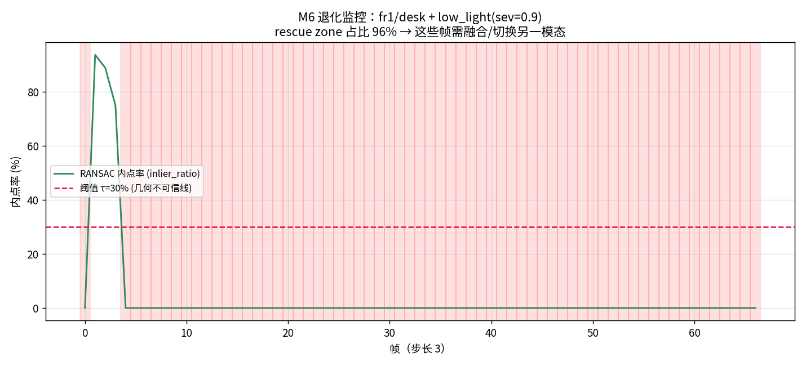

# 00 · 路线图：从几何地基到端侧空间感知

> 设计原则：**每个 Module 都是一个可验证的小闭环**，都能产出一份"能放进报告/简历"的东西。
> 每个 Module 走同一套 5 步法：`概念 → 理论 → 实现 → 实验 → 反思`。

---

## 全局地图

```
        ┌─────────────── 基础层（理解"是什么"）───────────────┐
        │  M0 几何地基  →  M1 手搓 SfM/VO  →  M2 深度与重建   │
        │  （硬件扫盲 F7 应与本层配套：先懂器件再懂算法）        │
        └──────────────────────────────────────────────────┘
                              ↓
        ┌───────────── 科学层（本项目核心资产）─────────────┐
        │  M3 退化建模与失效归因  →  M4 前馈3D基础模型        │
        │              →  M5 压力测试矩阵 ⭐                 │
        └──────────────────────────────────────────────────┘
                              ↓
        ┌──────── 工程层（差异化壁垒）────────┐
        │  M6 多模态融合  →  M7 语义层  →  M8 端侧部署        │
        └──────────────────────────────────────────────────┘
                              ↓
                        M9 综合闭环
                              ↓
        ┌──── 集成与闭环层（感知→控制，落地的最后一公里）────┐
        │  F6 决策与控制（WorldModel→costmap→规划→控制→兜底） │
        │  F8 全栈贯通（一镜到底：同一任务串起全栈，每步真实图）│
        │  F9 方法选型（该不该用、用得起吗：四联表+数据/算力/OOD）│
        │  →  P1 实战闭环  →  P2 仿真实验台/真实相机            │
        │        →  P3 面试旗舰实战（收口：能讲给面试官听）      │
        │        →  P4 真实驾驶动态建图（真实传感器数据闭环）    │
        │        →  P5 真实驾驶端到端闭环（感知→建图→规划→控制）  │
        └──────────────────────────────────────────────────┘
```

### 📷 全局地图的「一图流」（每一层给一张代表作）

| 层 | 代表作 | 说明 |
|---|---|---|
| 基础层 · 投影 |  | 3D 世界 → 2D 像素（F0/M0） |
| 基础层 · 轨迹 |  | 一段视频 → 相机轨迹（M1） |
| 基础层 · 重建 |  | 深度 → 3D 网格（M2） |
| 科学层 · 失效 |  | 什么条件崩、崩在哪一步（M3） |
| 科学层 · 前馈 |  | 前馈模型深度几乎不退化（M4） |
| 科学层 · 图谱 ⭐ |  | 方法 × 环境失效图谱（M5，核心资产） |
| 工程层 · 融合 |  | 退化监控触发救援（M6） |
| 工程层 · 语义 |  | 自然语言查询检测（M7） |
| 工程层 · 端侧 |  | 算力预算 vs 精度（M8） |
| 收口 · 闭环 |  | 解构世界为 3D 物体（M9） |

---

## M0 · 几何地基 🟡

**目标**：把"空间感知"的语言学扎实。这一层不牢，后面所有论文都读不懂。

| 项 | 内容 |
|---|---|
| 概念 | 针孔相机模型、内参/外参、齐次坐标、坐标系约定（世界/相机/像素/归一化平面） |
| 理论 | 投影矩阵推导；李群 SO(3)/SE(3) 与李代数；扰动模型（为什么优化要用李代数）；对极约束、本质矩阵 E、基础矩阵 F；单应矩阵 H；三角化；PnP |
| 实现 | `src/wildspatial/geometry/`：camera.py、lie.py、epipolar.py、triangulation.py、pnp.py —— **全部手写** |
| 实验 | 合成场景：已知相机对 → 投影 3D 点 → 加噪声 → 反解 E/F → 三角化 → 与真值比对 |
| 反思 | 退化构型：纯旋转为什么解不出 E？为什么平移太小会炸？ |
| 产出 | 几何库 + 数值自检全绿 + 1 张"退化构型"可视化图 |

**自检标准**：`pytest tests/` 全过。每个函数配 **解析解对照** 与 **数值雅可比对照**（1e-6 级）。

---

## M1 · 手搓 SfM / 单目 VO

**目标**：亲手搭一遍传统管线。**这一层的痛苦是后面所有理解的地基。**

| 项 | 内容 |
|---|---|
| 管线 | SIFT/ORB 特征提取 → 描述子匹配 → 比值检验 + RANSAC 剔外点 → 估 E（五点法）/ H（DLT）→ 分解 R,t → 三角化建图 → 下一帧 PnP 定位 → 局部 BA 优化 |
| 理论 | RANSAC 的迭代次数怎么定？五点法 vs 八点法？三角化的角度 criterion？重投影误差与 BA 的目标函数（Levenberg-Marquardt） |
| 实现 | `src/wildspatial/sfm/`；BA 用 scipy.optimize.least_squares，**手写残差与雅可比** |
| 实验 | TUM `fr1/desk`：跑出轨迹，与真值对齐（Umeyama/Sim3）后算 **ATE / RPE** |
| 反思 | 在 `fr3/nostructure_notexture` 上跑，**看它怎么崩**。记录：匹配数、内点率、轨迹漂移曲线 |
| 产出 | 轨迹对比图 + 量化表（ATE/RPE） + **第一份"它崩了"的记录** |

> 💡 **为什么必须手搓**：VGGT 的出现正是为了取代这条管线。没亲手搭过，你无法判断"前馈模型到底强在哪、在什么假设下会失效"。

---

## M2 · 深度与重建

| 项 | 内容 |
|---|---|
| 概念 | 视差-深度关系、极线校正、代价体积（cost volume）、RGB-D 融合、TSDF、点云/网格/3DGS |
| 实现 | 双目视差（块匹配 + SGBM）→ 深度；TSDF 体积融合 → Marching Cubes 出 mesh |
| 实验 | TUM RGB-D：单帧深度 vs 融合重建；对比 TSDF 前后噪声 |
| 产出 | 可旋转查看的 mesh + 深度误差表 |

---

## M3 · 退化建模与失效归因 ⭐

**目标**：建立本项目的**方法论核心** —— 一套可复用的"为什么失效"分类学。这也是你最强的差异化（物理退化建模）。

| 项 | 内容 |
|---|---|
| 物理退化模型 | 大气散射模型（雾霾/水下）：`I = J·t + A(1-t)`；水下波长选择性衰减；低光照泊松-高斯噪声；运动模糊卷积；镜头污损 |
| 实现 | `src/wildspatial/degrade/`：对干净数据**可控施加**退化（可复现、有真值对照） |
| 失效分类学 | 5 类根因：**① 特征缺失**（无纹理/白墙）**② 光度违背**（光照剧变/反光/烟雾）**③ 几何退化**（纯旋转/小基线/重复结构）**④ 动态破坏**（移动物体违反静态假设）**⑤ 时间失联**（快运动/模糊/帧率不足） |
| 诊断指标 | 每类配**可量化探针**：特征点数/匹配内点率/重投影残差分布/位姿条件数/深度一致性 |
| 产出 | **失效分类学文档 + 诊断工具包** |

> 🎯 **为什么这是王牌**：学术界刷干净场景的 SOTA，工业界关心"什么时候会失效、失效了怎么办"。
> 而**用合成退化 + 真值对照**做归因，是小团队唯一能做且做得比大厂细的路子。

---

## M4 · 前馈 3D 基础模型

| 项 | 内容 |
|---|---|
| 模型 | VGGT（CVPR25 Best Paper）/ MASt3R / DUSt3R |
| 理解点 | 它为什么能"一次前向取代整条 SfM"？输出表示（point map / depth+pose）的设计取舍；VGGT-Ω 为何改成只预测每帧深度+位姿（**用正确的输出表示绕开物理矛盾**） |
| 实验 | **同一批数据、同一套评测协议**与 M1 的手搓 VO 对比 |
| 产出 | "分块 vs 一体化"实证报告：精度 / 速度 / 鲁棒性 三维对比表 |

---

## M5 · 压力测试矩阵 ⭐⭐（核心资产）

| 项 | 内容 |
|---|---|
| 设计 | **方法 × 环境 × 退化强度** 三维交叉评测 |
| 方法轴 | SIFT-VO(M1) / ORB-SLAM / VGGT / MASt3R / (+M6 融合方案) |
| 环境轴 | 干净 / 无纹理 / 低光 / 烟雾 / 运动模糊 / (水下散射) |
| 强度轴 | 3~5 档递进 |
| 产出 | **失效图谱**（heatmap）+ 归因报告：**每种方法在哪个强度、因哪类根因开始失效** |

> 这是"学术界不屑做、工业界急需、几乎无人竞争"的位置。也是简历上最硬的一条。

---

## M6 · 多模态融合补救

针对 M5 找出的失效点，引入互补模态：IMU（抗模糊、提供尺度）、深度/ToF（抗无纹理）、热成像（抗烟雾/全黑）、声呐（水下）。
产出：**融合方案 + 精度提升量化**（例如"低光下 ATE 从 X 降到 Y"）。

---

## M7 · 语义层（责任切分）

复现 TAMP-Nav / RoboAtlas 思想：**VLM 只输出 2D 语义目标点，几何坐标由深度+内参转换，执行交给规划器**。
产出：语义闭环 demo（"去厨房"→ 导航执行）。
⚠️ 刻意验证 VLM 的几何弱点：**让它直接估深度/位姿，看它崩**（把 benchmark 结论在自己数据上复现一遍）。

---

## M8 · 端侧部署

量化（PTQ/QAT）、ONNX → TensorRT、算子替换、显存/延迟剖析。目标平台 Jetson Orin / 瑞芯微。
产出：**延迟 / 功耗 / 精度损失** 三维表。

---

## M9 · 综合闭环

完整系统：感知 → 语义 → 规划 → 执行 → 验证 → 重规划，在恶劣环境下跑通。
产出：技术报告（博客级）+ Demo 视频 + 简历项目描述。

---

## F6 · 决策与控制（感知控制的后半段）

**目标**：补齐"感知 → 动作"的最后一段——把 WorldModel 变成机器人真的会动的轮子指令。
这是"视觉工程师"和"能交付机器人的感知控制专业人士"的分水岭。

| 项 | 内容 |
|---|---|
| 概念 | WorldModel 接口（衔接 `P2_simulation.md §3.7`）、占据栅格/代价地图、全局规划（A\*/NavFn）、局部避障（速度障碍法）、差速轮运动学 + PID、兜底分层（不确定性感知/反应式安全/降级） |
| 实现 | 读 `P1_service_robot`（占据栅格+A\*+动态避障+控制指令）、`P2_dynamic_obstacle`（五层闭环）、`p2_delivery_fpv_gazebo.py`（第一视角工况）的真实跑通代码 |
| 实验 | 跑 `sg render -c 'python scripts/p2_delivery_fpv_gazebo.py'` 看第一视角 ①②③⑥ 工况闭环 |
| 产出 | "感知→决策→控制"全链路认知 + 一份可被面试/简历复述的工程架构（WorldModel + 三层兜底） |

> 🎯 **为什么必须有这一层**：前面 M0–M9 全是"感知"（看懂世界）。但看懂 ≠ 能行动。
> F6 讲清楚"世界模型怎么交给规划器、规划器怎么变成轮子转速、建模差时怎么不撞"——这是 §3.7 架构认知的初学者教学版。

---

## F7 · 硬件扫盲（感知系统的"器官"清单）

**目标**：补齐"算法人"最缺的一块——**硬件认知**。摄像头买哪种、看哪些参数、采出什么数据？激光雷达和毫米波雷达区别？机器人靠什么动起来？同步标定怎么回事？

| 项 | 内容 |
|---|---|
| 概念 | 感知输入（摄像头/激光雷达/毫米波雷达/深度相机/IMU/编码器/GPS/超声波）、控制输出（电机/舵机/驱动器/运动机构）、计算平台（MCU/Jetson）、神经与能源（总线/同步/标定/供电） |
| 选型口诀 | 摄像头：**分辨·帧率·快门·焦距·接口**；激光雷达：**线束·测距·点频·FOV**；数据形态：图像张量 / 点云 `(x,y,z,intensity)` / 雷达目标列表 / IMU 高频角速度 |
| 实现 | 看 `P2` 多传感器同步（相机+LiDAR+IMU）、`P2` 仿真 RGB-D、`F5` KITTI 真实 LiDAR 点云——硬件在仿真/数据上的真实形态 |
| 产出 | 一份"园区配送机器人选型清单" + "算法人必懂的硬件器官地图"，能从"看仿真真值"过渡到"接真实硬件" |

> 🎯 **为什么必须有这一层**：前面 F0–F6 全是"软件怎么理解世界"，但**数据是被硬件采集、动作是被硬件执行**的。
> 不懂硬件，你连"数据从哪来、为什么这么脏"都说不清——这是 `F7` 与 `F0`/`F5`（硬件侧 vs 数学/融合侧）互补的意义。

---

## F8 · 全栈贯通（把碎片拼成一条线的一镜到底）

**目标**：`F0`–`F7` + `M0`–`M9` 是知识点碎片，`F8` 用**同一个真实任务（园区夜间配送）**把它们拧成一根能跑的线——每个时刻讲清「谁在工作（硬件）· 算什么（算法，引 F/M）· 吐什么数据 · 出事谁兜」，并附本项目已实跑的真实图作证据。

| 项 | 内容 |
|---|---|
| 场景 | 园区夜间配送：出发标定 → 走廊定位 → 融合感知 → 填 WorldModel → costmap+A\* → 动态避障 → 差速+PID 控轮子 → 三层兜底（全黑/反光）→ 门口送达 |
| 引图 | 第一视角关键帧、多传感器同步、VO 轨迹、开放词汇检测、KITTI 真实 LiDAR、投影闭环、VGGT 深度、夜间/雾/反光退化图、costmap、A\* 规划、NavFn vs 手搓、动态避障、控制指令序列（共 ~19 张真实图） |
| 衔接 | 与 `F7 §13`（硬件器官视角看同一趟任务）两面互补；与 `F6`（决策控制）逐段对应；与 `M3`/`M5`（失效图谱）呼应"为什么崩" |

> 🎯 **为什么必须有这一层**：前面每篇单独读都"懂了"，但真实系统里它们**同时工作**。`F8` 让你在脑子里 replay 一趟完整任务，从此回看任何一篇都不再孤立——这是从"会读文档"到"能设计系统"的收口。

---

## 时间与优先级建议

> 你的现实约束：小公司在职、单卡 24G、时间碎片化。
> 因此优先级排序：**M0 → M1 → M3 → M4 → M5** 是主干（M2 可快过，M6~M8 按需）。
> **M5 的失效图谱是必须拿下的山头**，前面所有 Module 都是为它铺路。

> **成为「感知控制专业人士」的最后一公里**：在 M0–M9 之上，务必补 **F6（决策与控制）+ F7（硬件扫盲）+ F8（全栈贯通）+ F9（方法选型与工程清单）+ P1/P2/P3/P4/P5（实战闭环）**——
> 否则你只是"会看不会动的视觉工程师"。F6 与 `P2_simulation.md §3.7` 的"感知-决策解耦 + 兜底分层"是同一套架构的两面（教学版 vs 架构版），建议成对读；
> F9 则回答"**选哪个方法、要多少数据、要什么卡、没见过的东西怎么办**"——是从"会跑 demo"到"能交付选型"的最后一问。
> **P4 + P5 合起来**是本仓库唯一一条"**真实驾驶数据上的 感知→建图→规划→控制 全链路**"：P4 管前半段（感知→建图），P5 管后半段（建图→规划→控制）。

---

## P3 · 面试旗舰实战（收口：能讲给面试官听）

**目标**：把 `P0`（感知→场景图）+ `P1`（感知→规划→控制）+ `M5`（失效图谱）+ `M6`（融合兜底）+ `M8`（端侧）收口成一个**能讲给面试官听**的完整项目：
「真实恶劣工况下定位崩了怎么办？→ 诊断驱动融合兜底 → 托底轨迹驱动闭环控制」。

| 项 | 内容 |
|---|---|
| 场景 | 园区 / 室内夜间配送机器人：弱光、动态障碍、烟雾等恶劣条件下可靠定位并送达 |
| 真实问题 | 单目几何 VO 在弱光/运动模糊下特征匹配先断 → 轨迹塌缩 → 机器人迷路（初学者/传统方案最容易翻车的一刀） |
| 方法轴 | 传统几何 VO（SIFT→匹配→RANSAC→三角化→PnP）vs 前馈 3D 基础模型 VGGT（一次前向出轨迹+深度+点云，绕开「特征→匹配」最先失效环节） |
| 兜底 | 诊断驱动融合（M6）：监控路径长度/内点率，主方法塌缩即切 VGGT；尺度由真值路径长定标 |
| 闭环 | 托底轨迹 → 深度反投影成 2.5D 占据栅格 → A\* 规划 → 差速轮 (v,ω) 控制（a_max/ω_max 限幅）→ 速度障碍法动态避障 |
| 端侧 | 把分辨率/特征当算力旋钮，实测三维表（延迟/精度/算力预算，M8） |
| 代码 | `scripts/p3_flagship_delivery.py`（方法动物园 + 退化 + 融合兜底 + 闭环 + 4 图 + metrics + README） |
| 文档 | `docs/P3_field_project.md`（30 秒电梯演讲 + 鲁棒性对比表 + 系统架构图 + 三视角讲解 + 复现命令） |
| 实证 | TUM fr1/desk 合成退化：自研 VO 弱光/运动模糊**塌缩**，VGGT 稳压 0.020/0.022/0.030m；融合兜底切 VGGT；闭环建出占据栅格 28×38、A\* 30 步、控制 29 条、避障 5 步 |

> 🎯 **为什么它是收口**：前面 M0–M9 + F0–F8 + P0/P1/P2 是"能力碎片"，P3 把它们拧成一根**能被面试/简历复述的线**——
> 从「定位会崩」的真实问题出发，用可量化方法边界（ATE）和兜底/闭环证明"这是个能交付的系统"，而不是玩具。
> 诚实边界：TUM fr1/desk 为手持桌面基准、退化系合成施加（已标注）；真实夜间证据见 `M5_stress_test.md §4.2`（4Seasons）。

---

## P4 · 真实驾驶动态建图（真实传感器数据闭环）

**目标**：把「真实多传感器数据当实时输入流」完整跑通：
**真实 RGB → VGGT 视觉定位 → 真实 LiDAR 尺度定标 → 逐帧 BEV 增量建图 → 第一视角 + 俯视全景双视角视频回放**。
数据用已在磁盘的 KITTI depth_completion 真实街道驾驶（零下载、非仿真、非合成退化）。

| 项 | 内容 |
|---|---|
| 输入 | 真实车载 RGB（image_02）+ 真实稀疏 LiDAR（velodyne_raw，depth=png/256m）+ 内参 |
| 定位 | 方法动物园 VGGT 一次前向出相机轨迹 `T_cw`（up-to-scale，M4） |
| 定标 | 真实 LiDAR 深度 median 比定标全局尺度（×72.433）→ 度量级轨迹 125.16m |
| 建图 | 每帧真实激光反投影→世界系→增量写入 0.4m 栅格 BEV（高度着色，≈150×190m，56.5 万点） |
| 回放 | 双视角视频：左=RGB+激光扫描（近暖远蓝），右=BEV+绿轨迹+红车体（forward 朝上） |
| 代码 | `scripts/p4_real_driving.py` |
| 文档 | `docs/P4_real_driving.md`（电梯演讲 + 原理流程图 + 实测表 + 三视角 + 复现 + 诚实边界） |

> 🎯 **为什么它是 P3 的姊妹篇**：P3 回答"**定位崩了怎么办**"（鲁棒性+兜底），P4 回答"**真实传感器数据怎么变成随车生长的地图**"（系统构建）。
> 两者合起来 = 感知系统"鲁棒性"与"完整性"两面，且都不依赖真值位姿（量产形态）。
> 诚实边界：该基准无逐帧真值位姿 → 不报 ATE；轨迹来自视觉、尺度来自激光；「雷达」=LiDAR；海上场景待真实多传感器数据集。
