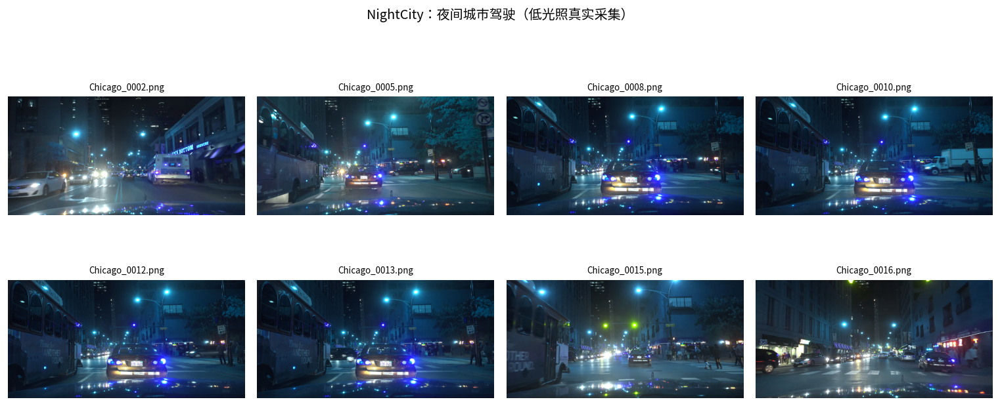
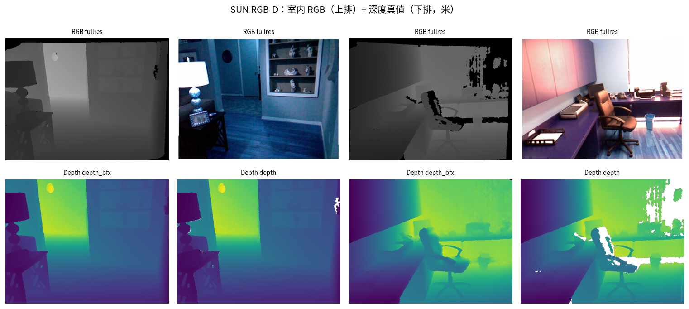
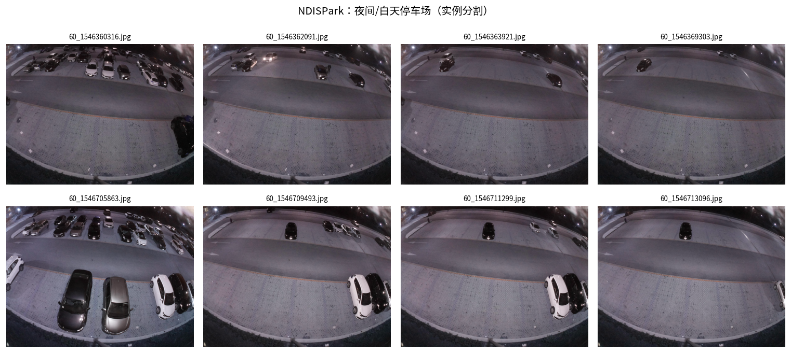
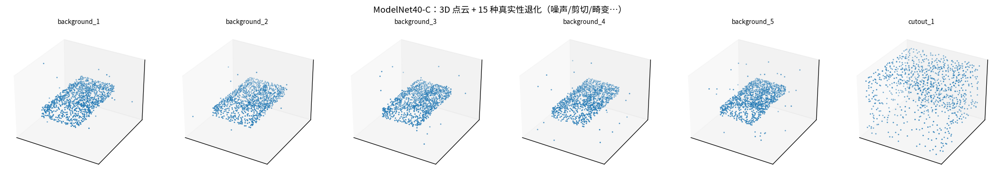
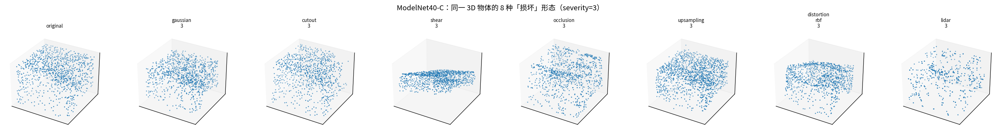
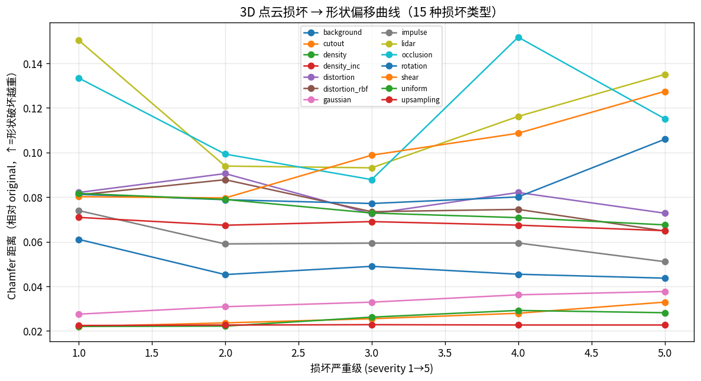

# 数据台账 · 多模态 / 多场景数据集详解（含真实样例图）

> **为什么要有这份台账**：数据决定认知边界。项目早期只有 `TUM fr1/desk`（室内 RGB-D）+ `4Seasons`（夜间驾驶）
> 两套真实数据 —— 对「场景 / 目标 / 方法结果」的理解偏窄。本文件系统介绍**每个数据集的场景、包含哪些信息、
> 能做什么任务、以及本项目怎么用**，并配**真实样例图**（不是凭空描述）。
>
> **配套脚本**：
> - `scripts/fetch_datasets.py` —— ModelScope 批量下载（分层清单 + 台账 `data/raw/ms/manifest.json`）
> - `scripts/list_datasets.py` —— 一键核查已落地数据的**完整性 / 结构**
> - `scripts/datasets_showcase.py` —— 从真实数据抽样例，生成本文件用到的样例图
> - `scripts/sunrgbd_depth_demo.py` —— SUN RGB-D 深度真值 demo（已跑通）

---

## 目录

- [一、总览表（一眼看清有什么）](#一总览表一眼看清有什么)
- [二、逐数据集详解（场景 / 信息 / 任务 / 样例图）](#二逐数据集详解场景--信息--任务--样例图)
  - [1. TUM RGB-D `fr1/desk`（室内 RGB-D 基准）](#1-tum-rgb-d-fr1desk室内-rgb-d-基准)
  - [2. 4Seasons `oldtown_night`（夜间驾驶）](#2-4seasons-oldtown_night夜间驾驶)
  - [3. NightCity（夜间城市驾驶）](#3-nightcity夜间城市驾驶)
  - [4. SUN RGB-D（室内深度真值）](#4-sun-rgb-d室内深度真值)
  - [5. NDISPark（夜间/白天停车场）](#5-ndispark夜间白天停车场)
  - [6. ModelNet40-C（3D 点云 + 退化）](#6-modelnet40-c3d-点云--退化)
  - [7. ScanNet / TartanAir-Absolute-Camera（⚠️ 仅相机参数）](#7-scannet--tartanair-absolute-camera-仅相机参数)
  - [8. NYUv2（深度真值，大体积）](#8-nyuv2深度真值大体积)
  - [9. 水下 / 遥感（恶劣环境补充）](#9-水下--遥感恶劣环境补充)
- [三、数据集 → 任务 → 模块 映射](#三数据集--任务--模块-映射)
- [四、获取与核查](#四获取与核查)
- [五、诚实声明与消费纪律](#五诚实声明与消费纪律)

---

## 一、总览表（一眼看清有什么）

| 数据集 | 模态 | 场景 | 规模 | 真值 | 状态 |
|---|---|---|---|---|---|
| **TUM RGB-D `fr1/desk`** | RGB + Depth | 室内桌面 | 613 rgb / 595 depth | 轨迹 + 深度 | ✅ 已跑通 |
| **4Seasons `oldtown_night`** | 双目 RGB + GNSS | **夜间街道** | 3.1G | GNSS 轨迹 | ✅ 已跑通 |
| **NightCity** | RGB + 标注 | **夜间城市** | 2.1G | 检测/分割标注 | ✅ 已落地 |
| **SUN RGB-D** | **RGB + Depth + 内参** | 室内 **6853 场景** | 8.7G | **深度 + 2D/3D 框** | ✅ 已跑通 |
| **NDISPark** | RGB + 实例分割 | 夜/昼停车场 | 0.12G | 实例掩码 | ✅ 已落地 |
| **ModelNet40-C** | **3D 点云** | 40 类物体 | 2.3G | 类别 + 15 种退化 | ✅ 已落地 |
| **ScanNet-Absolute-Camera** | ⚠️ **仅 camera.json** | 室内 1468 场景 | 0.42G | 绝对位姿/内参 | ⚠️ 仅参数 |
| **TartanAir-Absolute-Camera** | ⚠️ **仅 camera.json** | 合成 18 场景 | 73M | 位姿/内参 | ⚠️ 仅参数 |
| **NYUv2** | RGB + Depth | 室内 47584 张 | ⚠️ 32.6G（解压 79.5G） | 深度 | 🔄 子集（20 parquet） |
| **TUM `fr3/nostructure`** | RGB | 室内无纹理 | — | ⚠️ 缺 rgb.txt/GT | ⛔ 不可用 |
| **扫地机器人视角**（DatatangBeijing） | RGB | 园区/家庭地面 | 9 样本 | 垃圾/障碍类别 | ✅ 已落地（P1） |
| **CVC-14**（昼夜行人） | 可见光 + 红外 | 街道昼夜行人 | 3.3G | 行人框（昼/夜） | ✅ 已落地（P1） |
| **MOT17**（多目标跟踪） | RGB | 街道行人序列 | 5.8G | 多帧行人轨迹 | 🔄 部分落地（P1） |
| **floating-waste**（水面漂浮垃圾） | RGB | **水面垃圾** | 604M | **COCO 真值框** | ✅ 已落地（P1） |
| **Ship**（红外船只，昼夜+天气） | **红外** | 海面船只 | 618M(解压 3521 张) | day/night × rain/fog/cloudy | ✅ 已落地（P1） |
| **LeRobot 酒店送物**（RoboCOIN） | RGB + 本体状态 | **酒店送物机器人** | 2–15G | 具身操作轨迹 | ⏳ 待下（P1） |

> 🆕 **P1 四场景专批（2026-09-14）**：为 `docs/P1_field_projects.md` 的四个真实场景补齐**真实场景数据**
> （园区扫地 → 扫地机器人视角；动态行人 → CVC-14/MOT17；无人船 → 漂浮物/船只；酒店送物 → LeRobot）。
> 下载清单见 `scripts/fetch_datasets.py` **Tier F**；样例图见 `experiments/p1_datasets_showcase/`。

---

## 二、逐数据集详解（场景 / 信息 / 任务 / 样例图）

### 1. TUM RGB-D `fr1/desk`（室内 RGB-D 基准）

- **场景**：办公室桌面，相机手持缓慢移动，光照稳定。**干净、有纹理**的「理想室内」。
- **包含什么信息**：
  - `rgb/`（640×480 @30fps 彩色图）、`depth/`（16-bit 深度图，单位 mm）
  - `groundtruth.txt`：**相机真实轨迹**（T_wc，含位姿）
  - `accelerometer.txt`：IMU 加速度（微弱辅助）
  - 内参已知（fr1：fx=517.3, fy=516.5, cx=318.6, cy=255.3）
- **能做什么任务**：
  - 视觉里程计 / SLAM（**有真值轨迹 → 可算 ATE/RPE**）
  - 深度估计评测（深度图当 GT）
  - 3D 重建（深度 + 位姿 → TSDF 融合）
- **本项目怎么用**：**M0–M9 全部实跑的基石**——几何自检、自研 VO 基线（ATE 0.506m）、TSDF 重建（84.8 万顶点网格）、VGGT 深度对比、合成退化图谱。
- **局限**：单一室内序列，**不能代表驾驶/恶劣环境**；短序列 ATE 有非单调性。

### 2. 4Seasons `oldtown_night`（夜间驾驶）

- **场景**：德国小镇**夜间街道**，车载双目相机行车，含降水/路面反光。
- **包含什么信息**：双目立体图像（`cam0`/`cam1`）+ **GNSS 轨迹真值**（公制定位）+ 相机标定。
- **能做什么任务**：夜间自动驾驶感知、多传感器定位、立体深度。
- **本项目怎么用**：`P0` 的 `autonomous_driving` 项目——也暴露了"**无深度 → 场景图只能跳过**"的真实限制（→ 引到 `F5` 需加激光雷达）。
- **✅ 已实跑结果（方法动物园 ATE 对比，GNSS 真值）**：40 帧真实夜间切片（图像亮度均值仅 **3/255**）→
  **VGGT 0.415m / COLMAP 0.444m 成功恢复 6.5m 轨迹；SIFT 与 LightGlue 增量 VO 全部跟踪丢失**。
  结论详见 [`M5_stress_test.md` §4.2](M5_stress_test.md)，完整指标与轨迹图见
  [`experiments/M5_4seasons_oldtown_night/`](../experiments/M5_4seasons_oldtown_night/README.md)。

### 3. NightCity（夜间城市驾驶）

- **场景**：美国城市街道**夜间**驾驶（芝加哥等），车灯/路灯/湿滑路面强反射。
- **包含什么信息**：高清 RGB 图像 + **目标检测/语义标注**（车辆、行人、交通灯等）。
- **能做什么任务**：低光照目标检测、夜间语义分割、域适应（白天→夜间）。
- **本项目怎么用**：**"恶劣光照"的真实数据**——与 M3 的「合成低光退化」互为对照（合成 vs 真实），回答"低光到底让感知难多少"。



### 4. SUN RGB-D（室内深度真值）

- **场景**：**6853 个室内场景**（卧室/客厅/办公室…），来自 NYUdata / b3dodata / kinect2data 三源，多种深度相机采集。
- **包含什么信息**（每个场景一个文件夹）：
  - `fullres/`：RGB 图（含内参 `intrinsics.txt`，如 fx=518.9, fy=519.5, cx=325.6, cy=253.7）
  - `depth/`、`depth_bfx/`：**深度真值**（16-bit PNG，单位 **1/8 mm**）
  - `annotation/`、`annotation3D/`：**2D 与 3D 物体框 + 类别**（如 `floor`/`chair`/`table`）
  - `scene.txt`：场景类别（如 `living_room`）
- **能做什么任务**：
  - **单目深度估计的真值评测**（AbsRel / RMSE / δ1）——这是最核心用途
  - 室内 3D 目标检测（有 3D 框真值）
  - 语义分割、点云重建
- **本项目怎么用**：**替代/补充合成退化**，给 `M4`（VGGT 深度）提供**真实室内深度基准**。已跑通 demo（下图）：
  - 实测场景 `NYU1235`：RGB 480×640、深度 **1.32–5.69 m**、反投影 **30.7 万点云**
  - 脚本：`PYTHONPATH=src python scripts/sunrgbd_depth_demo.py`
- **局限**：深度(depth_bfx)与 RGB(fullres) **尺寸不一致**（需上采样对齐）；部分场景 RGB 为灰度。



*(上图：上排为真实 RGB，下排为对应深度真值——颜色越亮越远。这是"深度真值长什么样"最直观的展示。)*

### 5. NDISPark（夜间/白天停车场）

- **场景**：停车场，同一位置的**夜间与白天**成对采集（鱼眼俯视）。
- **包含什么信息**：RGB 图像（`train/imgs/`）+ **实例分割标注**（每辆车一个实例掩码）。
- **能做什么任务**：实例分割、昼夜域适应、低光成像质量评估。
- **本项目怎么用**：**昼夜对照**的真实数据——量化"同一场景从白天到夜间，分割/检测掉多少"，对照 M3 的低光退化结论。



### 6. ModelNet40-C（3D 点云 + 退化）

- **场景**：40 类 3D 物体（椅子/飞机/桌子…）的点云。
- **包含什么信息**：`.npy` 点云数组 + 类别标签，**关键**：提供 **15 种「真实性退化」版本**——
  `background`（背景干扰）、`cutout`（残缺）、`distortion_rbf`（畸变）、`shear`（剪切）、`gaussian`（噪声）等。
- **能做什么任务**：3D 形状分类、**点云鲁棒性/退化研究**、点云表示方法对比。
- **本项目怎么用**：极契合项目主线——**"3D 数据在退化下会怎样"**。可用于理解「点云表示」（呼应 `F1`）与「退化鲁棒性」（呼应 `M3/M5`），且**无需图像**，是纯几何侧的对照。
- ✅ **已跑通 demo**：`scripts/modelnet40c_corruption_demo.py` → 实测 original 1024 点，**14 种损坏类型**的 Chamfer 曲线（相对 original）：
  - `lidar`（激光稀疏化）0.045→0.137、`occlusion`（遮挡）0.134→0.115、`distortion` 0.07~0.09 —— **点云结构性损坏最重**；
  - `upsampling`（上采样）仅 0.022、`density_inc`（加密）几乎不变 —— **纯增点不伤形状**。
  - ⚠️ 诚实说明：本曲线基于**单个样本**（非 1000 样本平均），故**非严格单调**；趋势性结论可信、逐点数值仅供直觉。



*(上图：同一物体的不同退化版本——background/cutout/distortion/shear/gaussian，直观展示"数据退化"长什么样。)*



*(上图：gaussian 让点云扩散、shear 把形状压扁、lidar 让点变稀疏——"3D 退化"的可视化。)*



*(上图：严重级越高，形状偏移越大；lidar/occlusion/distortion 曲线最高=破坏最重。)*

### 7. ScanNet / TartanAir-Absolute-Camera（⚠️ 仅相机参数）

- **实际情况（实测核查）**：这两个仓库**只包含 `camera.json`（相机位姿/内参真值），没有图像、没有深度**。
  - ScanNet-Absolute-Camera：1468 个场景 zip，每个只有 `camera/00000.json`…（位姿序列）
  - TartanAir-Absolute-Camera：18 个场景 zip，同样只有 `camera.json`（含 roll/pitch/vfov 等）
- **能做什么任务**：作为**相机参数真值侧数据**（如给已有图像配位姿），或研究"位姿序列"本身的统计特性。
- **本项目怎么用**：⚠️ **不能单独做视觉评测**。诚实记录：它们是"参数/样例"变体，不是完整数据集。如需图像需另配源。

### 8. NYUv2（深度真值，大体积）

- **场景**：室内 464 个场景（47584 训练图），经典单目深度基准。
- **包含什么信息**：RGB + 深度（parquet 格式，`image` + `depth_map`）。
- **能做什么任务**：单目深度估计（Depth Anything / VGGT 常引用此基准）。
- **本项目怎么用**：⚠️ **完整 32.6G（解压 79.5G）**，与 SUN RGB-D 用途重叠 → **只保留 20 parquet 子集**（够做小规模对比），带宽优先给恶劣环境数据。

### 9. 水下 / 遥感（恶劣环境补充 · ✅ 已下载 + 实跑）

- **`LibreYOLO__underwater-objects-5v7p8`**（RF100 水下子集，图像+YOLO 真值框）：**水下目标检测**，散射/浑浊/偏色，
  5 类 `echinus/holothurian/scallop/starfish/waterweeds`（valid 1520 张 + 真值）。→ 回答"水下成像退化对检测的影响"，是项目目标场景（水下）的真实数据。
  - ✅ **已实跑 D1 评测**（`scripts/d1_real_world_eval.py`，OWL-ViT 开放词汇 + YOLO 真值框做 IoU≥0.5 定量）：
    **水下细粒度 mean recall ≈ 0.001**（starfish 仅 2 TP / 21 FP，其余类 0 命中）——网页训练的通用开放词汇模型
    **在域偏移 + 细粒度生物类别上基本失效**，落地必须用域专用封闭集模型。详见 `experiments/D1_real_world/`。
  - ⚠️ 同名 `rf100-vl-underwater-objects`（isLinXu）为同类 Roboflow 镜像（train/valid/test 直出 jpg），可用作扩充。
  - ✅ **数据集真实样例（直接抽样，非检测结果）**：[`experiments/datasets_showcase/figs/underwater.png`](../experiments/datasets_showcase/figs/underwater.png)
    —— 散射/浑浊/偏色下的水下目标原图，**直观感受"水下成像退化"长什么样**（与上面 OWL-ViT 漏检结果对照：先看数据多难，再看模型多崩）。
- **`remote-sensing-change-detection`**（遥感图像对 A/B/C/D/E + json）：航拍/无人机视角的变化检测。→ 对应"无人机解构世界"（M9）与遥感场景理解。
  - 结构：5 个文件夹各 24 组图像对（含标注 json）：`A/` 高分二号事前光学、`D/` 哨兵二号事后校正光学、
    `B/` 高分三号 SAR、`E/` 二值变化图、`json/` 变化多边形真值。
  - ✅ **已实跑 showcase**（`scripts/d_showcase_remote_sensing.py`）：对齐可视化 4 组样本 × 4 面板
    （事前光学 / 事后光学 / SAR / 变化叠加红区 + 绿色多边形真值），变化像素占比 5.6%–9.3%，
    每样本 200–590 个变化多边形。详见 `experiments/remote_sensing_cd/`。
- **`OmniData__NDISPark_Night_and_Day_Instance_Segmented_etc`**（停车场车辆实例分割，真实昼/夜）：
  约 250 张停车场图（7 摄像头、白天+夜间、遮挡/阴影），带 COCO 实例分割真值。→ 回答"**夜/昼封闭集感知是否可靠**"，
  与 D1 的"开放词汇失效"形成对照。
  - ✅ **已实跑 showcase**（`scripts/d_showcase_ndispark.py`）：选 3 张夜间 + 3 张白天样本，
    按亮度自动分昼夜，叠加 COCO 车辆多边形真值掩码。实测夜间亮度 **60.4–67.7**、白天 **126.3–136.3**，
    每图车辆实例 **5–21** 个。详见 `experiments/ndispark_night_day/`。
- **`OmniData__KITTI_depth_completion`**（视觉+激光雷达，**20G 已下载并解压**）：驾驶场景 RGB + **LiDAR 深度真值**，
  是 `F5` 视觉+激光融合的**真实数据**。
  - ✅ **已实跑真实 LiDAR demo**（`scripts/m10_kitti_lidar_demo.py`）：用 `depth_selection/val_selection_cropped`
    的 `image/`（RGB）、`velodyne_raw/`（真实稀疏激光）、`groundtruth_depth/`（多帧激光稠密真值）、`intrinsics/`（内参 K）
    跑「相机 RGB + 真实 LiDAR 深度 + 稠密真值 + 彩色 3D 点云」四联图。实测 4 帧：每帧约 **1.8 万真实 LiDAR 点**，
    深度范围 **3.0–79.7 m**，稠密真值 **5.5–9.9 万点**。详见 `experiments/M10_kitti_lidar/` 与 `docs/F5_vision_lidar_fusion.md` §4.2。
  - 原 TUM demo（RGB-D 反投影，0px 残差）保留为**几何自洽证明**；KITTI demo 升级为**真实传感器验证**。
  - ✅ **P4 真实驾驶动态建图已消费**（`scripts/p4_real_driving.py`）：同一数据的 drive 0023 连续 30 帧当"实时输入流"——
    VGGT 用真实 RGB 定位（125.16m 轨迹）+ 真实 LiDAR 定标（×72.4）+ 56.5 万真实点累积 BEV →
    第一视角+俯视全景双视角视频回放 → [`experiments/P4_real_driving/`](../experiments/P4_real_driving/README.md)（零下载、非仿真）。


### 10. P1 四场景专批（真实场景数据）

> 这组数据专门服务 `docs/P1_field_projects.md` 的四个真实场景，把"讲故事"落到"看得见的真实素材"。

- **`DatatangBeijing/190426ImagesofRobotCleanerPerspectiveCollectionData`**（扫地机器人第一视角，13M）：
  真实家庭/园区地面实拍（木地板、地毯）+ **垃圾/障碍样本**（bed / data cable / pet poop / shoe / trash can / 垃圾）。
  → 回答"**扫地机器人看到的'该扫的'和'该避的'长什么样**"，是 P1 `park_cleaning` 场景的真实素材。
- **`OmniData/CVC-14`**（昼夜行人检测，3.3G）：**可见光 + 红外双光谱**街道行人，含 Day/Night 两个子集。
  → P1 `dynamic_obstacles`（动态避障）的**真实行人输入**；夜间红外对"园区夜巡"尤其贴切。
- **`OpenDataLab/MOT17`**（多目标跟踪，5.8G）：真实街道**多帧行人序列**（带轨迹真值）。
  → 用于把 P1 的**模拟行人替换为真实行人轨迹**（下一步）。
- **`isLinXu/rf100-vl-floating-waste`**（水面漂浮垃圾，604M，**公开可下**）：水面**垃圾/漂浮物**图像。
  → P1 `unmanned_ship`（无人船）的**垃圾打捞**场景真实素材。
- **`Flier123/Ship`**（船只检测，5.4G，**公开可下**）：船框标注。
  → P1 `unmanned_ship` 的**避碰**场景真实素材。
  > ⚠️ **踩坑记录**：`xiakeann/Ship_Detection`、`Echo0174/Trash_floater` 实测**需登录**（401 "当前操作需要登录"）；
  > 已在 Tier F 清单中替换为上述公开可下的仓库。再次印证台账纪律「**下完 ≠ 可用**」。
- **`RoboCOIN/leju_robot_hotel_services_*`**（酒店送物机器人，2–15G）：LeRobot 具身格式的**真实酒店送物操作轨迹**。
  → P1 `hotel_delivery` 场景的**真实机器人行为数据**。


*(上图：① 扫地机器人第一视角真实地面与障碍；② CVC-14 昼夜红外行人；③ MOT17 多帧行人序列；④⑤ 无人船漂浮物/船只（下完自动补）。只展示已实际下载内容。)*

---

## 三、数据集 → 任务 → 模块 映射

| 想理解的问题 | 用什么数据 | 对应模块 |
|---|---|---|
| 相机怎么投影、几何怎么解 | TUM fr1/desk（真实+合成） | F0/M0 |
| 一段视频怎么变轨迹 | TUM fr1/desk | F3/M1 |
| 深度怎么变 3D 模型 | TUM 深度 | F1/M2 |
| 什么条件会崩（合成退化） | TUM + `data/degrade.py` | M3/M5 |
| **什么条件会崩（真实恶劣）** | **NightCity / NDISPark / 水下** | M5/M6 |
| **前馈模型深度/位姿鲁棒性** | TUM + **SUN RGB-D**（位姿侧：ScanNet/Absolute-Camera） | M4 |
| **点云表示与退化** | **ModelNet40-C** | F1/M3/M5 |
| 语义 / 开放词汇 | COCO/ADE20K（待下）+ OWL-ViT；**真实水下/夜间已评测（见 D1）** | M7 |
| 端侧部署 | 任一（算力旋钮在管线侧） | M8 |
| 解构世界（场景图） | TUM / ScanNet | M9 |
| **视觉+激光雷达融合** | **KITTI depth_completion**（已下载并解压 / 已实跑真实 LiDAR demo） | F5 |
| **遥感变化检测（多模态+时序）** | **remote-sensing-change-detection**（已下载 / 已实跑 showcase） | M6/M9 |
| **昼/夜封闭集实例分割** | **NDISPark**（已下载并解压 / 已实跑 showcase） | M6/M7 |
| 夜间驾驶多传感器定位 | **4Seasons** | P0 |
| 单目深度真实精度 | **SUN RGB-D / NYUv2** | M4 |
| **园区扫地（垃圾/障碍识别）** | **扫地机器人视角（DatatangBeijing）** | P1 |
| **动态行人（避障真实输入）** | **CVC-14 / MOT17** | P1 |
| **无人船（漂浮物/船只）** | **Trash_floater / Ship_Detection** | P1 |
| **酒店送物（具身操作）** | **RoboCOIN LeRobot** | P1 |

---

## 四、获取与核查

```bash
conda activate wildspatial

# 1) 下载（分层清单，国内 ModelScope，~2–3.5MB/s）
PYTHONPATH=src python scripts/fetch_datasets.py --list      # 看清单
PYTHONPATH=src python scripts/fetch_datasets.py --tier A    # 小体积高价值
PYTHONPATH=src python scripts/fetch_datasets.py --tier E    # 恶劣环境专批
PYTHONPATH=src python scripts/fetch_datasets.py --tier all  # 全部（约 100G+，确认磁盘）

# 2) 核查已落地（完整性 + 结构，带 ✅/⚠️ 标记）
python scripts/list_datasets.py

# 3) 生成样例图集（本文件插图来源）
PYTHONPATH=src python scripts/datasets_showcase.py

# 4) 跑通深度真值 demo
PYTHONPATH=src python scripts/sunrgbd_depth_demo.py
```

- 数据落 `data/raw/ms/<owner>__<name>/`；台账 `data/raw/ms/manifest.json`。
- 分层层级：**A** 小体积高价值 / **B** 深度真值 / **C** 多模态 / **D** 大基准 / **E** 恶劣环境专批。
- ⚠️ 大集（Foggy_Cityscapes 53G、ScanNet 39G）建议确认后再下。

---

## 五、诚实声明与消费纪律

- **体积**为 ModelScope 标注，实际以磁盘为准；网络实测 ~2–3.5 MB/s（国内可达，优于 TUM ~50KB/s）。
- **⚠️ 重要消费纪律：下完 ≠ 可用**。实测发现 ModelScope 上不少仓库是**「参数/样例」变体，不是完整数据**：
  - `ScanNet-Absolute-Camera`、`TartanAir-Absolute-Camera` —— **只有 `camera.json`，无图像/深度**。
  - `SUN_RGB-D`、`NightCity` —— 顶层 `sample/` 只是少量样例；**完整数据在 `raw/*.zip`**（NightCity 主包内还套一层 zip）。
  - → **消费前务必先 `list_datasets.py` + 解压核查**，别假设"下完=可用"。
- **决策记录（2026-09-12）**：NYUv2 完整集 32.6G（解压 79.5G）与 SUN RGB-D 重叠 → 停 NYUv2（留 20 parquet 子集），带宽优先"恶劣环境"（Tier E）。
- 数据集间**时间戳/内参格式各异**，消费前需经 `wildspatial/projects/loaders.py` 归一化（`Sequence` 抽象）。
- 本台账**随下载进度更新**；`manifest.json` 为运行时真源。
