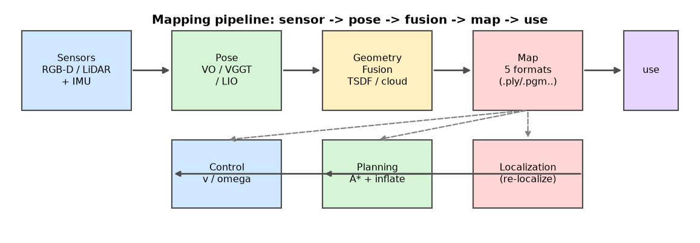
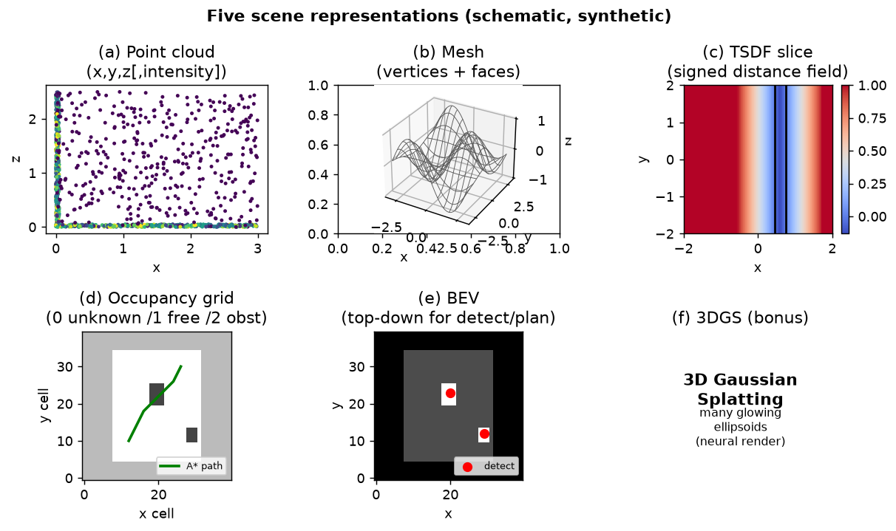
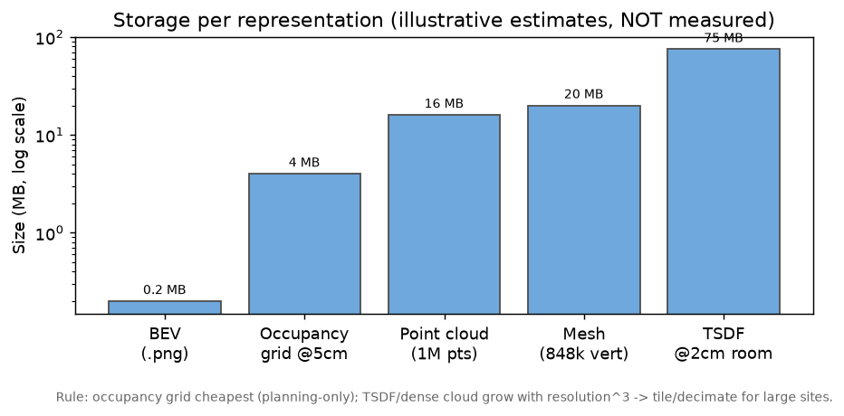
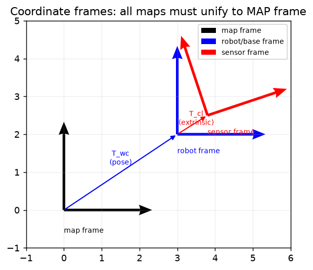

# F11 · 建图实操全链路：从硬件到"地图被用"的一站式指南

> 本文是 `F1`(场景表示) / `F3`(正常流程) / `F7`(硬件) 的**串联+补洞**篇。那几篇分别讲了"用什么容器装 3D 世界""算法怎么跑""传感器怎么选"，但**没把一条建图链路从头到尾走给初学者看**，也**没给体积数字、没讲存哪/坐标帧/坑**。本文补齐这些，让"我想给机器人建张地图"这件事有可照做的步骤。
>
> 📌 诚实边界：本文 §4 的体积数字、**§7 的园区扫地例子**为**经验量级估算**（非本项目实测）；本项目真跑过的建图在 `P4`(真实 LiDAR→BEV)、`M2`(真实 TSDF 84.8 万顶点网格)、`P6 §6.10`(USV 栅格 400×600)，这些在对应篇里是实数据。

---

## 1. 全景表：建图这件事到底有几步

| 步骤 | 干什么 | 用什么 | 产出 | 格式 | 典型体积* | 下游谁用 |
|---|---|---|---|---|---|---|
| ① 采数据 | 传感器边走边采 | RGB-D/双目/LiDAR+IMU | 图像/点云流 | `.png`/`.bag`/`.csv` | 视频级（几 GB/小时） | ② |
| ② 算位姿 | 估计每帧相机/机器人哪 | VO/SfM/VGGT/LO | 轨迹 T_wc(t) | `.traj`/`.txt` | 几 KB | ③ |
| ③ 融几何 | 把深度投到世界系叠加 | TSDF/点云累积/BEV | 地图 | `.ply`/`.pcd`/`.pgm` | 见 §4 | ④ |
| ④ 用地图 | 定位+规划+避障 | 重定位 / A\* / 膨胀 | 路径/指令 | — | — | 机器人 |

> *体积为**经验量级**，随场景大小、分辨率剧烈变化，见 §4 具体算法。

*图 1：建图全链路。传感器采数据 → 算位姿（VO/VGGT/LIO）→ 几何融合（TSDF/点云/BEV）出地图 → 地图被重定位/规划/控制消费。虚线表示地图"下行"到使用端。*

---

## 2. 硬件怎么选（引 `F7`，给"建图专用"建议）

| 场景 | 推荐传感器 | 理由（建图视角） |
|---|---|---|
| 室内/小场地（扫地/仓储） | **RGB-D（RealSense/Kinect）+ IMU** | 自带真深度→直接出点云，省去猜尺度（`F2` §2.3） |
| 室内大/无纹理（仓库货架） | RGB-D + **轮速编码器** | 无纹理处视觉 VO 易崩，编码器补里程 |
| 室外园区/道路 | **64/128 线 LiDAR + GNSS/IMU** | LiDAR 不受光照影响，GNSS 给全局系（`P4` 真跑过） |
| 水面/地下（无 GNSS） | LiDAR + **紧耦合 IMU（LIO）** | GNSS 拒止时只能靠惯性+激光（`M5` 退化场景） |
| 快速原型 | 单目+IMU（VGGT 前馈兜底） | 零硬件成本，`M4` 出 up-to-scale 点云 |

> 选型四联表（定位/精度/算力/数据量）详见 `F9`；传感器原理见 `F7`。

---

## 3. 算法怎么跑（引 `F3`/`M2`/`M4`）

1. **经典链路**：图像→特征→帧间位姿（VO）→深度图→投世界系→TSDF 融合出 mesh（`F3` §正常流程、`M2` 真实 84.8 万顶点网格）。
2. **前馈捷径**：一张/一段视频直接 VGGT 出点云+位姿（up-to-scale，需外部尺度源锚定，`M4`/`P4` 用 LiDAR median ×72.433 定标）。
3. **融合兜底**：上游崩了（无纹理/夜间）切 LiDAR/IMU（`M6` 诊断驱动切换）。

---

## 4. 建出来长啥样 + 格式 + 体积（核心补洞）

### 4.1 五种表示长啥样（详 `F1`）

- **点云**：一堆 (x,y,z[,intensity,rgb]) 点，像"太空星图"，能转能量距离，但无表面。
- **网格 mesh**：点连成三角面，像"纸糊的实体"，能渲染能仿真。
- **TSDF**：空间每体素存"到墙还有几厘米"，融合多帧最稳。
- **占据栅格**：2D 方格，每格=自由/障碍/未知，规划最爱（`P1`/`P5`/`P6` 都用它）。
- **BEV**：俯视鸟瞰图，把点云压成"上帝视角"给检测/规划（`P4`）。

*图 2：五种场景表示长啥样（**合成示意，非真实数据**）。(a) 点云=一堆带坐标的点；(b) 网格=点连成三角面；(c) TSDF=每体素到表面的带符号距离（暖色近墙、冷色远离）；(d) 占据栅格=每格自由/障碍/未知+一条 A\* 绿路径；(e) BEV=俯视灰度+检测框；(f) 3DGS=发光椭球（神经渲染，补充项）。*

### 4.2 格式与体积（**经验量级，非实测**）

| 表示 | 常见格式 | 体积估算（给可感知的量级） |
|---|---|---|
| 占据栅格 | `.pgm`+`.yaml`（ROS 标准） | 100m×100m @ 5cm = 2000²=400 万格 ×1B ≈ **4 MB**；@2cm ≈ **25 MB** |
| 点云 | `.pcd`/`.ply` | 100 万点 ×(xyz float32=12B + intensity 4B) ≈ **16 MB**；1000 万点 ≈ **160 MB** |
| TSDF 体素 | `.sdf`/`.tsdf`/`.npz` | 5m×5m×3m @ 2cm = 250×250×150≈940 万体素 ×(SDF+权重 8B) ≈ **75 MB**（分辨率×2→体积×8，最吃空间） |
| 网格 | `.obj`/`.gltf`/`.ply` | 84.8 万顶点 ×(位+法向 6×4B) ≈ **20 MB** 顶点 + 面索引 |
| BEV 图 | `.png` | 400×400 PNG 压缩后 **几十 KB~几百 KB** |

> **关键直觉**：占据栅格最省（规划够用就别建稠密点云）；TSDF/稠密点云最贵且随分辨率立方增长——大场地必须用**分块/截断/降采样**。

*图 3：五种表示的体积量级对比（**对数轴、经验估算非实测**）。BEV 最省（百 KB 级），占据栅格次之（@5cm 约 4 MB），点云/网格在十几~二十 MB，TSDF 体素最贵（@2cm 房间约 75 MB，且随分辨率立方增长）。*

---

## 5. 存在哪 · 坐标帧 · 地图版本（新内容，别处没讲）

### 5.1 存哪
- **离线建图（已知环境）**：落盘到磁盘/数据库（如 `experiments/P4/...`、`rosmap.pgm`），机器人上线只读不改。
- **在线 SLAM（未知环境）**：实时写在内存环形缓冲，定期快照落盘防掉电。
- **多机器人/大场地**：切子地图（submap）分文件存，`F8` 园区任务即此类。

### 5.2 坐标帧（新手最常踩的坑）
建图涉及至少三层帧，搞混地图就"飘"：
- **sensor frame**：传感器自身坐标（点云原始系）。
- **robot/base frame**：机器人本体（外参 `T_cl` 把传感器→本体，`F5` 讲标定）。
- **map frame**：全局地图系（位姿 `T_wc` 把相机→地图）。
> 规则：所有地图必须统一到 **map frame**；外参标错 1°→10m 外错 17cm（`F5` 重投影残差要压到 0）。

*图 4：三层坐标帧。sensor frame（红，随传感器）→ 经外参 `T_cl` → robot/base frame（蓝，随机器人本体）→ 经位姿 `T_wc` → map frame（黑，全局）。所有地图点必须统一到 map frame 才不会"散架"。*

### 5.3 地图版本与多程拼接
- 同一场地跑多次→**多会话地图融合**（配准后合并，删重复）。
- 长期运行→**地图版本号 + 增量更新**（众包高精地图 `P4` 即此范式）。
- 不同季节/光照→重建会不一致，需**重定位而非重建**（`M6` 降级逻辑）。

---

## 6. 怎么被规划用（引 `P1`/`P5`/`F6`）

地图不是终点，是控制的输入（本项目"感知为主、控制为辅"）：
1. 占据栅格 → **膨胀**（按机器人半径+余量，见 `P5`/`P6`）→ **A\*** 出路径。
2. BEV/点云 → 提取**移动目标**→ 速度障碍法让行（`P5` VO 式避障）。
3. 重定位：上线拿当前帧匹配先验地图→得"我在哪"→再规划（`P1` 园区机器人）。

---

## 7. 完整例子：园区扫地机器人（经验估算）

> 以下为**串联演示（经验值）**，非本项目实测；真实建图见 `P4`/`M2`/`P6`。

1. **硬件**：RealSense D455（RGB-D）+ 轮速编码器 + 工控机。
2. **采+建**：机器人先空跑一遍园区→`F3` 链路出点云→`F1` 转占据栅格 `.pgm`（200m×200m @ 5cm ≈ 16 MB）。
3. **剔动态**：用 `P4 §⑩` 思路剔掉路过的人/车（"移动物体不进静态地图"）。
4. **存**：`/maps/campus_v1.pgm` + `campus_v1.yaml`（分辨率/原点/外参）。
5. **上线用**：每日开工→RGB-D 帧匹配 `campus_v1` 重定位→A\* 全覆盖牛耕式规划（`P1` §园区扫地）→遇人停等/绕行。
6. **更新**：每周重跑增量合并→`campus_v2`。

---

## 8. 新手"想都想不到"的 8 个坑

1. **外参漂移**：传感器松动/温度→`T_cl` 变→地图错位（标完要定期重标，`F5`）。
2. **动态物体进静态地图**：人/车被建进去→规划绕"幽灵障碍"（必剔，见 `P4 §⑩`/`§7`）。
3. **回环失败**：长走廊/对称场景无特征→累积漂移，`M3` 退化一类。
4. **GPS 多径**：楼旁/桥下丢星→全局系跳变（`M5` 退化场景）。
5. **尺度锚错**：单目/VGGT up-to-scale 没锚真尺度→整图缩放（`F2` §尺度歧义、`P4` ×72.433）。
6. **坐标帧混用**：点云没转到 map frame 就叠加→"地图散架"（§5.2）。
7. **长期不一致**：季节/光照变→同一墙建出两版（`§5.3` 重定位而非重建）。
8. **体积爆炸**：TSDF 分辨率调细 1 倍→体积 8 倍→内存爆（`§4.2` 分块/降采样）。

> 这些坑的**系统验证法**见 `F10`：从 ODD 边界 + FMEA 反推测试项，仿真打底 HIL 收口。

---

## 9. 🏭 实际应用：建图能力对应什么真活

- **园区/仓储/扫地**：已知环境→离线建一次长期复用（本文 §7 范式），对应 AMR 首跑建图、扫地机户型图。
- **高精地图众包**：量产车日常采→增量更新（`P4` 真跑的迷你版），对应地图公司更新岗。
- **灾后/施工重建**：一次巡检回放即得可度量地图，本文 §5 的版本/拼接即上线清单。
- **面试讲法**：能讲清"栅格@5cm 仅几 MB 够规划、TSDF 立方增长要分块、外参错 1° 飘 17cm、动态物体必剔"——这就是"干过建图"和"只会调 SLAM demo"的分界。

> 延伸：新场景从零建图的方法论脚手架见 `P6`；建图的测试验收见 `F10`。
