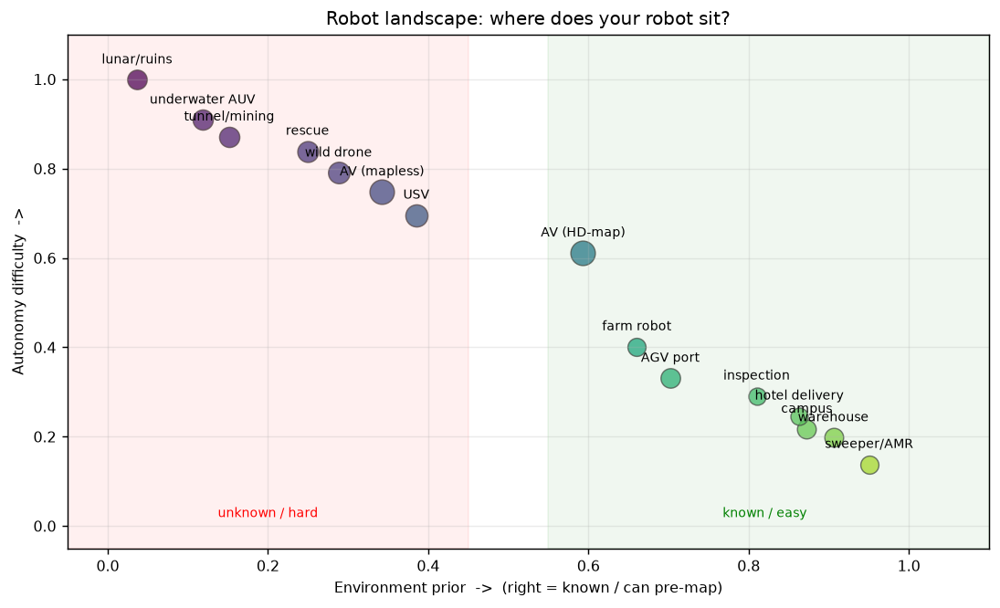

# F12 · 机器人任务分类与架构难度：先看清"你在造哪种机器人"

> 初学者最容易犯的错：**把扫地机器人和自动驾驶当成一回事**。它们表面都是"车+摄像头"，但架构、难度、测试方法天差地别。本文给你一张"机器人地形图"，先看全貌再决定学哪块、用本项目哪篇。
>
> 📌 本文是 `00_LANDSCAPE` 的**补强篇**：`00_LANDSCAPE` 讲"知识地图"，本文讲"机器人种类地图"。两者配合 = 既知学什么、又知为谁学。

---

## 1. 真正分水岭：环境先验（不是"固定 vs 移动"）

很多人按"场地固不固定"分，但那不准——**真分水岭是"有没有先验地图、环境变多快、路线能否重复"**。三句话定位一个机器人：

1. **先验地图可用吗？** 能提前建好长期复用 → 已知环境；每次都得现建 → 未知环境。
2. **环境变多快？** 家具半年不动 → 慢；车流每秒变 → 快。
3. **路线能重复吗？** 每天同一园区 → 能；每次新地址 → 不能。

> 直觉：自动驾驶看似"新场景"，但 Waymo 类靠高精地图 → 其实是"半已知"；只有 Tesla 式 mapless 才接近真·新场景。所以**别用"固不固定"贴标签，用上面三条**。

---

## 2. 五大类（按先验从强到弱）

| 类 | 代表 | 先验 | 典型传感器 | 建图 | 定位 |
|---|---|---|---|---|---|
| **① 已知结构化** | 扫地/仓储/园区/酒店送物 | 强（可先建图） | RGB-D+IMU/轮速 | 离线一次，长期复用 | 地图匹配(AMCL) |
| **② 半已知混合** | 自动驾驶(HD-map)/港口AGV/农田 | 中（有底图需刷新） | 64线LiDAR+GNSS/IMU | 在线增量更新 | 地图+GNSS融合 |
| **③ 未知开放** | 无人船/野外无人机/搜救 | 弱 | LiDAR+紧耦合IMU | 必须在线SLAM | VO/VGGT+IMU |
| **④ GNSS拒止** | 水下AUV/井下/隧道 | 极弱（无GPS） | 声学/DVL+IMU | 在线SLAM+多传感紧耦合 | 纯惯性推算 |
| **⑤ 极端新场景** | 月球车/废墟探索 | 无（通讯也断） | 特种+自主决策 | 在线+自修复 | 自主 |

> 你之前说的"家庭扫地/酒店送物/园区/仓储"全在 **①**；"自动驾驶/无人船/无人机"跨 **②/③**（AV 偏②，船/野机偏③）。补的门类：**农业机器人**（半已知）、**手术/工业臂**（已知但高精度）、**巡检**（已知路线）、**救援/消防**、**采矿**、**水下/太空**（④/⑤）。

---

## 3. 架构 / 方法 / 难度对比（核心表）

| 维度 | ① 已知结构化 | ② 半已知 | ③ 未知开放 | ④ GNSS拒止 |
|---|---|---|---|---|
| **硬件** | RGB-D+IMU（便宜） | 64线LiDAR+GNSS（贵） | LiDAR+IMU（中） | 声学+IMU（特种） |
| **算法重心** | 定位+避让（轻SLAM） | HD-map更新+融合 | 在线SLAM+open-set感知 | 紧耦合+长航程修正 |
| **场景表示** | 占据栅格(`F1`) | BEV+栅格(`P4`) | 栅格+点云(`P6`) | 稀疏点云/声图 |
| **控制难度** | 低（慢速可围栏） | 中（高速） | 中-高（欠驱动/6自由度） | 高（通讯断） |
| **算力** | 边缘低功耗 | 机载GPU | 机载GPU | 受限（密封散热难） |
| **安全规范** | 低（撞了不致命） | 中-高(ISO 21448 `F10`) | 中-高 | 极高 |
| **最大难点** | 多楼层/动态人/多机调度 | 地图新鲜度/长尾 | **感知泛化+长期不崩** | 无GPS+无通讯+退化 |

**难度排序（大概）**：① << ② < ③ < ④ < ⑤。

---

## 4. 机器人地形图（一图定位）

*图 1：横轴=环境先验（右=已知），纵轴=自主难度。气泡越大=速度/风险越高。扫地/仓储在右下（容易），太空/水下在左上（最难），自动驾驶/无人船在中部——一眼看出"你在造哪种、难在哪"。*

---

## 5. 落回本项目：每类用哪篇

- **① 已知结构化**：用 `P5` 闭环（栅格→A\*→v/ω）即可，**不必每次在线SLAM**；建图见 `F11`（离线一次）。
- **②/③ 半已知/未知开放**：正是本项目"感知为主、控制为辅"+ `P6` 新场景脚手架的主场——控制契约反推→拆子任务→查 `F9` 选型→数据三路径→复用 `P5` 改写。
- **④ GNSS拒止**：`P6 §8` 出海采集 + `M5` 退化场景库直接对应（无GPS/无纹理怎么不崩）。
- **测试验证**：① 测定位误差+避障率；③/④ 必须按 `F10` 的 ODD 边界+场景覆盖测，且验降级兜底。

---

## 6. 新手"想都想不到"的跨门类共性坑

1. **同传感器不同难**：室内 RGB-D 很稳，室外强光/透明面直接瞎（`F2` 限制）。
2. **先验地图会过期**：商场改布局→旧图变陷阱（①② 都要增量更新，`F11 §5.3`）。
3. **人机共存比避障更难**：酒店机器人要"礼貌绕行"而非"急停"（① 的隐藏难点）。
4. **法规是硬门**：自动驾驶(ISO 26262/21448)、无人船(DNV/ABS)、手术(医疗认证)——算法之外还有合规（`P6 §7.4`、`F10`）。
5. **水下/井下连"看"都难**：浑浊水/无纹理→感知退化，只能靠声学+惯性（`M5` 退化）。
6. **多机协同**：仓储/园区多机器人抢道、地图冲突，单机思维不够（`F6` 决策）。

---

## 7. 🏭 实际应用：面试怎么讲"我懂机器人架构差异"

> "我不只会调 SLAM demo。我会先问三个问题定位任务：**先验地图有没有、环境变多快、路线能否重复**——这决定架构。已知结构化（扫地/仓储）用离线地图+AMCL+占据栅格就够了；未知开放（无人船/野机）必须在线 SLAM+open-set 感知+降级兜底（`M6`）；GNSS 拒止（水下）要靠紧耦合惯性。难度从①到⑤递增，测试方法也从'测误差'升级到'ODD 边界+场景覆盖+正风险平衡'（`F10`）。这就是'造过机器人'和'跑过 demo'的分界。"

> 延伸：建图实操见 `F11`；新场景脚手架见 `P6`；测试验收见 `F10`；决策控制见 `F6`。
