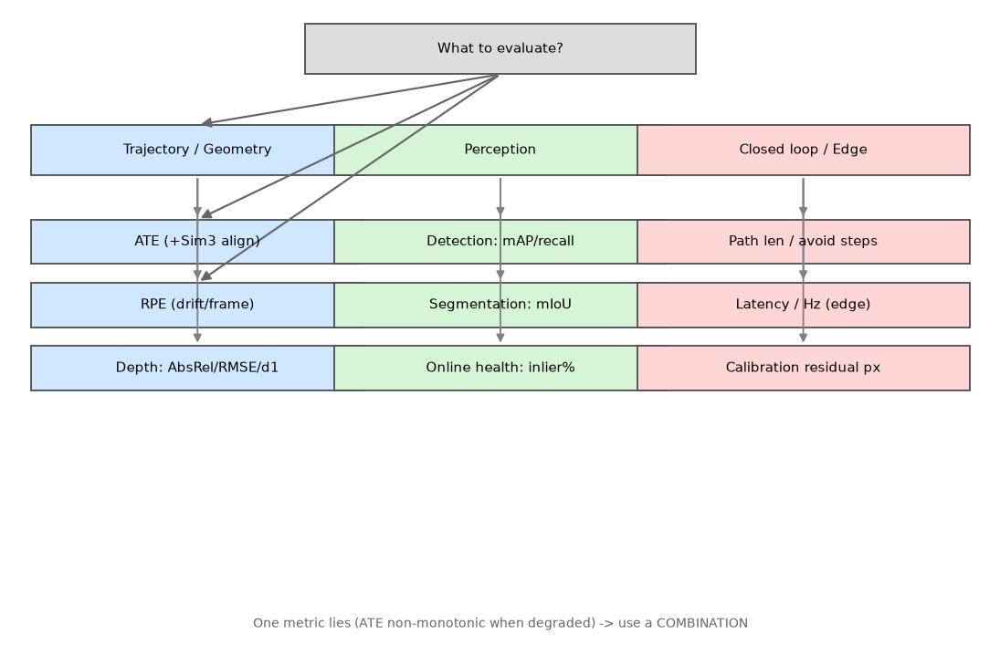

# F13 · 指标速查表 + 标定实操：怎么知道"系统到底行不行"

> 初学者最后一个大坑：**跑完不知道算成功还是失败**。本报告给你两张表——①「我想评什么 → 看哪个指标 → 正常量级是多少 → 坑在哪」；②「标定怎么落地（从结论到步骤）」。两张表都接本项目的真实数字，照着用就不会被"平均精度"骗。
>
> 📌 本文是 `F9`(选型) 与 `F10`(测试验收) 的**落地下游**：F9 说"选哪个方法"，F10 说"测什么"，本文说"测出来用什么数判断、硬件怎么标才可信"。



*图 1：你想评什么 → 看哪个指标（按轨迹/几何、感知、闭环/端侧三支路）。单个指标会骗人，组合用。*

---

## 1. 指标速查表：你想评什么，就看哪个

> 原则：**单看一个 ATE 会被骗**（M3 已证明退化下 ATE 非单调、甚至无定义）。按任务选指标组合。

| 你想评的 | 看哪个指标 | 本项目真实量级 | 坑（初学者易踩） |
|---|---|---|---|
| **轨迹准不准** | **ATE**（绝对轨迹误差，RMSE） | 自研 VO **0.506 m**；COLMAP **0.026 m**；VGGT **0.018~0.415 m** | ATE 要先 Sim3 对齐；崩了 ATE 无定义（看内点率） |
| **相邻帧漂不漂** | **RPE**（相对位姿误差） | 自研 VO RPE 平移 **0.156 m** | 长序列 RPE 累积成 ATE |
| **深度准不准** | **AbsRel / RMSE / δ₁**（δ₁=预测/真值<1.25 占比） | VGGT δ₁>0.96、RMSE 0.10–0.17 m | 单目深度是"相对"，要锚真尺度（`P4 ×72.433`） |
| **检测全不全** | **mAP / recall** | OWL-ViT 零样本船 mAP **0.58**、微调 **0.84** | 开放词汇 recall 不稳（水下≈0.001），只能当探针 |
| **分割准不准** | **mIoU** | 水/岸/船 封闭集 **0.91** | 像素标注贵；长尾类 mIoU 虚高 |
| **规划合不合理** | 路径长 / 避障步数 / 控制条数 | P5：A\* **8181 格**、避障 **18 步**、控制 **349 条** | 只看路径短会忽略安全余量（inflation 不可省） |
| **端侧跑不跑得动** | 延迟 / 帧率(Hz) / 精度保持 | VGGT INT8 **80 ms**(4.8Hz)；Orin Nano 级 | 显存是硬门槛；INT8 先量化再剪枝 |
| **系统健康度（实时）** | **内点率 / 匹配数 / 地图点** | 健康 75~80%，崩前跌到 11% | **"特征数"是骗人的**（噪声下反涨 44%） |

> **一句话口诀**：位姿看 ATE+RPE；几何看 δ₁；感知看 mAP+mIoU；闭环看路径+避障步；端侧看延迟+Hz；**在线健康看内点率**。

---

## 2. 标定实操：从"结论"到"怎么做"

> 标定时常犯的错误：**先调算法、最后才怀疑标定**——其实 90% 的"融合废了"是标定/对时错（`F9 §6.2` 顺序铁律）。

### 2.1 三类标定怎么做

| 标定 | 做法 | 精度 | 实测参照 |
|---|---|---|---|
| **相机内参** | 棋盘格张正友标定，≥20 张不同角度 | 亚像素 | 本项目 K 自洽，重投影残差 **0.0000 px**（`M10`） |
| **相机–LiDAR 外参 `T_cl`** | 靶标法（棋盘格 + 反光孔 / ArUco） | 厘米级 | KITTI 真实 LiDAR 投影到 image_02 完全吻合 |
| **多相机 / IMU** | 联合标定（含时间偏移 $t_d$） | 需精细优化 | 专用流程 |
| **时间同步** | 硬件触发 **PTP/gPTP** 或软件插值 | 时差 < 10 ms | `P2 §4.13` 三路同源天然同步 |

### 2.2 一个反直觉但必须记住的数

> **外参标错 1° → 10 m 外错 17 cm**（`F11 §5.2` / `F5`）。
> 所以标定不是"大概对齐"，是精度直接决定下游地图对不对。标完必须用**重投影残差**验收（本项目 M10 做到 0.0000 px）。

### 2.3 排错铁律（一上真机就撞，按序查）

1. **先对钟**：相机/LiDAR/IMU 是不是同一时钟源？`chrony`/`ptpd` 看漂移，`rostopic delay` 看话题延迟。
2. **再查外参**：静态标定残差（重投影/点云贴合）过不过关。
3. **最后才怀疑算法**。多数"融合废了"死在 1、2 步。

> 典型症状对照：`P2 §6.2`——点云"飘"在图像里→查时；高速过弯直墙变斜墙→运动畸变（去畸变）；图像比点云慢半拍→滚动快门+触发延迟。

---

## 3. 一个最小标定闭环例子（相机→LiDAR）

```
① 打印棋盘格 + 反光孔靶标，固定不动
② 相机拍 20+ 张（不同角度），LiDAR 扫同一靶标
③ 估相机内参 K（张正友）+ 外参 T_cl（靶标法）
④ 验收：把 LiDAR 点云按 K、T_cl 反投影回图像
   → 边缘严丝合缝 = 标定 OK（本项目 M10 残差 0.0000 px）
   → 错位 = 重标，别动算法
```

> 这就是 `F5` 那张"点云↔图像投影闭环"图的来历——它既是融合证据，也是**标定验收工具**。

---

## 4. 🏭 实际应用：指标与标定的真活

- **健康度监控**：上线后用内点率/匹配数当预警（不是等 ATE 崩），直接接 `M6` 诊断切换——这是"干过活"和"跑 demo"的分界（`M3` §7）。
- **标定即验收门**：交付前必须过标定验收（重投影残差）+ 时间同步检查，否则地图不可信（`F10` 单元测试项）。
- **给评审讲量化**：用 §1 的指标组合报"成功"，而不是单甩 mAP——监管/客户要看 ATE、避障率、无碰撞率（`F10` 验收门）。

**面试/简历讲法（可直接背）**：
> "我不只看平均精度——位姿看 ATE+RPE 且先 Sim3 对齐，几何看 δ₁，感知看 mAP+mIoU，闭环看路径+避障步，端侧看延迟和 Hz；在线用内点率做健康度（崩前从 80% 跌到 11% 就报警）。标定上，相机–LiDAR 外参标错 1° 在 10m 外偏 17cm，所以标完必用重投影残差验收（我们做到 0px）。排错顺序永远是先对钟、再外参、最后算法。"

> 想看指标怎么变成测试项 → `F10`；想看选型决定用哪个方法 → `F9`；想看坐标帧为什么重要 → `F11 §5.2`；想看融合怎么靠标定 → `F5`。
