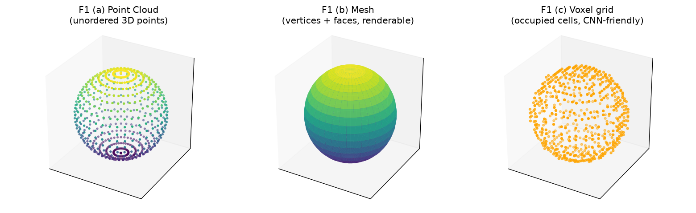

# F1 · 场景表示全家桶：用什么"容器"装下 3D 世界

> 上一篇 `F0` 讲了"2D 像素 ↔ 3D 点"如何对应。这篇回答：**重建出来的 3D，到底存成什么格式？**
> 适合：懂张量/数组，但分不清"点云、网格、体素、NeRF、3DGS"的人。
> 定位：**一般场景**基础认知，不谈退化。

---

## 1. 目的：为什么"表示"是个独立的大问题

同一个房间，可以存成"一堆点"、存成"一张三角网"、存成"三维像素格"、存成"一个神经网络"——**不同表示，决定了你能对它做什么、算多快、占多大内存**。

你做深度学习时早已熟悉这种权衡：图片用 `H×W×3` 张量（规整、CNN 友好），文本用 token 序列（变长、Transformer 友好）。3D 世界也一样，没有"唯一正确答案"，只有"在当前任务下最合适的表示"。本章帮你建立这张"选型的全景地图"。

---

## 2. 方法原理（专业骨架）

| 表示 | 数学本质 | 关键字段 |
|---|---|---|
| **点云 (Point Cloud)** | 无序点集 $\{(x_i,y_i,z_i,[\text{rgb}],[\text{n}])\}$ | 坐标 + 可选颜色/法向 |
| **网格 (Mesh)** | 顶点 + 面 $(V, F)$，$F$ 为顶点索引三角面 | 连通性 |
| **体素 (Voxel)** | 三维占据栅格 $\mathcal{G}[i,j,k]\in\{0,1\}$ | 占据概率 |
| **TSDF / SDF** | 场函数 $f(\mathbf{p})$ = 到表面的有/无符号距离，截断 | 距离场 |
| **占用场 (Occupancy)** | 神经网络 $\phi(\mathbf{p})\to[0,1]$ 占据概率 | 隐式场 |
| **NeRF** | 神经网络 $F_\theta(\mathbf{p},\mathbf{d})\to(\text{rgb},\sigma)$ 体渲染 | 辐射场 |
| **3D Gaussian Splatting** | 各向异性高斯集合 $\{\mu,\Sigma,\text{color},\alpha\}$ 可微光栅化 | 椭球集 |

**渲染差异**：显式表示（点云/网格/体素）直接可视；隐式表示（SDF/NeRF）需"采样+渲染"才出图；3DGS 用"泼洒式"光栅化，又快又真。

---

## 3. 直白讲解（类比 + 何时用）

- **点云 = 一群会飞的蚂蚁，每只在空中报自己的坐标**。最简单，激光雷达/RGB-D 直接吐这个。缺点：没"连起来"，不知道哪两点属于同一个面，且常有洞。
- **网格 = 用三角纸片的顶点缝出一只猫**。把点云连成面，能渲染出光滑表面、能算光照。你打游戏看到的 3D 模型基本都是网格。缺点：从散点"织"成面本身不简单（见 `M2` 的 TSDF）。
- **体素 = 把空间切成乐高小方块，每块标"空/实"**。最直观，且能直接喂 3D CNN（像 2D 图片喂 CNN）。致命缺点：**内存随分辨率立方增长**——分辨率翻一倍，体积涨 8 倍。
- **SDF / TSDF = 给空间每点发一张"到墙还有几厘米"的便签**。离表面近便签写小数字，穿过表面变负。融合多帧深度时特别稳（见 `M2`）。缺点：仍是体素式占内存，需截断。
- **NeRF = 把整个场景"烤"进一个神经网络**。你问"从某个角度、某个方向看这个点，是什么颜色、多不透"，网络告诉你。优点：照片级新视角；缺点：训练和渲染慢、几何不直接、难编辑。
- **3D Gaussian Splatting（3DGS）= 用一堆会发光的椭球拼出场景**。每个椭球有位置/形状/颜色/透明。可微光栅化让它又快又真，是 2023 年后的新宠。缺点：椭球多、吃显存，几何精度不如 TSDF 干净。

**一句话选型**：
- 机器人要"知道形状、能抓" → 点云 / 网格 / TSDF（要几何）
- 影视/VR 要"看着真" → NeRF / 3DGS（要画质）
- 要喂网络做感知 → 体素 / 点云（要张量友好）

---

## 4. 真实知识 / 验证（领域标准）

1. **格式与工具是真实的**：`.ply`/`.pcd`（点云）、`.obj`/`.gltf`（网格）、`.sdf`/`.tsdf`（距离场）是工业通用格式；Open3D、PyTorch3D、trimesh 都能读。
2. **公开数据集真实存在**，可直接拿来建立直觉：
   - **ShapeNet / ModelNet**：单物体 CAD 网格（理解"网格"的最佳起点）。
   - **ScanNet / Matterport3D / 3RScan**：真实室内场景的**网格 + 点云 + 语义标签**（同时看到点云和网格两种表示）。
   - **Tanks and Temples**：被用于 NeRF/3DGS 质量评测的真实场景。
3. **效果展示（程序跑的图 + 已有真实图）**：

同一个球体，左=点云（无序点集）、中=网格（顶点+面，可渲染）、右=体素（占据栅格，喂 CNN 友好）——一眼看清"表示"差异。

本项目 `M2` 的 TSDF 融合结果 `recon.png`（84.8 万顶点真实室内网格），就是"深度 → 点云 → TSDF 网格"这条显式表示链路的真实实例：

4. **可跑的边界认知**：点云→网格的"泊松重建/TSDF 抽取"在 Open3D 里几行即可跑（见 `M2` 脚本 `scripts/m2_reconstruct.py`）。

> ⚠️ 诚实声明：本节是**领域标准知识 + 引用真实公开数据集/本项目已有图**，不编造新的评测数字。具体指标见 `M2`（顶点数）、`M4`（深度精度）。

---

## 5. 它和前后模块的关系

- **`M2` 深度与重建**：讲"深度图 → 点云 → TSDF 网格"这条最常用显式链路。
- **`M4` 前馈模型**：VGGT 直接出点云；DUSt3R/MASt3R 出点云+位姿——你读完本章就明白它们"表示"的是什么。
- **`M7` 语义层**：语义标签通常贴在**点云或网格**的顶点上（"这个顶点是桌子"）。
- **`M8` 端侧**：不同表示部署成本天差地别——点云轻、NeRF 重，选型直接影响能不能塞进边缘设备。

---

## 6. 🏭 实际应用

- **自动驾驶**：激光雷达点云实时感知（要快、要几何）→ 点云/体素。
- **游戏/影视/数字孪生**：要好看可交互 → 网格 / 3DGS。
- **工业检测/逆向**：要精确表面 → TSDF 网格。
- **机器人抓取**：点云 + 网格表面是抓取规划输入。

> **本项目对应**：`M2` 的 TSDF 网格是显式表示的"标准答案"；理解它表示什么，才看得懂 `M2` 为什么说"84.8 万顶点"。

---

*下一篇*：知道了"用什么装 3D"，自然会问——**3D 里的深度到底从哪来、为什么单目照片测不准？** 见 `F2_depth_basics.md`。
