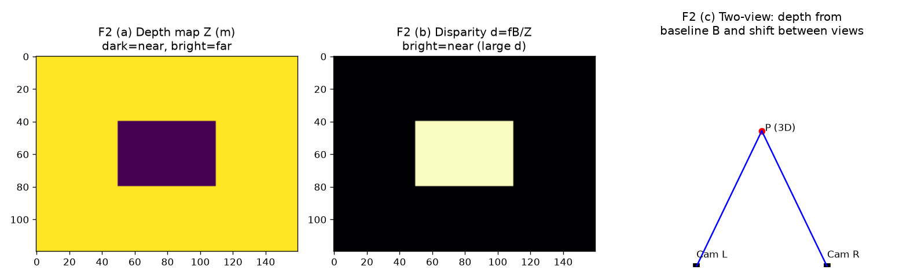

# F2 · 深度到底是什么：3D 感知的"第一性"问题

> `F0` 讲了投影（3D→2D），`F1` 讲了 3D 怎么存。这篇讲**反过来最关键的一步：2D→3D 时，深度从哪来？**
> 适合：知道"监督学习/回归"但困惑"为什么单张照片测距不准"的 ML 人。
> 定位：**一般场景**基础，不谈退化（坏场景留给 `M3/M5`）。

---

## 1. 目的：为什么"深度"是绕不开的第一关

深度 = 图像里每个像素对应的"离相机多远"（沿视线方向的距离 $Z$）。

你回头看 `F0` 的反投影公式：
$$X=(u-c_x)\frac{Z}{f_x},\quad Y=(v-c_y)\frac{Z}{f_y}$$
**只要拿到每个像素的深度 $Z$，整张图瞬间变成 3D 点云。** 所以：
- 深度是"2D 升 3D"的唯一钥匙。
- 但**单张照片拿不到 $Z$** —— 这是整个 3D 视觉最根本的"先天残疾"，理解它，就理解了为什么需要双目、RGB-D、运动、或神经网络。

---

## 2. 方法原理（专业骨架）

### 2.1 单目歧义（为什么一张图不够）
投影是**丢失维度**的操作：一个 3D 点 $(X,Y,Z)$ 压成 2D $(u,v)$，世界里的 $(2X,2Y,2Z)$ 会投到**同一个像素**（只是更亮更大）。所以从单张图，**近处小猫**和**远处老虎**可以长得一模一样。称"尺度/深度歧义"。→ 单目必须靠额外线索（运动、先验、或学习）补深度。

### 2.2 双目立体 (Stereo)
两个水平放置的相机，同一 3D 点在左右图像素差（**视差 disparity** $d=u_L-u_R$）满足：
$$Z = \frac{f\,B}{d}$$
$f$ 焦距，$B$ 基线（两相机间距）。**视差越大 = 越近**。这是纯几何、无需学习就能算深度（经典 SGMBM 算法）。

### 2.3 主动深度：RGB-D / ToF
直接发射红外/光（Kinect、RealSense、iPhone LiDAR），测返回时间/相位得 $Z$。给的是**带公制尺度的真深度**，是机器人最爱的传感器。

### 2.4 运动恢复 (移动得到深度)
同一相机移动，帧间视差（类似双目但 $B$ 来自自身位移）→ `M1` 的 SfM/VO 本质在算这个。但**尺度只有相对值**，需 RGB-D/IMU 锚定真尺度（见 `M6`）。

### 2.5 学习式单目深度
训练 CNN/Transformer 直接从 RGB 回归深度图。两种训练：
- **有监督**：用 RGB-D 数据（NYUv2/ScanNet/TUM）当标签。
- **自监督**：用"相邻帧重投影一致性"当损失（不需标签，但只能拿到**相对深度**，仍无量纲）。
代表：**Depth Anything / DPT / MiDaS**（任意图片出相对深度）；`M4` 的 VGGT 把深度+位姿+点云一次出齐。

### 2.6 评价指标（看懂论文必备）
深度常用：**AbsRel**（相对误差均值）、**RMSE**、**$\delta_1$**（预测/真值比值在 1.25 内的占比，越高越好）。位姿常用 **ATE / RPE**（见 `M1`）。

---

## 3. 直白讲解（类比）

- **单目歧义 = 你闭一只眼，分不清"手指尖"和"远处山"**。睁一眼时，指尖和山能挡住同一片背景——这就是歧义。所以单张照片"看起来"有深度，其实是大脑/模型在猜。
- **双目 = 两只眼 + 比对**。"斗鸡眼"看近物更费力，因为视差大；看远物两眼几乎平行。相机同理，$\frac{fB}{d}$ 就是这层直觉的公式版。
- **RGB-D = 自带尺子的相机**。别人只能看到"画面"，它额外给你"每点多远"——所以机器人最爱它，省去猜。
- **学习式深度 = 见多识广的猜_distance 专家**。它看过百万张"图+真距离"，于是新图上能凭经验估个大概；但**它估的是"相对远近"，像"A 比 B 近"，不一定知道"A 是 2 米"**——除非训练时给了真尺度。
- **指标 $\delta_1$ = 考试及格率**。预测深度和真值差不到 25% 算"答对"，$\delta_1$ 越高说明整体越准。

---

## 4. 真实知识 / 验证（领域标准）

1. **真实传感器与数据集**（可验证、可下载）：
   - 双目/深度评测：**KITTI**（自动驾驶，带激光真值）、**Middlebury / SceneFlow**（双目视差基准）。
   - RGB-D：**NYUv2**、**ScanNet**、**TUM RGB-D**（`M1/M2/M4/M7` 全用它）。
   - 学习式深度模型：**Depth Anything V2**、**DPT (MiDaS)** 在 HuggingFace 可离线跑，对任意图出相对深度图。
2. **双目公式自洽验证**（可跑）：给定 $f=525, B=0.12\text{m}, d=10\text{px}$，则 $Z=525\times0.12/10=6.3\text{m}$——视差 10 像素对应 6.3 米，符合直觉（近大视差大）。
3. **效果展示（程序跑的图 + 已有真实图）**：

左：深度图（暗=近、亮=远）；中：视差图 $d=fB/Z$（亮=近）；右：双目几何（同一 3D 点在不同相机里像素偏移=视差）。

本项目 `M4` 的 `depth_vs_degradation.png` 展示了 VGGT 在干净+退化下的真实深度估计对比，直观呈现"深度估计长什么样、随条件怎么变"：

> ⚠️ 诚实声明：本节为**领域标准知识 + 公开数据集/模型引用 + 本项目已有图**；具体项目量化指标见 `M4`（δ1 0.962–0.986 等）。

---

## 5. 它和前后模块的关系

- **`M0/M1`**：SfM/VO 本质在从"运动"恢复相对深度与位姿。
- **`M2`**：深度图 → 点云 → 网格，深度是输入。
- **`M4`**：前馈模型直接出深度（含 VGGT），是学习式深度的最强形态之一。
- **`M6`**：恶劣环境深度崩了，靠 IMU/热成像/前馈模型补——本章的深度来源正是它要"救"的对象（实测：低光退化下 96% 帧触发救援）。
- **`M7`**：语义标签贴在点云（=深度反投影结果）上。

---

## 6. 🏭 实际应用

- **手机人像虚化 / 测距**：单目深度网络估相对深度，近处虚化。
- **自动驾驶**：双目/RGB-D/LiDAR 融合拿深度，避障、测距。
- **机器人导航**：深度图生成障碍物点云，规划路径。
- **AR 量尺寸**：RGB-D 或单目+尺度锚定，量真实物体长宽。

> **本项目对应**：深度是贯穿全栈的"第一性输入"。学完本章，再看 `M2/M4` 会明白——它们的起点都是"拿到一张靠谱的深度图"。

---

*下一篇*：把 `F0–F2` 串起来——**一段普通手机视频，怎么一步步变成 3D 模型？** 见 `F3_normal_pipeline.md`（正常场景端到端流程）。
