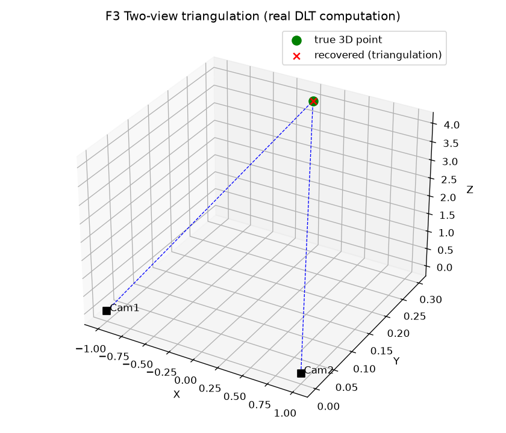
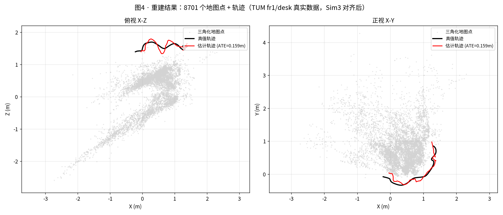

# F3 · 正常场景端到端流程：一段普通视频怎么变成 3D 模型

> 前几篇是零件（`F0` 投影、`F1` 表示、`F2` 深度）。这篇把这些零件**拼成一条正常场景的完整流水线**，让你看到"从零到 3D"的全貌。
> 适合：想要"全局地图"、害怕一上来就学崩溃的初学者。
> 定位：**一般场景的 Happy Path**，故意不讲退化（坏情况专门留给 `M3/M5`）。

---

## 1. 目的：先看到"正常时长啥样"，才知道"崩了是怎么回事"

你学任何系统，都应该先看**它正常工作时什么样**，再去研究它怎么坏。但本项目前几篇（M3 失效、M5 压力测试）一上来就在讲"怎么崩"——这对专业人士有用，对初学者却是"还没学会走就学摔"。

本章给你一条**干净、标准、可复现**的端到端流程：拿一段普通手机拍的房间视频 → 输出一个可交互的 3D 模型。走完它，你再回看 M0–M9 的每一篇，都会知道"这步在整个链条的哪"。

---

## 2. 方法原理（标准 SfM→MVS→Fusion 流水线）

```
① 采集  → ② 特征提取+匹配 → ③ 相对位姿(本质矩阵) → ④ 三角化(稀疏点)
   → ⑤ 全局BA(光束法平差) → ⑥ 稠密重建(深度融合) → ⑦ 网格化 → ⑧ (可选)语义
```

- **① 采集**：手机绕房间走一圈，帧间有重叠（别太快、别模糊）。这是"运动恢复深度"（`F2 §2.4`）的素材。
- **② 特征**：每帧提关键点+描述子（SIFT 或学习型 SuperPoint），相邻帧两两匹配（SuperGlue / LoFTR）。
- **③ 相对位姿**：从匹配用**本质矩阵 (5 点法)** 解出两帧间旋转平移（即外参，回看 `F0`）。
- **④ 三角化**：已知两帧外参+匹配，把 2D 点"反投"成 3D（用 `F0` 投影逆运算）→ 得到**稀疏点云**。
- **⑤ 全局 BA**：把所有相机位姿 + 3D 点一起优化，最小化"重投影误差"（见 `M0/M1`）。这是把整条链拼严丝合缝的关键。
- **⑥ 稠密深度**：对每帧估计稠密深度（MVS 或多视图深度学习；或 RGB-D 直接给，回看 `F2`）。
- **⑦ 网格化**：把多帧深度融成 TSDF → 抽网格（见 `M2`）。
- **⑧ 语义（可选）**：把"桌子/墙"标签贴到点云（见 `M7`）。

---

## 3. 直白讲解（类比）

把整条线想象成**拍全景拼图**：
- **① 采集** = 你绕着雕塑拍照，每张和前后有重叠。
- **② 特征匹配** = 在两张照片里认出"这是同一个窗角"。算法找的就是这种"锚点"。
- **③ 相对位姿** = 知道两张照片的"站位差"，就能推断你移动了多少。
- **④ 三角化** = 左眼右眼定位同一点 → 算出它离你多远（双目逻辑，`F2`）。
- **⑤ BA** = 把所有照片的站位和所有锚点一起微调，让"我脑子里拼出的 3D"和"每张照片看起来"完全一致。调完，整个场景就严丝合缝了。
- **⑥⑦ 稠密+网格** = 从"只有锚点的稀疏骨架"补成"有血有肉的实体模型"。
- **⑧ 语义** = 给模型贴上"这是门、那是桌"的标签，机器才"懂"场景。

> 关键认知：**前面 `M0–M9` 的每一篇，都是这条线的某一环的"深挖版"**。M1 深挖 ②③⑤，M2 深挖 ⑥⑦，M4 用前馈模型"一口气替代 ②③④"，M7 做 ⑧，M8 把它塞进小设备跑。

---

## 4. 真实知识 / 验证（领域标准 + 可复现）

1. **这条流水线不是本项目发明，是工业标准**：开源工具 **COLMAP** 一个人就能跑完 ①②③④⑤；**Open3D** 跑 ⑥⑦。学术界/业界重建几乎都基于此范式。
2. **可跑的真实体验（无需写代码，装软件即可）**：
   - 用手机拍 20–30 张房间照片 → 丢进 **COLMAP** → 自动出稀疏点云 + 相机轨迹 + 网格。这是"正常场景 Happy Path"最省事的亲历方式。
   - 本项目 `scripts/m2_reconstruct.py` 用 Open3D 对 **TUM RGB-D `fr1/desk`** 做 TSDF 融合，真实产出 **84.8 万顶点**网格（干净场景、未加退化）。
3. **效果展示（程序跑的图 + 已有真实图）**：



两个相机 + 一组匹配点，用真实 DLT 三角化算出的 3D 点（红×）与真值（绿点）重合——这正是流水线第 ④ 步"2D 匹配 → 3D 点"在做的事。

本项目 `M1` 的 `fig4_map3d.png` 展示真实多视图重建出的 3D 地图；`M2` 的 `recon.png` 是 ⑥⑦ 步的真实网格输出：




> ⚠️ 诚实声明：本节为**领域标准流程 + 可复现公开工具（COLMAP/Open3D）+ 本项目干净场景已有图**。它在"正常场景"成立；一旦遇到 `M3/M5` 的退化条件（纯旋转、无纹理、强噪声），这条线会在 ②③ 步崩——那才有必要读后续模块。

---

## 5. 它和前后模块的关系

本章是**全仓库的"目录"**：

| 流水线步骤 | 深挖文档 |
|---|---|
| ②③ 特征/位姿 | `M1` 手搓 SfM/VO（专家）/`M0` 几何 |
| ④⑤ 三角化/BA | `M0` / `M1` |
| ⑥⑦ 稠密/网格 | `M2` 深度与重建 |
| 单步替代 | `M4` 前馈模型（一次出深度+位姿+点云） |
| 多传感器互补 | `F5` 视觉+激光雷达融合（相机补语义、激光补几何） |
| ⑧ 语义 | `M7` 语义层 |
| 崩了怎么办 | `M3` 失效归因 / `M5` 压力测试 |
| 救回恶劣 | `M6` 多模态融合（诊断驱动切换，已实测） |
| 落小设备 | `M8` 端侧部署 |

---

## 6. 🏭 实际应用

- **实景建模 / 文保数字化**：拍文物/建筑 → 3D 存档。
- **电商/VR 商品建模**：拍商品 → 可旋转 3D 展示。
- **室内地图 / 数字孪生**：扫房间 → 可交互 3D。
- **机器人建图 (SLAM)**：边走边建，实时用（见 `M1/M8`）。

> **本项目对应**：这条 Happy Path 是"及格线"。本项目真正的差异化在它**之上**——当这条线在恶劣环境崩掉时（`M3/M5`），用几何可靠性（`M0/M1`）+ 前馈模型（`M4`）+ 多模态（`M6`）+ 语义（`M7`）+ 端侧（`M8`）把它救回来。先看通正常路径，才有资格谈"救"。

---

*下一篇*：你是有 ML/DL 背景的人——**你已有的知识在这套体系里到底用在哪、哪些是全新的？** 见 `F4_ml_to_3d_bridge.md`。
