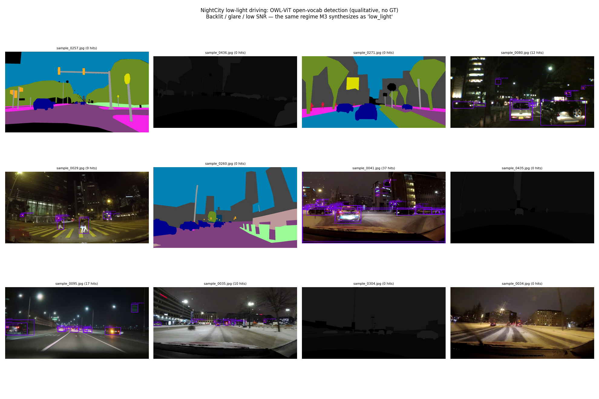
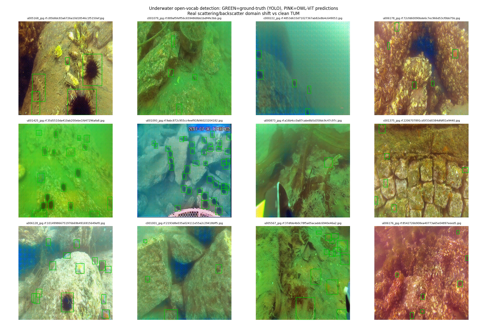

# F7 · 硬件扫盲：机器人感知系统的"器官"清单（初学者向）

> 前面 `F0` 讲相机的**数学模型**、`F5` 讲**视觉+激光融合的概念**。但你真正搭一套系统时会先撞上的是：
> **摄像头到底买哪种？看哪些参数？它吐出来的是什么数据？激光雷达和毫米波雷达有啥区别？机器人靠什么动起来？**
> 本篇就是这张"硬件器官清单"——**扫盲向、零公式门槛、配选型口诀**。
> 定位：**一般场景 + 基础知识**，和 `F0`（相机数学）、`F5`（融合概念）是同一基础层的"硬件侧"，建议配套读。

---

## 0. 一句话定位

**感知控制系统 = 一堆"传感器（眼睛/耳朵）" + 一个"大脑（计算平台）" + 一堆"执行器（手脚）" + "神经（总线/供电）"。**
本篇把这套"器官"逐个拆开：它**长啥样、测什么、关键参数看哪几个、吐出什么数据、在你项目里对应哪段代码**。

---

## 1. 目的：为什么搞算法的人也必须懂硬件

你做深度学习时，数据是个现成的张量。但真实机器人里：

- 你选了**卷帘快门**相机装在**高速旋转**的云台上 → 图像会"果冻畸变"，你模型的指标再高也救不回（这是硬件病，不是算法病）。
- 你指望激光雷达"看清 200 米外" → 但选了 16 线低线束雷达，远处的点**稀疏到根本没打到目标** → 漏检。
- 你写好了 PID 控制 → 但电机驱动器**不支持你需要的协议** → 轮子转不起来。

**算法决定"上限"，硬件决定"下限"和"能不能跑"。** 不懂硬件，你连数据从哪来、为什么这么脏都说不清——这正是本教程反复强调"理解失效比理解成功值钱"的硬件版。

---

## 2. 总览：一套系统由哪些硬件器官组成

把机器人拆成四类"器官"，先建立全局框架：

| 大类 | 角色 | 典型器件 | 在 F/M/P 里对应 |
|---|---|---|---|
| **① 感知输入**（眼睛/耳朵） | 把世界变成数据 | 相机、激光雷达、毫米波雷达、深度相机、IMU、GPS、编码器、超声波 | F0/F5、M1/M4/M6、P1/P2 |
| **② 计算平台**（大脑） | 跑模型、做决策 | 上位机（x86 工控机）、边缘 AI（Jetson）、MCU（STM32） | M8 端侧、F6 决策 |
| **③ 控制执行**（手脚） | 把决策变动作 | 电机（直流/无刷/步进/舵机）、驱动器（电调/驱动板）、轮子/机械臂 | F6 控制、P1 |
| **④ 神经与能源**（神经/血） | 连接 + 供电 + 时钟 | 总线（CAN/UART/I2C/SPI）、同步线、电池/电源模块 | P2 多传感器同步 |

> 🎯 **类比**：机器人像人——① 是五官（看/听/平衡感），② 是大脑（处理+决策），③ 是肌肉骨骼（动），④ 是神经+血液循环（传信号+供能）。
> 后面几节把 ① 和 ③ 拆细，④ 在 §9 单独讲。

---

## 3. 感知输入①·摄像头（最常用、也最容易被选错）

### 3.1 摄像头有哪些"种类"（按结构分）

| 类型 | 一句话 | 直接给深度？ | 典型用途 |
|---|---|---|---|
| **单目（Monocular）** | 一台普通相机 | ❌ 只给 2D 图，深度靠猜 | 语义识别、VIO 辅助 |
| **双目（Stereo）** | 两台相机定好间距（基线） | ✅ 视差算深度（见 `F0` §2.2） | 室内机器人、避障 |
| **RGB-D（深度相机）** | 相机 + 主动测距（ToF/结构光） | ✅ 直接出深度图 | 抓取、重建、导航 |
| **鱼眼/广角** | 超大 FOV（≥180°） | ❌ 但视野广 | 环视、SLAM 前端 |
| **事件相机（Event）** | 只报"像素亮度变化" | ❌ 但微秒级、不怕运动模糊 | 高速、高动态场景 |

### 3.2 选摄像头看哪几个参数（扫盲口诀：**分辨·帧率·快门·焦距·接口**）

| 参数 | 是什么 | 选错会怎样 | 怎么选 |
|---|---|---|---|
| **分辨率** | 图像多大（如 1920×1080） | 太低→远处小物体认不出；太高→算力爆 | 看清任务里最小的物体需要几像素 |
| **帧率 FPS** | 每秒拍几张 | 太低→快速运动模糊、VO 跟丢（见 `M3` 时间失联） | 机器人速度越快、帧率要越高（≥30fps 起步） |
| **快门** | 全局快门 vs 卷帘快门 | **卷帘+运动→果冻畸变**（致命）；全局快门贵但无畸变 | 有运动/振动→必选全局快门 |
| **焦距 / FOV** | 看多远、看多宽 | 长焦→看得远但视野窄；广角→视野宽但边缘畸变大 | 导航要广角（看全路况），读码/远距识别要长焦 |
| **动态范围 / HDR** | 明暗同时看清的能力 | 低→逆光/隧道口"死白或死黑"（`M3` 光度违背） | 室外/逆光场景必选 HDR |
| **接口** | USB3 / MIPI / GMSL / FPD-Link | 选错→带宽不够、线太长丢帧、抗干扰差 | 近距离用 USB3；车载/长距离用 GMSL（抗干扰、可传 15m） |
| **同步** | 能否外部触发/打时间戳 | 多相机不同步→融合错位（`F5` 前融合难） | 多传感器系统要支持硬件触发或 PTP 时间同步 |

### 3.3 摄像头"采出来"的是什么数据

- **最核心**：一张**图像张量** `H×W×3`（高×宽×通道），每个格子一个 RGB 值（0–255 或 0–1）。
- **视频流**：连续的图像序列 + 每帧时间戳。
- **RGB-D 额外**：一张同分辨率的**深度图** `H×W`，每格一个"离相机几米"。
- ROS 里对应消息：`sensor_msgs/Image`、`sensor_msgs/CompressedImage`、`sensor_msgs/PointCloud2`（深度反投影后）。

> 🎯 **类比**：摄像头就是你雇的**摄影师**——单目是"只会拍不会量距离"的记者，双目/RGB-D 是"边拍边拿卷尺"的测绘员；分辨率=相机像素，帧率=手速，快门=快门速度（手抖就糊）。

**🖼️ 实际效果展示（相机长啥样、拍出来啥）**

- **仿真 RGB-D 相机**：左 RGB、右真值深度（`P2` 感知实验台）——这就是 §3.1/§6 "相机+深度"在仿真里的真实形态，深度图直接告诉你每个像素离相机几米：
  
- **真实恶劣场景里，相机拍到的**（这正是 §3.2 "动态范围/HDR/快门"为何重要）：
  - **夜间城市道路**（`D1` 真实数据）：普通相机几乎全黑，语义检测在夜间仍要能工作 → 此时几何必须靠激光/雷达补：
    
  - **水下**（`D1` 真实数据）：水体散射让相机严重退化，OWL-ViT recall≈0.001 → 水下靠声呐而非相机（`§7` 超声波）：
    

---

## 4. 感知输入②·激光雷达 LiDAR（给"精确距离"的卷尺）

### 4.1 它是什么、有哪几种

激光雷达向四周发射激光束，测"光飞出去又回来用了多久"→ 算出每个方向的距离，攒成一圈点。

| 类型 | 结构 | 特点 |
|---|---|---|
| **机械旋转式** | 里面真的在转（16/32/64/128 线） | 360° 环视、成熟；贵、怕震、体积大 |
| **固态/半固态**（MEMS/转镜/Flash） | 无机械转动部件 | 便宜、可靠、体积小；视野常是**扇形**（非 360°） |

> "线数"= 垂直方向同时发射几束激光。16 线→稀疏（远处几乎没点）；128 线→稠密但贵。

### 4.2 选激光雷达看哪几个参数

| 参数 | 含义 | 怎么选 |
|---|---|---|
| **线束（lines）** | 垂直方向光束数 | 室内/低速 16 线够；自动驾驶要 64+ |
| **测距范围（range）** | 最远能测多远 | 室内几米；车载要 100–200m |
| **水平/垂直 FOV** | 能扫多大角度 | 机械式常 360°×±15°；固态扇形要算够不够用 |
| **点频（points/s）** | 每秒打出多少点 | 决定点云稠密度，越高越贵 |
| **旋转频率（Hz）** | 每秒转几圈 | 影响帧率与运动下的点云拖尾 |
| **测距精度** | 厘米级误差 | 一般 ±2–3cm，足够导航 |

### 4.3 激光雷达"采出来"的是什么数据（重点）

**点云（Point Cloud）**——一堆 3D 点，每个点通常带：

```
(x, y, z, intensity)   # 三维坐标（米）+ 反射强度
```

- **形态**：机械式是一圈圈**扫描线**（见 `F5` 的 KITTI 图——稀疏竖直扫描线，不是稠密图）；
- **数据量**：单帧几万~几十万点（KITTI 真实单帧约 1.8 万点，`F5` 已实测）；
- **强项**：距离**精确（厘米级）**、**不受光照影响**（夜间/隧道照样工作）；
- **弱项**：**语义弱**（一圈点很难直接说出"这是红杯子"）、雨雪/玻璃/镜面会失效、贵。

ROS 里对应：`sensor_msgs/PointCloud2`。

> 🎯 **类比（接 `F5`）**：相机是"懂行但眼神不好估距离"的鉴定师，激光雷达是"精准但没文化"的卷尺——它量出"前方 2.31 米有个东西"，但不知道那是个杯子还是灭火器。两者融合才得到"红杯子在左前方 2.31 米"（`F5` 核心结论）。

**🖼️ 实际效果展示（激光雷达点云长啥样、怎么变成地图）**

- **真实车载 LiDAR 稀疏扫描线**（KITTI，单帧 ~1.8 万点、3.0–79.7m）——注意它**不是稠密图，而是一圈圈扫描线**，远处点很稀（§4.3）：
  
- **LiDAR 点云 → 导航能用的代价地图（costmap）**：把点云投到地面、膨胀成"可走/不可走"栅格，机器人绕开障碍（`P2` TB3 无头闭环，对应 `F6` costmap）：
  

---

## 5. 感知输入③·毫米波雷达 Radar（激光的"动辄测速度"兄弟）

很多人分不清激光雷达和毫米波雷达，一句话区分：

| | 激光雷达 LiDAR | 毫米波雷达 Radar |
|---|---|---|
| 发射什么 | 激光（光，波长 ~nm） | 电磁波（毫米波，波长 ~mm） |
| 给什么 | 点云 `(x,y,z,intensity)` | **目标列表**（距离/方位/**径向速度**/尺寸） |
| 测速度 | ❌ 靠多帧差分 | ✅ **多普勒效应直接测**（这是它独门绝技） |
| 恶劣天气 | 雨雪/雾会失效 | **穿透雨雾强**（车载主力） |
| 分辨率 | 高（能看到形状） | 低（一团团目标，难区分细节） |
| 成本 | 较高 | 低（几百元级） |

**数据形态差异**：激光给你"每束光打到的点"（稠密几何）；雷达给你"我判断前方 30m 有个车、正以 5m/s 靠近"（稀疏语义目标）。所以**自动驾驶常"激光看形状 + 雷达看速度"双保险**。

---

## 6. 感知输入④·深度相机（RGB-D 怎么"主动"测距）

`§3.1` 提到的 RGB-D 相机，其"主动测距"有三条技术路线：

| 路线 | 原理 | 优点 | 缺点 |
|---|---|---|---|
| **ToF（飞行时间）** | 测光往返时间 | 远近都稳、帧率高 | 室外强光干扰、分辨率一般 |
| **结构光** | 投红外编码图案，看变形算深度 | 近距精度极高 | 室外不可用、怕黑物/反光 |
| **主动双目** | 双目 + 主动红外补纹理 | 兼顾 | 仍受双目局限 |

**数据**：`RGB 图 + 深度图`（对齐到同一分辨率），可直接反投影成彩色点云（见 `F5` TUM demo，255190 点自洽）。室内机器人/机械臂抓取最爱用。

---

## 7. 感知输入⑤·本体感知与定位（知道"自己在哪、动了多少"）

光有外部传感器还不够，机器人还得感知**自身状态**：

| 器件 | 测什么 | 数据 | 作用 |
|---|---|---|---|
| **IMU（惯性测量单元）** | 加速度 + 角速度（+磁场） | 三轴加速度、三轴角速度（高频 ~100–1000Hz） | 补视觉尺度（`PRIMER` §2.2 尺度歧义）、抗运动模糊 |
| **轮式编码器（Encoder）** | 轮子转了几格 | 脉冲数 → 推算里程 | 差速/里程计闭环（`F6` 控制用） |
| **GNSS/GPS（+RTK）** | 全球经纬度 | 经纬度 + 高程（RTK 到厘米） | **室外**全局定位；室内失效 |
| **超声波/声呐** | 近距离测距（声波） | 距离值 | 低速防撞、水下（激光在水下失效） |

> 🎯 **类比**：IMU 是你内耳的"平衡感"（闭眼也知头转了没），编码器是你脚的"步数计"（走了几步），GPS 是你抬头看的"街道牌"（只在室外有用）。

---

## 8. 控制输出·执行器件（机器人靠什么"动"）

这是"感知控制"里"控制"二字的**物理落点**——前面 `F6` 算出的轮子转速，最终靠这些器件变成真实运动。

### 8.1 电机（提供动力）

| 类型 | 特点 | 用在哪 |
|---|---|---|
| **直流有刷电机** | 便宜、好控、有电刷损耗 | 玩具、低成本 |
| **直流无刷（BLDC）** | 高效、长寿命、需驱动 | 无人机、轮毂、伺服 |
| **步进电机** | 转角度精确、可开环定位 | 云台、3D 打印机 |
| **舵机（Servo）** | 角度闭环（转±90°/±180°） | 机械臂关节、转向 |

### 8.2 驱动器（电机的"油门+变速箱"）

- **电调（ESC）**：把控制信号变成大电流驱动无刷电机（无人机必备）。
- **驱动板 / H 桥**：控制有刷电机正反转、调速。
- **闭环伺服驱动器**：接收位置指令，内部做 PID 让电机精准到位。

### 8.3 运动机构（决定"怎么走"）

| 机构 | 能力 | 对应控制 |
|---|---|---|
| **差速轮**（左轮+右轮） | 左右转速差→转向，不能横移 | `F6` 讲的差速运动学 + PID |
| **全向轮（Mecanum）** | 可横移、斜走 | 更复杂逆运动学 |
| **舵轮 / 阿克曼** | 像汽车前轮转向 | 转向角 + 油门 |
| **机械臂** | 多自由度操作 | 关节空间规划（`P2` 移动操作 OMPL） |

> 🎯 **类比（接 `F6`）**：PID 是"司机的大脑"，电机是"发动机"，驱动器是"油门和变速箱"，差速轮是"用左右轮速差拐弯的轮椅"。`F6` 里算出的 `(v, ω)` 指令，就是发给左右轮驱动器的具体转速。

---

## 9. 计算平台 + 神经与能源（连接一切）

### 9.1 大脑：算在哪

| 平台 | 角色 | 跑什么 |
|---|---|---|
| **MCU（STM32/Arduino）** | 实时底层控制 | 电机 PID、读编码器（毫秒级实时） |
| **上位机（x86 工控机）** | 中算力 | 导航、建图 |
| **边缘 AI（NVIDIA Jetson Orin）** | 高算力 + 低功耗 | 跑神经网络（`M8` 端侧部署的主场，算 TOPS） |

> 典型分工：**MCU 管"动"（实时、不能卡）**，**Jetson/工控机管"想"（跑模型、规划）**，两者通过串口/CAN 通信。

### 9.2 神经：怎么连、怎么对时、怎么供能

- **总线**：CAN（车规、抗干扰）、UART（简单点对点）、I2C/SPI（板载传感器）、以太网（大带宽传图像/点云）。
- **时间同步（极重要）**：多传感器融合（`F5`）前必须先对齐时间——靠**硬件触发线**或 **PTP（精确时间协议）** 给每个数据包打统一时间戳，否则"相机看到的和雷达扫到的"不是同一时刻。
- **标定**：相机内参（`F0`）、相机-激光外参（`F5` §2.1）、IMU-相机外参——出厂/装好后必做，否则几何全错。
- **供电**：电池容量决定续航；电源模块要稳压、抗电机启停的"电压塌陷"（电机一启动把整个系统电拉垮是经典坑）。

---

## 10. 真实数据验证 + 本项目对应（你能在哪看到这些硬件）

本项目的仿真/实验已经把这些硬件"具象化"了，去亲眼看看：

- **多传感器同步（相机+LiDAR+IMU）**：`experiments/P2_gz_multisensor/figs/sensor_fusion.png`（`P2`，`F5`/`M6` 引用）——这就是 §9.2 说的"三路对齐"的真实形态。
  
- **仿真相机 → 真值深度**：`experiments/P2_gz_perception/figs/gazebo_rgbd.png`（`P2`，`M4`）——RGB-D 相机（§3.1/§6）在 Gazebo 里的形态，直接给你真值深度图。
- **真实激光雷达点云**：`experiments/M10_kitti_lidar/figs/kitti_lidar_fusion.png`（`F5`）——真实车载 LiDAR 的稀疏扫描线（§4.3），单帧 ~1.8 万点、3.0–79.7m。
- **真实 RGB-D 反投影点云**：`experiments/M10_lidar_fusion/figs/lidar_projection.png`（`F5`）——深度相机（§6）数据 → 彩色点云闭环（残差 0px）。
- **动态避障的真实效果**：行人距离 vs 避障指令（`P2` 动态障碍五层闭环）——这就是 `§8`/`F6` 算出的"减速让行"在真实序列上的落地，雷达/相机联合触发：
  
- **一套完整的"实车硬件"配置长什么样**：`P4` 消费的 KITTI 数据来自**真实自动驾驶采集车**（PointGrey 相机 + **Velodyne 64 线** LiDAR + OXTS GPS/IMU），
  且 `P4 §⑨` 给出了"KITTI 硬件 ↔ 本篇 §3/§4/§7/§9 选型要点"的逐项对应，以及"为什么选 64 线而不是 16 线"的任务倒逼逻辑；
  `P5` 则在同一份实车数据上把感知→建图→规划→控制跑成闭环。**建议本篇与 `P4 §⑨` 对读**。

> 🔗 **想看"硬件配置 ↔ 代码 ↔ 实测数字"三者的完整对应** → `P4 §⑨ 硬件对应`（KITTI 实车相机/LiDAR/算力）与 `P4 §⑩ 参数与规则设置`（每个阈值的取值理由）。

> ✅ **诚实声明**：以上为**领域常识 + 本项目在仿真/公开数据上的真实形态**，非编造参数。硬件选型口诀来自行业通用实践。

---

## 11. 它和前后模块的关系

| 硬件 | 对应文档 | 衔接点 |
|---|---|---|
| 摄像头 | `F0`（投影数学）、`F5`（融合） | 本节 §3 补"硬件选型"，`F0` 补"数学模型"——两面合一才是完整认知 |
| 激光雷达 | `F5`（融合）、`M6`（融合补救） | 本节 §4 补"数据形态与参数"，`F5` 补"怎么和相机对齐" |
| IMU / 编码器 | `PRIMER` §2.2（尺度歧义）、`F6`（控制） | 本节 §7 补器件清单，解决"单目无尺度"和"轮子转速从哪读" |
| 电机/驱动器 | `F6`（差速+PID） | 本节 §8 补物理器件，`F6` 补控制算法——算法指令最终落到这些硬件 |
| 计算平台 | `M8`（端侧部署） | 本节 §9.1，Jetson 是 `M8` 量化模型的落地目标 |
| 同步/标定 | `F5` §2.1（外参）、`P2` 多传感器 | 本节 §9.2，是"融合能成立"的物理前提 |

---

## 12. 🏭 实际应用：一份"选型清单"给你带走

搭一套**园区配送机器人（本项目 `P1`/`P2` 的场景）**最少要：

1. **1 台全局快门 RGB 相机**（语义识别 + 视觉里程计前端）→ 对应 `F0`/`M1`
2. **1 个 16–32 线激光雷达**（建图 + 避障，给精确几何）→ 对应 `F5`/`P2` costmap
3. **1 个 IMU + 轮式编码器**（补尺度、估自身运动）→ 对应 `F6` 控制闭环
4. **2 个差速轮无刷电机 + 驱动器**（执行移动）→ 对应 `F6` §8
5. **1 块 Jetson Orin**（跑检测/深度/规划）+ **1 个 STM32**（实时控电机）
6. **CAN/串口总线 + 硬件同步线 + 稳压电源**

> **本项目的"诚实边界"**（`P2_simulation.md §4.7`）：仿真里这些硬件被**真值**替代（位姿来自 `/world/default/pose/info`、深度来自仿真相机）。
> 真机上，上面这 6 类硬件才是数据的**真实来源**——本篇就是帮你从"看真值"过渡到"接真硬件"的扫盲地图。

---

## 13. 实际场景串联：一趟「园区夜间配送」，硬件怎么协同（含真实数据）

光列清单太抽象。下面把 §12 的 6 类硬件，放进**一个真实任务**里，看它们每时每刻在干嘛、吐出什么数据、出问题时谁兜住——这正是 `F6` 三层兜底（`§3.7.4`）+ 本篇硬件冗余设计的**同一件事的两面**。

**任务**：配送机器人从驿站出发，夜间穿过园区，送到 3 号楼门口。

| 时刻 / 工况 | 谁在工作（硬件） | 采出什么数据 | 决策 / 动作（`F6`） | 若它失效，谁兜 |
|---|---|---|---|---|
| 出发前·标定 | 相机 + LiDAR + IMU 联合标定（§9.2） | 外参 `T_cl`、内参 K、IMU-相机外参 | 建图初始化 | — |
| 直行·走廊 | 轮式编码器 + IMU（高频 100–1000Hz） | 里程脉冲、三轴角速度 | `F6` 里程计估自身位姿 | 视觉 VO 补 |
| 遇行人横穿 | 相机（语义）+ LiDAR（距离） | 2D 框 + 点云距离 | 速度障碍法减速让行 | 反应式安全层急停 |
| **进隧道·全黑** | **相机失效**（§3.2 HDR 不够） | 黑屏 | **切 LiDAR 单模建图 + 雷达测速**（§4/§5） | IMU 短时续命 |
| **雨后·积水反光** | **LiDAR 镜面失效**（§4.3） | 点云破洞 | 降速 + 靠视觉/雷达 + 反应式安全 | 不确定性感知（costmap 低置信=障碍） |
| 到达·门口 | 深度相机 ToF（§6） | RGB-D 识别/抓取 | 确认送达物 | — |

**🖼️ 对应真实效果（本项目已实跑，直接印证上表）**：

- **行人横穿 → 减速让行**（上表"遇行人"一行）——`P2` 动态障碍五层闭环，雷达/相机联合触发：
  
- **多传感器协同标定/同步**（上表"出发前·标定"一行）——相机+LiDAR+IMU 三路对齐（`P2`）：
  
- **夜间相机退化 → 必须靠其他传感器**（上表"进隧道·全黑"一行的真实依据）——`D1` 夜间数据，相机几乎全黑：
  

> 🎯 **一句话收尾**：硬件不是孤立的零件，而是一套"**谁主用、谁备份、谁兜底**"的冗余组合。看懂这套组合，你就从"会调相机参数的人"升级为"能设计一套在真实世界里不趴窝的系统的人"——这正是本教程想让你成为的"感知控制专业人士"。

---

*下一篇*：硬件齐了，回到 `F6` 把"感知→决策→控制"跑成闭环；或直接读 `F8 全栈贯通`——用「园区夜间配送」一趟任务把**本篇的硬件 + `F6` 的控制**串成一条完整可 replay 的线，每步配真实图（与本篇 §13 是同一趟任务的两面）；再读 `P1`/`P2` 看这些硬件在真实/仿真机器人上怎么协同工作。
