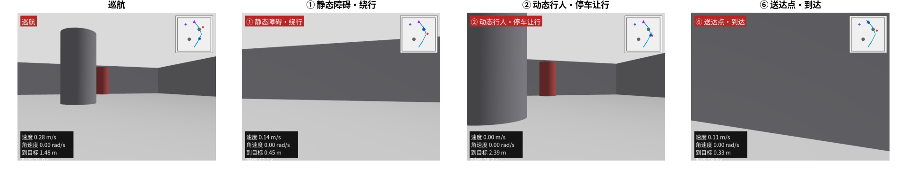
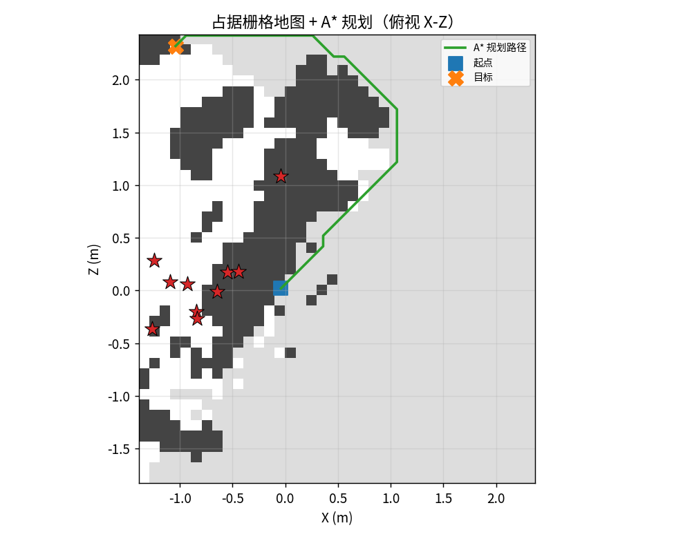
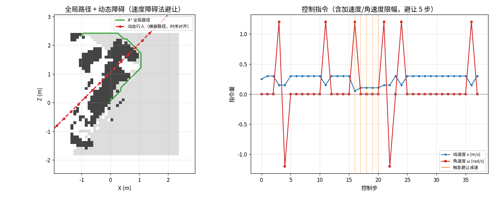
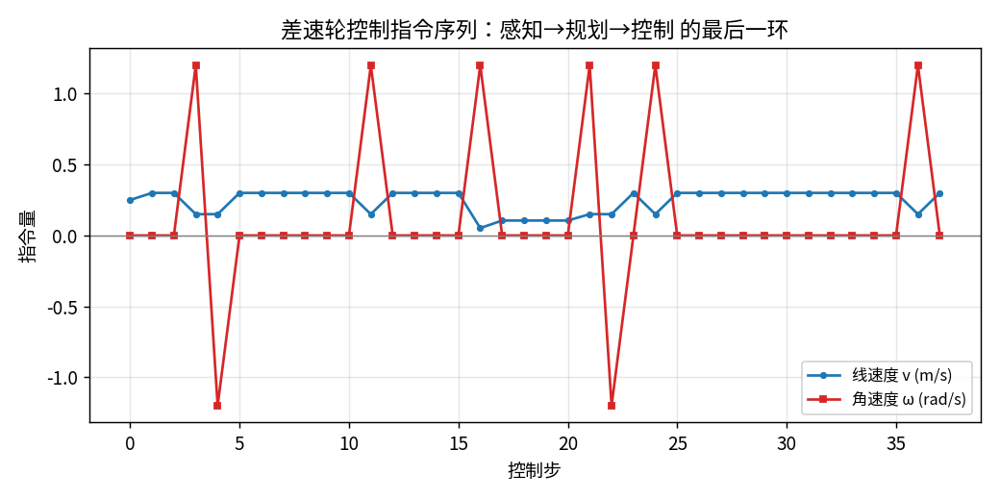

# F8 · 一镜到底：用「园区夜间配送」走通全栈（硬件→感知→决策→控制→兜底）

> 前面 `F0`–`F7` + `M0`–`M9` 是一堆**知识点碎片**：相机怎么投影、激光怎么出点云、WorldModel 是什么、PID 怎么控轮子……
> 但真实项目里，这些碎片是**串成一条线**工作的——一个任务从出发到送达，每秒钟都在同时调用它们。
>
> **本篇就是那根线**：把一个真实任务（园区夜间配送）拆成 9 个时刻，每个时刻讲清
> 「**谁在工作（硬件）· 算什么（算法，引 F/M）· 吐什么数据 · 出事谁兜**」，并附**本项目已实跑的真实图**作证据。
> 读完你会得到一张「全栈一张图」，回看任何一篇都不会再觉得它们孤立。
>
> **和 `F7 §13` 的关系**：`F7 §13` 是从「硬件器官」视角看同一趟任务；本篇是从「全栈数据流」视角看同一趟任务——**两面互补**，建议对照读。

---

## 0. 为什么需要这一篇（把碎片拼成一条线）

| 你之前读的 | 它单独讲了什么 | 但在真实任务里它…… |
|---|---|---|
| `F0` 相机投影 | 像素 ↔ 世界坐标怎么换算 | 只是「采到一张图」的第一步 |
| `F5` 视觉+激光融合 | 相机和激光怎么对齐、互补 | 只是「看懂世界」的中间一环 |
| `F6` 决策与控制 | WorldModel→costmap→规划→控制→兜底 | 只是「决定怎么动」的后半段 |
| `F7` 硬件扫盲 | 摄像头/激光/电机怎么选 | 只是「数据从哪来、动作靠谁执行」 |

**真实机器人不会「只读一篇」**——它每秒同时跑以上全部。本篇把它们压进**同一个时间轴**，让你看见「数据从相机进来到轮子转出去」的完整链路。

---

## 1. 任务与主角设定（真实场景，不是玩具）

> **任务**：一台园区配送机器人，晚上 9 点从驿站出发，穿过 200 米园区（走廊 + 一段全黑隧道 + 雨后积水路面），把包裹送到 3 号楼门口。

它的「身体」就是 `F7 §12` 那份选型清单的 6 类硬件：

```
① 全局快门 RGB 相机    → 看世界、认物体（F0/F5/M7）
② 16 线激光雷达        → 量距离、建地图（F5/F6 costmap）
③ IMU + 轮式编码器     → 感知自身运动状态（F6 控制闭环）
④ 差速轮无刷电机+驱动器 → 执行移动（F6 §5、F7 §8）
⑤ Jetson Orin + STM32  → 跑模型 + 实时控（M8、F7 §9）
⑥ CAN/同步线/稳压电源  → 连接 + 对时 + 供能（F7 §9.2）
```

**🖼️ 第一视角看它长什么样、要干啥**（本项目 Gazebo 真实相机渲染的送货工况关键帧）：



> 上面每个窗口都是机器人「眼睛看到的真实画面」（不是仿真真值贴图）——下方还会逐时刻解释每个画面背后发生了什么。

---

## 2. 时刻 ① 出发前：标定与初始化（硬件 + 几何）

机器人还没动，先得让所有传感器「说同一种语言」：

- **相机内参**（焦距/主点/畸变，`F0`）：把像素变回射线；
- **相机–激光外参**（`F5 §2.1`）：让「相机看到的」和「激光量到的」对齐到同一坐标系；
- **IMU–相机外参**：让高频惯性数据和图像帧对齐；
- **时间同步**（`F7 §9.2`）：给每个数据包打统一时间戳——否则「相机和雷达不是同一时刻」。

**🖼️ 这就是「三路对齐」的真实形态**（相机+LiDAR+IMU 同步，`P2`）—— `F7 §9.2` 说的"先对时再融合"在这里具象化：


> **诚实边界**（`P2_simulation.md §4.7`）：仿真里位姿来自 `/world/default/pose/info` 真值、深度来自仿真相机——真机上，上面这步标定就是真值的**物理前提**。

---

## 3. 时刻 ② 直行·走廊：自身定位（硬件 + 里程计/SLAM）

机器人要边走边知道「我在哪」。两条腿同时迈：

- **轮式编码器 + IMU**（高频 100–1000Hz，`F7 §7`）：实时估「走了多少、转了多少」；
- **视觉/激光 SLAM**（感知，见 `M1`/`M2`）：用环境特征校正编码器累积误差。

这里藏着 `PRIMER §2.2` 那个经典坑——**单目没有尺度**：光看图像分不清「近处小狗 vs 远处大象」。所以必须靠 **IMU/编码器/双目** 补回真实尺度（`M6` 融合要补的洞）。

**🖼️ 视觉里程计真实跑出的轨迹**（手搓 VO 在 TUM `fr1/desk`，`M1`）——这就是「边走边报位置」的产物：


---

## 4. 时刻 ③ 看懂世界：相机 + 激光 融合感知（感知核心）

这是整条链路最「重」的一环——把原始数据变成「墙在这、人在那、红杯子在左前方 2.31 米」。

- **相机（语义）**：用开放词汇模型认物体（`M7`），比如「前方有个行人」；
- **激光（几何）**：量出精确距离（`F5`/`F7 §4`），比如「行人 @ 2.31m」；
- **融合**（`F5`）：相机说「是什么」，激光说「在哪」→ 拼成「红杯在左前 2.31m」。

**🖼️ 相机语义侧**：开放词汇检测（OWL-ViT，自然语言查询「a red object」，`M7`）——VLM 擅长「理解是什么」，不擅长「在哪」：


**🖼️ 激光几何侧**：真实车载 LiDAR 稀疏扫描线（KITTI，单帧 ~1.8 万点、3.0–79.7m，`F5`）——注意是「一圈圈扫描线」不是稠密图：


**🖼️ 融合闭环**：把深度/点云反投影回图像、对齐残差≈0px（`F5` TUM demo）——这就是「相机+激光对齐」成功后的证据：


**🖼️ 深度从哪来**：前馈模型 VGGT 估的深度 vs 仿真真值深度（`P2`/`M4`）——深度图是「每个像素离相机几米」，直接喂给融合：


### 4.1 真实世界的「脏数据」长啥样（为什么 `M3`/`M5` 重要）

理想很丰满，真实很骨感。同一趟任务里你会撞上：

- **夜间/逆光**：相机几乎全黑 → 语义退化（`D1` 真实夜间，相机全黑）：
  
- **可控退化图库**（低光/雾/噪声，本项目在 Gazebo 里物理级合成，`P2`/`M5`）：
  
- **物理级退化**（光照/雾 4 条件，`P2`/`M5`）：
  

> 🎯 **本教程的核心哲学**：理解「为什么崩」比「怎么跑通」值钱十倍。上面三张图就是 `M3`/`M5` 方法论的「弹药库」——它们告诉你：夜间靠激光兜底、雾天靠雷达/IMU、反光靠语义代价层。

---

## 5. 时刻 ④ 感知结果交接：WorldModel 接口（`F6 §1`）

感知算出的所有东西，不是直接塞给控制器，而是先填进一个**结构化世界模型**——这是 `F6` 与 `P2 §3.7` 的灵魂：

| WorldModel 字段 | 这一刻填了啥 | 谁填的 |
|---|---|---|
| `ego_pose` | 我在 (0,-3)、朝北 | 时刻② 里程计 |
| `occupancy` | 前方 5m 有墙（概率 0.9） | 时刻③ 激光建图 |
| `obstacles` | 行人@(2,1)，以 0.35m/s 向北 | 时刻③ 检测+跟踪 |
| `goal` | 去 (0,3.8) 送货 | 任务层 |
| `confidence` | 隧道段置信度低 | 感知栈 |

**🎯 为什么这个接口是分水岭**：控制器只认 WorldModel，**不关心数据是仿真真值还是 M7 检测器给的**。所以仿真里用真值填、真机上换检测器填——控制代码一行不用改（`F6 §1.2`）。

---

## 6. 时刻 ⑤ 把世界变成「能走的地图」+ 规划路线（`F6 §2–3`）

控制器拿到 WorldModel，先把 `occupancy` 压成 2D 栅格，再搜一条路：

- **代价地图 Costmap**（`F6 §2`）：激光点云投到地面、按机器人半径**膨胀**成「可走/不可走」；
- **全局规划 A\***（`F6 §3`）：在代价地图上搜「从当前到目标总代价最低」的格子序列（像高德地图搜路线）。

**🖼️ LiDAR→膨胀→代价地图**（TB3 在 Gazebo，`P2`/`F6`）——点云怎么变成机器人能绕开的地图：


**🖼️ 占据栅格 + A\* 全局规划**（手搓，`P1`）——「从 A 到 B 走哪条格」：



**🖼️ 工业级 vs 手搓**：同样任务，ROS2 Nav2 的 NavFn vs 手搓 A\*（`P2`/`F6`）——底层都是「在代价图上搜路」，一回事：


---

## 7. 时刻 ⑥ 路上有人：动态避障（`F6 §4` + 真实）

全局路径是「理想路线」，但真实环境会冒出没预料到的动态障碍（行人/车）。需要**局部实时重规划**：

- **速度障碍法 VO**（`F6 §4`）：把行人预测成「未来会占哪片区域」，机器人选避开该区域的 `(v,ω)`；
- **行人横穿**：检测到行人在 1.3m 内 → 速度清零（VO 判定危险）→ 等他先过。

**🖼️ 速度障碍法让机器人减速**（行人逼近时，`P1`）：



**🖼️ 行人距离 vs 避障指令闭环**（雷达/相机联合触发，`P2` 五层 pipeline 之一）：


**🖼️ 感知→决策→控制 五层数据流**（全链路一图流，`P2`）：


**🎬 闭环动图**（俯视：机器人遇行人减速让行，`P2`）——比静态图更直观：


---

## 8. 时刻 ⑦ 控制执行：把「路线」变成「轮子转速」（`F6 §5`）

规划给的是「期望轨迹 (x,y,θ)」，底盘只认「左右轮转速」。翻译靠：

- **差速轮运动学**（`F6 §5.1`）：左轮 `vL`、右轮 `vR` → 线速度 `v=(vL+vR)/2`、角速度 `ω=(vR-vL)/L`；
- **PID**（`F6 §5.2`）：实际偏了就纠（P 偏多少使多劲、I 消稳态误差、D 别冲过头）；
- **落到硬件**：指令发给左右轮**无刷电机驱动器**（`F7 §8`）——PID 是司机大脑、电机是发动机、驱动器是油门。

**🖼️ 差速轮按规划指令生成的控制序列**（38 条控制指令，`P1`）——高层路径变成底层轮子转速的真实产物：



---

## 9. 时刻 ⑧ 兜底：建模差时怎么不撞（`F6 §6` 三层兜底）

前面③⑤⑥ 假设感知都正常。但真实任务里会撞上退化工况——**这正是 `F6 §6` 与 `F7 §13` 兜底的用武之地**：

| 退化工况 | 谁失效 | 谁兜住（三层兜底 `F6 §6`） |
|---|---|---|
| **进隧道·全黑** | 相机（HDR 不够，见 `F7 §3.2`） | 切 **LiDAR 单模建图 + 雷达测速**；IMU 短时续命；反应式安全层读原始激光急停 |
| **雨后·积水反光** | LiDAR（镜面失效，见 `F7 §4.3`） | 降速 + 靠视觉/雷达；**不确定性感知**（costmap 低置信格子当障碍）；反应式安全层 |

**🖼️ 夜间相机退化的真实依据**（`D1` 夜间，相机几乎全黑）——这就是「进隧道必须靠其他传感器」的硬证据，再次呼应第 4.1 节：


> 🎯 **核心结论（`F6 §6`）**：难点在感知，但**控制的鲁棒性可以独立保证**。只要「反应式安全层」在，感知差顶多「走得蠢/停住」，不会「撞上去」——这是你能写进简历、真实产品必须有的工程素养。

---

## 10. 时刻 ⑨ 到达门口：确认送达（深度相机收尾）

机器人到 3 号楼门口，用 **RGB-D/ToF 深度相机**（`F7 §6`）做近距离识别/抓取确认，把包裹交付。至此一趟任务闭环。

> 整条链路：**硬件采数（F7）→ 几何/语义感知（F0/F5/M7）→ 填 WorldModel（F6 §1）→ costmap+A\*（F6 §2–3）→ 动态避障（F6 §4）→ 差速+PID 控轮子（F6 §5）→ 退化时三层兜底（F6 §6）**。每一个方框，上面都给了**本项目已实跑的真实图**。

---

## 11. 全链路「一图流」对照表（你去哪看每个环节的真实跑通）

| 时刻 | 发生了什么 | 真实图证据 | 对应文档 |
|---|---|---|---|
| ① 标定 | 三路传感器对齐、对时 | `sensor_fusion.png` | `F7 §9.2` / `F5 §2.1` |
| ② 定位 | 编码器+IMU+VO 估自身位姿 | `trajectory.png` | `M1` / `PRIMER §2.2` |
| ③ 感知 | 相机语义 + 激光几何 + 融合 | `open_vocab_detection.png` `kitti_lidar_fusion.png` `lidar_projection.png` `vggt_vs_gt_depth.png` | `F5` / `M7` / `M4` |
| ③′ 退化 | 夜间/雾/反光真实脏数据 | `night_det.png` `degradation_gallery.png` `physical_conditions.png` | `M3` / `M5` |
| ④ 交接 | 感知 → WorldModel 结构化 | （接口表，见 §5） | `F6 §1` / `P2 §3.7` |
| ⑤ 建图+规划 | LiDAR→costmap→A\* | `costmap_concept.png` `map_plan.png` `navfn_vs_p1.png` | `F6 §2–3` |
| ⑥ 避障 | 行人横穿→减速让行 | `dynamic_avoid.png` `ped_tracking.png` `pipeline.png` `closed_loop.gif` | `F6 §4` / `P2` |
| ⑦ 控制 | 路线→差速轮+PID 指令 | `control_cmd.png` | `F6 §5` / `F7 §8` |
| ⑧ 兜底 | 全黑/反光时谁兜 | `night_det.png`（复用） | `F6 §6` / `F7 §13` |
| ⑨ 送达 | 深度相机确认交付 | `gazebo_rgbd.png`（`F7 §3`） | `F7 §6` |

---

## 12. 收尾：从一个场景看懂整个教程

把这一趟任务回看一遍，你会发现本教程的所有篇章，都是这台机器人**身上的不同器官/不同能力**：

| 你刚在场景里看到的 | 是哪篇在发力 |
|---|---|
| 相机拍到画面、估深度 | `F0` 投影 / `F2` 深度 / `M4` 前馈模型 |
| 激光量距离、建点云 | `F5` 融合 / `F7 §4` |
| 认出「前方是行人」 | `M7` 语义层 |
| 夜间全黑、雾天退化 | `M3` 失效归因 / `M5` 压力测试 |
| 多传感器对齐、对时 | `F7 §9.2` / `F5 §2.1` |
| 把世界填进 WorldModel | `F6 §1` / `P2 §3.7` |
| 变成能走的地图、搜路线 | `F6 §2–3` |
| 遇人减速、控轮子转 | `F6 §4–5` / `F7 §8` |
| 建模差也不撞 | `F6 §6` 三层兜底 |

**🎯 一句话总结**：这一篇不是新知识，而是把 `F0`–`F7` + `M0`–`M9` 拧成**一根能跑的线**。当你能在脑子里 replay 这趟「园区夜间配送」的每一秒，你就从「会读单篇文档的人」变成了「能设计一套在真实世界里不趴窝的系统的人」——这就是本教程想让你成为的**感知控制专业人士**。

---

*下一篇*：想亲手让这趟任务跑起来，去 `scripts/p2_delivery_fpv_gazebo.py` 看第一视角闭环，再翻 `P1_field_projects.md` / `P2_simulation.md` 看工程全貌；想补硬件细节回 `F7 §13`，想补控制细节回 `F6`。
