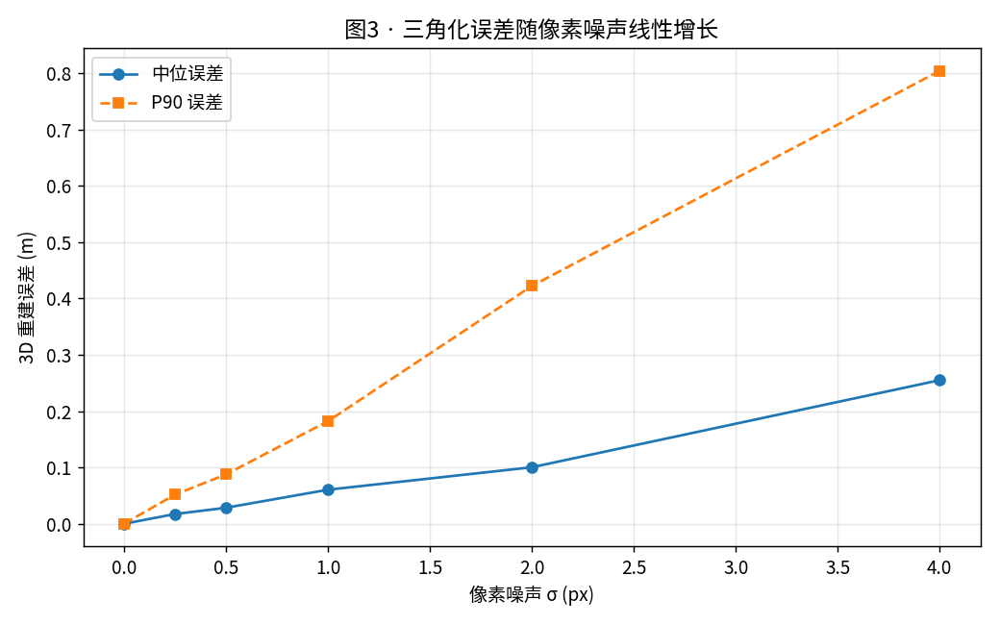
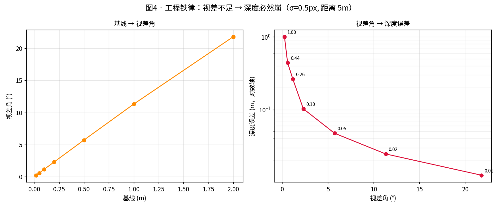
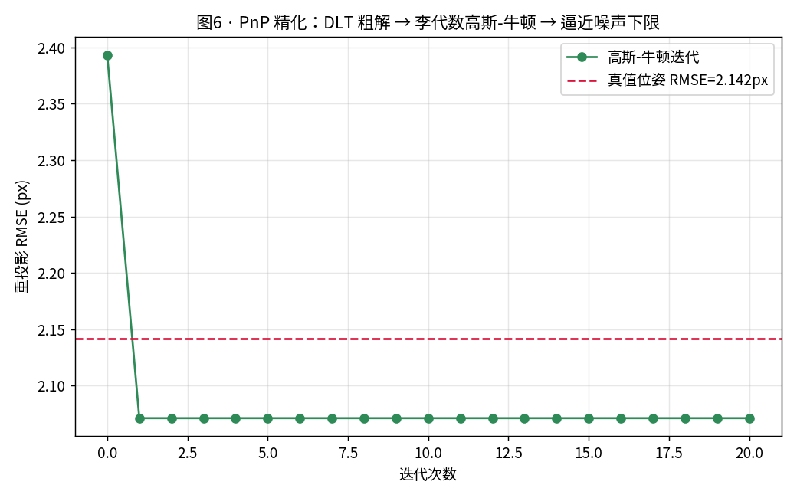
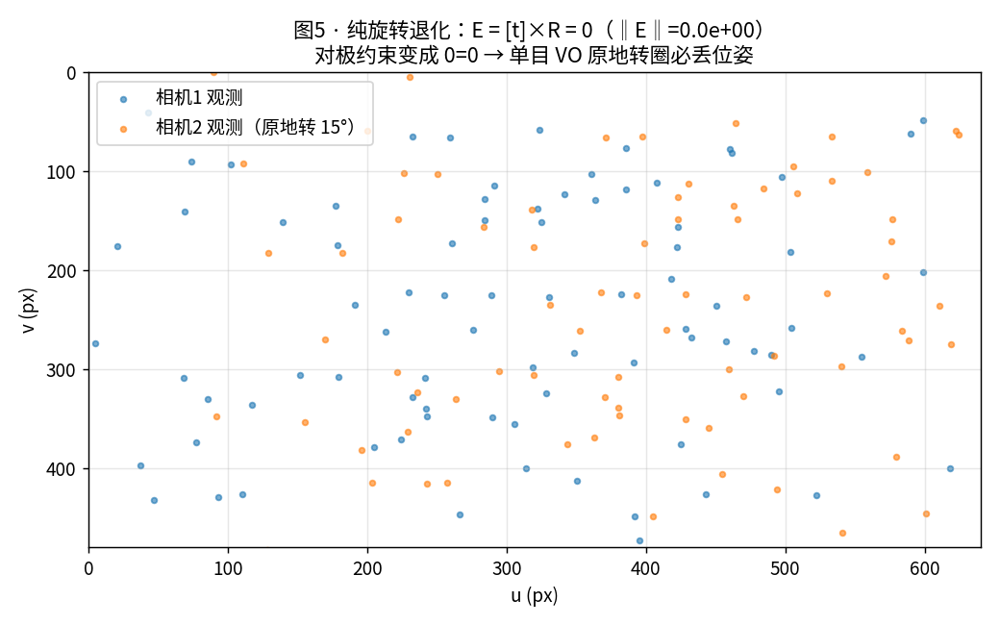

# M0 · 几何地基

> 目标：把空间感知的"语言"学扎实。**这一层不牢，后面所有论文都读不懂。**
> 本 Module 全部手写实现 + 数值自检（`tests/test_geometry.py`，25 项全绿）。

> ## 🧭 初学者导读（5 分钟版 · 零基础先看这里）
>
> **这篇讲什么**：相机怎么把 3D 世界拍成 2D 照片，以及怎么从 2D 照片**反推**回 3D。这是整个空间感知的"字母表"。
>
> **先记住 4 句话**（看不懂公式也能懂）：
> 1. **相机 = 一个投影器**：3D 点 → 2D 像素，靠的是"内参 K"（焦距/光心）。
> 2. **拍照 = 降维，会丢信息**：无数个 3D 场景能拍出同一张照片 → 所以反推 3D 是**难题**（要靠多个视角）。
> 3. **两个视角是关键**：同一个点在两帧里的位置差，就能算出它有多远——这就是**三角化**（类比双眼测距）。
> 4. **有时几何上不可解**：相机原地旋转（没有平移）时，**永远**算不出深度——这是硬限制，不是 bug。
>
> **术语可以不背，先建立画面感**：
> - **内参 K** = 相机的"度数"（焦距）；**外参 [R|t]** = 相机"站在哪、朝哪看"。
> - **对极几何** = 两帧之间的"搜索规则"：第二帧里找匹配点，只需沿**一条直线**找，不用满图找。
> - **本质矩阵 E** = 把这条规则写成数学；从 E 分解就能拿到两帧的相对位姿。
> - **三角化** = 两条射线相交，交点就是 3D 点的位置。
> - **PnP** = 已知 3D 点和它在图里的像素，反求相机位姿。
>
> **建议读法**：先只读每节的「💡 直白讲解」和 6 张图（§1.3/§2.4/§3/§5/§6 各有关键图），
> 跳过 `§` 里的公式推导；等你把 `F0`–`F2` 和 `M2/M4` 读完，再回来补公式，会顺很多。
>
> **读完能回答**：为什么单目要动起来才能测深度？为什么原地转圈会丢位姿？为什么说"几何不能靠大模型"（本文 §0 那张表）？

---

## 0. 为什么从几何开始，而不是从 VGGT 开始？

一个反直觉但极其重要的事实（ICLR 2026 的 benchmark 数据）：

| 任务 | 最强 VLM | 经典几何方法 | 人类 |
|---|---|---|---|
| 相机相对位姿估计（F1） | GPT-5: **0.64** | LoFTR: **0.97**，SIFT 也强过 VLM | 0.92 |
| 深度轴推理准确率 | **7.4%** | — | 高出 52 个百分点 |
| 心理旋转 / 视角采择 | 接近随机 | — | 显著更好 |

**专业术语**：上面这张表比的是"相机相对位姿估计""深度轴推理""心理旋转"三类空间任务。

> **💡 直白讲解**：VLM（大语言/多模态模型）在"理解空间"这件事上，打不过二十年前的 SIFT。
> 所以地基是几何，不是大模型。VLM 的位置在**语义层**（M7 再讲）。

**结论**：几何必须靠几何方法。

---

## 1. 坐标系与投影（一切的起点）

### 1.1 约定（写错一个转置，debug 三天）

**专业术语**：坐标系变换约定 `T_cw`（camera-from-world）。

```
世界点 P_w ──T_cw──> 相机点 P_c ──K──> 像素 (u,v)

    P_c = R_cw · P_w + t_cw
    s · [u, v, 1]^T = K · P_c
```

> **💡 直白讲解**：`T_cw` 读作 "camera from world"（把世界点变到相机系）。
> 有人说 `T_wc`（相机在世界的位置），两者互为逆 —— **看代码时第一件事就是确认这个约定**，
> 写反了整套坐标都会错。

### 1.2 内参矩阵

**专业术语**：针孔相机内参矩阵 `K`。

```
K = [ fx  0  cx ]
    [ 0  fy  cy ]
    [ 0   0   1 ]
```

- `fx, fy`：焦距（**像素单位**）。本质上是"角度 → 像素"的换算系数
- `cx, cy`：主点（光轴与成像平面交点），理想在图像中心，实际有偏差

### 1.3 单目的根本难题：尺度歧义 ⚠️

**专业术语**：尺度歧义（scale ambiguity）—— 单目无法恢复绝对尺度。

从投影方程看：`P_c` 和 `k·P_c` 投影到**同一个像素**。
把整个场景和相机轨迹同时放大 k 倍，观察到的图像完全一样。

> **单目视觉无法仅从图像恢复绝对尺度。**

这就是为什么单目 VO 必须靠 IMU、已知尺寸物体、或双目来定尺度。
在数学上，它表现为本质矩阵 E 只有 5 个自由度（3 旋转 + 2 平移**方向**），平移的模长丢失了。

> **🖼️ 结果图**（运行 `scripts/m0_demo.py` 生成于 `experiments/M0_geometry_foundation/figs/fig1_projection.png`）：


> **💡 直白讲解**：这张图就是把"3D 点投影成 2D 像素"这件事画出来。同一堆 3D 点（颜色=离相机远近），
> 从两个不同角度拍，落在照片上的位置就不一样。VO/SfM 是**反着用**这件事：看同一个点在两张照片里
> 位置变了，倒推出相机是怎么移动的。

---

## 2. 李群 SO(3) / SE(3)：为什么优化要用李代数

### 2.1 问题

**专业术语**：旋转矩阵 `R` 属于特殊正交群 SO(3)，平移+旋转的组合 `T` 属于特殊欧氏群 SE(3)。
它们的"导数/优化"要在**李代数**（so(3)/se(3)）上做。

旋转矩阵 R 有 9 个数，但只有 3 个自由度，还要满足 `R^T R = I, det R = 1`。
直接优化 9 个数，结果会跑出约束空间。

### 2.2 解法：指数映射

**专业术语**：指数映射 `exp(·)`，把李代数（无约束向量）映射到李群（带约束矩阵）。

用旋转向量 φ（方向 = 轴，长度 = 角度）表示，Rodrigues 公式：

```
exp(φ) = I + (sinθ/θ)·φ^ + ((1-cosθ)/θ²)·(φ^)²      θ = |φ|
```

这样优化变量从"带约束的 9 维"变成"无约束的 3 维"。

### 2.3 左雅可比 J_l(φ) —— 最容易被忽略、但最重要

```
exp(φ + Δφ) ≈ exp(J_l(φ)·Δφ)^ · exp(φ)^
J_l = (sinθ/θ)·I + (1 - sinθ/θ)·a a^T + ((1-cosθ)/θ)·a^      (φ = θa)
```

它把"李代数增量"换算成"李群增量"。**它出现在两个地方**：

1. SE(3) 的指数映射里：平移部分 `t = J_l(φ)·ρ`，**不是 ρ**
2. BA 的雅可比推导里

⚠️ 我写的 `expSE3` 就靠它：
```python
T = [[exp(φ^),  J_l(φ)·ρ],
     [0 0 0,        1    ]]
```
（自检 `test_expSE3_translation_uses_left_jacobian` 专门验证这一点）

---

## 3. 对极几何：两视图的约束

### 3.1 直觉

**专业术语**：对极约束（epipolar constraint）、极线（epipolar line）、对极平面。

相机光心 C1、C2 和空间点 P **三点共面**（对极平面）。
这个平面与两张图像的交线叫**极线**。
于是：已知 p1，对应点 p2 一定落在第二张图的一条直线上 —— **把 2D 搜索降为 1D 搜索**。

> **🖼️ 结果图**（运行 `scripts/m0_demo.py` 生成于 `experiments/M0_geometry_foundation/figs/fig2_epipolar_lines.png`）：


> **💡 直白讲解**：左图是相机 1 看到的几个彩色点；右图是相机 2 里对应的彩色直线（极线）。
> 关键结论：已知左图一个点，它在右图的位置**不需要满图找**，只要沿这条线搜就行——
> 把"二维搜索"降成"一维搜索"，这是特征匹配能又快又准的底层原因。

### 3.2 数学

```
像素坐标:    p2^T · F · p1 = 0     F: 基础矩阵，7 自由度
归一化坐标:  x2^T · E · x1 = 0     E: 本质矩阵，5 自由度
关系:        E = K2^T · F · K1
```

E 只比 F 少 2 个自由度 —— 少的正是内参提供的信息。

### 3.3 八点法（+ 我踩的坑）

`x2^T E x1 = 0` 对 E 是线性的，把 E 拉成 9 维向量：

```
[u2u1, u2v1, u2, v2u1, v2v1, v2, u1, v1, 1] · e = 0
```

8 对点 → 8 个方程 → SVD 取最小奇异向量。然后**强制 rank=2**（E 的内在性质）：SVD 后把最小奇异值置 0。

**🔴 实战坑（我在本项目里真踩了）**：
`normalize_points()` 返回的是**齐次坐标 (N,3)**，而八点法要 **(N,2)**。
直接 `reshape(-1, 2)` 不会报错，但会把数据彻底打乱 —— 解出来的 E 看起来"差不多对"
（与真值余弦相似度 0.83），跑起来轨迹就是歪的。

**教训**：几何代码必须写数值自检。这也是 `tests/` 存在的理由。

### 3.4 从 E 恢复位姿

SVD 分解给出 **4 组**候选 (R, t)：`{U W V^T, U W^T V^T} × {+u3, -u3}`。
4 组在几何上都满足对极约束，必须用 **chirality（正深度）检验** 选唯一解：

> 三角化后，点必须在**两个相机的前方**（Z > 0）。

---

## 4. 三角化：恢复 3D

### 4.1 线性 DLT

每个视图给出 2 个独立方程（叉积展开的第 3 行是冗余的）：

```
[u·p3^T - p1^T]
[v·p3^T - p2^T]  X = 0      齐次方程组 → SVD 取最小奇异向量
```

### 4.2 可信度准则（工程必用）

1. **正深度**：点在两相机前方
2. **视差角 θ**：两条射线夹角。θ < 1~2° 时深度不确定度爆炸
3. **重投影误差**：投影回去与观测差多少

**实测**（`test_triangulation_with_noise`）：0.5px 噪声、0.5m 基线、2~6m 距离下，
平均 3D 误差 < 0.15m。

> **🖼️ 结果图 1**（噪声 vs 三角化误差，运行 `scripts/m0_demo.py` 生成于
> `experiments/M0_geometry_foundation/figs/fig3_triangulation_vs_noise.png`）：



> **💡 直白讲解**：横轴是像素噪声大小，纵轴是三角化出的 3D 点误差。噪声越大、误差越往上走，
> 但整体可控（0.5px 噪声下约 0.03m）。说明几何链路在干净数据上是"对"的。

> **🖼️ 结果图 2**（视差角 vs 深度误差，运行 `scripts/m0_demo.py` 生成于
> `experiments/M0_geometry_foundation/figs/fig4_parallax_vs_depth_error.png`）：



> **💡 直白讲解**：横轴是视差角（两个相机看同一个点的夹角），纵轴是深度误差。
> 视差角越小（相机几乎没动），误差**暴涨**——这正是为什么 M1 初始化必须等视差 > 3° 才能开始。

---

## 5. PnP：已知 3D 点求位姿

**专业术语**：PnP（Perspective-n-Point）—— 已知 3D 点及其在图像上的投影，求相机位姿。

VO 的流程是：前两帧用对极几何初始化 → 三角化建图 → **之后每帧用 PnP 定位**。

- 最小解：P3P（3 点，最多 4 解）
- 线性解：DLT（≥6 点）
- 最优解：EPnP + LM 迭代最小化重投影误差

**⚠️ 又一个坑**：DLT 解的 `M` 与 `-M` 残差完全相同，SVD 无法区分符号。
必须用正深度检验消歧：
```python
if np.mean((M @ Xh.T)[2]) < 0: M = -M
```
（我第一版就漏了，测试直接报平移符号全反）

> **🖼️ 结果图**（DLT 初解 vs LM 精化，运行 `scripts/m0_demo.py` 生成于
> `experiments/M0_geometry_foundation/figs/fig6_pnp_refine.png`）：



> **💡 直白讲解**：对比 DLT 直接解（初始）和 LM 迭代精化后的重投影误差。
> 精化把误差从 2.39px 压到 2.07px，接近噪声下限 2.14px。
> 说明"先用线性解、再迭代精化"这套流程确实有效。

---

## 6. 三种退化构型（M3 失效归因的雏形）

这几个不是"边缘情况"，而是**工业现场每天都在发生的事**：

### 6.1 纯旋转 → 几何上不可解
`E = [t]_× R`，若 `t = 0` 则 `E = 0`，对极约束退化成 `0 = 0`。
**后果**：机器人原地转圈时，单目 VO 直接丢失位姿。
自检：`test_pure_rotation_is_degenerate`

> **🖼️ 结果图**（运行 `scripts/m0_demo.py` 生成于
> `experiments/M0_geometry_foundation/figs/fig5_pure_rotation_degenerate.png`）：



> **💡 直白讲解**：蓝点（旋转前）和橙点（原地转 15° 后）几乎重合。
> 因为没有平移，两张图里点的移动全是旋转造成的，**无法解出深度**——纯旋转在几何上不可解。

### 6.2 小基线 / 弱视差 → 病态
基线缩短 → 视差角变小 → E 条件数爆炸。
**实测**（`test_small_baseline_degrades_pose_accuracy`，0.3px 噪声）：

| 基线比例 | 旋转误差 |
|---|---|
| 1.0 | 0.03° |
| 0.2 | 0.04° |
| 0.03 | **0.14°**（还在涨）|

**后果**：缓慢移动、远距离观测时位姿急剧恶化 → 这就是要加 IMU 的原因。

### 6.3 无纹理 → 特征数归零
没有可区分的角点，连匹配都做不了。
这是 M3/M5 的主战场（TUM 的 `nostructure_notexture` 序列就是为此准备的）。

---

## 7. 本 Module 的实现清单

| 文件 | 内容 |
|---|---|
| `src/wildspatial/geometry/lie.py` | hat/vee、exp/log SO(3)/SE(3)、左右雅可比 |
| `src/wildspatial/geometry/camera.py` | PinholeCamera、投影/反投影、归一化、投影雅可比 |
| `src/wildspatial/geometry/epipolar.py` | 八点法、E/F 互转、位姿分解与恢复、Sampson 误差 |
| `src/wildspatial/geometry/triangulation.py` | DLT 三角化、视差角、重投影误差 |
| `src/wildspatial/geometry/pnp.py` | DLT PnP + 李代数高斯-牛顿精化（BA 的雏形）|
| `tests/test_geometry.py` | 25 项数值自检 |

## 8. 自检方式

```bash
cd /home/hmn-cjy/liuliuqiu/WildSpatial
PYTHONPATH=src python -m pytest tests/ -q
```

每种检查手段：
- **解析解对照**：绕 z 轴 90° 的旋转矩阵、光轴上点投影到主点
- **往返对照**：exp/log 互逆、project/unproject 互逆
- **数值差分对照**：J_l、投影雅可比（有限差分 vs 解析，误差 < 1e-5）
- **退化构型断言**：纯旋转 E=0、小基线条件数恶化

---

## 9. 反思（写给我自己）

1. **"能跑"和"对"是两回事**。八点法那个 (N,3)/(N,2) 的 bug，输出看起来完全合理，
   只有与真值比对才暴露。**几何代码必须自检**。
2. **每个经典算法都有至少一个"对称性陷阱"**：E 的 4 解、PnP 的符号、尺度不定。
   记住它们的共通解法：**用物理约束（正深度）消歧**。
3. **退化不是 bug，是几何的固有性质**。纯旋转不可解、小基线病态 —— 这些不是实现问题，
   是问题本身的性质。工程上的对策是**加传感器**（IMU/深度），这正是 M6 要做的。

---

## 下一步 → M1

把这一层拼成完整管线：SIFT 特征 → 匹配 → RANSAC → E → 三角化 → PnP → BA，
在 TUM RGB-D 上跑出轨迹，算 ATE，然后**看它在无纹理序列上怎么崩**。
