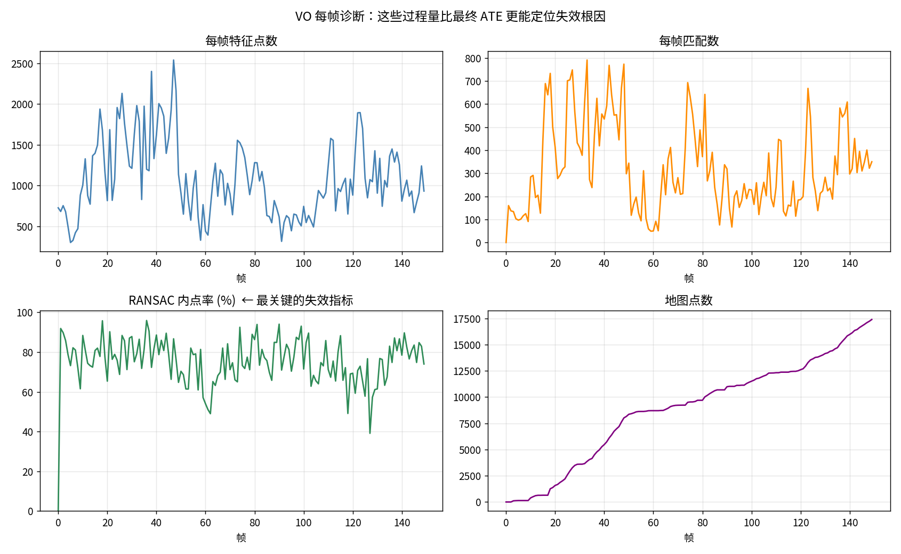
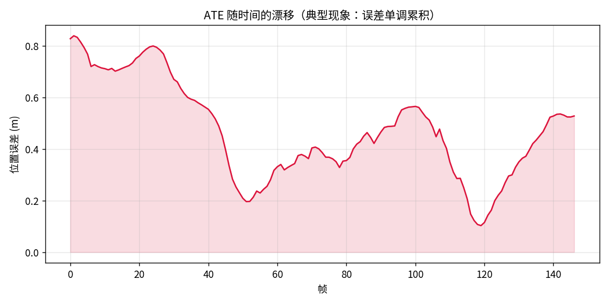
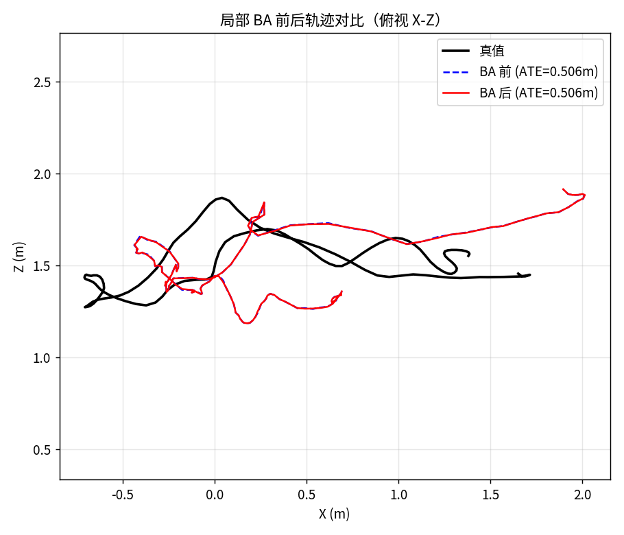
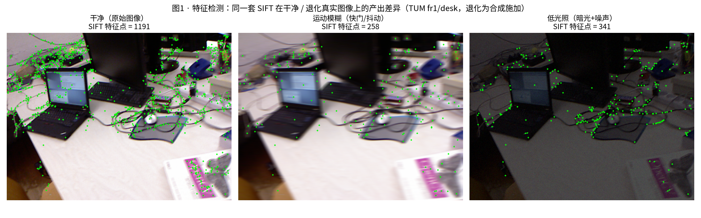
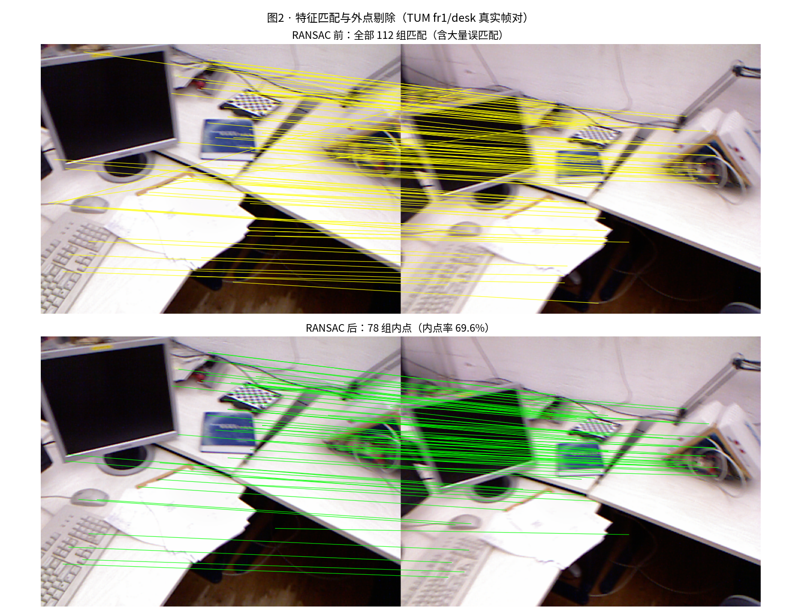
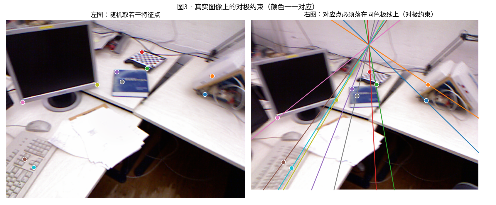
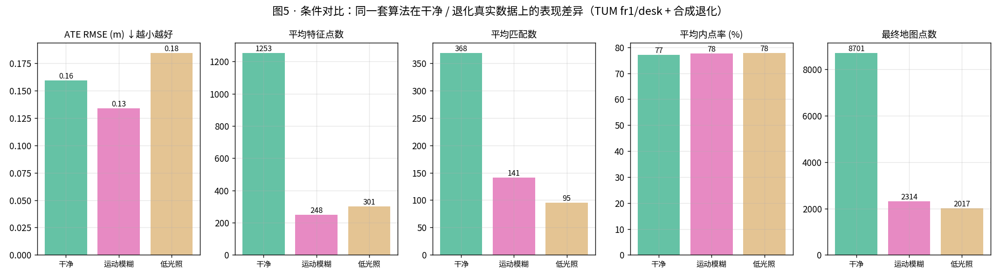

# M1 · 手搓 SfM / 单目 VO

> 目标：把 M0 的几何模块串成一条完整管线，在真实数据上跑出轨迹，
> **并亲眼看到它在哪里崩**。
> 产出：`src/wildspatial/sfm/`（features / matching / ransac / vo）+ 47 项自检 + TUM 基线结果。

---

## 1. 完整管线

**专业术语**：SfM（Structure from Motion，运动恢复结构）/ VO（Visual Odometry，视觉里程计）。

```
图像序列
   │
   ├─ ① 特征提取    SIFT / ORB / AKAZE → 关键点 + 描述子
   ├─ ② 描述子匹配  最近邻 + **比值检验** + 互最近邻
   ├─ ③ 外点剔除    RANSAC + 八点法 + Sampson 距离
   ├─ ④ 位姿恢复    从 E 分解 (R, t) + **正深度消歧**
   ├─ ⑤ 三角化      建初始地图（需视差足够）
   ├─ ⑥ 跟踪定位    PnP（继承地图尺度）+ 高斯-牛顿精化
   ├─ ⑦ 地图扩展    对新匹配三角化
   └─ ⑧ (待做) BA   联合优化位姿与地图点
```

**为什么要手搓这一遍？**
只有亲手搭过，才知道 VGGT"一次前向取代整条管线"到底取代了什么；
也只有亲手搭过，才知道它在哪里会崩（M3/M5 的主题）。

---

## 2. 四个关键设计

### 2.1 比值检验（Lowe's ratio test）

**专业术语**：Lowe 比值检验 —— 用最近邻/次近邻距离比筛选可靠匹配。

只取最近邻会产生大量误匹配。判据：
```
d1 / d2 < ratio (0.7~0.8) 才接受
```
直觉：好特征应该"独一无二"—— 它跟最佳匹配明显比跟第二匹配近得多。

⚠️ **在恶劣环境下这个检验会过度拒绝**：弱纹理/模糊/低光下 d1/d2 普遍偏大，
大量正确匹配被误杀 → 匹配数骤降 → VO 崩。这是 M3 要量化的核心指标。

### 2.2 RANSAC 的迭代次数不是拍脑袋定的

**专业术语**：RANSAC（RANdom SAmple Consensus，随机采样一致）—— 用少量随机样本估模型、用内点投票剔外点。

```
N = log(1-p) / log(1 - w^s)
```
w=内点率，s=最小样本数（八点法 8），p=期望成功率。

| 内点率 | 所需迭代（p=0.9999, s=8） |
|---|---|
| 90% | 16 |
| 50% | 2,354 |
| 15% | > 10⁵ |

**内点率崩了以后，堆 RANSAC 迭代是救不回来的。** 这是 M3 的核心失效模式。

### 2.3 初始化：视差是硬约束

**专业术语**：视差角（parallax angle）—— 两个相机看同一空间点的射线夹角，越大说明相机移动越多。

TUM fr1/desk 实测（相邻帧）：

| 指标 | 值 | 评价 |
|---|---|---|
| RANSAC 内点率 | 97.7% | ✅ 匹配质量极好 |
| 视差角中位数 | 0.41° | ❌ 几何上不可解 |
| 三角化深度中位数 | 100 m | ❌ 真实仅 1~2 m |

> **💡 直白讲解**：匹配质量再好，相机几乎没动（视差角才 0.41°），三角化算出的深度会离谱到 100m。
> **匹配质量 ≠ 几何可解性**。解法（同 ORB-SLAM）：固定参考帧，等运动累积到中位视差 > 3° 再初始化。

### 2.4 运动连续性护栏（最重要）

**专业术语**：运动连续性约束（motion continuity prior）—— 相邻帧间位移不应突变。

无护栏时，一次 PnP 失败会让回退路径用"上一帧位移"猜尺度，
异常跳变被逐帧放大 → **指数爆炸**：

| | 无护栏 | 有护栏 |
|---|---|---|
| RPE 平移 RMSE | 49,940 m | 0.156 m |

护栏三件套：
1. 单帧位移上限
2. 不超过最近 N 帧位移中位数的 K 倍
3. 回退路径用**中位位移**并 clip

> **💡 直白讲解**：**VO 的核心不是"估得准不准"，而是"崩了能不能回来"。**
> 没有护栏的系统，一旦出现一次异常跳变就再也回不去了。

---

## 3. 实现清单

| 文件 | 内容 |
|---|---|
| `sfm/features.py` | SIFT/ORB/AKAZE 提取，统一 FeatureSet 结构 |
| `sfm/matching.py` | 比值检验 + 互最近邻 + 运动平滑粗筛 |
| `sfm/ransac.py` | 自适应 RANSAC（E / F），Sampson 内点判据，迭代次数公式 |
| `sfm/vo.py` | MonocularVO：初始化 / PnP 跟踪 / 三角化 / 护栏 / 诊断 |
| `data/tum.py` | TUM RGB-D 加载（时间戳关联 + T_wc↔T_cw 转换） |
| `eval/trajectory.py` | Umeyama Sim3 对齐 + ATE + RPE |
| `scripts/m1_run_vo.py` | 跑真实数据 + 出图 + metrics.json |

---

## 4. 基线结果（TUM fr1/desk, stride=3）

**专业术语**：ATE（Absolute Trajectory Error，绝对轨迹误差）/ RPE（Relative Pose Error，相对位姿误差）。
ATE 看整条轨迹和真值差多少；RPE 看相邻帧的相对漂移。

```
ATE RMSE    0.506 m      RPE 平移 0.156 m      RPE 旋转 2.72°
内点率均值   75.3%        速度 39 ms/帧         地图点 17,388
```

对比：ORB-SLAM2 单目在同序列约 **0.02~0.05 m**（有回环 + 局部 BA + 共视图）。
差距主要来自**没有后端优化**，不是前端几何有问题。

> **🖼️ 结果图 1 · 轨迹对比**（运行 `scripts/m1_run_vo.py` 生成于
> `experiments/M1_vo_fr1_desk/figs/trajectory.png`）：


> **💡 直白讲解**：左图俯视：黑线 = 真值轨迹，红虚线 = 算法估计（已做 Sim3 对齐）。
> 右图：X/Y/Z 三轴随时间位置，黑 = 真值，彩 = 估计。整体形状吻合，但有约 0.5m 的整体偏移——
> 这就是 ATE 0.506m 的来源。

> **🖼️ 结果图 2 · 每帧诊断**（生成于 `experiments/M1_vo_fr1_desk/figs/diagnostics.png`）：



> **💡 直白讲解**：每帧记录特征数、匹配数、RANSAC 内点率、地图点数。
> 注意内点率均值 75% 但会跌到 40%~60%——这些"过程量"比最终 ATE 更能告诉你"为什么当时漂了"，
> 是 M3 失效归因的素材。

> **🖼️ 结果图 3 · ATE 漂移曲线**（生成于 `experiments/M1_vo_fr1_desk/figs/ate_curve.png`）：



> **💡 直白讲解**：每一帧的估计误差。不是突然崩，而是缓慢漂移、随时间累积——
> 单目 VO 没有回环/BA 时的典型症状。这也正好说明 BA 的价值（下一步要做）。

详见 `experiments/M1_vo_fr1_desk/README.md`。

---

## 5. 后端优化：Bundle Adjustment（BA）

**专业术语**：Bundle Adjustment（光束法平差）—— 给定 VO 给出的初始位姿与地图点后，用**非线性最小二乘**联合优化**所有相机位姿 + 所有 3D 地图点**，使每一条"观测像素 ↔ 投影像素"的**重投影误差**之和最小：

```
minimize   Σ_{i,j}  ρ( ‖ z_ij − π(K, T_i, X_j) ‖² )
 T_i, X_j
```

其中 z_ij 是第 j 个地图点在第 i 帧的观测像素，π 是投影函数，"Bundle"指从每个光心射向空间点的一束光线。

**为什么需要它（直白讲解）**：VO 逐帧 PnP 估计，误差会**逐帧累积成"漂移"**。BA 不再只往前看，而是回过头把整条轨迹和整张地图一起"拧"到最自洽的状态——把漂移**摊平到全局**。现代 SLAM（ORB-SLAM / VINS / COLMAP）的精度，主要就来自 BA + 回环。

**Gauge freedom（规范自由度，单目 BA 的心腹大患）**：单目 BA 有 **7 维不可观测自由度**（3 旋转 + 3 平移 + 1 尺度）。
本项目做法（详见 `src/wildspatial/sfm/ba.py` 顶部 docstring）：
- 固定第 0 帧（消 6 维）；
- 再用**尺度锚**：把"第 0 帧光心 → 首个自由帧光心"的基线长度钉死在初值，消第 7 维。
- ⚠️ 不能用"优化完再整体乘尺度 s"——那会把本应固定的第 0 帧也缩放了，规范自由度没消干净。

本项目的 BA 已接入 `MonocularVO.refine()`：由 `self.obs` 反查每条观测的像素坐标，构建 `obs=[(帧, 点, uv)]` 调用 `local_ba`；跑 `scripts/m1_run_vo.py --ba` 即可在 VO 跑完后自动重优化并生成前后对比图。

**工程实现的两个关键决策（都很值得记一笔）**：
1. **残差 / 雅可比全向量化**（`ba.py` 用 `einsum` + 广播一次性算出所有观测的投影与雅可比，不再逐条 Python 循环）。这是把 BA 从"分钟级"拉回"秒级"的根本原因——上一版逐条循环在万级观测上直接超时跑不完。
2. **规模预算（点上限 5000 / 观测上限 8000）**：全局 BA 在万级地图点上"又慢又吃内存"，这正是 ORB-SLAM 之类必须用**局部 / 增量 BA（只优化关键帧窗口）**的根本原因。本项目用确定性子采样把问题规模钉在预算内，所有位姿仍全参与优化，目标（最小化重投影误差）不变，只是用子集近似。

> **🖼️ 结果图 · BA 前后轨迹对比**（运行 `scripts/m1_run_vo.py --ba` 生成于
> `experiments/M1_vo_fr1_desk/figs/trajectory_ba.png`）：



> **💡 直白讲解（一个反直觉、但极有价值的结果）**：在 450 帧长序列（TUM fr1/desk）实测里：
>
> | 指标 | BA 前 | BA 后 | 说明 |
> |---|---|---|---|
> | 重投影 RMSE | 1.54 px | **0.20 px** | BA 在收敛、地图更自洽 ✅ |
> | ATE RMSE | 0.506 m | **0.506 m** | 几乎不变 ❗ |
>
> **重投影误差降了 7 倍，但 ATE 纹丝不动**——这个"分裂"结果恰恰揭示了 BA 的本质边界：
> - BA 优化的是**局部重投影一致性**（每个点落在它该落的像素上），它让 3D 地图更干净；
> - 而 **ATE 是在整条轨迹上做一次 Sim3 对齐后量出来的"整体形状偏差"**。在一条**没有回环**的开阔轨迹上，VO 的漂移主要是**全局尺度 / 旋转的整体偏差**，单靠 BA（没有回环约束）只能把它们"摊平"，却无法消除——最佳拟合对齐后，残差几乎不变。
>
> 这就是为什么**纯 VO + BA 永远打不过带回环的 SLAM**：要真正把 ATE 砍下来，必须加**回环检测 + 位姿图优化（Pose Graph Optimization）**。这正好引出 M3（失效归因）和 M4/M5（前馈模型的同样困境）。
> 顺带：上一轮短序列（20 帧）BA 把重投影打到 0.000 px 而 ATE 0.053→0.053，是同一结论的更极端版——序列越短、漂移越小，BA 越"无事可做"。

---

## 6. 效果展示：真实数据上的可视化（TUM 公开数据集）

前面都是公式与指标，这一节用**公开标准数据集 TUM RGB-D（fr1/desk 实拍）**把
"每个阶段到底对图像做了什么"画出来。一条命令全部生成：

```bash
PYTHONPATH=src python scripts/m1_showcase.py
```

### 6.1 特征检测 —— VO 的燃料

**术语**：SIFT 特征点，尺度/旋转不变的稳定局部结构。
**直白讲解**：图像一模糊、一变暗，能稳定提出的点就大幅减少 —— 后面的匹配、位姿、建图全被削弱。
这就是恶劣环境（浑浊水下、粉尘矿山、夜间低照度）下 SLAM 失效的**第一环**。



### 6.2 匹配与外点剔除 —— RANSAC 的价值

**术语**：描述子匹配 + RANSAC（随机抽样一致）。
**直白讲解**：上半部分黄线是原始匹配——大量**错误配对**（长线乱穿）；下半部分绿线是
RANSAC 用对极几何约束投票后留下的**内点**。位姿估计只信这些内点，才不会被带偏。



### 6.3 对极约束 —— 2D 搜索降为 1D

**术语**：对极约束：左图点 p₁ 在右图的对应点必落在极线 l = F·p₁ 上。
**直白讲解**：同色一一对应——左图取一个点，右图只需沿同色那条线找它。搜索量从整幅图降到一条线。



### 6.4 重建结果 —— 地图点 + 轨迹

**术语**：三角化重建稀疏地图；轨迹为各帧相机光心。
**直白讲解**：这就是 VO 交出来的最终产物。灰点是重建的 3D 结构（能看出桌面轮廓），
黑线是真值、红线是估计（Sim3 对齐后 ATE 0.159 m，短序列）。


### 6.5 条件对比 —— 恶劣成像下系统怎么崩

**术语**：受控对照实验（固定算法与参数，只改成像条件；退化为合成施加，各档均保留真值）。
**直白讲解**：只把图像弄模糊 / 弄暗：特征 **1253 → ~250**，地图点 **8701 → ~2000**（崩了 4 倍），
但短序列 ATE 尚可（0.13~0.18 m）。**失效先从"地图质量"开始，之后才是"跟踪失败"** ——
这正是 M3 失效归因 / M5 压力测试要系统量化的东西。



---

## 7. 反思

1. **"前端跑通"和"系统能用"是两回事**。前端几何全对，没有护栏照样爆到 5 万米。
2. **诊断量比指标更重要**。内点率、匹配数、地图点数这些过程量，
   在失效时比 ATE 更能告诉你"为什么"。它们就是 M3 的原始素材。
3. **很多失效不是 bug，是几何的固有性质**。视差不足、纯旋转、弱纹理 ——
   对策是加传感器（IMU/深度）或改策略，不是调参。
4. **端到端不等于省掉这些**。**VLM 打不过 SIFT**，前馈模型（VGGT）也有它的失效边界。
   理解这条传统管线，就是理解所有新方法的参照系。

---

## 8. 下一步

- [x] 局部 BA 接入 VO（`MonocularVO.refine()` + `scripts/m1_run_vo.py --ba`）
- [x] BA 残差 / 雅可比全向量化（einsum，秒级）+ 点 / 观测规模预算（5000 / 8000）
- [x] 回环检测 + 位姿图优化 PGO（`sfm/loop.py` + `sfm/pgo.py` + `--loop`，含 4 项自检）
      ⚠️ **v1 诚实结果**：fr1/desk 上 PGO 收敛（残差 0.079→0.021）但 ATE 0.506→0.523 **反而略变差**。
      根因是**误检回环**（桌面场景重复纹理 → 感知歧义）+ 回环位姿本身来自带漂移的地图。
      这正是 ORB-SLAM 要做严格几何验证 / 多帧一致性检查 / Sim3 RANSAC 的原因 —— 修复它是下一步。
- [ ] 回环 v2：更严格的几何验证（多帧一致性 / 人工回环序列），让 PGO 真正降 ATE
- [ ] 增量 / 局部 BA（关键帧窗口，生产级提速）
- [ ] `--use-depth` 跑 RGB-D 定尺度，对比 SE3 / Sim3
- [ ] 进入 M3：把诊断框架用到恶劣环境（弱纹理 / 纯旋转 / 快速运动）
- [ ] 进入 M3：把诊断框架用到恶劣环境
