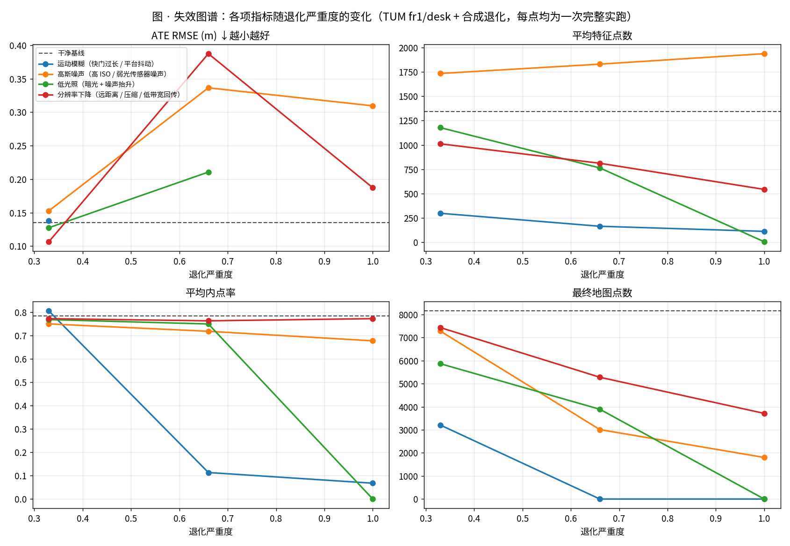
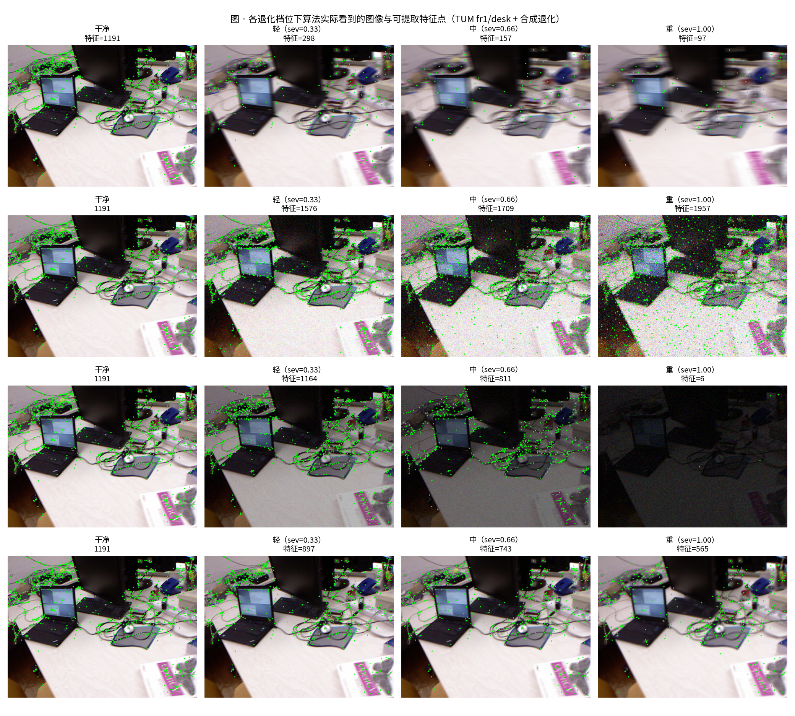
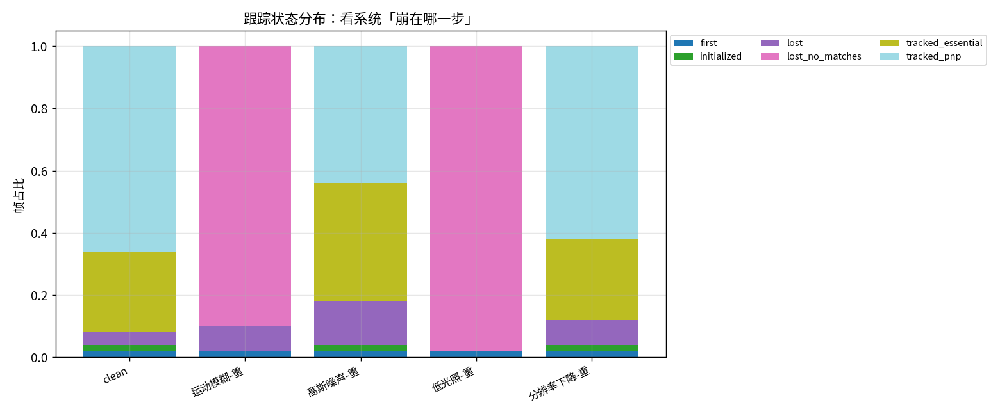

# M3 · 退化建模与失效归因

> 本文遵循本项目**四段式**写作规范：目的 → 方法原理 → 直白讲解 → 真实数据验证。

---

## 1. 目的（为什么要做这个）

M0（几何地基）和 M1（手搓 SfM/VO）解决的是"**能不能跑通**"：在干净数据上，我们拿到了
ATE ≈ 0.135 m（短序列）/ 0.506 m（长序列）的轨迹。

但本项目真正关心的是**恶劣物理环境**下的可靠性：水下（散射+浑浊）、地下/矿山（粉尘+全黑）、
烟雾、夜间低照度。所以 M3 要系统回答三个问题：

1. **什么条件**会让系统崩？（模糊？噪声？暗光？分辨率？）
2. **崩到什么程度**？—— 定量给出**临界点**（多严重开始崩）
3. **崩在哪一步**？—— 特征 → 匹配 → 位姿 → 建图，**哪一环先断**

这三个问题的答案，就是 M5（压力测试矩阵 / 失效图谱）的素材，也是判断
M4 前馈模型（VGGT）"到底比传统管线强在哪、又会在哪崩"的**参照系**。

---

## 2. 方法原理

### 2.1 受控对照实验（Controlled Experiment）

固定算法与**全部参数**，只改变**成像条件**这一个变量，观察各项指标如何退化。
这是定位失效根因的标准做法——只有单变量，才能把"崩了"归因到具体原因。

### 2.2 为什么用"合成退化"而不是真实恶劣数据集

**困难**：带**真值标签（ground truth）**的恶劣环境公开数据集极其稀缺。
实测 TUM `fr3/nostructure_notexture` 只有 rgb 图片和 `accelerometer.txt`，
**缺 `rgb.txt` 也缺真值**，根本无法定量评估。

**方案**：在**带真值的数据**上施加可控退化。

```
干净序列（有 ground truth）──施加合成退化──▶ 退化序列（仍然保留真值）
```

这样每一档都能定量算 ATE / RPE，从而画出"失效曲线"。

⚠️ **纪律**：以下所有结论均基于**合成退化**，代表趋势与下界，**不等于真实采集的恶劣环境数据**
（真实运动模糊有方向性、真实噪声有 Bayer/色彩结构）。已在每处图注标明。

退化类型与物理含义（实现见 `src/wildspatial/data/degrade.py`）：

| 类型 | 物理来源 |
|---|---|
| `motion_blur` 运动模糊 | 快门过长 / 平台高速运动 / 抖动 |
| `gaussian_noise` 高斯噪声 | 高 ISO / 弱光下的传感器噪声 |
| `low_light` 低光照 | 夜间 / 矿井 / 水下（同时伴随噪声抬升） |
| `downsample` 分辨率下降 | 远距离 / 有损压缩 / 低带宽回传 |

### 2.3 指标体系：每一环都要有探针

不要只看最终 ATE——**ATE 只在系统没崩时才存在**，崩了它就没有定义。
所以给管线的每一环都装探针：

| 指标 | 对应环节 | 含义 |
|---|---|---|
| `n_features` 特征点数 | 第 1 环 检测 | 还能不能找到特征 |
| `n_matches` 匹配数 | 第 2 环 匹配 | 还能不能配上 |
| `inlier_ratio` 内点率 | 第 3 环 几何验证 | 配上的是否几何自洽 |
| `n_map` 地图点数 | 第 4 环 建图 | 还能不能建出图 |
| `ATE / RPE` 轨迹误差 | 最终结果 | 位姿准不准 |
| `status` 跟踪状态 | 失效方式 | 初始化失败 / 丢失 / 跳变被拒 |

一键复现：

```bash
PYTHONPATH=src python scripts/m3_degradation_sweep.py --frames 150 --stride 3
```

---

## 3. 直白讲解

把上面的方法说人话：

- **为什么要"合成退化"？** 因为真实恶劣环境的数据多半没有"标准答案"（真值），
  没有答案就没法算误差。所以我们拿一段**有答案的干净视频**，人为把它弄糊、弄暗、加噪点，
  这样"弄坏之后答案还在"，就能精确测出"坏到什么程度开始崩"。

- **为什么不能只看最终误差？** 因为系统一旦崩了，连轨迹都算不出来，误差更是无从谈起
  （就像体温计量不出死人的体温）。所以要看**过程中的探针**：特征还剩多少、
  还能配上多少、配上的有多少是靠谱的。这些量在"崩之前"就已经开始报警了。

- **"崩"有两种**：
  - **硬失效**：系统直接起不来（初始化失败、一个地图点都建不出来）—— 最危险，完全不可用。
  - **软劣化**：还能跑，但轨迹越来越不准、地图越来越稀疏 —— 更隐蔽，容易被人忽略。

---

## 4. 真实数据验证（TUM RGB-D `fr1/desk`，含真值轨迹）

- 数据：**TUM RGB-D `fr1/desk`**（公开标准基准，含 ground truth 轨迹 + 深度图）
- 设置：前 150 帧、步长 3（50 个处理帧）、SIFT、`max_features=3000`
- 每一格都是**一次完整实跑**（共 13 次），不是估计值

### 4.1 量化结果

> ⚠️ 退化均为**合成施加**；`ATE` 为 Sim3 对齐后的 RMSE（米）。

| 退化类型 | 档位 | 特征点数 | 匹配数 | 内点率 | 地图点数 | ATE (m) | 初始化 |
|---|---|---:|---:|---:|---:|---:|:---:|
| **干净基线** | — | 1345 | — | — | 8151 | **0.135** | ✅ |
| 运动模糊 | 轻 | 298 | 169 | 80.6% | 3207 | 0.138 | ✅ |
| 运动模糊 | 中 | 164 | **6** | **11.4%** | **0** | **失效** | ❌ |
| 运动模糊 | 重 | 112 | **5** | **6.8%** | **0** | **失效** | ❌ |
| 高斯噪声 | 轻 | **1735** | 346 | 75.0% | 7279 | 0.153 | ✅ |
| 高斯噪声 | 中 | **1831** | 244 | 71.9% | 3009 | 0.336 | ✅ |
| 高斯噪声 | 重 | **1938** | 175 | 67.8% | 1801 | 0.309 | ✅ |
| 低光照 | 轻 | 1178 | 339 | 76.9% | 5864 | 0.127 | ✅ |
| 低光照 | 中 | 764 | 213 | 75.0% | 3890 | 0.211 | ✅ |
| 低光照 | 重 | **5** | 0 | 0.0% | **0** | **失效** | ❌ |
| 分辨率下降 | 轻 | 1012 | 390 | 77.3% | 7430 | 0.106 | ✅ |
| 分辨率下降 | 中 | 812 | 357 | 76.4% | 5277 | 0.387 | ✅ |
| 分辨率下降 | 重 | 543 | 260 | 77.3% | 3711 | 0.187 | ✅ |

### 4.2 🖼️ 失效图谱：指标随退化严重度的变化

> 黑色虚线 = 干净基线；横轴为退化严重度（0→1）。



### 4.3 🖼️ 各档位下"算法实际看到的图像"



### 4.4 🖼️ 崩在哪一步：跟踪状态分布



### 4.5 结论（全部由带真值数据支撑）

**① 失效分两类，危险程度完全不同**
- **硬失效**（初始化失败、地图点归零）：运动模糊中/重档、低光照重档。系统**完全不可用**。
- **软劣化**（能跑但变差）：高斯噪声、低光照轻/中、分辨率下降。轨迹精度下降 1.5~3 倍、
  地图点减少 55~78%，**更隐蔽也更危险**——因为"看起来还在正常工作"。

**② 最先断的是"匹配"，不是"特征"** ⭐
运动模糊从"轻"到"中"：特征还有 **164 个**（不算少），但**匹配数从 169 崩到 6**、内点率从
80.6% 崩到 11.4%。说明**运动模糊主要摧毁的是描述子的"可匹配性"**，而不是特征检测本身。
→ 对策方向：换更鲁棒的描述子 / 缩短曝光 / 加 IMU，而不是简单"多提点特征"。

**③ ⚠️ 特征数量是误导性指标** ⭐（最反直觉的一条）
高斯噪声让特征数从 1345 **涨到** 1938（**+44%**），但同期：
地图点 8151 → 1801（**−78%**）、ATE 0.135 → 0.309（**+129%**）。
原因是**噪声制造了大量不稳定的伪特征点：能检测到，但配不上、也不稳定**。
→ **绝不要用"特征点数"监控系统健康度**，它是一个会骗人的指标。

**④ 内点率是最灵敏的失效前兆** ⭐
健康状态下内点率稳定在 **75~80%**；运动模糊中档崩到 **11.4%** 时，系统已经无法初始化。
而此时 ATE 根本不存在（系统已崩）。
→ **内点率比 ATE 报警更早**，是做运行时健康监测/失效预警的首选信号（呼应 M1 的诊断量设计）。

---

## 5. 反思

1. **单看 ATE 会被误导**：分辨率下降档出现 0.106 → 0.387 → 0.187 的**非单调**波动。
   短序列（50 帧）上 ATE 噪声很大，**单个 ATE 数字不足以判断好坏**，
   必须**多指标联合 + 更长序列 + 多次运行**。
2. **"能跑"不等于"可用"**：软劣化档位 ATE 只差 2~3 倍，但地图点少了近 80%。
   对下游任务（避障、重建、语义）来说，地图稀疏可能比轨迹误差更致命。
3. **合成退化只是下界**：真实世界的退化是耦合的（水下 = 散射 + 色偏 + 低对比 + 悬浮物），
   且往往更严重。这里的结论用于**建立方法论与指标**，绝对值需真实数据校准。
4. **这套方法论本身就是资产**：退化类型 × 严重度 × 逐环探针 × 带真值定量，
   可以直接平移到 M4（VGGT 前馈模型）和 M5（压力测试矩阵），做**同类对比**——
   那时才能回答"神经网络比传统管线鲁棒在哪、又崩在哪"。

---

## 6. 下一步

- [ ] 把扫描扩展到**真实恶劣数据集**（SubT-MRS 地下/烟雾、DUO 水下），校准合成退化的结论
- [ ] 增加退化类型（雾/散射、色偏、局部遮挡、动态物体）并做**耦合退化**
- [ ] 用内点率等诊断量做**运行时失效预警**（不需要真值也能报警）
- [ ] 进入 **M5 压力测试矩阵**：把这套对照实验同时跑在传统管线与 VGGT 上，做横向对比
