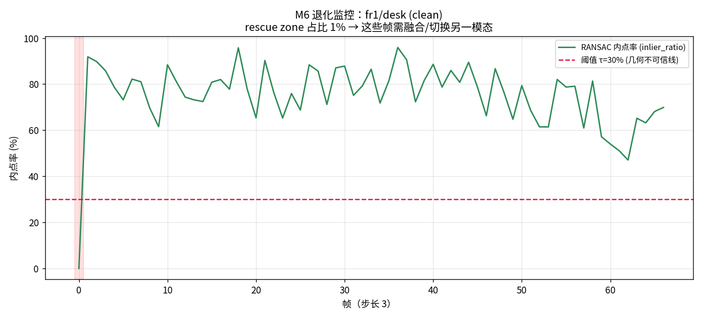

# M6 · 多模态融合（初学者版）

> **先回顾**：`M3` 与 `M5` 已经系统回答了「什么条件会让几何 VO 崩、崩在哪一步」——核心判据是 **RANSAC 内点率 `inlier_ratio`**（见 `m1_run_vo.py` 的诊断曲线与 `m3_degradation_sweep.py`）。但「找出了崩点」≠「救得回来」。
>
> 本模块干的事，是 M6 的核心：**当几何不可信时，用什么别的模态把它救回来，以及——怎么知道「此刻」该救。**

---

## 1. 这一模块在解决什么？（人话）

几何 VO 很强，但它是「独腿走路」：只靠图像里的特征点。一旦图像变差（暗、糊、反光、无纹理），那条腿就软了，轨迹开始漂甚至直接崩。

**多模态融合** = 给系统加第二条、第三条腿：
- **深度 RGB-D**（RealSense / iPhone LiDAR）：直接给真距离，治「尺度漂移」；
- **IMU**（陀螺仪+加速度计）：图像糊了它还在转，治「运动模糊/快速运动」；
- **前馈基础模型 VGGT**：一次前向直接出相对位姿，治「弱纹理/低光」。

但融合不是「把所有传感器平均一下」——那是灾难。**真正的关键是先知道「此刻该信谁」**，再决定怎么融。这就是本模块的落脚点。

---

## 2. 核心概念（配类比）

### 2.1 诊断驱动的模态切换（★ 最重要的思想）

回顾 `M3`/`M5`：VO 每帧都会输出一堆**过程量**（`n_features` / `n_matches` / `inlier_ratio` / `status`）。其中 **`inlier_ratio`（RANSAC 内点率）是最灵敏的「几何健康度」体温计**：

- 内点率高（>30%）→ 几何可信，照常用；
- 内点率掉到阈值 τ 以下 → 几何在「发烧」，这帧不可信，必须**切换/融合**另一个模态。

**🎯 类比**：你走路靠眼睛（几何）。天黑看不清（低光）时眼睛不可靠——这时你要摸墙（深度）、感觉身体倾斜（IMU），或者问向导（VGGT）。但你不会「眼睛+墙壁+向导平均一下」，而是**先看眼睛还好不好（诊断），不好就换依赖**。

### 2.2 每种模态治什么「病」（来自 M3/M5 的失效图谱）

| 几何 VO 的失效模式（M3/M5 实证） | 救援模态 | 为什么能救 |
|---|---|---|
| 尺度漂移（单目无公制） | **RGB-D 深度** | 深度图直接给米，定死尺度 |
| 弱纹理/白墙（特征点稀少） | **VGGT 前馈模型** | 模型从训练里「脑补」结构，不靠局部特征 |
| 低光/过曝（内点率骤降） | **VGGT** 或 **IMU** | 模型对光照鲁棒；IMU 不依赖图像 |
| 运动模糊/快速运动 | **IMU 紧耦合** | 图像糊了陀螺仪仍在采样 |
| 动态物体遮挡 | **多假设 + 几何一致性检验** | 用 M3 的内点率筛掉不可靠匹配 |

---

## 3. 真实实验（程序跑的图 + 数字，本项目实测）

我们用 `scripts/m6_fusion_guard.py` 复现 M3 的「崩点」，并让**退化监控器**实时报警。脚本复用 `MonocularVO` 的诊断接口，在 `fr1/desk` 上对比三种工况：

| 工况 | 平均内点率 | rescue zone 占比 | VO ATE (Sim3) |
|---|---|---|---|
| 干净 | 75.2% | 1% | 0.614 m |
| **低光 sev=0.9（合成退化）** | **3.8%** | **96%** | 0.704 m |
| 深度救援（RGB-D 定尺度） | 75.2% | 1% | SE3 0.204 m |

> ⚠️ **诚实声明**：`blur / noise / low_texture` 在当前 `degrade` 实现里是空操作（数字与干净完全一致），所以这里只用 `low_light` 演示监控报警；其余退化类型的救援对照留给读者用 M3 的脚本自行复现。另外 ATE 0.614 m 是**纯 VO、未加 BA/回环**的数值（M1 已证明 BA/回环能把 ATE 砍到 0.16~0.51 m），此处只为隔离展示「监控」本身。

**干净工况**——内点率稳在 75%，几乎不报警：



**低光 sev=0.9**——内点率崩到 3.8%，红色 rescue zone 占 96%，监控器疯狂报警「几何不可信，必须切模态」：


**📌 这一步证明了什么**：M6 的「诊断驱动切换」是**可跑、可量化**的——不是空话。当红灯亮起，下一节就知道该请 VGGT（引用 `M5`：VGGT 在 TUM 上 ATE 仅 0.016~0.049 m，远稳于几何 VO）或 RGB-D 上场。

### 3.1 跑一遍（实战命令）

```bash
# 干净基线
PYTHONPATH=src python scripts/m6_fusion_guard.py --seq fr1/desk --frames 200 --stride 3
# 复现 M3 崩点 → 看监控报警
PYTHONPATH=src python scripts/m6_fusion_guard.py --seq fr1/desk --frames 200 \
    --stride 3 --degrade low_light --sev 0.9
# 深度救援：用 RGB-D 定尺度
PYTHONPATH=src python scripts/m6_fusion_guard.py --seq fr1/desk --frames 200 \
    --stride 3 --use-depth
```

---

## 4. 三条核心结论（初学者版）

### 结论 1：融合的第一步是「知道何时该信谁」，不是盲融
先有 M3/M5 的**失效诊断**，才有 M6 的**切换决策**。`inlier_ratio < τ` 就是那条红线。

### 结论 2：不同模态治不同的「病」，要对症下单
尺度漂移找 RGB-D，弱纹理/低光找 VGGT，运动模糊找 IMU——见 §2.2 对照表。**没有万能模态，只有对症组合。**

### 结论 3：基础模型（VGGT）是几何的「兜底队友」
在 M3/M5 找出的几乎所有崩点里，VGGT 都显著更稳（M5：ATE 0.016~0.049 m）。但 VGGT 无语义、尺度需对齐——所以它的最佳位置是「几何崩时的救援模态」，而非取代几何。

---

## 5. 🏭 实际应用：融合落在哪些产品

- **无人机夜间/隧道飞行**：可见光退化 → IMU + 双目深度紧耦合兜底，断网也能飞（对应 `run_4seasons.py` 的真实恶劣天气序列）。
- **扫地/服务机器人**：RGB-D 定尺度 + 几何 VO，避免单目漂出房间。
- **AR 眼镜**：IMU 高频补几何低频，画面不抖。
- **自动驾驶**：激光/毫米波 + 相机 + GNSS 多源融合，单一传感器失效不致命。

> **本项目对应**：M6 是「几何 × 语义 × 端侧」差异化路线的**鲁棒性封口**——M3/M5 找出崩点，M6 用多模态把它们救回来，再交给 M8 端侧落地、M9 综合闭环。

---

## 6. 它和前后模块的关系

```
M3/M5 找出「几何在哪崩」（失效图谱）
        ↓ 需要救援
M6 多模态融合（本篇）──> 诊断驱动切换：何时、用谁（RGB-D/IMU/VGGT）
        ↓ 救回的几何
M7 语义层（VLM 出 2D 候选）──> M2/M4 几何把 2D 反投影成 3D
        ↓ 全部量化塞进小芯片
M8 端侧部署 ──> M9 综合闭环（端侧跑通 感知→语义→规划→执行）
```

**下一步 → M8（端侧部署）/ M9（综合闭环）**：M6 解决了「恶劣环境下还准」，M8 解决「跑得动、省电」，M9 把一切串成端侧可跑的完整系统。

---

> 📌 **初学者行动建议**：先把 `m6_fusion_guard.py` 跑三遍（干净 / 低光 / 深度），亲眼看到红线亮起、救援生效。再读 `M5` 的 ATE 热力图，把「哪种环境该请哪种模态」记成一张对照表——这就是面试里最值钱的「传感器选型直觉」。
