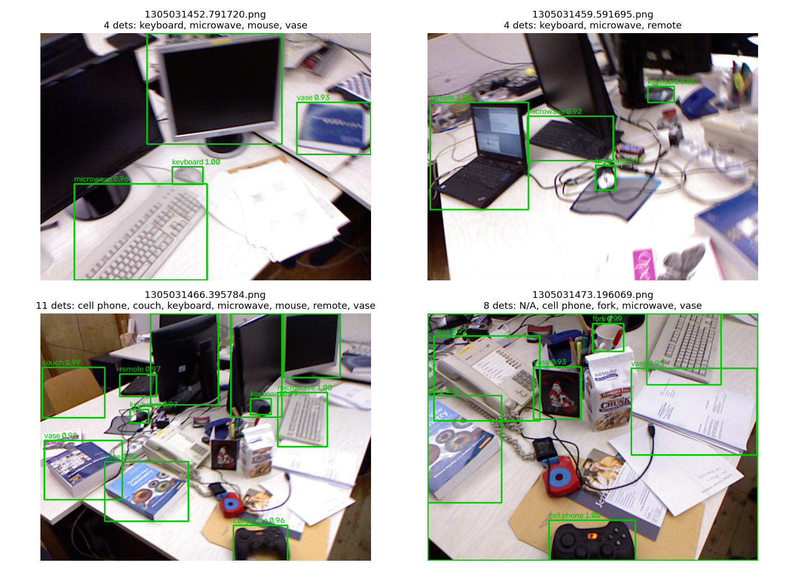

# M7 · 语义层（初学者版）

> **先回顾**：`00_PRIMER.md` §2.7 给过一个核心分工——**几何层负责「在哪」（位姿/3D 坐标），语义层负责「是什么、什么关系」（理解）**。前面 M0–M5 全是几何层。本模块第一次引入「让模型理解画面内容」，并讲清**为什么语义和几何必须分开、各司其职**。

---

## 1. 这一模块在解决什么？（人话）

几何层能告诉你「前面 2 米有个东西」，但不知道「那是个杯子、还是炸弹、易不易碎、在不在桌上」。

**语义层**干的事：把「像素」翻译成「人类能懂的语义」——这是什么物体、什么颜色、和别的东西什么关系、能不能抓。

**🎯 类比**：几何层像「盲人的手杖」，只感知空间阻挡；语义层像「眼睛 + 大脑」，认出「这是杯子、放手会掉」。机器人/无人机要真正「懂事」，缺一不可。

---

## 2. 核心概念（配类比）

### 2.1 封闭集检测 vs 开放词汇检测

| 类型 | 能认什么 | 代表 | 局限 |
|---|---|---|---|
| **封闭集** | 只认训练好的固定类别（如 COCO 80 类） | DETR（`landscape_demo.py` 用过） | 没见过的物体直接不报，只能当「未知障碍物」 |
| **开放词汇** | 用**自然语言**当查询，不受训练类别限制 | OWL-ViT、GLIP | 能按「a red object」这种文本找东西 |

**🎯 直觉**：封闭集像「只会指认照片里有没有猫/狗/车」；开放词汇像「你随便说一句话，它去图里找」——灵活得多，但也可能「找过头」。

### 2.2 VLM / 大模型在语义层真正擅长什么

回顾 `00_PRIMER.md` §2.6 的真相：**VLM 做不好几何（位姿 F1=0.64、深度轴 7.4%）**。但它擅长：
- **开放场景理解**：遇到没见过的物体，用语言描述它（软/硬、易碎、能不能抓）
- **关系推理**：A 在 B 上、A 挡住 B——传统 3D 检测几乎做不到
- **高层指令**：把「把桌上红瓶子拿进箱子」这种自然语言任务拆成步骤

### 2.3 经典理念：责任切分（为什么不让 VLM 直接干几何）

这是本模块**最重要的设计思想**（源于 TAMP-Nav / RoboAtlas 等工作）：

```
自然语言指令 ──> VLM ──> 输出「2D 语义目标框」（如「红瓶子」的像素位置）
                         │
                         ↓ 交给几何层
              深度 + 相机内参 ──> 把 2D 框反投影成「3D 坐标」
                         │
                         ↓ 交给规划器
                  执行：「去抓那个 3D 坐标的物体」
```

**🎯 关键**：VLM 只管「指哪个东西」（2D），**坐标由几何算**（3D）。这样 VLM 的幻觉最多让你「指错物体」，而不会让你「算错位置摔下去」——**把风险隔离在语义层**。

---

## 3. 本项目真实实验（图 + 数字）

**设置**：用 **OWL-ViT**（`google/owlvit-base-patch32`，开放词汇检测器），对 TUM `fr1/desk` 的 4 帧做**自然语言查询**检测。查询词特意混入了「属性/关系」表达：

> `a bottle` / `a cup` / `a keyboard` / `a book` / `a remote control` / `a red object` / `the object on the left`

**每类查询命中数（4 帧累计）**：

| 查询 | 命中数 | 说明 |
|---|---|---|
| a bottle | 0 | 桌面无瓶子，正确返回 0（**没幻觉**） |
| a cup | 2 | 合理 |
| a keyboard | 11 | 合理（键盘是大目标） |
| **a book** | **20** | ⚠️ **严重过度触发**（桌面实际没那么多书） |
| a remote control | 4 | 合理 |
| a red object | 2 | ✅ 属性查询命中（DETR 做不到） |
| the object on the left | 0 | 关系查询失败（空间推理弱） |

**总命中 39 个框**，效果可视化：


> **🖼️ 你看到的**：每张图里不同颜色的框是不同文本查询命中的结果。能看到「a red object」「a remote control」这类**属性查询**确实能找到对应物体——这是封闭集 DETR（只能报 COCO 固定词表）做不到的。

> **对照封闭集**：`landscape_demo.py` 里的 DETR 在同样数据上只报 `vase/keyboard/microwave/mouse…`（COCO 80 类），且遇到没学过的物体直接 `N/A`——两种范式的差距，如下两图并排看一目了然：




---

## 4. 两条核心结论（初学者版，双刃）

### 结论 1：✅ 增益——开放词汇真正补上了「封闭集」的洞

「a red object」「a remote control」这种**用属性/自然语言描述**的查询能命中，而 DETR 的 COCO-80 词表根本表达不了「红色的东西」。**这正是 §2.1 说的开放场景理解能力**——遇到训练集没见过的物体/属性，也能用语言去图里找。

### 结论 2：⚠️ 限制——幻觉严重，「a book」返回 20 个框

查询 `a book` 竟返回 **20 个候选框**，明显过度触发（桌面实际没那么多书）。这说明开放词汇模型会**为了「尽量命中」而虚构/误报**。

**🎯 工程含义（极重要）**：在**安全关键场景**（自动驾驶、工业机器人），VLM 的语义结果**不能直接信任**——它可能「指错物体」。本项目用「§2.3 责任切分」把风险隔离：VLM 只出 2D 候选，最终决策靠几何 + 规划器多重校验。

> 另外注意 `the object on the left` 返回 0——**空间/关系推理是 VLM 的弱点**（和 §2.6「VLM 做不好几何」一致），它不擅长「左边那个」这种需要空间定位的表达。

---

## 5. 从这次实验学到什么（takeaway + 限制）

**✅ 学到**：
- 语义层的价值是「开放理解 + 关系推理」，正好补几何层的盲区。
- 「责任切分」架构（VLM 出 2D 语义 → 几何出 3D 坐标 → 规划器执行）是落地的关键护栏。

**⚠️ 限制（关键）**：
1. **幻觉不可避免**：开放词汇模型会过度触发/虚构，安全场景需隔离风险。
2. **空间推理弱**：「左边/上面」这类关系它常搞错（几何才是它的强项）。
3. **本实验只用检测**：完整的「语义闭环」（指令→理解→执行→验证）还需规划器与 M6 融合配合，是 M9 综合闭环的目标。
4. **纯文本 LLM 部分未做**：任务分解、故障解释等文本侧能力，因本机 `transformers 4.48` 不支持 Qwen3（需 ≥4.51），暂未实证——逻辑上仍属本模块范围。

---

## 6. 🏭 实际应用：语义层落到哪些产品

M7 的「开放词汇 + 责任切分」不是概念，已在真实系统里跑：

- **家用 / 服务机器人**：「把桌上红瓶子拿进箱子」——开放词汇让机器人听懂自然语言指令，几何负责把 2D 框反投影成可抓的 3D 坐标（TAMP-Nav 范式）。
- **仓储 / 零售拣选**：用「蓝色那个箱子」「最左边的货」这类口语找货，不受训练类别限制。
- **视障辅助 / 摄像头导航**：描述「前方三步有台阶、左边有门」。
- **自动驾驶场景理解**：把「施工区 / 临时路障」用语言描述给规划器，补传统检测的固定词表盲区。

> **本项目对应**：M7 的 OWL-ViT 实验同时证明了**增益**（属性查询命中）与**风险**（"a book" 返回 20 框的幻觉）。所以落地必须靠 §2.3 的**责任切分护栏**——VLM 只出 2D 候选，3D 坐标交给几何算，把幻觉风险隔离在语义层。安全关键场景绝不能直接信 VLM。

## 7. 它和前后模块的关系

```
M5/M4 证明「几何层很强但只给坐标」
        ↓ 缺「理解」
M7 语义层（本篇）──> 用 VLM 补「是什么/关系」，但严格责任切分
        ↑ 依赖
M0–M2 几何层（提供 3D 坐标，把 VLM 的 2D 框反投影成 3D）
        ↓ 真实恶劣环境几何会崩
M6 多模态融合（补几何可靠性）──> 让语义层有更稳的 3D 坐标可用
        ↓ 落地
M8 端侧部署（把 VLM+几何都量化塞进无人机/车载芯片）
```

**下一步 → M6 或 M8**：M7 已经证明「语义要建立在可靠几何上」——那真实恶劣环境下几何崩了怎么办？M6 用多模态融合补；模型怎么跑在端侧？M8 用量化部署。这两条正是你「几何 × 语义 × 端侧」差异化路线的收口。
