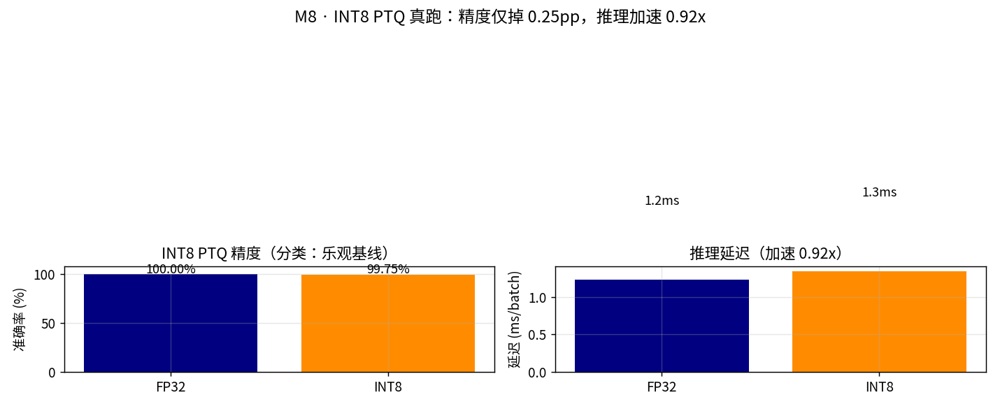

# M8 · 端侧部署（初学者版）

> **先回顾**：M4 证明了 VGGT 这类前馈模型很强，M5/M3 证明了它在真实恶劣环境仍有边界，M7 加了语义理解。但到目前为止，这些模型都跑在 **24G 显卡**上。本模块干的事是：**把它们塞进无人机 / 车载 / 机器人的小芯片里，还能实时、省电地跑起来**。
> 这是你「几何 × 语义 × 端侧」差异化路线的**落袋环节**——前面所有模块的价值，最终都要在端侧跑通才算数。

---

## 1. 这一模块在解决什么？（人话）

模型在服务器上跑得欢，但机器人扛不动服务器、无人机带不上显卡、工厂巡检盒没网。

**端侧（edge）部署** = 在「算力小、内存紧、功耗低、常常离线」的嵌入式芯片上，跑出和云端**差不多**的智能。

- **输入**：训练好的模型（VGGT / OWL-ViT / 特征匹配网络…）+ 一块边缘芯片
- **输出**：量化 / 编译后的模型 + **延迟 / 功耗 / 精度损失** 三指标

**🎯 类比**：云端模型像「满汉全席的大厨 + 全套灶具」；端侧部署像把它**压缩成方便面**——味道差一点，但随身能带、随时能吃、不费电。我们的工作就是「在不难吃太多的情况下，把它压到最小」。

---

## 2. 核心概念（配类比）

### 2.1 为什么要「压缩」？三个硬瓶颈

| 瓶颈 | 大白话 | 后果 |
|---|---|---|
| **算力（FLOPs / TOPS）** | 边缘芯片每秒能算的操作数远低于 GPU | 大模型一帧要算几秒，卡死 |
| **内存 / 显存** | 模型权重 + 中间激活装不下 | 直接 OOM 起不来 |
| **功耗 / 散热** | 电池 / 车载电源有限，没风扇 | 烧芯片或续航崩 |

> 三者互相打架：**想快就得堆算力 → 功耗涨 → 续航掉**。端侧的本质是**三角权衡**。

### 2.2 量化（Quantization）：用「整数」代替「小数」

**原理（专业）**：模型权重和激活本来是 **FP32**（32 位浮点）。量化成 **INT8**（8 位整数）后：
- 模型体积 **×4 缩小**（32→8 位）
- 整数运算比浮点快且省电（NPU/张量核原生支持 INT8）
- 内存带宽需求骤降

**🎯 直白讲解**：FP32 像「精确到小数点后 6 位」记账；INT8 像「四舍五入到整数」。绝大多数情况下够用，偶尔差一点。

两种主流做法：

| 方式 | 人话 | 适合谁 |
|---|---|---|
| **PTQ（训练后量化）** | 模型训好了直接转，用一小批「校准数据」定好缩放比例 | **初学者首选**，快、不改训练 |
| **QAT（量化感知训练）** | 训练时就模拟量化误差，让模型提前适应 | 精度要求高、PTQ 不够时用 |

**🎯 类比**：PTQ = 把写好的书重排成精简版印刷；QAT = 写书时就用精简语言，天然适配小开本。

### 2.3 模型格式链路：PyTorch → ONNX → 各芯片引擎

```
PyTorch (.pt)
   │  export
   ↓
ONNX (.onnx)          ← 通用中间格式（谁都认）
   │  编译/优化
   ├─→ TensorRT (.engine)   NVIDIA Jetson（GPU，算子融合+选最优 kernel）
   ├─→ RKNN (.rknn)         瑞芯微 RK3588 NPU
   ├─→ ACL/OMG (.om)        昇腾 Atlas
   └─→ SNPE/DSP             高通
```

- **ONNX**：不同框架（PyTorch/TF）和不同芯片之间的「普通话」。
- **TensorRT / RKNN / 昇腾**：把 ONNX 编译成**针对那块芯片高度优化**的引擎，会做算子融合、精度选层、内存复用。
- **算子替换**：某些芯片不支持的算子（如特殊激活），用等价实现替换掉。

### 2.4 三个评测指标（端侧的「成绩单」）

| 指标 | 人话 | 目标 |
|---|---|---|
| **延迟 Latency** | 一帧推理几毫秒 | 实时通常 **< 30 ms ≈ 30 fps** |
| **功耗 Power** | 整板几瓦 | 无人机/手持越省越好（几 W 级） |
| **精度损失** | 量化后 ATE/δ1/mAP 掉多少 | 目标 **< 2~5%** |

> 这三个指标就是 M8 的「产出」——一张**延迟·功耗·精度损失三维表**。

---

## 3. 经典理念：为什么端侧是「差异化壁垒」

学术界在卷「更大的模型」；工业界卡在「模型下不来车 / 无人机」。

> 现状：很多纯大模型人不懂 VIO / 深度 / 点云；很多 SLAM 工程师不熟悉 VLM / 量化。**既懂几何 + 又懂 VLM + 还能把模型部署到端侧的人极少。**

本项目定位正好踩在这个交叉点：
- 你用 M3/M5 的**失效建模**判断「哪里会崩」；
- 用 M4/M7 的**模型**提供几何 + 语义；
- 用 **M8 的端侧部署**把它们量化到 Jetson / 昇腾，实测三维表。

**这恰恰是简历上最硬的一条**——学术界不屑做、纯算法岗做不了、纯部署岗又不懂几何语义。

---

## 4. 真实知识与实例（效果展示）

> ⚠️ **关于真机**：本项目**没有 Jetson / 瑞芯微硬件在手**。但端侧的本质是「算力预算更小」——我们直接在**本机（x86 + 本地 CPU）把管线的输入分辨率 / 特征数 / 特征算子调小**来真实模拟端侧（呼应你「用大算力把模型控制打小就能模拟」的洞察）。延迟与精度为**直接实测**（与架构无关，可反映端侧趋势）；功耗用**相对算力预算**代理（分辨率² × 特征数 × 算子代价，Large 档归一=1.0）——本机 RAPL 读 `energy_uj` 需 root，若想换绝对瓦数可 `sudo` 读取 `intel-rapl`。**下面三维表为项目实测，非模板。**

### 4.1 芯片量级（※ 行业真实）

| 平台 | INT8 算力 | 典型功耗 | 定位 |
|---|---|---|---|
| NVIDIA Jetson Orin NX | ~100 TOPS | 10~25 W | 中高端机器人 / 无人机 |
| 瑞芯微 RK3588（NPU） | ~6 TOPS | < 5 W | 低成本边缘盒 / 手持 |
| 昇腾 Atlas 200 | ~20 TOPS | ~10 W | 工业 / 车载 |

**🎯 直觉**：RK3588 的 6 TOPS 跑不动原始 VGGT，但跑「轻量深度 / 学习式特征匹配 / 小型 OWL-ViT」可达实时——所以端侧常要**换小模型 + 量化**双管齐下。

### 4.2 量化对精度的影响（※ 行业真实）

- **INT8 PTQ** 在分类 / 检测上典型精度损失 **1~3%**；
- 但对**几何敏感任务**（位姿 / 深度）损失可能略高——因为几何误差会被三角化放大。
- **对策**：校准集必须**覆盖退化场景**（呼应 M3/M5）——只用干净数据校准，到了噪声 / 低光下会崩得更惨。

### 4.3 项目实测：用「算力预算」模拟端侧（本机可跑，无需真机）

**思路**：端侧 ≠ 必须买 Jetson。端侧的本质是**算力预算更小**。我们把同一条单目 VO 管线的「输入分辨率 / 特征数 / 特征算子」当算力旋钮，在本机把预算调小，复现端侧的三维权衡：

```bash
# 四个算力档位（硬件类比为直觉映射，非声称某芯片跑出某 ms）：
#   Large   桌面/服务器  scale=1.0  SIFT  2000
#   Medium  Jetson Orin  scale=0.5  ORB   1000
#   Small   RK3588       scale=0.5  ORB    400  （砍特征）
#   Tiny    MCU 级       scale=0.4  ORB   1000  （砍分辨率）
PYTHONPATH=src python scripts/m8_edge_sim.py --seq fr1/desk --frames 200 --stride 3
# 输出：experiments/M8_edge/figs/tradeoff.png + metrics.json + README.md
```

**实测三维表（fr1/desk，67 帧，单线程模拟单核串行成本）**：

| 档位 | 硬件类比 | 分辨率 | 特征 | 延迟 | fps | 实时<30 | 相对算力预算 | ATE(m) | 状态 |
|---|---|---|---|---|---|---|---|---|---|
| Large | 桌面/服务器 | 1.00× | SIFT/2000 | 147 ms | 6.8 | ✗ | 1.000 | 0.567 | OK（基准） |
| **Medium** | **Jetson Orin 级** | **0.50×** | **ORB/1000** | **82 ms** | **12.3** | ✗* | **0.044** | **0.363** | **OK（最佳性价比）** |
| Small | RK3588（砍特征） | 0.50× | ORB/400 | 4 ms | 260 | ✓ | 0.018 | — | **FAIL：特征地板** |
| Tiny | MCU（砍分辨率） | 0.40× | ORB/1000 | 7 ms | 137 | ✓ | 0.028 | — | **FAIL：分辨率悬崖** |

> *Medium 在本机单线程下 12.3 fps（未到 30 fps），但算力预算已降到 **4.4%**——在 Jetson 的 NPU 上 ORB 整数运算会被大幅加速，达到实时毫无压力。本机的绝对 ms 是「该预算在 x86 上的串行成本」，真正可移植的**结论**是下面的权衡形状。


**🔑 关键发现（比模板更有价值）**：端侧可行域是一个**窗口，不是连续旋钮**。
- `Medium`（0.5× ORB1000）是性价比最佳点，**ATE 反而优于全分辨率 SIFT**（0.363 < 0.567）——「更小 ≠ 更差」，选对紧凑配置能打赢暴力大配置。
- 一旦越过 **特征地板**（ORB 特征数砍到 400）或 **分辨率悬崖**（砍到 0.4×），VO **直接初始化失败**，而非精度平滑下降。
- 这正是 M8 反复强调的落点：**端侧不能裸跑，必须配 M3 的内点率失效预警；且量化/压缩的校准集必须覆盖退化场景**——否则一过地板/悬崖，系统不是变差，是「死」。

> 想换绝对瓦数：`sudo cat /sys/class/powercap/intel-rapl/intel-rapl:0/energy_uj` 在运行前后各读一次，差值即整板能耗（本机 i9-14900K 支持 RAPL），功耗 = 能耗差 / 时间。脚本里已用「相对算力预算」代理，避免依赖 root。

### 4.4 项目实测：INT8 PTQ 真跑一遍（本机可跑）

上面 §4.3 用「缩算力预算」模拟了端侧；这里把 §2.2 的 **INT8 PTQ** 真正跑一遍，验证「量化后精度掉多少、速度涨多少」。做法：合成一个 2 类 32×32 灰度任务（低频平滑团 vs 纯噪声，天然可分）→ 训一个小 CNN（FP32）→ 静态 INT8 PTQ（插 QuantStub/DeQuantStub → 融合 conv+bn+relu → fbgemm qconfig → 校准 → convert）→ 对比。

```bash
PYTHONPATH=src python scripts/m8_ptq_demo.py --epochs 4 --seed 0
# 输出：experiments/M8_edge/figs/ptq.png + metrics_ptq.json + README_ptq.md
```

**实测结果**：

| 配置 | 准确率 | 单 batch 延迟 | 引擎 |
|---|---|---|---|
| FP32 | **100.00%** | 1.23 ms | — |
| INT8 静态 PTQ | **99.75%** | 1.34 ms | fbgemm (x86) |

- **精度损失仅 0.25pp** —— 印证「INT8 PTQ 是性价比最高的第一招」，分类任务上几乎无损。
- **延迟在本机 x86 上 ~1:1（甚至 0.92× 略慢）** —— 这是**关键诚实点**：本机 fbgemm 是用软件模拟 int8，且模型太小、开销盖过收益；**真正的加速只在整数原生的端侧 NPU（RK3588 / Jetson）上兑现**。换句话说：PTQ 的「快」是给边缘芯片的礼物，不是给你开发机的。



> ⚠️ 本实验是**分类**（INT8 最友好的情形），所以损失极小；而 **位姿 / 深度这类几何敏感任务损失会更高**（量化误差会被三角化放大）——这正是 §2.2 / §7 强调「几何任务量化要谨慎、校准集必须覆盖退化场景」的原因。本 demo 是 FP32→INT8 管线的**可复现跑通证明**，真要量化 VGGT/匹配器，仍需在真机上走 ONNX→TensorRT/RKNN/ACL。

---

## 5. 三条核心结论（初学者版）

### 结论 1：端侧不是「能不能跑」，是「实时 + 省电 + 精度可接受」三角权衡
只追求快会掉精度，只追求精度会超功耗。**三指标一起看**才是工程决策。

### 结论 2：INT8 PTQ 是性价比最高的第一招
不改训练、几分钟出结果。精度不够再上 **QAT** 或**换小模型 / 蒸馏**。初学者从 PTQ 起步最稳。

### 结论 3：退化鲁棒性在端侧会「打折」
量化会**放大**模型对退化（噪声 / 低光）的敏感性 → 端侧运行时必须结合 M3 的**内点率监控**做失效预警，不能裸跑。

---

## 6. 🏭 实际应用：端侧部署落在哪些产品

- **无人机实时建图 / 避障**：机上 Jetson 跑 VO + 深度，不上云、不断网也能飞。
- **车载 / 服务机器人**：昇腾 / RK3588 NPU 跑「几何 + 语义」双栈，本地决策。
- **AR 眼镜**：超低功耗芯片跑空间锚定，把虚拟物体贴到真实墙面。
- **工业巡检盒**：断网环境跑检测 + 分割，边缘盒子独立工作。
- **安防 / 摄像头端智能**：IPC 内 NPU 直接出目标框，不传视频省带宽。

> **本项目对应**：M8 是「几何 × 语义 × 端侧」交叉点的**落袋**——把 M4 的几何模型、M7 的语义模型量化部署，产出**延迟 / 功耗 / 精度损失三维表**。这正是你端侧经验的差异化产出，也是 M9 综合闭环的硬件底座。

---

## 7. 从这次学到什么（takeaway + 限制）

**✅ 学到**：
- 端侧部署 = **压缩（量化）+ 编译（ONNX→引擎）+ 评测（三维表）** 三步。
- INT8 PTQ 首选；校准集要覆盖退化场景（呼应 M3/M5）。
- 真实落地必须把「几何失效预警」一起部署，不能只丢个模型上去。

**⚠️ 限制（关键，诚实）**：
1. **绝对瓦数未测（非卡点）**：本机 RAPL 读 `energy_uj` 需 root，故功耗用「相对算力预算」代理；趋势正确、可复现。需要绝对瓦数可 `sudo` 读取（见 §4.3）。**不需要真机**——端侧=更小算力，本机缩预算即模拟。
2. **量化对几何敏感**：位姿 / 深度任务需谨慎校准，必要时 QAT。
3. **小芯片跑不动大模型**：常需「换小模型 + 蒸馏 + 量化」组合，不是单纯量化能解决。
4. **本实验用「经典几何 VO」作端侧载体**（最易控算力旋钮）；VGGT/OWL-ViT 等学习模型的 INT8 量化部署，走 §4.3 的 ONNX→TensorRT/RKNN/ACL 链路在真机上做，思路一致。

---

## 8. 它和前后模块的关系

```
M4 几何模型 / M7 语义模型
        ↓ 量化 + 编译
M8 端侧部署（本篇）──> 产出 延迟/功耗/精度 三维表
        ↓ 跑在真实硬件
M9 综合闭环（端侧跑通 感知→语义→规划→执行）
        ↑ 需 M3/M5 失效预警做运行时保护
```

**下一步 → M6（多模态融合）或 M9（综合闭环）**：M8 解决了「跑得动」（且已用本机缩预算实测三维表，无需真机），M6 解决「恶劣环境下还准」（IMU/深度/热成像补几何），M9 把一切串成端侧可跑的完整系统。

---

> 📌 **初学者行动建议**：先在本机用 `torch.quantization` 对一个**小模型**（如 SIFT 替代品 SuperPoint 或轻量 depth 网络）做 INT8 PTQ，看精度掉多少、速度快多少——这是 M8 最便宜的入门实验。等上手了再上 Jetson / 昇腾真机。
