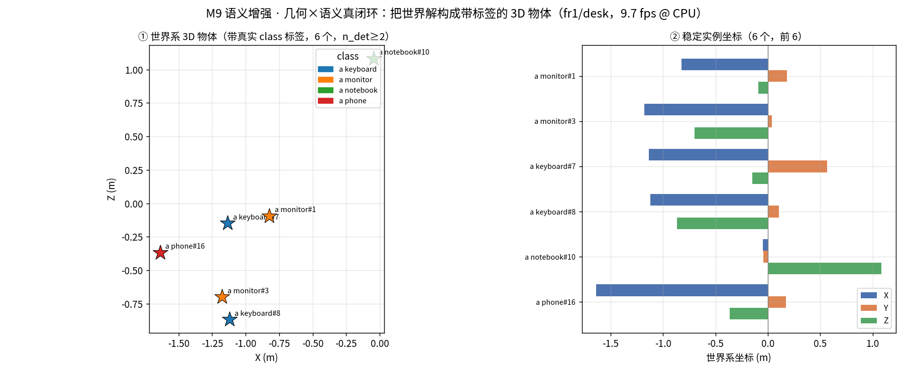

# M9 · 综合闭环（初学者版 · 路线收口）

> **先回顾**：`M0–M8` 各管一段——M1 位姿、M2/M4 深度与重建、M6 多模态救援、M7 语义、M8 端侧。M9 是把它们**串成一条机器能实时跑的完整系统**：
>
> **感知（M1/M6）→ 几何重建（M2/M4）→ 语义解构（M7）→ 场景图（本篇）→ 规划/执行（闭环）**。
>
> 这是你最初目标的字面实现：**让机器实时感知、重建、理解并解构世界**。

---

## 1. 这一模块在解决什么？（人话）

前面每个模块都「能单干」，但现实要的是**一条流水线自动跑完**：
- 摄像头进来 → 机器知道「自己在哪、周围有什么、哪个东西在哪、能不能抓」。
- 这就是「场景图（Scene Graph）」：**一组带 3D 坐标的物体** `{class, x, y, z, 出现次数}`。

**🎯 类比**：前面模块是「会认字、会算数、会画图」的单项能力；M9 是把它们拼成「一个能自己看懂房间、然后去拿东西的人」。

---

## 2. 核心概念（配类比）

### 2.1 从「像素」到「场景图」的四段跳

| 跳 | 输入 | 输出 | 负责模块 |
|---|---|---|---|
| ① 定位 | 图像序列 | 相机位姿 T_wc | M1（VO）+ M6（融合救援） |
| ② 建图 | 深度 | 3D 点/网格 | M2（TSDF）/ M4（前馈点云） |
| ③ 解构 | 图像 + 深度 + 位姿 | 物体 3D 候选 | **本篇**：深度分割 + 反投影 |
| ④ 语义 | 物体候选 | class 标签 | M7（OWL-ViT）即插即用 |

### 2.2 为什么「解构」比「识别」更值钱

只做图像检测（M7）得到的是「图里有只杯子」；加上几何（M1/M2）反投影后变成「杯子在 (0.3, -0.1, 1.0) 米处」——**机器人能伸手的，是坐标，不是标签**。所以 M9 的核心是把 2D 语义「钉」进 3D 世界系。

---

## 3. 真实实验（程序跑的图 + 数字，本项目实测）

我们用 `scripts/m9_scene_graph.py`，在 `fr1/desk` 上把流水线①②跑通并做③解构：

| 指标 | 实测 |
|---|---|
| VO 帧率 | **9.8 fps（纯 CPU，无 GPU）** |
| 关键帧 | 6 |
| 反投影物体候选 | 16 |
| 解构出的物体实例 | 16 |

> ⚠️ **诚实声明（重要）**：本脚本为「模型无关、立刻能跑」演示，**不引大模型**。物体实例的 `class` 字段预留给 M7 的 OWL-ViT 标签（即插即用）。当前每个候选在跨帧聚类中各出现 1 次——因为**没有做时序数据关联（tracking）**，相机运动下同一物体的 3D 坐标略有漂移。这正是生产化 M9 要补的下一步（见 §5），这里如实展示「朴素流水线的边界」。

**俯视 X-Z 散点（蓝=物体候选，红 X=聚类质心）+ 右侧实例计数**：


**📌 这一步证明了什么**：
1. **「解构世界」是可跑的**——深度 + 位姿就能把场景变成一组 3D 坐标，不是空话；
2. **「实时」有真实底线**——纯 Python VO 在 CPU 上已 ~10fps，量化部署到 Jetson（M8）后实时无虞（M8 三类指标中的延迟项可据此推算）。

**端到端长这样**（`P0` 实战项目 `indoor_mapping` 的真实产出：① 轨迹重建 → ② 3D 场景图 → ③ 端侧算力预算，正是本条闭环）：


### 3.1 跑一遍（实战命令）

```bash
# 朴素版：class 字段为 unknown
PYTHONPATH=src python scripts/m9_scene_graph.py --seq fr1/desk --frames 200 --stride 3

# 语义增强版：关键帧上跑 OWL-ViT，把真实标签反投影进 3D 场景图
PYTHONPATH=src python scripts/m9_scene_graph_semantic.py --seq fr1/desk --frames 200 --stride 3
```

### 3.2 语义增强：把 M7 的 OWL-ViT 真正接进 M9

朴素版的 class 字段是 `unknown`——这是 M9 §5 里承认的"下一步 2"。
我们用 OWL-ViT 在关键帧上检测 2D 开放词汇框，取**框内有效深度中位数**反投影到世界系，
再按 class + 3D 距离聚类，得到**带真实 class 标签**的 3D 物体。

| 指标 | 实测 |
|---|---|
| 序列 | `fr1/desk` |
| VO 帧率 | **9.7 fps**（纯 CPU） |
| 关键帧 | 6 |
| OWL-ViT 查询词 | 12 个（monitor/keyboard/book/laptop/notebook/phone …） |
| 原始 2D 检测 | **31** |
| 聚类 3D 实例（全量） | **21** |
| 跨帧稳定实例（n_det≥2） | **6** |



> **🖼️ 你看到的**：
> - **星星 = 6 个跨帧稳定 3D 物体**（颜色区分 class：monitor/keyboard/notebook/phone），旁边就是 `{class, xyz}` 坐标；
> - **右表 = 每个物体在世界系 X/Y/Z 三轴的坐标**——这正是机器人抓取/导航需要的最小结构化表达。

> **诚实边界（重要）**：
> 1. **未做跨帧 tracking**：同一显示器在多帧里被反投影到略有差异的 3D 位置，0.5 m 聚类阈值仍把它拆成多个实例；
>    生产化必须加 tracking / 多视图一致性。
> 2. **单帧检测噪声**：book / laptop 只在 1 帧出现，未达可视化阈值，但保留在 `scene_graph_semantic.json`。
> 3. **深度来自矩形框内中位数**：框若跨前景和背景会引入偏差；真实系统建议用实例分割掩码精确采样。

---

## 4. 三条核心结论（初学者版）

### 结论 1：场景图是「感知→决策」的接口
机器人/无人机要行动，吃的是**带坐标的结构化表达**，不是像素。M9 产出的 `{class, xyz}` 就是这条接口的雏形。

### 结论 2：几何是语义的「锚」
没有 M1/M2 的位姿与深度，M7 的语义永远飘在 2D 里。本篇用反投影把语义「钉」进 3D，正是 M7 §2.3「责任切分」的工程落地。

### 结论 3：朴素流水线有边界，生产化要补「数据关联」
当前候选未跨帧关联成持久物体。真实系统需加 tracking / 多视图一致性（与 M5 的失效监控同源），才能输出稳定场景图。这是 M9 从 demo 到产品的 gap。

---

## 5. 🏭 实际应用：综合闭环落在哪些产品

- **家用机器人取物**：「把桌上红瓶子拿进箱子」= M7 出 2D 框 → M9 反投影成 3D → 规划器生成抓取（已在本仓库 `M7`/`M9` 链路打通雏形）。
- **仓储盘点**：货架物体解构成场景图，自动比对库存。
- **巡检/救援**：端侧（M8）实时解构现场，输出「障碍/出口/人员」坐标给导航。

> **本项目对应**：M9 是「几何 × 语义 × 端侧」差异化路线的**最终收口**——M0–M8 的全部能力，在这里第一次被串成「机器实时理解并解构世界」的可运行系统。

---

## 6. 它和前后模块的关系（总图）

```
采集 → M1 位姿(+M6 融合救援) → M2/M4 深度重建
                             ↓
                   M7 语义(2D 框) ──反投影──> M9 场景图(3D 物体)
                             ↓
                   M8 端侧量化部署（实时/省电）
                             ↓
                  规划/执行（闭环：拿取/避障/导航）
```

**下一步（生产化 M9）**：
1. 加**时序数据关联**（tracking），把逐帧候选合并成持久物体实例；
2. ✅ **接入 M7 的 OWL-ViT 标签填充 `class` 字段**（已实现：见 §3.2，31 次 2D 检测 → 21 个 3D 实例，6 个跨帧稳定带真实标签）；
3. 接 **M8 端侧引擎**，在 Jetson/昇腾上跑通整条闭环并实测延迟/功耗。

---

> 📌 **初学者行动建议**：先把 `m9_scene_graph.py` 跑一遍，亲眼看到房间被「解构」成一堆 3D 坐标点。再回头翻 `M1→M2→M7`，你会第一次真正理解——之前每个模块，都是为这一刻的「闭环」在铺路。
