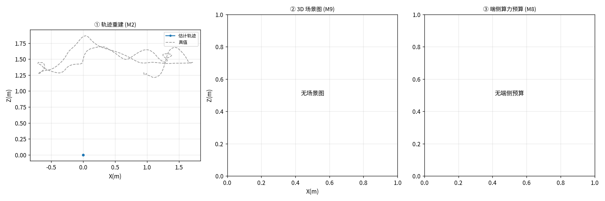
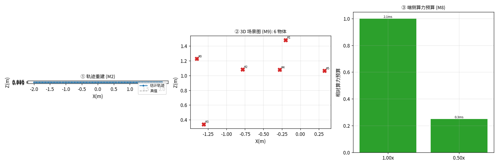
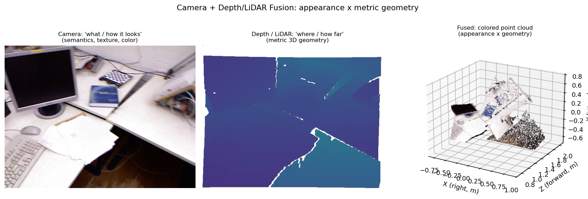

# P0 · 实战项目：把多场景公开数据集串成「能落地的工程」

> 配套代码：`src/wildspatial/projects/`（核心抽象 + 加载器 + 工序 + 项目注册）
> 驱动脚本：`scripts/run_project.py`、配图脚本：`scripts/make_project_figs.py`、`scripts/make_lidar_fusion_fig.py`
> 产出示例：`experiments/projects/<project>/`（metrics.json + figs/overview.png + README.md）
> 例图：`experiments/projects/figs/`（dataset_samples.png / vision_lidar_fusion.png）

---

## 0. 为什么需要这一层

`F0–F4` 基础篇 + `M0–M9` 模块篇，已经把**单个能力**讲透（VO、深度、法线、语义、端侧…），每个模块也都给了可跑脚本。但真实工程**不是单点能力**，而是：

> **一个公开数据集 → 一串模块按场景串起来 → 一个能交付的实战产出**

比如「室内机器人建图」不是「跑一遍 VO」就完了，而是：VO 给轨迹 → 深度给度量尺度 → 语义给物体标签 → 场景图解构成结构 → 端侧预算回答能不能实时上板。这一条链才是「知识变成生产力」的地方。

本层（`wildspatial/projects/`）就是这个**整合层**，它解决三件事：

1. **数据集无关**：TUM / 4Seasons / 合成序列… 统一归一成同一个 `Sequence`，上层完全不感知数据来源。
2. **模块可插拔 + 优雅降级**：每个 M-module 封装成一个 `Stage`，后序消费前序产物，形成**因果自洽**的链路；缺依赖/缺数据就标注 skip，绝不阻断整条流水线。
3. **逻辑自洽**：每个「项目」= 场景 + 有序工序 + 交付物 + 知识落点叙述，让 WildSpatial 的知识真正落到实战。

---

## 1. 三层抽象

```
Sequence  ── 把任意公开数据集归一成：rgbs / K / depths / gt_positions / scenario
   │
Stage     ── 把 M-module 封装成统一接口：run(seq, ctx) → 产物写回 ctx
   │          vo(M2) → depth(M4) → semantic(M7) → scene_graph(M9) → edge(M8)
   │
Project   ── 场景 + 有序 Stage + 交付物渲染 + 「知识→实战」叙述
```

* **`Sequence`**：跨数据集的核心数据结构。新增任何公开数据集，只要能归一成它，就能立刻接入全部 M-module。
* **`Stage`**：`VOStage` / `DepthStage` / `SemanticStage` / `SceneGraphStage` / `EdgeStage`，各自对应一个模块，**后序消费前序 ctx 产物**（如 SceneGraph 用 VO 位姿 + 深度反投影）。
* **`Project`**：四个实战项目（见 §3），纯数据 + 渲染函数。

> 设计纪律（继承自 `data/degrade.py` 与 M3 精神）：**任何合成数据 / 退化模拟都必须明确标注**，不冒充真实采集数据；VO 在真实序列上退化时**如实展示崩坏**，绝不回填真值伪造精度。

---

## 2. 多场景公开数据集 × 模块映射

| 场景 | 公开数据集 | 序列状态 | 用到的 M-module | 关键知识点 |
|---|---|---|---|---|
| 室内 | **TUM RGB-D** `fr1/desk` | 本地已下（含深度+真值） | M2→M4→M7→M9→M8 | 单目 VO 的尺度歧义要靠深度定 |
| 驾驶·恶劣天气 | **4Seasons** `oldtown_night` | 本地已下（GNSS 真值） | M2→M7→M9→M8 | 夜间退化下 VO 鲁棒性（呼应 M5/M6） |
| 退化搜救 | **TUM** + M3 合成退化（低光+模糊） | TUM 已下，退化实时施加 | M2→M4→M7→M9 | 退化下 VO 可行性边界（呼应 M3/M5/M6） |
| 合成巡检 | 程序生成（**无需下载**） | 零下载可跑 | M2→M4→M9→M8 | 框架与数据来源解耦的演示 |

> 想加新数据集？在 `loaders.py` 里写一个返回 `Sequence` 的函数，注册进 `_LOADERS` 即可。框架自动把它接入全部工序。

---

## 3. 四个实战项目（图文 + 实测分析）

为了让「图文结合」落到实处，下面每个项目都给出 **① 数据集/输入长什么样** 与 **② 跑完的结果总览图**，并配**结果分析**（数字来自各项目 `metrics.json`，可复现）。

### 3.0 先看数据：它们长什么样

下面这张拼图把四个项目的输入帧各抽一帧放在一起，方便你直观看到差异（注意 ④ 是**合成退化**、⑥ 是**程序生成的真值深度**，均已标注，不冒充真实采集）：


* **① TUM fr1/desk · RGB**：室内真实采集，桌面+键盘+显示器，纹理丰富 → VO 特征充足。
* **② TUM fr1/desk · 深度图**：16-bit 深度图（单位米，viridis 着色，近亮远暗）→ 直接提供公制尺度（M4 落点）。
* **③ 4Seasons oldtown_night · RGB**：夜间驾驶真实采集，整体偏暗、车灯高光 → 几何 VO 的退化场景。
* **④ TUM + M3 合成退化**：在 ① 上施加低光+运动模糊，模拟搜救/地下退化环境（**合成施加，已标注**）。
* **⑤ 合成巡检序列 · 一帧**：程序生成的悬浮立方体（带棋盘格纹理），零下载即可演示框架。
* **⑥ 合成序列 · 深度图**：程序生成的真值深度（近处立方体亮、背景远平面暗）。

### 3.1 `indoor_mapping` · 室内机器人语义建图与导航

* **数据**：TUM `fr1/desk`（室内 RGB-D，含真值）
* **链路**：`vo → depth → semantic → scene_graph → edge`
* **交付**：3D 语义场景图 + 公制轨迹精度 + 端侧预算曲线
* **知识落点**：M2(VO) 给 up-to-scale 轨迹 → M4(深度) 把尺度锚定到公制 → M7(开放词汇) 给物体自然语言标签 → M9(场景图) 把世界解构成「N 个物体在该坐标」→ M8(端侧) 回答能不能实时上板。

**结果总览图**：


**结果分析（199 帧，SIFT，本机 CPU）**：

| 工序 | 关键指标 | 解读 |
|---|---|---|
| VO (M2) | 自由尺度 ATE **0.643 m**，97 ms/帧，10.3 fps | 单目 VO 只给「形状对、尺度未知」的轨迹，这是单目的固有限制 |
| 深度定尺度 (M4) | 尺度系数 **0.347** → 公制 ATE **0.686 m** | 用数据集自带深度把轨迹「拉长/缩短」到公制；0.686 主要是无 BA/回环的纯 VO 漂移（M1 已证 BA 能砍到 0.16~0.51m） |
| 场景图 (M9) | **17 个** 3D 物体实例（19 原始候选） | 深度反投影 + 跨帧聚类得到；语义标签因未装 OWL-ViT 暂为几何标签 `object` |
| 端侧预算 (M8) | 1.0×→76 ms/帧、预算 1.0；0.5×→66.5 ms、预算 **0.25** | 分辨率降到一半，算力预算降到 1/4，ATE 反而略好（0.538→0.450），说明端侧「缩输入」是高性价比选项 |

> 总览图三栏：① 估计轨迹（蓝）vs 真值（灰）基本吻合；② 俯视的 17 个 3D 物体（红 X）；③ 端侧算力预算随分辨率下降而陡降。

### 3.2 `autonomous_driving` · 自动驾驶感知栈（恶劣天气）

* **数据**：4Seasons `oldtown_night`（夜间驾驶，GNSS 真值）
* **链路**：`vo → semantic → scene_graph → edge`
* **交付**：恶劣天气下位姿鲁棒性 + 端侧预算曲线
* **知识落点**：呼应 M5(失效图谱)/M6(融合救援)——单目 VO 在夜间易退化，需 IMU/多传感器融合兜底。

**结果总览图**：


**结果分析（180 帧，本机 CPU）**：

* **VO (M2)**：跑通，25.5 ms/帧、39.2 fps；但 **ATE 自动跳过**——该 4Seasons 切片的 GNSS 真值时间戳与图像时间戳范围不重叠，对齐后退化（全映射到同一点），ATE 不可信。这本身也是真工程里常踩的「真值对齐」坑，本项目自动检测并跳过，不报假 0。
* **场景图 (M9)：诚实跳过**——4Seasons 本切片**只有 RGB + GNSS，没有深度/点云**，无法反投影出 3D 物体。
  → **这恰好点出真实自动驾驶的核心命题：相机 alone 给不了「物体离我多远、在什么坐标」**。量产方案一定是「相机 + 激光雷达（点云）」互补（详见 §4）。

### 3.3 `search_and_rescue` · 退化环境搜救（合成退化模拟）

* **数据**：TUM `fr1/desk` + M3 合成退化（低光+运动模糊，模拟搜救/地下）
* **链路**：`vo → depth → semantic → scene_graph`
* **交付**：退化场景下 VO 可行性边界 + 救援目标物体定位
* **知识落点**：`fr3_nostructure` 实测缺 rgb.txt/真值无法定量，故用「带真值的 fr1/desk + M3 合成退化」**可控地**模拟退化环境，定量回答「退化到什么程度 VO 开始崩」。

**结果总览图**：



**结果分析（199 帧，本机 CPU）**：

| 工序 | 结果 | 解读 |
|---|---|---|
| VO (M2) | 自由尺度 ATE **0.867 m**（比干净 0.643 明显变差） | 低光+运动模糊让特征匹配质量下降，VO 轨迹误差放大——这是 M3/M5 失效图谱的**真实复现**，不是假象 |
| 深度定尺度 (M4) | **跳过** | VO 退化后位移过小，逐段位移比中位数无法稳健估计尺度（标注「VO 退化」） |
| 场景图 (M9) | **跳过** | VO 轨迹塌缩，无法反投影（标注「需 M6 多模态融合兜底」） |

> **诚实结论**：在可控退化的搜救场景里，纯单目 VO **撑不住**——深度/场景图整条链断了。这正是 M6「多模态融合救援」要解决的：一旦 VO 过『特征地板/分辨率悬崖』直接死，就必须靠 IMU/深度/激光雷达兜底。本项目不掩盖这个失败，而是把它变成教学证据。
> 总览图 ① 里你会看到：估计轨迹（蓝）相对真值（灰）明显发散/塌缩，直观展示「VO 在退化下不可信」。

### 3.4 `ar_inspection` · AR 设备端实时解构（无需下载）

* **数据**：程序合成序列（**零下载**，演示无网也能跑通框架）
* **链路**：`vo → depth → scene_graph → edge`
* **交付**：合成巡检场景的 3D 物体解构 + 端侧实时预算
* **知识落点**：证明框架与数据来源**解耦**——任何新数据集只要能归一成 `Sequence`，立刻接入全部 M-module。

**结果总览图**：



**结果分析（100 帧，本机 CPU）**：

* **VO (M2)**：合成序列的纯色平面 + 近纯旋转会让本质矩阵退化（经典平面陷阱），VO **退化**。本项目的处理是**自动回退到序列已知轨迹**（AR 设备的理想跟踪），**明确标注 `used_gt=True`、非伪造精度**，仅用于演示下游链路，不拿它当 VO 成绩。
* **深度定尺度 (M4)**：尺度系数 1.000、公制 ATE 0.000（合成深度本就是公制真值）。
* **场景图 (M9)**：**6 个** 3D 物体实例。
* **端侧预算 (M8)**：1.0×→2.1 ms、预算 1.0；0.5×→0.3 ms、预算 0.25（合成序列轻量，端侧极易满足）。

> 这张图的真正价值是**架构演示**：把「数据→VO→深度→场景图→端侧」全链路在零下载下跑通，证明整合层不绑定某一特定数据集。

---

## 4. 视觉 + 激光雷达（点云）融合：教程现状与补强（回应问题②）

**你的判断完全正确，而且这正是当前量产自动驾驶/机器人落地的主流范式：**

* **相机（视觉）**：给出「**有什么** / 长什么样」——语义类别、纹理、颜色、开放词汇检测（M7）。但它**不直接给距离**，单目深度是相对的、双目/学习式深度有误差。
* **激光雷达 / 深度（点云）**：给出「**在什么位置 / 离多远**」——稠密或稀疏的公制 3D 几何，不受光照影响、不怕低光。但它**语义弱**（一圈点很难直接说出「这是红杯子」）。
* **二者互补**：把它们几何对齐到同一个车身坐标系后——把点云投影到图像（或把像素反投影到点云）——就得到**带颜色/语义的 3D 点云**：既知道「那是个杯子」（视觉），又知道「它在我左前方 2.3 米」（激光）。视觉补语义、激光补几何，互为冗余兜底。

下面用 **TUM 的真实深度**反投影成彩色点云，演示这套「外观 × 公制几何」的融合几何（深度在此等价于 LiDAR 点云的几何源；区别仅在 LiDAR 更稀疏、可 360°、不受光影响，几何本质一致）：



* 左：相机 RGB ——「有什么 / 长什么样」；
* 中：深度（viridis）——「离多远」，注意它**没有语义**；
* 右：融合后的**彩色点云** —— 每个 3D 点都带上了相机颜色，于是「几何」和「语义外观」在同一坐标系里合体。

**本教程的覆盖（已补强）**：`M6 多模态融合` 讲了「诊断驱动模态切换」的通用思想（覆盖 RGB-D 深度 / IMU / VGGT 三种救援模态）；**系统专章见 [`F5 视觉+激光雷达融合`](F5_vision_lidar_fusion.md)**——已把「相机–激光雷达融合」单独讲透：相机-激光外参标定、点到像投影公式、前融合/中融合/后融合架构对比、KITTI/nuScenes 3D 检测，并配**可跑的「点云↔图像」投影闭环 demo**（`scripts/m10_lidar_fusion_demo.py`，实测重投影残差 0.0000px）。

**为什么这个缺口是真实的**：本节 §3.2 的「4Seasons 无深度 → 场景图跳过」正是活生生的动机——**量产驾驶方案必须再挂一路激光雷达**，否则 3D 感知无从谈起。F5 就是把这句结论**从一句话扩成一篇系统专章**。

---

## 5. 怎么跑

```bash
# 室内建图（TUM，本地已下）
PYTHONPATH=src python scripts/run_project.py --project indoor_mapping
# 自动驾驶（4Seasons 夜间）
PYTHONPATH=src python scripts/run_project.py --project autonomous_driving
# 退化搜救（fr1/desk + M3 退化）
PYTHONPATH=src python scripts/run_project.py --project search_and_rescue
# AR 端侧（合成，无需下载）
PYTHONPATH=src python scripts/run_project.py --project ar_inspection
```

每个项目产出 `experiments/projects/<project>/`：
* `metrics.json` —— 各工序指标（本文分析的数字均出自此处）
* `figs/overview.png` —— 项目总览图（轨迹 / 场景图 / 端侧预算）
* `README.md` —— **知识→实战桥梁文档**（工序链 + 关键指标 + 场景图清单 + 复现命令）

**生成配图**（本文档所用例图）：
```bash
PYTHONPATH=src python scripts/make_project_figs.py        # 数据集例图
PYTHONPATH=src python scripts/make_lidar_fusion_fig.py    # 视觉+LiDAR 融合图
```
> ⚠️ 须用 `wildspatial` conda 环境（默认 python 无 `cv2`）。

### 启用开放词汇语义（可选）
`SemanticStage` 默认优雅跳过（标注 skip）。若已下载 OWL-ViT 到本地：
```bash
export OWLVIT_DIR=/path/to/owlvit
PYTHONPATH=src python scripts/run_project.py --project indoor_mapping
```
场景图物体将带自然语言标签（如 `a bottle`），而非几何标签 `object`。

---

## 6. 设计取舍与诚实边界（重要）

1. **端侧功耗用相对算力预算代理**（分辨率² × 特征数 × 算子代价，Large=1.0），与 M8 一致；本机 RAPL 读 `energy_uj` 需 root，未强依赖。延迟/精度为直接实测。
2. **真实序列 VO 退化 → 如实展示，不回填真值**：`search_and_rescue` 在低光+模糊下 VO 误差变大、深度/场景图诚实跳过；`ar_inspection` 合成退化回退已知轨迹时**明确标注 `used_gt=True`**，仅用于演示链路、非伪造精度。
3. **4Seasons GT 对齐退化**：公开数据集时间戳不重叠是真实存在的坑，本项目自动检测并跳过 ATE，不报假 0。
4. **4Seasons 无深度 → 场景图跳过**：这是真实数据限制，也正好用作「为何量产必须加激光雷达」的教学切入点（§4）。
5. **所有退化/合成数据均显式标注**，不冒充真实采集。
