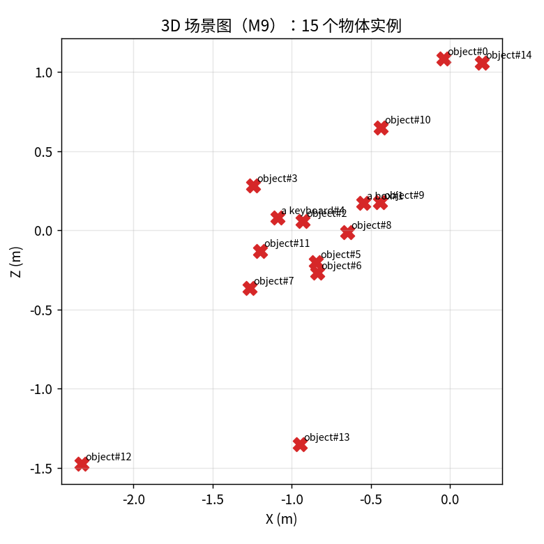

# P1 · 从场景感知到自动控制：四个实战项目的工程叙事

> **本文定位**：把 `F0–F5` + `M0–M9` 的知识链拧成「能讲给面试官 / 客户 / 同行听」的完整工程项目。
> 不只谈算法，更谈：场景是什么、目的、数据从哪来、用什么设备、算法怎么分层、感知结果如何变成轮子/螺旋桨/舵的控制指令、以及初学者最容易漏掉的工程约束。
>
> 阅读对象：想要用真实项目打动面试官或客户的初学者 → 中级工程师。

---

## 0. 为什么写这份文档

`P0` 已经把「感知 → 场景图」的抽象管线跑通了，但它更像**内部技术 demo**：
给面试官看，他们会问「传感器是什么？」「控制指令怎么出？」「真实园区里动态行人怎么办？」
给客户看，他们会问「扫地扫得完吗？」「会不会撞到人？」「晚上能不能跑？」

本文把这些问题**系统补全**：
- 用 **4 个真实落地场景**（园区扫地 / 酒店送物 / 自动驾驶 / 无人船）讲清「输入 → 处理 → 输出 → 控制」全链路；
- 对 **园区 / 室内服务机器人** 做深做可跑版，用 TUM + SUN RGB-D + KITTI 已下数据把「感知 → 栅格地图 → A* 路径 → 差速轮 v/ω」真正跑通；
- 每种场景都给出「讲给三种人听」的叙事模板。

---

## 1. 四场景工程叙事概览

下面每张表都按同一套框架展开：**场景 / 目的 / 数据 / 设备 / 算法 / 感知→控制 / 约束 / 初学者常漏**。

### 1.1 园区扫地机器人

| 维度 | 内容 |
|---|---|
| **场景** | 办公园区 / 商场 / 厂区室外道路，路面平整，有行人、车辆、花坛、垃圾桶。 |
| **目的** | 1) 不漏扫（全覆盖路径）；2) 不撞人/车（实时避障）；3) 电量低自动回充。 |
| **数据** | 公开基准：TUM RGB-D（室内算法验证）、KITTI depth_completion（室外 LiDAR+RGB 融合展示）。真实部署需采集：园区 RTK 轨迹、LiDAR 点云、清扫任务日志。 |
| **采集方式** | 先用 RTK/GNSS 全站仪扫出园区高精地图；部署时板载相机+LiDAR 实时增量更新；清扫任务记录“哪些格子已扫、未扫”。 |
| **设备传感器** | RGB-D 双目 / 3D LiDAR / 轮速编码器 / IMU / GNSS（园区室外必需，室内可换 UWB/二维码）。 |
| **算法设计** | 1) 感知：LiDAR 地面分割 + 视觉语义（人/车/花坛/垃圾）；2) 定位：LiDAR-IMU 紧耦合 SLAM / GNSS+RTK；3) 建图：2.5D 占据栅格 + 已扫/未扫图层；4) 规划：全覆盖路径（牛耕法/Boustrophedon）+ A* 动态绕障；5) 控制：差速底盘 v/ω。 |
| **感知 → 控制** | 栅格地图 → 覆盖路径 → 速度指令；检测到行人/车 → 切换“停车等待”或“绕行”状态机。 |
| **场景约束** | 白天/夜间、雨天落叶打滑、行人穿行、狭窄通道、回充 docking 精度要求 ±5cm。 |
| **初学者常漏** | ① 覆盖路径不等于最短路径；② 边刷会把垃圾打到未扫区，需要重复覆盖策略；③ 电量/水量的任务调度；④ GNSS 多路径误差；⑤ 安全性要求：急停按钮、电子围栏、碰撞传感器的硬件冗余。 |

### 1.2 酒店送物机器人

| 维度 | 内容 |
|---|---|
| **场景** | 酒店走廊、电梯口、客房门前，动态行人多、光照变化大、玻璃/反光墙面。 |
| **目的** | 从大堂自动导航到指定客房送餐/送物，能叫电梯、敲门、返回。 |
| **数据** | TUM fr1/desk（离线建图/VO 验证）、SUN RGB-D（室内深度+语义，如 chair/floor/bed）。真实部署需酒店 CAD 图 + 采集走廊 RGB-D + 轮式里程计。 |
| **采集方式** | 预先扫图（SLAM 建图 + 人工标注客房号/电梯位置）；运行时在线定位 + 避障。 |
| **设备传感器** | RGB-D（深度受限 3–5m）+ 2D LiDAR（远距离测距）+ 轮速计 + IMU + 超声波（玻璃近距补盲）+ 对讲模块（叫电梯/电话通知）。 |
| **算法设计** | 1) 感知：2D LiDAR 主导建图 + RGB-D 做近距离语义（门/墙/行人腿）；2) 定位：2D LiDAR SLAM（Cartographer/ gmapping）+ 重定位；3) 规划：拓扑图（楼层→电梯→走廊→房间）+ A*；4) 控制：差速轮 + 电梯/门禁 IoT 对接。 |
| **感知 → 控制** | 语义识别「电梯门/客房门」→ 触发对接子程序（等电梯→进电梯→按楼层→出电梯）；检测到行人近距离 → 降速/停车。 |
| **场景约束** | 地毯/光滑地砖导致轮子打滑；玻璃/镜子导致 LiDAR 虚障碍；狭窄走廊不能原地打转（最小转弯半径）；电梯内无 GPS、需 IMU+轮速计航位推算。 |
| **初学者常漏** | ① 多楼层拓扑与电梯状态机；② 门牌号 OCR/语音播报；③ 乘客优先、机器人让行的社会行为；④ 被盗/被卡住后的远程干预；⑤ 与酒店 PMS/IoT 系统对接。 |

### 1.3 传统自动驾驶

| 维度 | 内容 |
|---|---|
| **场景** | 城市道路 / 高速公路 / 夜间 / 雨天 / 隧道。 |
| **目的** | 感知周围车辆/行人/车道线/交通标志，输出转向/油门/刹车指令。 |
| **数据** | KITTI depth_completion（已下，LiDAR+RGB，真实传感器验证）、4Seasons（夜间，GNSS 真值）、nuScenes/Waymo（3D 检测/轨迹预测经典，需下载）。 |
| **采集方式** | 采集车：多相机环视 + 车顶 64 线 LiDAR + 毫米波 + GNSS/IMU 组合导航 + 车辆 CAN 总线。 |
| **设备传感器** | 多相机（前视/环视）+ 3D LiDAR + 毫米波雷达（Radar）+ GNSS/RTK/IMU + 轮速计。 |
| **算法设计** | 1) 感知：BEV 特征融合（相机+BEVFusion/LiDAR）+ 3D 检测/跟踪/预测；2) 定位：RTK+IMU+高精地图/视觉车道线；3) 规划：行为决策 + 轨迹规划（Frenet/EM Planner）；4) 控制：横向 PID/MPC + 纵向油门/刹车。 |
| **感知 → 控制** | 3D 障碍物位置+速度 → 预测未来轨迹 → 规划自车安全轨迹 → 控制方向盘转角/加速度。 |
| **场景约束** | 功能安全 ISO 26262（ASIL-D）、传感器脏污/遮挡、恶劣天气、 cut-in、鬼探头、交通法规、乘客舒适度。 |
| **初学者常漏** | ① 预测比检测更重要；② 多传感器时空同步（时间戳对齐到 ms 级）；③ 传感器脏污检测与降级策略；④ 高精地图与实时感知的匹配/重定位；⑤ 功能安全与冗余（单点失效不能失控）；⑥ 法规与伦理（责任归属、数据隐私）。 |

### 1.4 无人船自动驾驶

| 维度 | 内容 |
|---|---|
| **场景** | 湖泊 / 河道 / 近海，水面有波纹、漂浮物、桥梁、岸边礁石、其他船只。 |
| **目的** | 水质监测 / 垃圾打捞 / 安防巡逻，自动沿航道行驶并避障。 |
| **数据** | 公开：MODD（Maritime Obstacle Detection Dataset）、USVInland、MaSTr1325。本项目暂未下载（受网络），架构可迁移。 |
| **采集方式** | USV（无人船）搭载相机+LiDAR/毫米波+IMU+GNSS+测深仪；预先测绘航道边界与障碍物；运行时在线采集水面图像/点云。 |
| **设备传感器** | 单目/双目相机（检测浮标、船只、岸线）+ 毫米波雷达（穿透雨雾测距）+ GPS/IMU（姿态、航向）+ 测深仪（水下地形）+ 风速仪。 |
| **算法设计** | 1) 感知：水面分割（把天空/陆地/水区分割）+ 障碍物检测（船只/浮标/漂浮物）；2) 定位：GPS+IMU 航位推算（无高精地图）；3) 规划：航路点跟踪 + 动态避障（COLREGs 海事规则约束）；4) 控制：艏向角 + 推进器差速 / 舵角 + 推力。 |
| **感知 → 控制** | 水面可航区域 → 航路点 → 艏向角/推力指令；检测到前方船只 → 按海事规则向右避让。 |
| **场景约束** | 波浪导致相机抖动/俯仰；GPS 在桥下/峡谷失效；漂浮物运动不可预测；电池续航；通信距离（4G/电台/卫星）。 |
| **初学者常漏** | ① 水面不是地面，船体有 sway/yaw/roll，坐标系复杂；② 必须遵守 COLREGs（国际海上避碰规则）；③ 测深仪防搁浅；④ 岸线与天空倒影易误检；⑤ 船只没有刹车，只能减速/转向，制动距离长。 |

---

## 2. 旗舰深做：园区 / 室内服务机器人

为什么选这个做深？因为**它链路最完整、传感器最简单、离线可跑**，能把「感知→规划→控制」每一个环节都用真实数据跑通。

### 2.1 一句话讲清项目

> 用一台**RGB-D 相机 + 差速轮底盘**的室内服务机器人模型，演示「看到世界 → 建出地图 → 规划路径 → 驱动轮子」的完整闭环；
> 真实数据来自 **TUM RGB-D fr1/desk**（离线已下），用 KITTI LiDAR 做视觉+LiDAR 融合的迁移展示。

### 2.2 场景与目的

- **场景**：办公室、酒店走廊、园区室内道路。机器人在桌椅、柜子、行人之间穿行。
- **目的**：从起点自动走到目标点，**不撞障碍、路径最短、控制指令平滑**。
- **成功指标**：公制轨迹误差、栅格地图质量、A* 路径长度、控制指令 v/ω 平滑度。

### 2.3 数据是什么、怎么采集

| 数据 | 来源 | 用途 | 采集方式 |
|---|---|---|---|
| RGB 图像 + 深度图 | TUM RGB-D `fr1/desk` | 感知：VO 定位 + 占据栅格建图 + 场景图 | 公开基准，已下载 |
| 真实位姿 | TUM `groundtruth.txt` | 训练/评测 VO 轨迹精度 | 动作捕捉系统采集 |
| 语义真值 | SUN RGB-D（室内 3D 框/类别） | 语义可行走区域 / 3D 物体检测基准 | 公开基准，已下载 |
| 真实 LiDAR | KITTI depth_completion | 视觉+LiDAR 融合展示（迁移到室外） | 公开基准，已下载 |

⚠️ **诚实声明**：TUM fr1/desk 是「手持桌面」基准序列，不是真机器人数据；
本脚本用它**演示算法链路**（真实机器人把输入换成板载 RGB-D + 轮速计即可）。

### 2.4 终端设备与传感器

- **主传感器**：RGB-D 相机（如 Intel RealSense D435i）—— 640×480@30fps，输出同步 RGB+深度。
- **辅助传感器**：轮速编码器（里程计，给短距离尺度）+ IMU（给旋转+运动连续性）+ 超声波（近距补盲）。
- **计算终端**：NVIDIA Jetson Orin / RK3588 / x86 工控机（呼应 M8 端侧算力预算）。
- **执行器**：两轮差速底盘（左轮、右轮独立转速）。

### 2.5 算法设计（感知 → 规划 → 控制）

```
RGB-D 帧流
   │
   ▼
[VO 定位] ──► up-to-scale 轨迹
   │
   ▼
[深度定尺度] ──► 公制位姿（M1/M2/M4）
   │
   ▼
[占据栅格地图] ──► 2D 可行走/障碍地图（0=未知，1=自由，2=障碍）
   │
   ▼
[A* 路径规划] ──► 安全无碰路径
   │
   ▼
[差速轮控制] ──► (v, ω) 指令序列
```

- **感知层（M1/M4/M7/M9）**：单目 VO 出轨迹，RGB-D 深度给公制尺度；
  OWL-ViT 开放词汇检测给语义标签（chair/person/box），反投影成 3D 场景图。
- **规划层（A*）**：把深度点云投影到 X-Z 平面，0.1m 分辨率栅格；
  A* 从当前位置搜索到目标点，障碍不可走。
- **控制层（差速运动学 + 底盘约束）**：路径切线 → 线速度 v + 角速度 ω；
  加入**线加速度限幅 `a_max=0.5 m/s²`** 与**角速度限幅 `ω_max=1.2 rad/s`**，
  让指令**物理可执行**（真实底盘不能瞬间变速，否则纸上谈兵的 v/ω 真机根本跟不上）。
- **动态避障（速度障碍法 Velocity Obstacle, VO）**：模拟一个**时序对齐、横穿机器人路径**的行人；
  预测机器人未来轨迹是否进入碰撞锥（最近距离 < 机器半径+行人半径），
  若命中则触发**避让减速**——这是移动机器人动态避障的经典轻量方案（VO/RVO 家族）。

### 2.6 感知结果怎么变成控制指令

这是最关键、初学者最容易模糊的一步。

1. **感知输出**：公制位姿 T_wc + 3D 物体坐标 + 栅格地图。
2. **地图表示**：把 3D 世界压成 2D 栅格 → 机器人只知道「某格能不能走」。
3. **路径规划**：A* 给出从当前格到目标格的离散路径点。
4. **轨迹跟踪**：把栅格路径点转成世界坐标序列。
5. **运动学反解**：
   - 线速度 `v`：沿路径前进速度（常数或按曲率降速）；
   - 角速度 `ω`：相邻路径点切线方向变化率 `dθ/dt`。
6. **底盘执行**：左轮速度 = `v - ω·b/2`，右轮速度 = `v + ω·b/2`（`b` 为轮距）。

### 2.7 场景约束与失效兜底

- **动态障碍**：A\* 在静态栅格上做全局路径；**叠加速度障碍法（VO）做局部动态避让**（已实现，见 §2.8 图）。
  真实系统还要加**行人轨迹预测**（当前用"已知匀速直线"模拟，避免引入未验证的跟踪模型）与**侧向绕行**（当前只做减速）。
- **低光/无纹理**：VO 可能退化 → 启动 IMU/轮速计航位推算（M6 多模态融合）。
- **端侧算力**：栅格分辨率 0.1m、稀疏采样每 4 像素，呼应 M8「0.5× ORB/1000 最佳性价比」。
- **安全冗余**：超声波急停、碰撞条、最大速度限幅、电子围栏。

### 2.8 真实数据验证

运行命令：
```bash
OWLVIT_DIR=/tmp/owlvit PYTHONPATH=src python scripts/p1_service_robot.py \
    --seq fr1/desk --max-frames 150 --stride 3
```

实测结果（TUM fr1/desk，150 帧）：

| 指标 | 数值 | 含义 |
|---|---|---|
| VO 自由尺度 ATE | **0.728 m** | 单目 VO 无尺度误差 |
| 深度定尺度后 ATE | **0.764 m** | 公制精度（尺度系数 0.373） |
| 场景图物体实例 | **15 个** | 带 3 类 OWL-ViT 语义标签 |
| 占据栅格 | **43 × 38** @ 0.1 m | 293 障碍格、自由/未知区分 |
| A* 规划路径 | **39 步** | 从起点到地图远端目标点 |
| 控制指令 | **38 条** | v_max = 0.30 m/s（含 a_max=0.5 m/s²、ω_max=1.2 rad/s 限幅） |
| 动态避障 | **5 步避让减速** | 速度障碍法（VO）响应横穿行人 |


> 深色 = 障碍（桌椅/柜子），浅色 = 可行走区域，绿色 = A* 规划路径，红星 = 3D 场景图物体，蓝方块 = 起点，橙叉 = 目标点。


> 左：红虚线 = 时序对齐横穿机器人路径的行人，绿线 = A\* 全局路径；
> 右：橙色竖线 = 触发避让减速的控制步（线速度 v 从 0.3 降到约 0.1 m/s）。这就是"感知（检测到人）→ 决策（会撞）→ 控制（减速）"的完整闭环。


> 线速度 v 基本稳定在 0.3 m/s，转弯处降速；角速度 ω 在路径拐弯处出现峰值，对应差速转向。



### 2.9 三视角讲解：给同行 / 面试官 / 客户

#### 给同行 / 面试官
> "这是一个端到端室内服务机器人闭环 demo。核心不是算法精度多高，而是**链路完整且逻辑自洽**：
> 单目 VO 给 up-to-scale 轨迹，RGB-D 深度提供公制尺度，OWL-ViT 给开放词汇语义，
> 深度反投影生成 2.5D 占据栅格，A* 规划无碰路径，最后按差速运动学输出 v/ω。
> 诚实地说，TUM 是手持桌面序列，用来验证接口；真实部署换成板载 RGB-D + 轮速计即可。
> 如果要上真实机器人，下一步是：动态障碍预测、MPC 轨迹跟踪、RTK/二维码重定位。"

#### 给客户
> "机器人会先‘看见’周围障碍，再‘画’出一张‘哪不能走’的地图，然后自己规划一条安全路线，
> 最后告诉左右轮分别转多快。整个过程可以在 Jetson/RK3588 上实时跑，
> 光线变差或纹理不够时，系统会自动切换到 IMU/轮速计兜底，不会乱撞。"

#### 给初学者（你自己整理思路）
> "机器人像闭着眼睛走路的人：
> - 眼睛 = 相机/深度/LiDAR（感知）
> - 脑子里的地图 = 占据栅格（规划的前提）
> - 选路 = A*（找到安全最近路）
> - 迈腿动作 = 左轮/右轮差速（控制）
> 感知给地图、地图给路径、路径给动作——这就是闭环。"

### 2.10 初学者常漏的 10 个环节

1. **多传感器时间同步**：相机、IMU、轮速计时钟不同步，位置会漂移。需要硬件 PPS 或软件时间对齐。
2. **坐标系约定**：相机系 / 机体系 / 世界系 / ENU-NED 混用，是 80% 几何 bug 的根因。
3. **标定**：内参（K）、外参（相机到机体）、手眼标定、LiDAR-相机联合标定，标定差 1° 都会放大。
4. **单目尺度歧义**：纯单目 VO 没有公制尺度，必须靠深度/IMU/轮速计/Stereo 定尺度。
5. **闭环检测与重定位**：长走廊相似纹理会丢定位，必须做回环检测或二维码/视觉重定位。
6. **动态障碍**：A* 只做静态地图；真实场景行人、推车会动，需要动态预测 + 速度障碍法（Velocity Obstacle）。
7. **失效兜底（M6）**：低光/玻璃/纯旋转导致 VO 失效时，不能硬撑，要切到保守模式（降速/停车/呼救）。
8. **端侧算力约束（M8）**：0.5× 分辨率 + ORB/1000 是经验甜点；砍过头会触发「特征地板」直接死。
9. **数据闭环**：采集 → 标注 → 训练 → 评测 → OTA 更新，不是一次交付。
10. **sim2real 鸿沟**：仿真里跑 100 分的算法，真机上可能因轮胎打滑、地面反光、标定偏差而崩。

### 2.11 如何迁移到自动驾驶 / 无人船

| 场景 | 主要改动 |
|---|---|
| **自动驾驶** | 把 RGB-D 换成 多相机 + 3D LiDAR；占据栅格升维到 BEV 占用网络；A* 换成 Frenet/EM 轨迹规划；控制换成方向盘+油门/刹车；加预测 + 高精地图。 |
| **无人船** | 传感器加 GPS/IMU/测深仪/风速仪；地面分割改为「水面可航区域分割」；A* 改成航路点跟踪 + COLREGs 避碰规则；控制换成艏向/推力。 |
| **酒店送物** | 增加多楼层拓扑与电梯状态机；加门牌号 OCR/语音播报；走廊窄，注意最小转弯半径。 |
| **园区扫地** | 栅格地图加「已扫/未扫」图层；规划从 A* 改成全覆盖牛耕法；加回充 docking。 |

---

## 2.12 四场景的**真实数据**（2026-09-14 补充）

前面 §1 讲的四场景，此前多依赖 TUM/KITTI 等"通用"数据。为让每个场景都有**真实素材**，
我们从 ModelScope 补齐了四场景专批（清单见 `scripts/fetch_datasets.py` **Tier F**）：

| 场景 | 数据集 | 内容 | 状态 |
|---|---|---|---|
| 园区扫地 | `DatatangBeijing/...RobotCleaner...` | 扫地机器人第一视角（垃圾/障碍样本：bed/shoe/trash can/垃圾） | ✅ 已落地 |
| 动态行人 | `OmniData/CVC-14` | 昼夜**红外**行人（园区夜巡真实输入） | ✅ 已落地 |
| 动态行人 | `OpenDataLab/MOT17` | 真实街道**多帧行人序列** | 🔄 部分落地 |
| 无人船 | `isLinXu/rf100-vl-floating-waste` | 水面**漂浮垃圾**（打捞，含 COCO 真值框） | ✅ 已落地 |
| 无人船 | `Flier123/Ship` | **红外船只**（避碰，昼夜×雨雾多云，3521 张） | ✅ 已落地 |
| 酒店送物 | `RoboCOIN/leju_robot_hotel_services_*` | LeRobot 具身操作轨迹 | ⏳ 待下 |

样例图（只展示已下载内容）：

```bash
PYTHONPATH=src python scripts/p1_datasets_showcase.py
```


*(① 扫地机器人第一视角的真实地面与障碍；② CVC-14 昼夜红外行人（按亮度排序）；③ MOT17 多帧行人序列；④⑤ 无人船漂浮物/船只下完自动补。)*

> **下一步**：把 MOT17 的**真实行人轨迹**接入 P1 的 `dynamic_obstacles`，替换当前"匀速直线模拟"。

---

## 3. 复现命令

```bash
# 1) 无语义版（纯几何链路，最快）
PYTHONPATH=src python scripts/p1_service_robot.py \
    --seq fr1/desk --max-frames 150 --stride 3

# 2) 完整版（带 OWL-ViT 语义标签）
OWLVIT_DIR=/tmp/owlvit PYTHONPATH=src python scripts/p1_service_robot.py \
    --seq fr1/desk --max-frames 150 --stride 3
```

产出目录：`experiments/P1_service_robot/`

---

## 4. 诚实边界与下一步

- TUM fr1/desk 是**室内干净桌面序列**，不是真机器人数据；
  用它跑通算法链路，真实部署需替换为板载 RGB-D + 轮速计。
- 全局路径 A\* 在**静态栅格**上运行；动态避让用 **VO 局部减速**，行人轨迹为**已知匀速直线**（非真实跟踪预测）。
- 控制指令是**运动学仿真 + 执行器限幅**，未接入真实底盘；真机需要加 PID/平滑滤波与轮速闭环。
- 下一步：加 **MPC 轨迹跟踪**、**真实行人跟踪/预测（SORT/ByteTrack）**、**侧向绕行（RVO）**、**真实机器人/ros2 桥接**。
