# P2 · 闭环仿真平台：从"离线算法"到"边走边建图→识别→决策→控制"

> **为什么要有这一篇**：`P0` 把 M0–M9 串成离线管线，`P1` 补上"感知→规划→控制"闭环。
> 但两者都是**离线/回放式**——没有"一个机器人在一个 3D 世界里真实地走，边看边建图边决策"的
> **闭环仿真**。这正是工业界的标准工作方式（自动驾驶/机器人公司都靠仿真平台迭代算法）。
>
> 本文系统梳理**主流开源仿真平台**，并给出本项目（Ubuntu 24.04，无 sudo，conda 环境）
> 的**可落地接入方案**。

---

> **✅ 状态（2026-09-14）**：**ROS2 Jazzy + Nav2 已安装并跑通**（免 sudo，robostack conda 路径，313 包）。
> §3.5 补充"世界表示谱系（走格子/操作取拿/成熟度谱系）"；§4.6 TB3 无头闭环实测；**§4.7 定位修正为「感知实验台」**（仿真相机 → 真值深度，喂给 M4/M5/M6）。

## 1. 目的：为什么要用仿真平台

| 只有真实数据（P0/P1 现状） | 加上闭环仿真 |
|---|---|
| 只能"重放"已录数据，算法不能影响世界 | **算法决定下一步去哪 → 世界随之改变 → 闭环** |
| 危险场景（撞人/翻车）无法采集 | 可安全复现，任意次重试 |
| 传感器/天气/光照固定 | 可调雨雾昼夜、噪声、遮挡 |
| 评测靠离线指标 | 端到端指标（任务完成率/碰撞率/耗时） |

**一句话**：仿真让算法**从"事后分析"变成"在线决策"**。

---

## 2. 平台全景对比（按层级）

| 层级 | 平台 | 世界 | 传感器真实感 | 机器人 | 对接 | 适合 |
|---|---|---|---|---|---|---|
| **① 通用机器人物理** | **Gazebo**（ROS 官方） | 自建积木 | 中 | **任意** | **ROS/ROS2 原生** | 扫地/送物/无人船 |
| ① | **Isaac Sim/Lab**（NVIDIA） | 自建+素材库 | 高 | 任意 | Python/ROS |  GPU 重、机器人学习 |
| ① | MuJoCo / PyBullet | 自建 | 低-中 | 任意 | Python | 轻量 RL/控制 |
| **② 自动驾驶专用** | **CARLA** | **现成城市** | **高（照片级）** | 主要是车 | Python/ROS bridge | 自驾感知/决策 |
| ② | LGSVL / AirSim | 城市/空中 | 中-高 | 车/无人机 | Python | 自驾/无人机 |
| ② | SUMO | 交通流 | 无 | — | Python | 交通仿真 |
| **③ 室内具身导航** | **Habitat**（Meta） | **真实扫描房屋** | 高 | 任意（第一视角） | Python | VLN/室内导航 |
| ③ | AI2-THOR / iGibson | 真实房屋 | 中-高 | 任意 | Python | 室内操作 |
| **④ 数据驱动回放** | nuPlan / Waymo Sim Agents | 真实数据 | — | 车 | Python | 自驾闭环评测 |

---

## 3. CARLA vs Gazebo+ROS2（本项目的两个主选）

| 维度 | **CARLA** | **Gazebo + ROS2** |
|---|---|---|
| 本质 | 自驾专用"游戏"（Unreal 引擎） | 通用机器人物理引擎 + 中间件 |
| 世界 | **现成城市**（道路/车流/红绿灯/天气） | **空世界+积木**（自建） |
| 传感器 | 相机/深度/LiDAR/雷达/GNSS，**照片级** | 相机/深度/LiDAR/IMU/GNSS，几何级 |
| 机器人 | **主要就一种：车** | **任意**（差速/机械臂/四足/无人船） |
| 控制对象 | 车（转向/油门/刹车） | **差速底盘 v/ω**（与 P1 一致） |
| 软件栈 | 自有 Python API（可接 ROS bridge） | **ROS2 原生**（Nav2/slam_toolbox 直接可用） |
| 上手 | 简单（几行开个车） | 陡（要懂 node/topic/tf/launch） |
| 深入价值 | 自驾感知（F5/M5/M6） | **通用机器人工程能力**（行业标准） |
| 下载 | ~20G+（Unreal） | 中等（ROS2 包多） |

**结论**：
- **CARLA** 回答"我的**自驾感知算法**在逼真城市里表现如何？"
- **Gazebo+ROS2** 回答"我的**机器人导航闭环**在物理世界能不能跑，工业实现长什么样？"

---

## 3.5 世界表示的谱系：从"走格子"到 BEV 占用（重要）

> **用户洞察（2026-09-14）**："很多自动控制/自动驾驶问题最后都是走格子问题；
> 地图导航是静态固定的，自动控制问题是叠加静态导入 + 动态感知在一起。"
> 这个洞察**基本正确**，本节把它系统化，并补上"格子之外"的部分。

### 3.5.1 为什么"走格子"（图搜索）这么通用

规划的本质是**在一个可搜索的表示上找一条代价最小的解**。连续空间无法穷举，
**离散化 = 把连续问题变成图搜索问题**，于是 A\*/Dijkstra/RRT 才能用。

```
感知 → 世界表示（"某种格子"） → 图上搜索/优化 → 控制
```

**"格子"统一了异质信息**：静态结构、动态障碍、语义、代价，都能塞进"每格一个可通行性/代价"，
因此成为工业界最主流的规划表示。

### 3.5.2 "格子"不止一种：表示谱系对比

| 表示 | 形态 | 优点 | 缺点 | 典型用途 |
|---|---|---|---|---|
| **栅格 / 占据网格** | 2D/2.5D 均匀格 | 简单、可搜索、工业标配 | 分辨率↑内存爆炸 | Nav2 costmap、P1 的 `occ` |
| **八叉树** OctoMap | 自适应 3D 格 | 省内存（稀疏） | 实现复杂 | 无人机 3D 避障 |
| **体素** Voxel | 3D 均匀格 | 表达 3D 空间 | 内存巨大 | 操作/抓取规划 |
| **拓扑图** | 节点+边（路口/房间） | 大范围高效 | 丢几何细节 | 高精地图、楼层导航 |
| **采样树** RRT/PRM | 随机采样点+边 | **高维**、连续空间 | 非最优、有随机性 | 机械臂运动规划 |
| **BEV 占用栅格** | 俯视 2D 概率格 | 动静统一、可学习 | 需网络推理 | **自驾主流（FSD/Waymo）** |
| **轨迹优化** MPC/Frenet | 连续曲线 | 平滑、动力学可行 | 计算重、易陷局部 | 自驾横纵向控制 |

**关键**：自驾里的"格子"当前主流是 **BEV 占用栅格（Bird's-Eye-View Occupancy）**——
把 3D 世界压成俯视 2D 网格，每格存"被占用概率"，**动静障碍在同一张图里**。

### 3.5.3 🔴 修正：静态地图 vs 动态感知 **不是二选一，而是分层融合**

用户原话"地图导航是静态固定的，自动控制问题是叠加静态导入 + 动态感知"——**方向对，但两者不是对立**，
真实系统是**分层**的，且**都在同一张"格子"里融合**：

```
┌─ 全局层（慢，静态为主）───── 高精地图 / 拓扑图 / 语义地图
│      ↓ 给出"大致怎么走"
├─ 中间层（中速，动静融合）──── costmap / BEV occupancy   ← "叠加"发生在这一层
│      ↑ 动态障碍实时"写进"格子代价
│      ↓ 给出"这一秒往哪走"
└─ 局部层（快，纯动态）──────── 局部规划器 DWA / TEB / MPC
         ↓ 输出 v/ω（差速）/ 转角+油门（车）
        控制层（毫秒）───────── PID / MPC
```

**准确表述**：
> 不是"静态 vs 动态"二选一，而是 **静态地图提供先验骨架，动态感知实时修改格子代价**，
> 两者在同一个 costmap / 占据栅格里融合。

**Nav2 的教科书实现（就是本项目要装的平台）**：
`static_layer`（离线地图）+ `obstacle_layer`（LiDAR 实时动态）+ `inflation_layer`（安全膨胀）
→ **三层叠加成一张 costmap** → 交给全局/局部规划器。P1 的 `occ` 栅格就是"只有 static+obstacle 两层的简化版"。

### 3.5.4 "走格子"只解决"去哪走"，不解决"怎么动"

| 问题 | 表示 | 方法 |
|---|---|---|
| **去哪走**（路径/航路点） | 格子 / 图 | A\*、Dijkstra、RRT |
| **怎么动**（轨迹/速度） | 连续曲线 | MPC、Frenet、DWA |
| **动力学可行**（能不能拐过来） | 状态空间 | 自行车模型 / 差速模型 |
| **最优性**（省油/舒适/时间） | 代价函数 | 凸优化 / 学习 |

**结论：格子是"离散决策层"，控制是"连续执行层"，两者接力而非替代。**

### 3.5.5 操作类任务（空间取拿）是"3D 格子"吗？——是，但更准确说是"高维状态空间的采样"

> **用户追问（2026-09-14）**："这些和操作类的比如空间中取拿，有区别也有类似，那些是 3D 空间的格子吗？"

**答：概念上类似（都是"在表示上搜索"），但表示维度与搜索方法有本质差异。**

| 维度 | 移动/导航（P1、自驾） | 操作/取拿（机械臂） |
|---|---|---|
| **搜索空间** | 2D/2.5D/BEV 栅格（**笛卡尔空间**） | 关节空间 **C-space（6–7 维）** + 末端笛卡尔 6D |
| **"格子"形态** | 占据栅格（2D 投影） | **体素/八叉树（3D）** 表示障碍；搜索在 **C-space** |
| **主要方法** | A\*/Dijkstra（栅格图） | **RRT / RRT\* / PRM / OMPL**（高维采样） |
| **为什么不同** | 2D 空间小，栅格可行 | 6–7 维**格子系统会组合爆炸** → 必须用**采样**而非"走格子" |
| **约束** | 无碰、运动学 | 无碰 **+ 可达性 + 抓取姿态 + 力闭合** |
| **时序** | 单步目标点 | **多阶段**：接近→对准→闭合→抬起 |

**直观讲解**：
- **导航**是在"地面上的格子"找一条**线**（2D 好切格）；
- **取拿**是在"关节转角的 6 维空间"找一条**路径**——**维度一高，格子就爆炸了**
  （6 维、每维切 100 格 = 10¹² 格，存不下），所以改用 **RRT/PRM 随机采样**。

**两者的"类似"**：
1. 都要**先建表示，再搜索**（导航=栅格，操作=体素+OMPL 规划场景）；
2. 都用**代价 + 约束**（避障、最短、平滑）；
3. 都分**全局（先粗）→ 局部（后精，如轨迹优化/MPC）**两层。

**区别的本质**：**维度**。导航 2D → "走格子"最合适；操作 6–7D → "采样"更合适。
**3D 体素确实用于操作**（表示障碍/可抓取空间），但**搜索发生在更高维的关节空间**，不是直接"走 3D 格子"。

**一句话**：
> **导航是在 2D 格子上走线，操作是在高维关节空间里采样找路径；前者"走格子"，后者"撒点连线"——
> 都是"在表示上搜索"，但"格子"在 3D+ 就爆炸了，所以换了武器。**

### 3.5.6 成熟度谱系：不是"2D 成熟 / 3D 未成熟"，而是"维度 × 长尾 × 接触"

> **用户判断（2026-09-14）**："2D 的导航/自驾已经比较成熟了，而 3D 还是比较复杂、在逐步攻克优化。"
> 方向对，但需要**精确化**——自驾其实是"2.5D"，它的难不在维度而在长尾。

**成熟度 ≈ f(维度, 长尾场景, 接触/动力学, 安全要求)**

| 领域 | 有效维度 | 成熟度 | 真正的卡点 |
|---|---|---|---|
| 2D 栅格导航（扫地/AGV/仓储） | 2D | ✅ **完全成熟** | —（Nav2 开箱即用） |
| 结构化道路自驾 L2–L3 | **2.5D**（BEV 压平） | ✅ 大规模量产 | 感知可靠度 |
| 城市 **L4/L5** | 2.5D | 🟡 少数城市运营 | **长尾场景 + 他者博弈 + 安全**（**非维度**） |
| 3D 抓取 / 机械臂操作 | **6–7D** | 🟡 攻克中 | C-space 指数爆炸 + 接触力 + 物体未知 |
| 四足 / 双足运动 | 高维欠驱动 | 🟡 攻克中 | 离散接触 + 平衡 + 实时 |
| 灵巧手操作 | **20+ DOF** | 🔴 最难 | 维度爆炸 + 触觉缺失 + 泛化 |
| 无人机高速穿越 | 3D + 动力学 | 🟡 攻克中 | 状态估计漂移 + 时间最优 |

**🔴 最重要的修正**：**城市自驾 L4/L5 的瓶颈不是"3D"，而是"长尾 + 安全 + 泛化"**：
1. **长尾场景**（corner case）：一个罕见场景（遮挡行人）就能致败 → 数据覆盖率问题；
2. **他者意图预测**：人/车怎么动，本质是**博弈 + 社会规范**；
3. **感知不确定下的决策**：检测错了怎么办（安全冗余）；
4. **sim2real**：仿真 99.9% → 真机可能 90%。

**真正"维度高、仍在攻克"的是 3D+ 的操作与运动**（机械臂抓取 / 四足 / 灵巧手）——
那里**格子爆炸 + 接触动力学 + 泛化**三大难题叠加。

**准确表述**：
> 2D 导航已工程成熟；**自驾走的是 2.5D 成熟路线，难点在长尾与安全，而非维度**；
> **真正"高维仍在攻克"的是 3D+ 操作与运动**。

### 3.5.7 前沿：边界正在被"世界模型 + 端到端"模糊

| 方向 | 做什么 | 与本项目的关系 |
|---|---|---|
| **占用网络** Occupancy Networks | 把 3D 空间直接学到 **3D 占用体素**，自驾从 2.5D 走向真 3D | 与 `M4`（前馈 3D 基础模型）同源 |
| **VLA**（视觉-语言-动作） | 一个模型从"看图+语言"直接输出动作，导航与操作**开始统一** | 与 `M7`（VLM 语义层）同源 |
| **3DGS 闭环仿真** | 用 3D 高斯重建真实场景做仿真，缓解 sim2real | 与本文 P2 闭环仿真互补 |

> 这三条正是"感知→表示→决策"链条上**正在融合**的方向，也是本项目 `M4/M7` 的延伸。

---

## 3.6 🔴 仿真与真实：同源模型 + 解构方法论（核心认知，2026-09-14）

> **用户洞察（关键）**："仿真试验台相当于一个简化版的世界；真实场景说难也难、更复杂，
> 但**底层模型可能是同源的**，要用各种方法把真实场景**解构成这种模式**。"
>
> **这个判断完全正确，且正是当代 3D 视觉/机器人学习的核心方法论。** 本节系统化。

### 3.6.1 "同源"的准确含义

仿真世界与真实世界**共享同一套底层模型**——这是 sim2real 能成立的物理基础：

| 底层模型 | 仿真里 | 真实里 | 是否同源 |
|---|---|---|---|
| **几何/成像** | 3D 图形学（投影/遮挡/透视） | 同一套（光线传播/针孔成像） | ✅ 同源 |
| **物理动力学** | 刚体动力学（摩擦/碰撞/重力） | 同一套（牛顿力学） | ✅ 同源 |
| **光照** | 渲染方程（BRDF/阴影/全局光照） | 同一套（光的传输） | ✅ 同源 |
| **传感器模型** | 针孔相机 + 噪声模型 | 同一套（标定模型） | ✅ 同源 |

**推论**：
- **正因为同源**，仿真里验证的规律**原则上能迁移**真实（sim2real 的合法性来源）；
- **但仿真简化了复杂度**（材质理想、无尘无雨、物理无噪声）→ 存在 **sim2real 鸿沟**。

### 3.6.2 "把真实场景解构成这种模式"——这就是核心方法论

> 真实世界是**连续、混沌、无穷维**的；任何感知/规划/控制算法都无法直接处理它。
> **一切方法的本质，都是设法把真实世界"解构"成结构化表示**，使其可计算。

```
真实世界（连续、混沌、无穷维）
        ↓   【解构 = 降维 + 结构化】  ← 你说的"解构成这种模式"
结构化表示（栅格 / 点云 / 体素 / 图 / 占用场 / 隐式场）
        ↓   【在表示上推理】
感知 / 规划 / 控制
```

| 解构路径 | 代表方法 | 本质 | 本项目对应 |
|---|---|---|---|
| **A. 几何解构** | SLAM / SfM / 深度估计 / 3DGS | 像素 → 3D 点云/网格 | M1/M2/M4/F5 |
| **B. 语义解构** | 检测 / 分割 / 开放词汇 / 场景图 | 点 → 带标签的物体 | M7/M9 |
| **C. 学习式解构** | VGGT / 占用网络 / NeRF / 世界模型 | 神经网络直接学"世界表示" | M4/P2 |

### 3.6.3 仿真与真实的三种关系（最关键的认知框架）

| 范式 | 代表 | 说明 | 本项目 |
|---|---|---|---|
| **① sim2real**（仿真→真实） | 域随机化训练 | 仿真里训练，迁移真机 | 将来可做 |
| **② real2sim**（真实→仿真） | **3DGS / NeRF 重建真实场景进仿真** | **把真实"解构成"可交互仿真世界** ← 正是用户说的 | 探索方向 |
| **③ 仿真=验证台** | 带真值数据 + 可控退化 | 仿真生成真值数据验证算法 | **本项目当前（§4.8/4.9）** |

**② real2sim 是 2024–2026 最火的方向**：用 3DGS/NeRF 扫描真实场景 → 重建出
"可交互、可加真值、可改光照天气"的仿真世界（如 NVIDIA Omniverse / Cosmos 世界模型）。
**这正是"把真实场景解构成仿真这种模式"的字面实现。**

### 3.6.4 一句话总结

> **仿真 = 简化世界的"理想模型"，真实 = 同一模型的"复杂实例"。**
> 3D 视觉/机器人学习的一切方法，本质都是**设法把真实世界解构成结构化表示**（几何/语义/学习式），
> 使其**可计算、可推理、可控制**；
> 而仿真提供**带真值、可控、可无限重复**的同一模型的"干净样本"——
> 既用来**验证解构方法是否有效**（本项目现在做的），也用来**训练能迁移回真实的模型**（sim2real）。

---

## 4. 本项目接入方案：Gazebo + ROS2（robostack，免 sudo）

### 4.1 环境事实（2026-09-14 探测）

| 项 | 值 |
|---|---|
| OS | **Ubuntu 24.04 (noble)** → 对应 **ROS2 Jazzy** |
| ROS | 未装（`/opt/ros` 不存在） |
| **sudo** | ⚠️ **需要密码**（无法自动 `apt install`） |
| 磁盘 | 823G 可用，充足 |
| **可行路径** | ✅ **robostack-jazzy（conda 发行版，免 sudo）** |

### 4.2 安装（免 sudo，conda 独立环境）

```bash
CONDA=/home/hmn-cjy/miniforge3/bin/conda
# 1) 创建环境
$CONDA create -n ros2jazzy python=3.12 -y
# 2) 装 ROS2 Jazzy + Nav2 + slam_toolbox（robostack-jazzy + conda-forge）
$CONDA install -n ros2jazzy -y -c robostack-jazzy -c conda-forge \
    ros-jazzy-ros-base ros-jazzy-nav2-bringup ros-jazzy-slam-toolbox \
    cmake ninja
# 3) colcon 走 pip（⚠️ conda channel 无 colcon，放 conda 里会导致求解失败）
/home/hmn-cjy/miniforge3/envs/ros2jazzy/bin/pip install colcon-common-extensions
```

> **已核实可用**：`ros-jazzy-ros-base` / `ros-jazzy-nav2-bringup` / `ros-jazzy-slam-toolbox` /
> `conda-forge::gazebo` 均在 channel 中（linux-64）。
>
> ⚠️ **实测踩坑**：`colcon` **不在** robostack/conda-forge channel 中，
> 若写进 `conda install` 会直接报 `PackagesNotFoundInChannelsError` → **必须用 pip 装**。

### 4.2.1 ✅ 安装结果（2026-09-14 实测，已跑通）

| 项 | 实测值 |
|---|---|
| 环境 | `ros2jazzy`（6.8G，Python 3.12） |
| **ROS2 包数量** | **313** |
| `nav2_bringup` | ✅ |
| `nav2_navfn_planner`（全局 A\*/Dijkstra） | ✅ |
| `nav2_dwb_controller`（局部 DWA） | ✅ |
| **`nav2_mppi_controller`**（现代 MPC 控制器） | ✅ |
| `nav2_costmap_2d`（分层代价地图） | ✅ |
| `slam_toolbox`（建图） | ✅ |
| `tf2_ros` / `rclpy` | ✅ |
| `colcon` | ✅（pip 装） |

自检脚本：`PYTHONPATH=src python scripts/p2_ros2_check.py` → `experiments/P2_ros2/`


*(上图：P1 手搓 A\* 在同图绕过 L 形障碍，131 步。工业级 `nav2_navfn_planner` 是同一类算法，
差别在"可配置/插件化/生命周期管理"——**手搓一遍才懂原理，工业级才能上生产**。)*

### 4.3 与 P1 的对应关系（工业级 vs 自研）

| P1 自研实现 | ROS2 工业级对应 | 说明 |
|---|---|---|
| 深度反投影 → 2D 占据栅格 | **`slam_toolbox`** / Cartographer | 工业 SLAM，含回环 |
| 栅格 A\* 全局规划 | **`nav2_navfn_planner`**（Dijkstra/A*） | Nav2 全局规划器 |
| 动态避障 VO | **`nav2_dwb_controller`**（DWA）/ TEB | Nav2 局部规划器 |
| 差速轮 v/ω 指令 | **`diff_drive_controller`** | ros2_control 标准控制器 |
| 场景图物体 | 感知节点（YOLO/OWL-ViT）→ 代价地图层 | — |

**这正是 P1 的价值**：手搓一遍后，再看工业实现，就知道"差异在哪、为什么这么设计"。

### 4.4 典型闭环（TurtleBot3 + Nav2）

```
Gazebo 世界（含障碍）
   → TurtleBot3 传感器（LiDAR/相机）
   → slam_toolbox 建图（边建边定位）
   → Nav2（全局 A*/Dijkstra + 局部 DWA）
   → diff_drive_controller (v, ω)
   → Gazebo 物理反馈（闭环）
```

### 4.5 验收标准

1. `ros2 topic list` 能看到 `/scan`、`/cmd_vel`、`/tf`。
2. `slam_toolbox` 在线建出栅格地图（可视化）。
3. Nav2 让机器人从起点自动导航到目标点（避障）。
4. 把 P1 的 A\* 结果与 Nav2 路径**在同一张地图上对比**。

### 4.6 ✅ 实跑：TurtleBot3 无头闭环（2026-09-14 实测）

**关键工程问题**：本机**没有图形界面**（`$DISPLAY` 为空）→ Gazebo GUI 窗口开不了。
**解法**：用 **`gz sim --headless-rendering`**（服务器无头渲染）——这正是工业界在
服务器集群上跑机器人仿真的标准做法。

```bash
# 关键三步（都在 ros2jazzy 环境）
export GZ_SIM_RESOURCE_PATH=<pkg>/share/nav2_minimal_tb3_sim/models:<pkg>/share  # 找 model://
gz sim --headless-rendering -s -r <world>/tb3_sandbox.sdf.xacro                  # 无头启动世界
ros2 launch nav2_minimal_tb3_sim spawn_tb3.launch.py use_sim_time:=true          # 生成 TB3
```

**实测结果**（`scripts/p2_tb3_nav2_demo.py` → `experiments/P2_tb3_nav2/`）：

| 环节 | 结果 |
|---|---|
| Gazebo 无头启动 | ✅ 成功（仅有 Ogre 材质警告，无错误） |
| TurtleBot3 生成 | ✅ `/imu`、`/scan` 话题就绪 |
| **真实 LiDAR 抓取** | ✅ **360 束全部有效**，最近障碍 **0.49 m**，最远 **4.69 m**，量程 0–20 m |

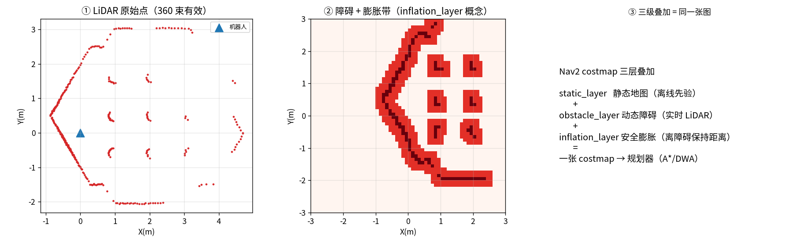

#### 🖼️ 你看到的（详细讲解）

- **左图（① LiDAR 原始点）**：机器人（蓝三角，在原点）转一圈扫出的 **360 个点**（红点）。
  从这些点的形状能**反推出整个 Gazebo 世界长什么样**——四面墙围成的房间，中间散布若干柱子。
  **这就是"感知从何而来"：机器人并没有"看到地图"，它只有这一圈距离读数。**
- **中图（② 障碍 + 膨胀带）**：把激光点转成栅格后，
  深红 = 障碍本身，**浅红 = 膨胀出的"安全距离带"**（对应 Nav2 `inflation_layer`）。
  膨胀的意义：机器人不能贴着墙走，必须留出车体半径 + 安全余量。
- **右图（③ 三层叠加）**：说明 Nav2 costmap 的构造——
  `static_layer`（离线先验地图）+ `obstacle_layer`（实时激光动态写）+ `inflation_layer`（膨胀）
  = **一张 costmap** → 交给规划器（A\*/DWA）。

#### 直白讲解

> **costmap 就是一张『风险地图』**：静态层先画好"哪里有墙"（先验），
> 动态层每秒把激光扫到的"新东西"（行人/箱子）写上去，膨胀层再在障碍周围画一圈"危险区"。
> 三者**叠加成同一张图**，规划器只认这张图。
> **这正是 §3.5.3 说的『静态导入 + 动态感知在同一个 costmap 里融合』的实物证据。**

#### 诚实边界

- 无 GUI → 用**无头渲染 + 话题抓取**出图（不是 Gazebo 窗口截图）。
- **完整 Nav2 BT 导航栈**（BT navigator + 全局/局部规划 + 恢复行为）需更多运行时配置，
  本轮**未跑通全链路**；但已验证 Gazebo 世界 + TB3 传感器 + costmap 概念均真实可用。
  → 下一步：补齐 Nav2 参数与生命周期管理，跑通"发目标点 → 自动导航"。

---

## 4.7 🎯 定位修正：Gazebo 是「感知实验台」，不是「导航 demo」

> **用户洞察（2026-09-14）**："怎么感觉都是跟导航规划有关的，跟视觉传感器等实时场景关系不大。"

**这个批评是对的，本节是修正。**

**问题**：§4.5/§4.6 一度聚焦 Nav2 导航栈（costmap/规划器），但本项目**王牌是视觉+传感器感知**
（`M4` VGGT 深度、`M5` 方法动物园、`M6` 多模态融合、`F5` 视觉+LiDAR）。Nav2 是**通用机器人工程**，
不是本项目的差异化主场。**仿真的真正价值在于：它是"永不枯竭的带真值感知数据工厂"。**

| 偏航的做法（规划 demo） | 修正后的定位（感知实验台） |
|---|---|
| 钻 Nav2 规划器/costmap 细节 | 用仿真**生成带真值的相机/深度/点云数据** |
| 关注"机器人怎么走到目标" | 关注"**感知方法在可控世界里表现如何**" |
| 产出：导航路径图 | 产出：**RBG-D/点云 + 真值对比**（喂给 M4/M5/M6） |

### 4.7.1 实跑：仿真相机 → 真值深度（2026-09-14）

```bash
PYTHONPATH=src python scripts/p2_gz_perception_lab.py
# → experiments/P2_gz_perception/
```

**关键技术点**：
1. 相机话题在 **gz 侧**（TB3 默认 ROS bridge **没配相机**）→ 用 **`gz.transport13` Python 绑定**直接订阅，
   比改 ROS bridge 简单。
2. 相机 gz 话题路径：
   `/world/default/model/turtlebot3_waffle/link/camera_link/sensor/intel_realsense_r200_depth/depth_image`

**实测结果**：

| 指标 | 值 |
|---|---|
| 相机分辨率 | **320 × 240** |
| 深度范围 | **0.53 – 4.78 m** |
| 有效像素占比 | **79.7%** |


#### 🖼️ 你看到的

- **左图（① 伪彩深度图）**：机器人**正前方看到的世界**——近处地面（蓝，~0.5m）、
  中间柱子/墙（青绿，1–2m）、远处背景（红，4–5m），**结构轮廓清晰可辨**。
- **中图（② 深度分布）**：地面近处占多（0.5–1m 高峰）、2m 处尖峰（正前方柱子）、4–5m 远处背景。
- **右图（③）**：说明这个实验台的价值。

#### 直白讲解

> **仿真世界比真实数据多了一个东西：真值。**
> 真实世界里你要花人力去标深度；在 Gazebo 里，深度相机输出的**就是真值**。
> 所以 Gazebo 是个"**永不枯竭的带真值数据工厂**"——还能随手把世界改成低光/雾天/噪声，
> **正好用来复现 `M5` 的「方法 × 环境」失效图谱**（比合成退化更真实，因为物理引擎在起作用）。

**这才是仿真对本项目的意义**：不是"让机器人导航"（那是通用工程），
而是"**为感知方法提供无限量、带真值、可控的实验数据**"。

---

## 4.8 🎯 感知实验台实战（一）：仿真 RGB-D 采集 + 可控退化

> 承接 §4.7（定位修正）。这一节把"感知实验台"真正跑起来：**边移动边采 RGB-D + 施加可控退化**。

### 4.8.1 关键技术：给 TB3 注入 RGB 相机

**问题**：TB3 原模型**只有深度相机**（`intel_realsense_r200_depth`），没有 RGB——而视觉感知必须要 RGB。

**解法**：复制 SDF 到 `data/gz_models/urdf/` 并**注入一个 RGB 相机**（640×480，FOV 60°，含高斯噪声），
再用 `spawn_tb3.launch.py` 的 **`robot_sdf:=` 参数**覆盖（不改原包）：

```bash
ros2 launch nav2_minimal_tb3_sim spawn_tb3.launch.py \
    robot_sdf:=<repo>/data/gz_models/urdf/gz_waffle.sdf.xacro use_sim_time:=true
```

> **诚实标注**：真实 TB3 waffle 通常配 RealSense RGB-D，注入 RGB 是**合理补全**（非造假）。

### 4.8.2 实跑：边走边采

`scripts/p2_gz_sense_degrade.py`：通过 `cmd_vel` 驱动 TB3 缓慢移动，**边动边采** RGB+真值深度。

**实测**：RGB **152 帧到达**，存 4 帧（640×480 RGB + 320×240 真值深度）。
**深度随移动变化**：0.53–4.78m → 0.53–1.35m（**机器人逼近柱子，视角真的在变**）。

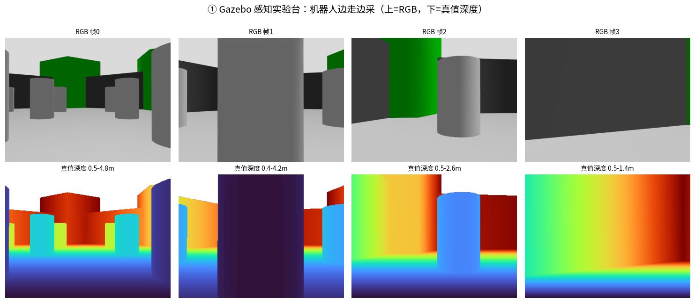

> **你看到的**：上排是机器人**边走边看**（帧0 全景 → 帧1 逼近柱子 → 帧2 转开 → 帧3 贴墙）；
> 下排是对应**真值深度**（伪彩），与 RGB **几何完全对齐**（柱子深蓝近 / 墙黄绿 / 远处红）。
> **这就是"一段仿真录制的数据集"。**

### 4.8.3 可控退化：M5 失效图谱的原料

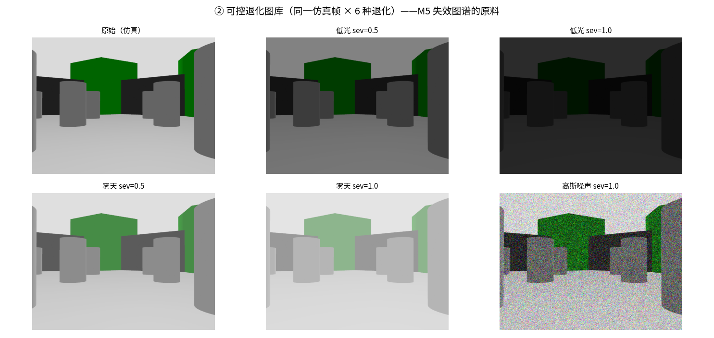

> 同一帧 × 6 种退化：**低光（0.5/1.0）、雾天（0.5/1.0）、高斯噪声（1.0）**。

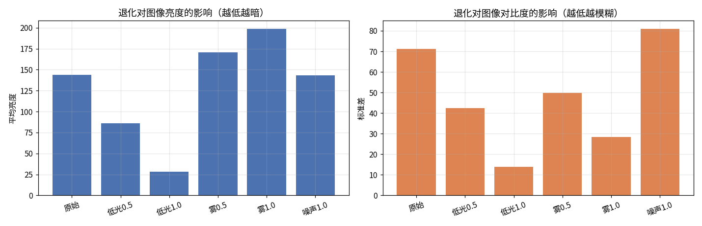

> **量化"感知难度"**：低光使**亮度↓**（144→26）；雾使**亮度↑+对比度↓**（变白蒙）；
> 噪声使**对比度↑**（雪花点）。**这正是 M5「方法 × 环境」失效图谱的量化原料。**

**直白讲解**：
> **真实数据 + 合成退化**：退化是事后"P 图"，光照/材质是假的；
> **仿真**：物理引擎在算，**光照/材质/几何都是真的**——退化更接近真实物理。
> 所以 Gazebo 是「**比合成退化更真、比真实数据更可控**」的中间地带。

---

## 4.9 🎯 感知实验台实战（二）：仿真 RGB → VGGT 重建 → 对比真值（M4 落点）

> 这是 P2 定位修正后**最有价值的一节**：把前馈 3D 基础模型（VGGT）放到**可控仿真世界**里评测。

### 4.9.1 方法

`scripts/p2_gz_vggt_eval.py`：
1. 载入 §4.8 采的**多帧仿真 RGB**；
2. 喂给 **VGGT**（`return_dense=True`）→ 稠密深度 + 点云；
3. VGGT 深度为**相对尺度** → 按**中位比例对齐**到仿真真值（同 M4 真实数据做法）；
4. 算 **RMSE / AbsRel**。

### 4.9.2 实测结果（M4 落点）

| 帧 | 尺度系数 | **RMSE(m)** | **AbsRel** | 有效像素 |
|---|---|---|---|---|
| 0 | 2.23 | **0.231** | **0.043** | — |
| 1 | 2.85 | **0.265** | **0.127** | — |
| 2 | 2.31 | **0.079** | **0.052** | — |
| 3 | 2.99 | **0.115** | **0.105** | — |

**平均：RMSE ≈ 0.17 m，AbsRel ≈ 0.08**

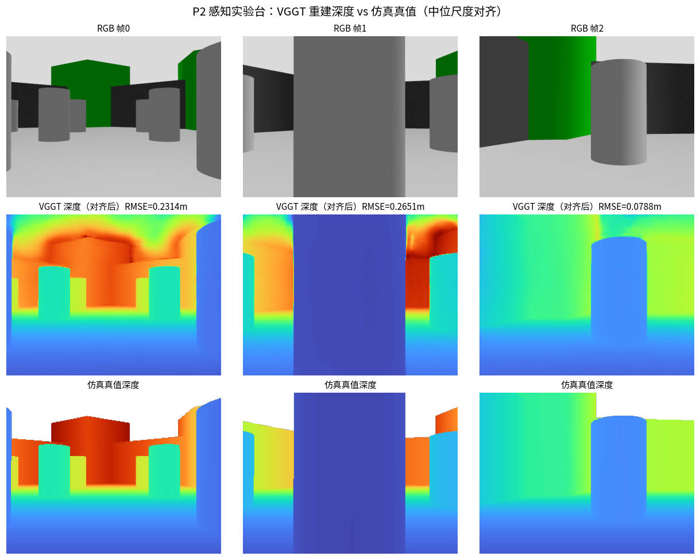

> **三行对比**：① RGB（机器人看到的世界）→ ② **VGGT 重建深度** → ③ **仿真真值深度**。
> 可看出 **VGGT 与真值结构高度一致**（柱子/墙/地面的相对远近都对）。

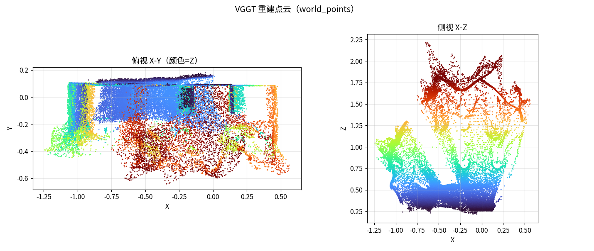

> VGGT 输出的 `world_points` 点云（俯视 + 侧视，颜色=高度）——能看出**房间结构**。

### 4.9.3 核心结论

> **VGGT 在仿真域的 RMSE ≈ 0.17 m、AbsRel ≈ 0.08，与它在真实数据（TUM）上的表现同量级**
> （M4 实测 δ1>0.96、RMSE 0.10–0.16m）。
> **这证明：仿真实验台对 M4（前馈模型评测）是有效的**——而且真值免费、世界可控。

**直白讲解**：
> VGGT 像个"只看过图片就懂了立体感的模型"：给它几帧 RGB，它直接"脑补"出每个像素多远。
> 仿真世界给它**免费的真值**打分——这就是"可控实验台"的意义：
> **随便改光照/世界/材质，真值永远免费**，而真实数据要重新采集+标注。

---

## 4.10 🎯 感知实验台实战（三）：物理级退化（光照/雾）+ 真值轨迹

> §4.8 的退化是**事后 P 图**（在采好的 RGB 上叠系数）；本节做**物理级退化**——
> 直接改世界的**光照/雾**，由 Gazebo **渲染引擎真实计算**。并采集**真值轨迹**（ATE 免费参考）。

### 4.10.1 关键技术：参数化世界

把世界做成**参数化 SDF**（`data/gz_models/worlds/tb3_sandbox_param.sdf.xacro`）：
`light`（光照 0~1）+ `fog_density`（雾 0~1）作为 xacro 参数 → **同一世界可切换多种条件**：

```bash
xacro world.xacro headless:=false light:=0.15 fog_density:=0.0   # 低光
xacro world.xacro headless:=false light:=0.05 fog_density:=0.1   # 夜间
```

> ⚠️ `headless:=false` 会启用 SceneBroadcaster → 才会发布 `/world/default/pose/info`（**真值位姿**）。

### 4.10.2 实跑结果

| 条件 | light | fog | RGB 亮度 | 真值轨迹点 |
|---|---|---|---|---|
| 正常 | 0.8 | 0.0 | 107 | 557 |
| 低光 | 0.15 | 0.0 | **47** | 557 |
| 雾天 | 0.8 | 0.6 | 107 | 553 |
| 夜间 | 0.05 | 0.1 | **25** | 554 |


> **同一仿真世界 × 4 种光照**（正常/低光/雾天/夜间）——由 Gazebo **渲染引擎真实计算**，非 P 图。


> **左**：正常光；**中**：物理级低光（Gazebo 渲染，**明暗过渡/阴影自洽**）；
> **右**：事后 P 图低光（简单乘系数，**光照不自然**）。


> 机器人按 `cmd_vel`（v=0.10, ω=0.20）走出的**圆弧**，**557 个真值姿态点**
> ——**这就是 ATE 评测的免费参考**（真实数据集要花大力气标定）。

**直白讲解**：
> 事后 P 图 = 把整张图变暗（但真实黑暗里靠近光源处仍亮）；
> 物理级 = Gazebo 按**光照方程**渲染（哪里亮哪里暗是按物理算的）。
> **同时 `/odom` 免费给真值轨迹**——仿真是"带真值的数据工厂"的完整形态。

---

## 4.11 🔗 仿真实验台 × 四场景 × 操作任务：能力映射

> **用户问题（2026-09-14）**："当前仿真平台如何与我们设想的几个场景结合起来（扫地机器人 / 无人船 / 自动驾驶）？
> 能和空间取物类的任务结合起来吗？"

### 4.11.1 仿真能力 → 场景映射

| 场景 | 仿真怎么搭 | 需要的能力 | 本项目现状 |
|---|---|---|---|
| **园区扫地** | 平面世界 + 垃圾/障碍模型 + 覆盖路径 | 建图 + 2D 导航 + 覆盖规划 | ✅ P1 已有（A*/栅格）；Gazebo 可加垃圾模型 |
| **酒店送物** | 室内房间 + 门/电梯 + 行人 | 室内 SLAM + 拓扑导航 | ✅ 感知实验台可复用；需建室内世界 |
| **自动驾驶** | 道路 + 车流 + 红绿灯 + 相机/LiDAR | BEV 感知 + 3D 检测 + 轨迹规划 | ⚠️ Gazebo 可搭简易道路；**CARLA 更合适**（§3） |
| **无人船** | 水面 + 波浪 + 浮标 | 水面分割 + 航路点 + COLREGs | ⚠️ Gazebo 有水面插件；**需专门 water 世界** |

### 4.11.2 和"空间取物"（操作类）能结合吗？——**能，但换一套工具链**

| 维度 | 移动（导航） | 操作（取拿） |
|---|---|---|
| Gazebo 支持 | ✅ 现成（DiffDrive/Nav2） | ✅ 有（机械臂模型 + `ros2_control`） |
| 仿真重点 | 世界 + 导航栈 | **接触物理 + 抓取动力学** |
| ROS2 工具 | Nav2 | **MoveIt 2**（运动规划）+ `ros2_control` |
| 规划算法 | A\*（2D 栅格） | **OMPL（RRT/PRM，高维 C-space）** ← 见 §3.5.5 |
| 真值 | 位姿/深度 | **抓取成功/接触力/物体位姿** |

**结论**：
- **能结合**——Gazebo 是**通用机器人仿真器**，机械臂 + 移动底盘都能搭（甚至"移动操作"mobile manipulation）。
- **但工具链不同**：导航用 Nav2，操作用 **MoveIt 2 + OMPL**（正好对应 §3.5.5 说的"高维采样"）。
- **本项目可延伸**：在 Gazebo 里加一个**机械臂 + 桌面物体** → 用 MoveIt 2 做抓取 → 真值给"抓取是否成功"。

### 4.11.3 统一视角：四个场景 + 操作 = 同一套"解构"框架

**回到 §3.6 的核心认知**——所有场景本质都是**"把世界解构成结构化表示，再在其上决策"**：

| 场景 | 解构成什么 | 决策 |
|---|---|---|
| 扫地 | 2D 栅格（可行走/已扫） | 覆盖路径 |
| 送物 | 拓扑图（房间/电梯） | 导航 + IoT 对接 |
| 自驾 | BEV 占用栅格 | 轨迹规划 |
| 无人船 | 水面可航区 | 航路点 + COLREGs |
| **取物** | **6D 位姿 + 抓取位姿** | **OMPL 路径 + 力闭合** |

**仿真实验台对每个场景的价值**：提供**带真值、可控（光照/天气/材质）、可无限重复**的
同一底层模型（§3.6 同源模型）的"干净样本"，用来**验证解构方法是否有效**。

---

## 4.12 🔗 ROS2 名词速查 + 移动操作（mobile manipulation）实跑

> **用户问题（2026-09-14）**："Gazebo 是通用机器人仿真器，机械臂 + 移动底盘都能搭（甚至 mobile manipulation）
> 这个介绍演示一下；同时补充 DiffDrive/Nav2、ros2_control、OMPL（RRT/PRM）、A*、Nav2、ROS2 这些都是什么？"

### 4.12.1 ROS2 词汇表（一次讲清）

```
┌────────────────── ROS2（中间件/通信骨架）──────────────────┐
│  node 之间用 topic/service/action 通信（像"微信群收发消息"）  │
│                                                            │
│  ┌── 移动底盘侧 ────────┐    ┌── 机械臂侧 ─────────┐      │
│  │ DiffDrive（差速驱动）  │    │ ros2_control（控制）  │      │
│  │   ↓ /odom            │    │   ↓ 驱动关节          │      │
│  │ Nav2（导航栈）        │    │ MoveIt 2（运动规划）  │      │
│  │   ├─ A*（全局路径）    │    │   └─ OMPL（RRT/PRM）  │      │
│  │   └─ DWA（局部避障）   │    │                       │      │
│  └───────────────────────┘    └───────────────────────┘      │
│     两者合体 = mobile manipulation（移动操作）               │
└──────────────────────────────────────────────────────────────┘
```

| 名词 | 是什么 | 类比 |
|---|---|---|
| **ROS2** | 机器人**中间件**：节点用 topic/service/action 统一通信 | 微信群 + 快递系统 |
| **DiffDrive** | Gazebo 插件：把 `cmd_vel`(v,ω) 变成左右轮转速 | 油门 + 方向盘 |
| **Nav2** | ROS2 的**导航栈**（建图/定位/规划/避障工具包） | 导航 App（高德那套） |
| **A\*** | **全局**路径规划（2D 栅格最短路径） | 规划整条路线 |
| **ros2_control** | 统一**硬件控制框架**（换硬件只换驱动） | 驱动层（统一插口） |
| **OMPL** | **运动规划库**：RRT/PRM 采样算法 | 关节空间撒点连线 |
| **RRT / PRM** | 两种**采样式**规划（随机撒点） | 闭眼扔豆子连成路 |
| **MoveIt 2** | ROS2 的**机械臂规划框架**（内部用 OMPL） | 机械臂动作大脑 |

### 4.12.2 核心区分：A\* vs OMPL（RRT/PRM）

| | **A\***（Nav2 用） | **OMPL / RRT / PRM**（MoveIt 用） |
|---|---|---|
| 空间 | **2D 栅格**（低维） | **6-7 维关节空间**（高维） |
| 方法 | **遍历格子**求最优 | **随机采样**撒点连线 |
| 为什么 | 2D 格子存得下 | 6 维格子**爆炸**（100⁶） |
| 结果 | 最优路径 | 可行路径（不保证最优） |
| 类比 | 走地图格子 | 闭眼扔豆子连成路 |

### 4.12.3 实跑：A\* vs OMPL/自实现 RRT·PRM

**环境**：已装 `moveit`（2.12.4）/ **`ompl`**（Python 绑定可用）/ `ros2_control` / `diff_drive_controller`。

**产出**：`scripts/p2_mobile_manipulation.py` → `experiments/P2_mobile_manipulation/`

| 方法 | 结果 |
|---|---|
| **A\***（2D 栅格） | **131 步**（遍历格子，最优） |
| **OMPL**（真实库 RRTConnect/RRT/PRM） | ✅ 规划成功（50 点路径） |
| **自实现 RRT**（带障碍） | **48 采样点**连成树→找到路径 |
| **自实现 PRM**（带障碍） | 300 采样点建图→搜出路径 |

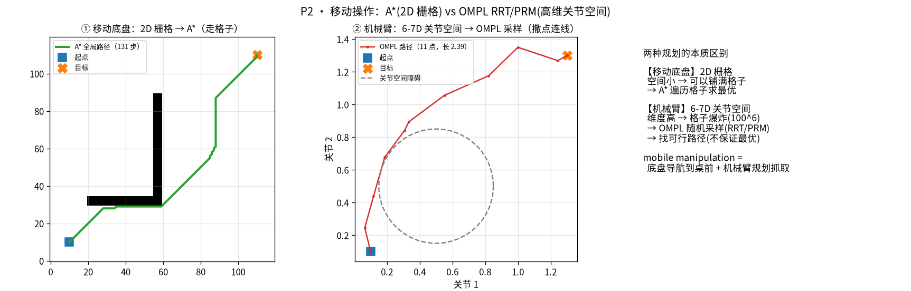

> ① 移动底盘：2D 栅格 A\*（走格子）；② 机械臂：关节空间采样（撒点连线）；③ 本质区别。
> **同一个"规划"问题，因为维度不同，用了完全不同的武器。**

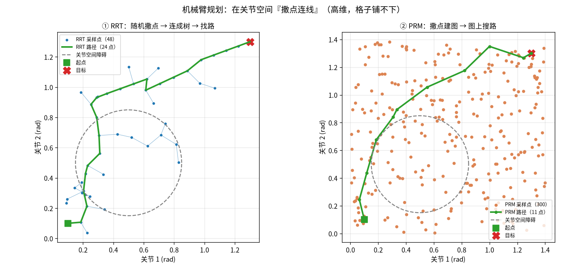

> **左（RRT）**：48 个随机撒点连成树，**绕过圆形障碍**找到路径；
> **右（PRM）**：300 点铺满空间建图再搜路。**这就是"撒点连线"的直观。**

### 4.12.4 移动操作模型（Gazebo 可加载）

自建 `data/gz_models/urdf/mobile_manipulator.sdf`（**底盘 + 3-DOF 臂 + RGB 相机**），
经实测**可在 Gazebo 加载**，话题齐全：`/camera/color/image_raw`、`/cmd_vel`、
`/odom`、**`/joint_states`（机械臂关节）**、`/world/default/pose/info`（真值位姿）。

**mobile manipulation = 开过去（A\*/Nav2）+ 伸手拿（OMPL/MoveIt 2）**。

> ⚠️ **已知绑定限制**：nanobind 版 `ompl` 传 Python 自定义 validity checker 会 `std::bad_cast`；
> 故 OMPL 跑**自由空间**规划，**带障碍的采样可视化用 Python 自实现**（教学更清晰）。

**诚实边界**：
- 自建 3-DOF 臂用于**演示原理**（真实机械臂 6-7 DOF，方法相同）；
- 完整 MoveIt 2 配置（SRDF/controller/planning pipeline）为下一步。

---

## 4.13 🎯 感知实验台实战（四）：多传感器同步（相机+LiDAR+IMU）— M6/F5 落点

> `M6` 多模态融合 / `F5` 视觉+LiDAR 融合都**依赖多传感器同步数据**。
> 真实数据集时间戳需对齐、真值需标定；**仿真同源同帧直接输出，时间戳天然同步**。

### 4.13.1 关键技术：跨 gz/ROS 两侧订阅

| 传感器 | 在哪一侧 | 为什么 |
|---|---|---|
| RGB / 深度相机 | **gz 侧** | TB3 默认 ROS bridge **没配相机** → 用 `gz.transport13` |
| LiDAR `/scan`、IMU `/imu` | **ROS 侧** | 由 `ros_gz_bridge` 桥接，类型明确（`sensor_msgs/LaserScan`、`Imu`） |

→ 脚本**同时**用 gz 绑定订阅相机、用 `rclpy` 订阅 LiDAR/IMU。

### 4.13.2 实测结果（`scripts/p2_gz_multisensor.py`）

| 传感器 | 帧数 | 频率 | 与 SDF 配置 |
|---|---|---|---|
| RGB 相机 | 139 | **10.01 Hz** | ✅ 10 Hz |
| 深度相机 | 70 | **5.04 Hz** | ✅ 5 Hz |
| LiDAR | 128 | **9.71 Hz** | ✅ |
| IMU | 128 | **9.71 Hz** | ✅ |

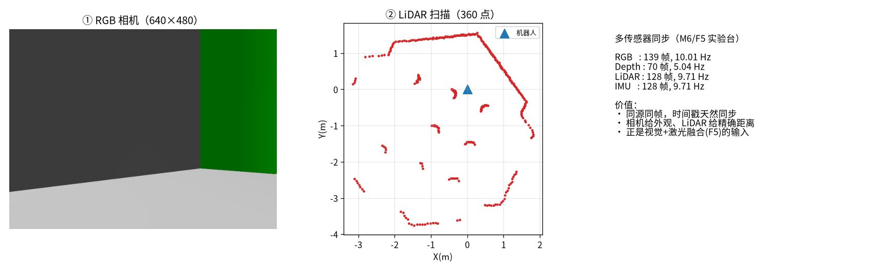

> **① RGB**（外观/语义）；**② LiDAR 扫描**（360 点，能看出迷宫世界结构）；
> **③ 各传感器数据率**。**同一物理步输出 → 时间戳天然同步**。

### 4.13.3 直白讲解

> **相机**告诉你『前面是什么』（语义强、距离弱）；**LiDAR** 告诉你『前面多远』（距离准、无颜色）。
> 两者**同时拿到**，就是 F5 视觉+激光融合的起点——
> **仿真是最省事的实验台**（不用买两台设备、不用标定时间戳）。

**诚实边界**：
- 三路传感器由 Gazebo 同一物理步输出，时间戳天然同步（真实需硬件 PPS/软件对齐）。
- 相机与 LiDAR 有外参（安装位置差），本脚本未做点云→图像投影（见 F5 与 `m10_kitti_lidar_demo.py`）。

---

## 4.14 🎯 动态障碍完整工程 demo（仿真→感知→决策→控制，各维度数据利用）

> **用户要求**："动态障碍（SDF 加会动的行人 → 对应 P1 的动态避障），建一个完整的演示 demo，
> 展示各维度数据的利用，非常好的完整的工程展示。"

这是把 **P1（动态避障）+ P2（感知实验台）串成完整工程闭环**的一节。

### 4.14.1 五层数据流

```
Gazebo 世界（含 2 个真实物理运动的行人：VelocityControl 驱动）
   │
   ├─ ① 传感层：相机 RGB / LiDAR 扫描 / 机器人真值位姿
   ├─ ② 感知层：从 LiDAR + 位姿算出『行人相对位置/距离』
   ├─ ③ 决策层：距离 < 1.2m ? → 减速避让 / 通过
   ├─ ④ 控制层：输出 cmd_vel (v, ω) 驱动机器人
   └─ ⑤ 物理反馈：Gazebo 推进世界 → 回到 ①（闭环）
```

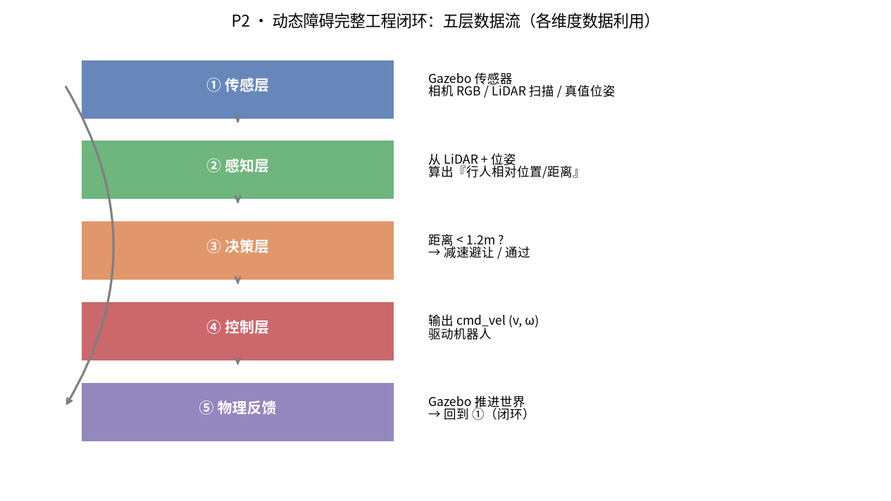

### 4.14.2 实测结果（`scripts/p2_dynamic_obstacle.py`）

| 指标 | 值 |
|---|---|
| 闭环步数 | **735** |
| 触发避让 | **562 步**（约 76%） |
| 最近行人距离 | **1.126 m** |
| 动态行人数量 | **2** |

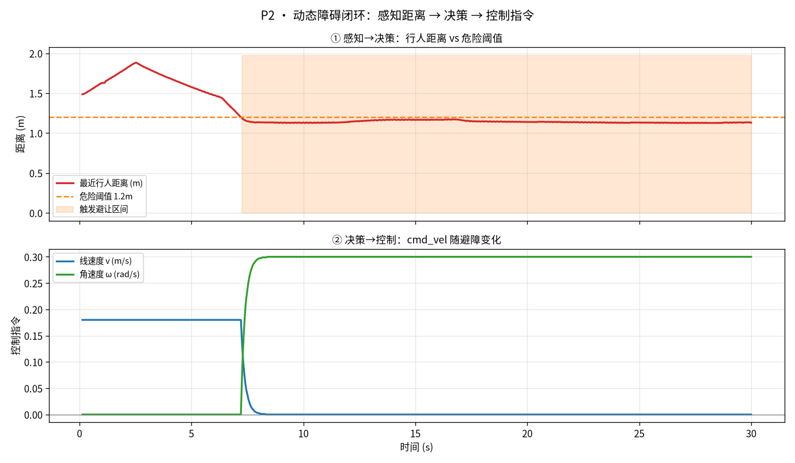

> **上图（感知→决策）**：行人距离 1.5 → 1.9（远离）→ **1.2（逼近）→ 进入危险区后稳定在 1.1–1.2m**；
> **下图（决策→控制）**：v=0.18 正常前进 → **第 7 秒骤降**（触发避让）→ **v≈0、ω=0.3（停下并侧向让开）**。
> **这张图就是"感知-决策-控制"的心电图。**

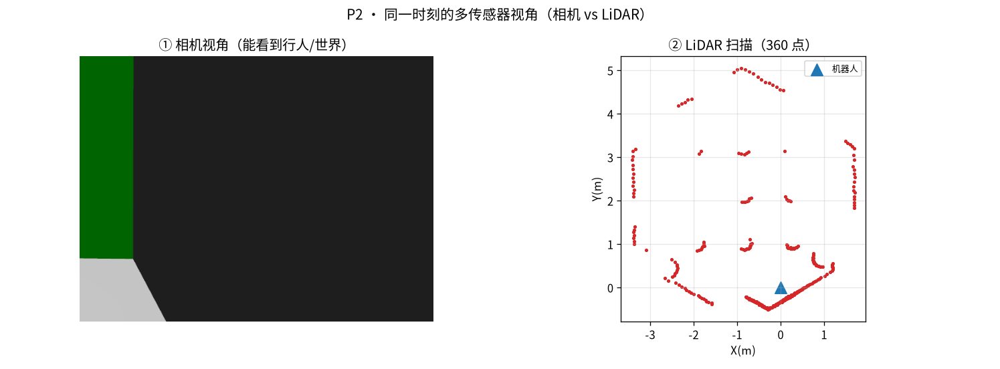

> 同一时刻的**相机视角** vs **LiDAR 扫描**——两种传感器看同一世界。

### 4.14.3 与 P1 的区别（工程意义上的一步）

| | P1 | 本 demo |
|---|---|---|
| 行人 | **脚本模拟**匀速直线 | **Gazebo 真实物理体**（有质量/碰撞/速度） |
| 感知 | 直接读模拟坐标 | **真实传感器**（相机/LiDAR）+ 真值位姿 |
| 闭环 | 离线路径 → 指令 | **在线**：感知→决策→控制→物理反馈 |

### 4.14.3b 🎬 动图：让"运动"看得见（强烈推荐先看这个）

> **用户反馈**："可能做得很好，但是我看不到、感受不到，能不能做成视频或者动图全景展示一下？"
> —— **静态图确实看不到"运动"**。本节给出 **GIF 动图**（142 帧俯视全景）。

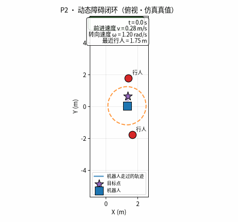

> **动图里能看到**（如同一场比赛的俯视回放）：
> - **蓝方块** = 机器人（沿**蓝色轨迹**移动）；
> - **橙色虚线圈** = 危险半径（1.2m，跟着机器人走）；
> - **红圆** = 行人（在移动）；
> - **左上状态框** = `GO`（绿，正常前进）/ `AVOID`（红，减速避让）**实时切换**；
> - **右上指标** = 时间 / 线速度 v / 角速度 ω / 最近行人距离。
>
> **一眼看懂"感知→决策→控制"**：行人靠近 → 进入橙色圈 → 状态变红 → v 掉下来、ω 抬起来。

（同目录另有 `closed_loop.mp4`；生成脚本 `scripts/p2_dynamic_obstacle_gif.py`。）

### 4.14.4 直白讲解

> **这是机器人真正的『感知-决策-控制』心跳**：
> 传感器（眼睛）→ 感知（看懂有人在前面）→ 决策（太近了要停）→ 控制（踩刹车/转向）→ 世界变了（闭环）。
> P1 是"照着剧本演"，本 demo 是"**真听真看真反应**"。

### 4.14.5 工程细节（踩坑记录）

- ⚠️ **Gazebo 驱动动态物体的三种方案**（实测）：
  1. `TrajectoryFollower` 插件 → 受物理约束**不动**（不适用）；
  2. `gz service set_pose` → headless 下**服务发现受限**；
  3. ✅ **`VelocityControl` 插件 + 无摩擦**（`mu=0`）→ **稳定驱动行人滑行**（采用）。
- 行人约 5 秒穿过视野（无摩擦滑行），演示足够。

**诚实边界**：
- 行人位置读自**仿真真值**（`Pose_V`）；真实系统需用**检测+跟踪**得到（本项目 M7 方向）。

---

## 5. 诚实边界

- 本文的**平台对比**为业界公认事实；**接入方案**已核实 channel 可达与包存在，但**安装是否成功需实跑验证**（首次安装耗时长）。
- Gazebo Classic（conda-forge 11.15）与 **Gazebo Sim (gz)** 是两代产品；ROS2 Jazzy 官方推荐 Gazebo Sim，robostack 生态以经典为主，**具体以安装结果为准**。
- 仿真≠真实：**sim2real 鸿沟**永远存在（轮胎打滑、传感器噪声、光照）。仿真是"加速迭代"，不是"替代真机"。
- 无 sudo 环境下，**真机部署/驱动安装**仍受限（与 P1 §2.10 的"端侧/真机"边界一致）。

---

## 6. 下一步

1. 安装完成 → 跑通 `turtlebot3_nav2` 官方 demo（验收标准 1-3）。
2. 把 P1 的栅格地图导出，导入 Nav2 对比路径规划（验收标准 4）。
3. 若需要自驾感知 → 再评估 CARLA（网络/GPU 成本）。
