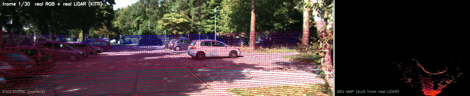
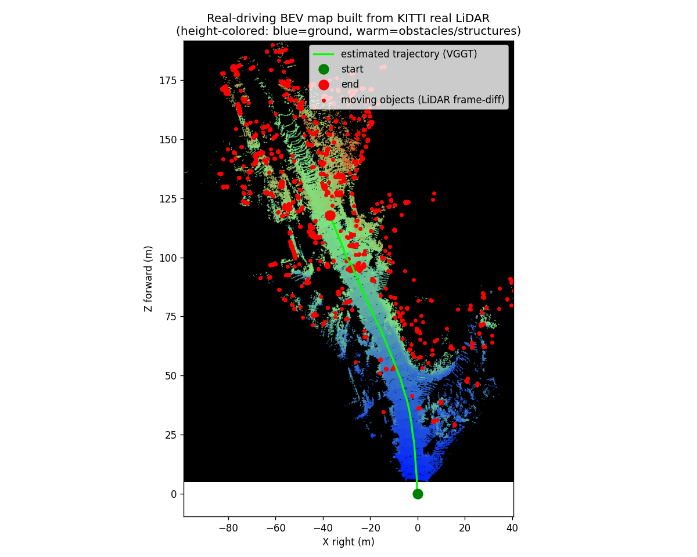
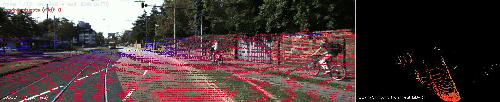
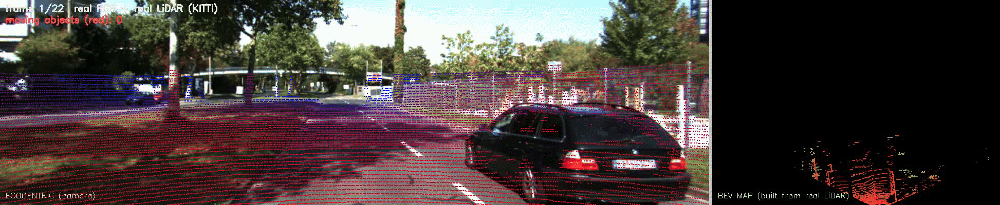
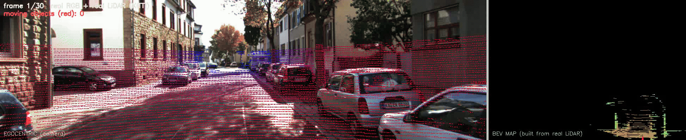

# P4 · 真实驾驶动态建图：真实 RGB + 真实 LiDAR 的"实时输入 → 场景构建 → 双视角回放"

> **一句话**：拿一段**真实街道驾驶**的多传感器数据（车载相机 RGB + 真实激光雷达点云，已在磁盘、零下载），
> 当成"实时输入流"逐帧喂进系统：项目自己的 **VGGT** 用 RGB 做视觉定位、**真实 LiDAR** 给轨迹定标并逐帧
> 反投影累积成**俯视全景（BEV）地图**、**LiDAR 帧间差分检测移动车辆/行人并标红**，最后用
> **第一视角 + 俯视全景双画面视频**同步回放"车开完全程"。
>
> 与 `P3` 的分工：P3 回答"**定位崩了怎么办**"（恶劣环境鲁棒性 + 兜底）；P4 回答"**真实传感器数据怎么变成一张随车生长的地图**"（真实数据系统构建）。两者合起来 = 感知系统的"鲁棒性"与"完整性"两面。
>
> ⚠️ **本篇的边界（先讲清楚，别误读）**：P4 覆盖的是自动驾驶栈的**前半段**——
> **感知 → 定位 → 建图 → 可视化**。它**不含规划、控制、决策、避障**；产物是"地图 + 回放视频"，不是控制指令。
> （对比：规划/控制/避障在 `F6`、`P1`、`P2`、`P3`。）**把前半段与后半段在同一份真实驾驶数据上跑通全链路**，见姊妹篇 **`P5 真实驾驶端到端闭环`**。

---

## ① 30 秒电梯演讲（面试开场）

> "我做了一个**真实传感器数据的动态建图系统**：输入是一段真实街道驾驶的车载相机 + 激光雷达原始数据，
> 不是仿真、不是合成退化。系统用前馈 3D 基础模型 VGGT 从真实 RGB 一次前向估出相机轨迹，
> 再用真实 LiDAR 深度把轨迹定标到度量级，然后把每帧真实激光点云按位姿反投影、逐帧累积成一张
> 俯视全景地图，并用**帧间差分**把"会动的东西"（对向车、行人）从静态背景里抠出来标红。
> 最终输出一段双视角视频：左边是司机看到的第一视角画面（叠着激光扫描、移动目标标红），
> 右边是这张地图随车一点点长出来、车标沿 125 米轨迹开到终点。整条链路没有用任何真值位姿——
> 轨迹是视觉算出来的，尺度是激光量出来的。"

---

## ② 场景、需求与真实问题

| 项 | 内容 |
|---|---|
| 场景 | 真实城市街道驾驶（KITTI：两侧停车、行道树、建筑），真实光照、真实传感器噪声 |
| 输入 | ① 真实车载 RGB（`image_02` 左目）② 真实稀疏 LiDAR（`velodyne_raw`，depth = png/256 m）③ 相机内参 |
| 真实问题 | RGB 看得懂但没距离；LiDAR 量得准但稀疏、无语义。单用任何一个都长不出可用的场景地图 |
| 需求 | 视觉定位 → 度量定标 → 逐帧反投影累积 BEV → **移动目标检测标红** → 双视角回放全程 |
| 交付 | `driving_dualview.mp4`（双视角视频）+ `bev_final_map.png`（米制终图）+ `metrics.json` |

**为什么这是"真实"的**：数据来自真实传感器采集（KITTI 实车），LiDAR 是真实的稀疏扫描线形态（每帧约 1.8 万点、3–80 m 量程），
不是仿真完美深度；RGB 有真实曝光/阴影/遮挡。系统消费的就是这种"脏但真"的输入。

---

## ③ 方法原理（专业）

```
真实 RGB ──► VGGT（一次前向）──► 相机轨迹 T_cw（up-to-scale）
                                    │
真实 LiDAR 深度 ──┬──► median(VGGT深度) 比 ──► 全局尺度 s=72.4 ──► 平移×s（度量级）
                  │
                  └──► 按内参反投影 → 相机系 3D 点（本来就是米制）
                                    │
                                    ▼
                    世界系点云 = T_cw(定标) ⊕ 相机系点
                                    │
                                    ▼
              逐帧增量写入 0.4m 栅格 BEV（高度着色：蓝=地面，暖=障碍）
                                    │
                                    ▼
        移动目标检测：前序帧世界点=静态地图 → KD-tree 3D 邻近匹配
                    （半径 1.2+0.03·Z m 容忍漂移）→ 无近邻且离地 = 移动目标（标红）
                                    │
                                    ▼
        双视角视频：左=RGB+LiDAR 扫描+移动目标(红) │ 右=BEV+绿轨迹+红车体+移动目标(红点)
```

- **视觉定位**：VGGT 对 30 帧连续 RGB 一次前向输出 `pose_enc` → `T_cw`（相机→世界），整体 up-to-scale。
- **尺度定标**：VGGT 深度与真实 LiDAR 深度在有效像素上取逐帧 median 比，再取中位数 → 全局尺度。
  这一步是"**用真实传感器给视觉模型定标**"的关键：旋转天然无量纲，只有平移需要乘尺度。
- **BEV 建图**：LiDAR 深度图按 `X=(u-cx)Z/fx, Y=(v-cy)Z/fy` 反投影成相机系点云（米制），
  乘定标后的 `T_cw` 变换到世界系，逐帧增量写入栅格（occupancy-style 增量建图）。
- **双视角回放**：轨迹/车体画在最终显示分辨率上（先缩放后绘制，避免线条被缩小吃掉）；BEV 面板 forward 朝上。
- **移动目标检测（帧间差分 + 自运动补偿）**：把**前序所有帧**的真实 LiDAR 世界点当"静态地图"——
  因为静态地图与当前帧用的是**同一套 VGGT 位姿**，二者自洽，VGGT 漂移不会造成地图与当前帧错位；
  用 **KD-tree 3D 邻近匹配**（半径 `1.2+0.03·Z` m 随深度放大，容忍角误差远处放大）判断当前帧每个点
  是否被静态地图解释；无近邻且**离地**（相机系 Y 明显小于相机离地高度 1.65 m，排除路面新揭示）
  → 判为移动车辆/行人。
  两个关键踩坑：① 逐像素深度比对会把"前景地面/远处建筑"混在一个射线里（min 深度被地面占据），
  必须在**世界系做 3D 邻近**而不是图像平面；② "离地"判定要用**相机系 Y ≈ 相机高度**这一常量事实
  （地面点相机系 Y 恒等于相机离地高度），而不是 Y/Z 斜率（近处地面 Y/Z 很大，会全被误判成障碍）。

**模块落点**：VGGT= `M4`；真实 LiDAR 融合 = `F5`；BEV/占据栅格 = `F1`/`F6`；移动目标检测 = `F5`/`M3`（动态 vs 静态的判别思想同动态障碍）；系统串联 = `F8`/`P0`；硬件对应 = `F7`（见本篇 §⑨）；**后半段（规划/控制）** = `F6`/`P3`/**`P5`**。

---

## ④ 直白讲解

把这套系统想成"**一边开车一边画地图**"：
- 眼睛（相机）负责记住"我往哪拐了"——VGGT 看连续画面就能报出车的走位；
- 手（激光雷达）负责每走一步"摸一下周围"——打出真实的一束距离点；
- 把每一步摸到的点，按眼睛报的位置贴到一张俯视图上——地图就随车一点点长出来；
- 谁在动？——把以前摸过的点记成"静态底账"，这一帧冒出来的、还悬在半空的点就是**会动的东西**
  （对面开过来的车、骑车的行人），画面里标红提醒。
- 视频里左边是司机视角（移动目标标红），右边是这张正在长大的地图：绿线是走过的路，红三角是车。

**为什么不用 GPS 真值？** 因为真实交付里 GPS 常常不可用（隧道/城市峡谷）。
本 demo 刻意让**轨迹完全由视觉算出、尺度完全由激光量出**——这正是不依赖高精 GPS 的量产方案形态。

---

## ⑤ 真实数据验证 + 效果

数据：KITTI depth_completion · `val_selection_cropped` · drive `2011_09_26_drive_0023_sync`

| 指标 | 数值 | 说明 |
|---|---|---|
| 帧数 / 时长 | 30 帧 / ≈18 s 行车（帧距 0.6 s） | 同一 drive 连续抽帧 |
| 尺度定标因子 | **72.433** | 真实 LiDAR / VGGT 相对深度 median 比 |
| 轨迹长度 | **125.16 m** | ≈7 m/s，城市车速合理 ✓ |
| 真实 LiDAR 点 | 每帧 1.7–2.0 万，累计 **56.5 万** | velodyne_raw 真实稀疏扫描 |
| BEV 覆盖 | ≈**150 m × 190 m** @ 0.4 m 栅格 | 街道走廊 / 两侧停车 / 行道树可辨 |
| 移动目标检测 | **1 743 点**（均值 ≈58/帧，逐帧 0–350） | 静态地图差分 + 离地约束；红色标注集中于对向车道/前方路口 |





- 视频 `driving_dualview.mp4`：1946×400 @3 fps，10 s（半速播放）；关键帧 `frame_*.png` 共 11 张（约每 3 帧一张）。
- 终图读法：绿线=VGGT 视觉定位轨迹（125 m），蓝=地面点，暖色=车/树/建筑（高度越高越暖）。
  可以看到地图沿街道走廊生长、与 RGB 画面中的两侧停车一致——**这就是"真实数据长出的地图"**。

### ⑤b 多场景示例（同一套管线，不同街道）

下面 4 条都是 KITTI depth_completion 里**不同的 drive（不同街道/时段）**，全部用同一条 `p4_real_driving.py` 跑出来——
证明这不是为某一条街调参的"特例"，而是可迁移到任意真实驾驶片段的通用流程。每条时长 10 s（半速）、30 帧。

| drive | 轨迹长度 | 真实 LiDAR 点 | 移动目标点（红） |
|---|---|---|---|
| `2011_09_26_drive_0023_sync` | 125.16 m | 56.5 万 | 1 743 |
| `2011_09_26_drive_0002_sync` | 71.87 m | 22.6 万 | 1 187 |
| `2011_09_26_drive_0013_sync` | 152.62 m | 40.4 万 | 4 771 |
| `2011_09_26_drive_0095_sync` | 155.52 m | 55.3 万 | 2 281 |

**drive 0023（默认）**


**drive 0002（短程居民区）**


**drive 0013（长程，移动目标最多）**


**drive 0095（长程商业区）**


> 每条 drive 的完整产物（mp4 + gif + 11 张关键帧 + BEV 终图 + metrics）都在
> `experiments/P4_real_driving/drives/<drive>/`。想加更多场景，直接换 `--drive` 重跑即可（见 §⑦）。

---

## ⑥ 工程叙事：讲给三种人听

- **面试官/同行**：强调四个工程决策——① 轨迹与尺度解耦（视觉管方向、激光管尺度）；② 增量式 BEV（流式、可扩展到回环/因子图优化）；③ 移动目标检测用"**同一套位姿下的静态地图差分**"而非图像差分（自洽抗漂移）+ 离地约束（排除路面新揭示）；④ 画轨迹/车体时"先缩放后绘制"（在最终分辨率上画，否则线条被缩小吃掉——真实可视化踩坑点）。
- **客户**："真实传感器数据进去，出来一张随车生长的俯视地图和一段双视角回放，不依赖高精 GPS。"
- **初学者常漏的环节**：① VGGT 轨迹是 up-to-scale，不定标就是"形状对、大小错"的地图；② LiDAR 与图像的内参/外参一致性；③ 抽帧序列的帧距要保证相邻帧有足够重叠；④ 逐帧点云要增量写入而非重画（否则丢失"地图在生长"的叙事）；⑤ 视频帧尺寸要提前定好（超编解码器上限会静默失败）。

---

## ⑦ 复现

```bash
# 默认：drive 0023，30 帧
PYTHONPATH=src python scripts/p4_real_driving.py --drive 2011_09_26_drive_0023_sync --max-frames 30

# 换一条街 / 更多帧（产物按 --out 分目录，便于多场景对比）
PYTHONPATH=src python scripts/p4_real_driving.py --drive 2011_09_26_drive_0013_sync \
    --max-frames 30 --fps 3.0 --out experiments/P4_real_driving/drives/2011_09_26_drive_0013_sync

# 由 mp4 生成 GIF（半速 3 fps）：
ffmpeg -i <out>/driving_dualview.mp4 -vf "fps=3,split[s0][s1];[s0]palettegen=max_colors=128[p];[s1][p]paletteuse" <out>/figs/driving_dualview.gif
```

> 可用 drive（val_selection_cropped，共 13 条）：`0002 / 0005 / 0013 / 0020 / 0023 / 0036 / 0079 / 0095 / 0113 / 09_28_0037 / 09_29_0026 / 09_30_0016 / 10_03_0047`。

依赖：GPU + 本地 VGGT-1B 权重（`~/models/vggt-1b`）；数据 `data/raw/ms/OmniData__KITTI_depth_completion/`（已在磁盘）。

**想跑完整链路（含规划 + 控制）** → 见 `P5 真实驾驶端到端闭环`：
```bash
PYTHONPATH=src python scripts/p5_real_driving_closed_loop.py --drive 2011_09_26_drive_0023_sync --max-frames 30
```
它复用本篇的 BEV 建图结果，接 **inflation 膨胀 → A\* 规划 → 差速轮控制 → 速度障碍法避障**，输出"感知→建图→规划→控制"在同一份真实驾驶数据上的闭环。

---

## ⑧ 诚实边界（必读）

1. **无逐帧真值位姿**：KITTI depth_completion 基准不提供 odometry 真值 → 本 demo **不报 ATE**，定位是"真实数据上的系统构建"，不是"带真值评测"。带真值的鲁棒性评测见 `M5`（TUM 合成退化 13 条件）与 `M5 §4.2`（4Seasons 真实夜间，VGGT 0.415 m vs GNSS）。
2. **轨迹来自视觉模型**（VGGT），非 GPS/IMU；**尺度来自真实 LiDAR**（median 比），非 IMU/轮速。
3. **抽帧序列**：val_selection 帧距 0.6 s，非满帧率 10 Hz；建图质量受抽帧间隔影响。
4. **「雷达」= 激光雷达**：该数据集无毫米波 radar；如需 radar 需换 nuScenes 类数据（后续可扩展）。
5. **移动目标检测是启发式**，非检测器 benchmark：远处新揭示的静态结构（树冠/建筑边缘）与残余位姿漂移
   可能被误标为移动；匹配半径随深度放大（1.2+0.03·Z m）是"容忍漂移 vs 不漏真移动"的折中。
   属演示级能力，用于体现"动态驾驶"叙事；要上量需换语义分割/多目标跟踪（如 CenterPoint）。
6. **海上场景未做**：真实"RGB+LiDAR 行船建图"公开基准缺省，KITTI 驾驶是已落地、最真实的替代；若用户提供海上多传感器数据集可平移复用本管线。
7. **⚠️ 不含自动驾驶栈后半段（最重要的一条）**：P4 是**感知→定位→建图→可视化**，**没有规划（planning）、控制（control）、决策、避障、速度规划、路径跟踪**——
   产物是一张地图和一段回放视频，**不是**控制指令。**这张 BEV 地图也不能直接拿去导航**（它没有做 inflation 膨胀、没有机器人几何/运动学约束、没有可达性检查）。
   若要看"真实驾驶数据上的感知→规划→控制闭环"，请读姊妹篇 **`P5 真实驾驶端到端闭环`**（把本图的 BEV 占据栅格接 A\* + 差速轮控制）。
   若要看恶劣环境下的"定位崩了怎么兜底"，请读 `P3`。
8. **硬件是"匿名的"**：本篇把 KITTI 当成"真实传感器数据流"消费，**没有讲实车用了什么相机（型号/焦距/快门）、什么 LiDAR（线束/量程/点频）、什么算力平台**——
   这些在本篇 §⑨「硬件对应」补齐，选型方法论见 `F7 硬件扫盲`。

---

## ⑨ 硬件对应：这份数据来自什么车、跑在什么算力上

> 前面 §②–§⑤ 把 KITTI 当成"真实传感器数据流"消费，没交代硬件。这一节补齐——**为什么选它、它对应什么实车、要什么算力、换成别的硬件会怎样**。
> 选型方法论（怎么挑相机/雷达/平台）见 **`F7 硬件扫盲`**；这里只讲"P4 这套具体配置"。

### 9.1 KITTI 采集车配置（本 demo 的"真实硬件"）

| 器件 | KITTI 采集车实际配置 | 在本 demo 中的体现 | 选型要点（对应 `F7`） |
|---|---|---|---|
| **相机** | 2 台灰点 **PointGrey Flea2**（彩色/灰度各一），**~1.4 MP（1392×512 裁切区）**，**卷帘快门**，装车顶 | `image_02`（左目彩色）就是数据来源；分辨率见 §⑤ | `F7 §3.2`：分辨率/帧率/**快门**/焦距/接口 |
| **LiDAR** | **Velodyne HDL-64E**，**64 线**机械旋转式，360°×27°，**~10 Hz**，量程 ~120 m | `velodyne_raw` 的真实稀疏扫描线（~1.8 万点/帧，3–80 m） | `F7 §4.2`：**线束**/量程/FOV/点频 |
| **定位真值** | GPS/IMU（OXTS RT3000，~100 Hz） | **本 demo 刻意不用**（轨迹纯视觉、尺度纯激光） | `F7 §7`：IMU/GNSS 作用 |
| **算力平台** | （KITTI 只给数据） | 本地 **RTX 4090（24 GB）** 跑 VGGT + 建图 | `F7 §9.1` / `F8`/`M8` 端侧 |

> **为什么是 64 线而不是 16 线？** 自动驾驶要看清 **100 m 外**的车和行人；`F7 §4.2` 已述"16 线远处几乎没点，64+ 线才够"。
> 所以 KITTI 用 64 线是**任务倒逼的硬需求**，不是堆料。反过来：本 demo 若换成 16 线，§⑤ 的 BEV 远处会**稀疏到连不成墙**。

### 9.2 为什么选 KITTI（数据集与硬件的关系）

| 评估项 | KITTI depth_completion | 说明 |
|---|---|---|
| 是否真实传感器 | ✅ 实车采集，非仿真、非合成退化 | P4 立身之本 |
| 是否零下载 | ✅ 已在磁盘（20 GB） | 不依赖网络 |
| 相机+LiDAR 是否齐备 | ✅ 同时给 RGB + 真实 LiDAR 深度（已投影到 image_02） | 融合所需的**标定已做好** |
| 是否有真值位姿 | ❌ 无 odometry 真值 | → §⑧ 边界 1：所以**不报 ATE**（要 ATE 用 `M5` 的 4Seasons/TUM） |
| 是否有毫米波 radar | ❌ 无 | → §⑧ 边界 4 |

**一句话**：选 KITTI 是因为它**唯一同时满足**"真实 + 相机 LiDAR 齐备 + 零下载 + 标定已做好"，代价是**没有位姿真值**（所以本 demo 是"构建型"而非"评测型"）。

### 9.3 算力需求与端侧可行性

| 环节 | 本项目实测 | 端侧可行性（对应 `M8`） |
|---|---|---|
| VGGT 视觉定位（30 帧一次前向） | RTX 4090，**≥16 GB 显存** | ❌ 端侧跑不动 → 量产需换轻量 VO 或蒸馏 |
| LiDAR 反投影 + 增量建图 | **CPU 即可**（纯几何） | ✅ 可上 Jetson |
| 移动目标检测（KD-tree 邻近） | **CPU 即可**（scipy cKDTree） | ✅ 可上 Jetson |
| 双视角渲染（OpenCV 画点） | **CPU 即可** | ✅ 只能离线后处理（非实时关键路径） |

> **结论**：P4 里**只有 VGGT 是算力大户**，其余环节都是轻量几何。
> 量产化路径 = **把 VGGT 换成轻量 VO/端侧量化模型（`M8`），保留 LiDAR 建图与检测（纯 CPU）**。

---

## ⑩ 参数与规则设置：每个阈值为什么这么定

> 初学者最容易问："这些数（0.4 m、80 m、1.65 m、1.2+0.03·Z）是哪来的？"这一节把 `scripts/p4_real_driving.py` 里的**每个关键参数**摆出来，给取值理由与调参方向。

### 10.1 建图参数

| 参数 | 值 | 代码位置 | 取值理由 | 调大/调小会怎样 |
|---|---|---|---|---|
| BEV 栅格 `res_` | **0.4 m**（终图 0.3 m） | `:251` / `:388` | 城市街道场景，0.4 m 已能分辨车道/停车（≈车身宽 1.8 m 的 1/4）；更细→点数稀疏填不满出现空洞 | 调小→更精细但空洞多、内存涨；调大→糊成一团 |
| LiDAR 绘制上限 | **80 m** | `:334` | 64 线在 80 m 外点已极稀疏、且对建图贡献低 | 调大→远处噪点污染；调小→丢掉远处建筑 |
| 距离着色满值 | **60 m** | `:338` | 让近处（主要障碍）颜色区分度最高 | — |
| 高度着色范围 | 自动取 `[ymin, ymax]` | `:250` | 自适应场景 | — |

### 10.2 移动目标检测参数（本节最该看）

| 参数 | 值 | 代码位置 | 取值理由 | 调大/调小会怎样 |
|---|---|---|---|---|
| 匹配基础半径 `r` | **1.2 m** | `:204` | 容忍 VGGT 残余位姿误差（米级）而不漏掉真移动 | **调大→误报爆炸**（远处静态被当移动）；调小→漏检真车 |
| 半径深度项 | **+0.03·Z m** | `:219` | 位姿角误差在**远处放大为位置误差**（=Z·Δθ）；线性放大是它的补偿 | 系数大→远处误报；小→远处静态全被标红（实测 52% 全红） |
| 相机离地高度 `cam_h` | **1.65 m** | `:203` | KITTI 相机装在车顶，**实测标称值** | 换成别的车必须重测，否则离地判定全错 |
| 离地判定阈值 | **`Y_cam < cam_h - 0.5`**（=1.15 m） | `:222` | 地面点在相机系 Y **恒≈cam_h**（这是常量事实）；留 0.5 m 余量吸收拟合/畸变误差 | **0.5 调大→障碍全漏（把车当路面）**；调小→路面被误判为障碍 |
| 累积策略 | 前序**所有**帧世界点 | `:226` | 静态地图越厚，匹配越可靠（同一套位姿，自洽抗漂移） | — |

> **两个"教科书级"坑（`§③` 已述，这里给参数依据）**：
> ① **必须用 3D 邻近，不能用像素深度比对**——稀疏 LiDAR 相邻帧像素覆盖不重叠，且 min 深度会被前景地面占据（遮住后方建筑）；
> ② **离地判定必须用"相机系 Y ≈ 相机高度"，不能用 Y/Z 斜率**——近处地面 Y/Z 很大，会把整条路误判成障碍。

### 10.3 失效判据与降级规则（P4 现有的"规则"）

| 触发条件 | 规则 / 动线 | 代码位置 |
|---|---|---|
| VGGT 不可用（无 GPU / 无权重） | **降级**：仅用 LiDAR 建图，轨迹缺失（明确打印提示） | `:110-112` |
| VGGT 前向失败 | **降级**：返回 None，跳过定位与建图 | `:117-119` |
| 尺度定标有效像素不足（< 50） | **跳过该帧**的尺度估计（避免除零/噪声定标） | `:137` |
| 视频写入器打不开 | **降级**：只输出关键帧 PNG | `:290-292` |
| 移动目标误检（远处静态被标红） | ⚠️ **目前无自动判据**，只靠 §⑧ 边界 5 定性说明 | — |

> **与 `P3` 的差距（诚实说明）**：P3 有**量化失效判据**（"路径长度 < GT 的 5% → 判塌缩 → 触发 VGGT 兜底"，`p3_flagship_delivery.py:408`）；
> P4 **没有**这种自动失效检测——因为 P4 无位姿真值，也还没接下游，所以"失效了怎么办"在 P4 里是**空缺**，由 `P3`/`F6` 承担。这是 P4 明确的规则层缺口。

### 10.4 调参速查（想改行为改哪）

```bash
# 换场景 / 帧数 / 播放速度
--drive, --max-frames, --stride, --fps, --out
```
**其余参数（0.4 / 80 / 1.65 / 1.2+0.03Z / 0.5）目前写死在代码里**（`:203-222, :251, :334`）。
若换车（相机高度不同）或换传感器（线束不同），**必须改 `cam_h` 与匹配半径**，否则 §⑩.2 的判定会全错——这也是后续可改进点（暴露为 CLI 参数）。
