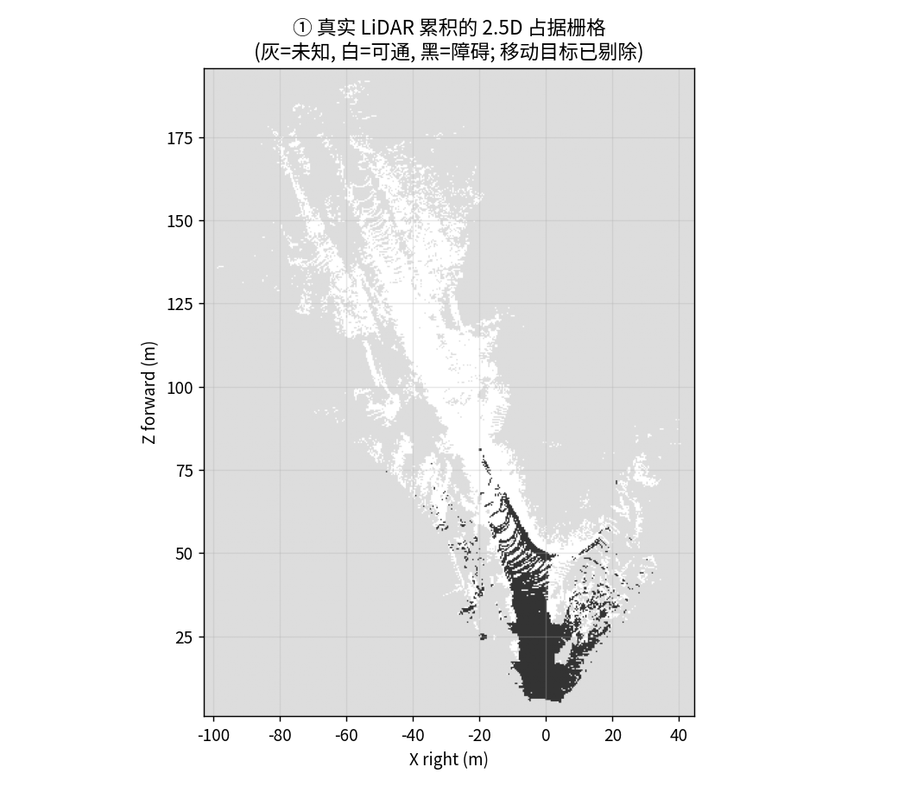
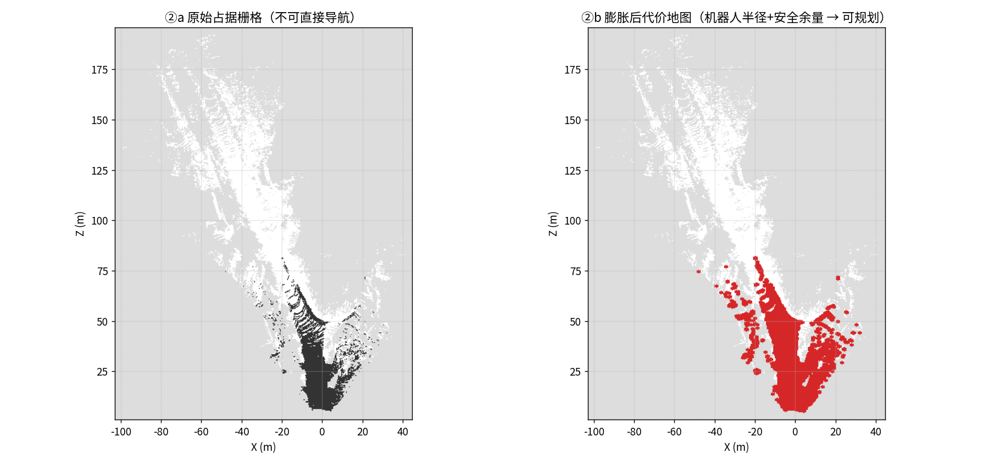
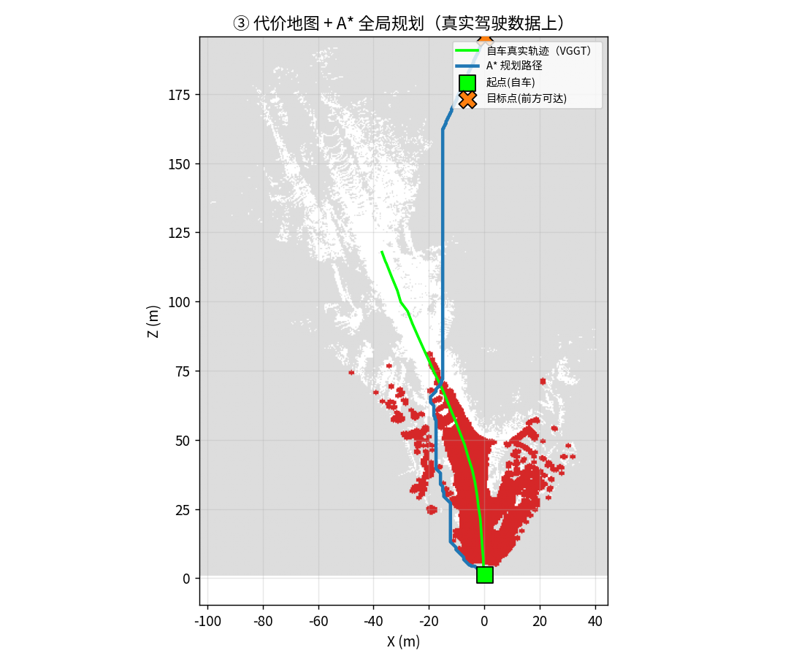
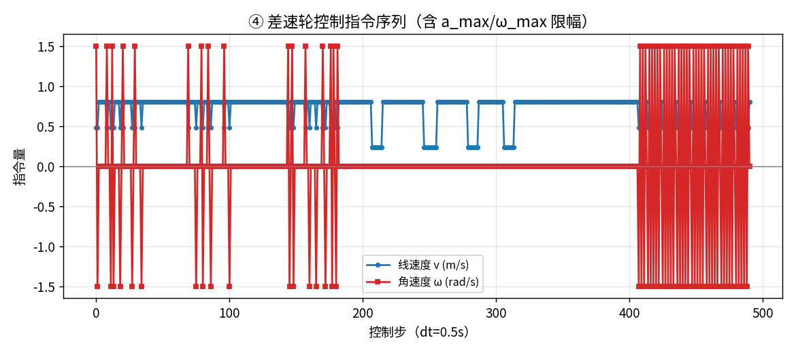
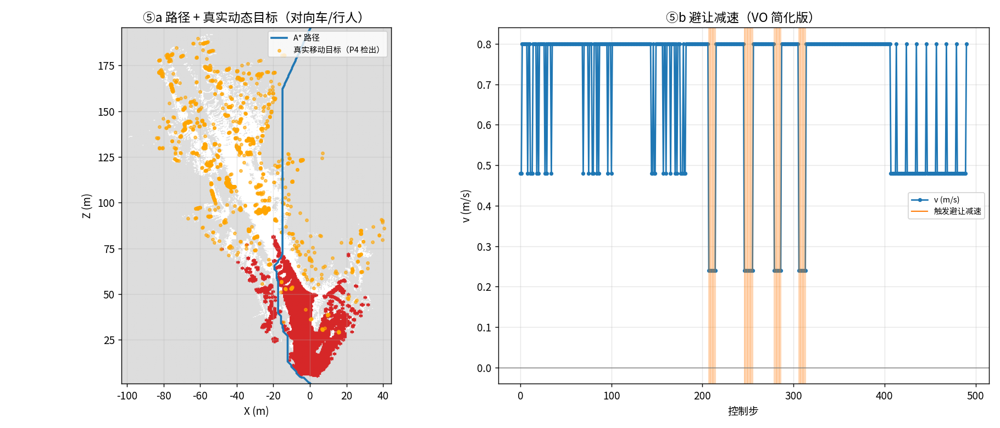
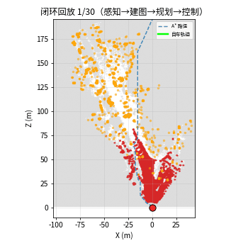

# P5 · 真实驾驶端到端闭环：感知 → 建图 → 规划 → 控制

> **一句话**：`P4` 回答了"真实传感器数据怎么变出一张地图"（自动驾驶栈的**前半段**）；
> 本篇补上它明确缺的那一环——**把那张地图变成能执行的控制指令**：
> 占据栅格 → **inflation 膨胀** → **A\* 规划** → **差速轮控制 (v, ω)** → **动态避障**，
> 全程跑在**同一份真实驾驶数据**（KITTI 真实 RGB + 真实 LiDAR）上。
>
> 与 `P4` 的分工：P4 = 感知→定位→建图→可视化；**P5 = 建图→膨胀→规划→控制**。
> 两者合起来，才是本仓库唯一一条"**真实驾驶数据上的感知→控制全链路**"。
> （对比：`P3` 有完整闭环但输入是 TUM 手持桌面；`F8` 是全栈叙事但基座是仿真。）

---

## ① 30 秒电梯演讲（面试开场）

> "P4 我能从真实车载相机 + 激光雷达数据建出一张俯视地图，但**地图不等于能开**——
> 原始占据栅格没有机器人几何约束，直接规划出来的路会贴着墙走。
> 所以 P5 把这条链补完：先把障碍按**车宽撑胖一圈**（inflation），再用 **A\*** 在代价地图上求出一条
> 从自车到前方目标的可通行路线，然后翻译成**差速轮的线速度/角速度指令**（带加速度和角速度限幅）；
> 路上遇到 P4 检出的**真实移动目标**（对向车、行人），沿路径前瞻触发**速度障碍法式减速让行**。
> 整条链的输入是真实驾驶数据，输出是一串可执行的控制指令——这才是从『看得见』走到『能行动』。"

---

## ② 场景、需求与真实问题

| 项 | 内容 |
|---|---|
| 场景 | 真实城市街道驾驶（KITTI），自车沿走廊前进，需避开对向车/行人 |
| 输入 | **复用 `P4` 的感知结果**：真实 LiDAR 世界点云 + P4 检出的移动目标点 |
| 真实问题 | **地图 ≠ 决策**：原始占据栅格未膨胀、无机器人几何约束 → 不能直接规划；中间缺"膨胀→规划→控制"这条链 |
| 需求 | ① 真实 LiDAR 建图 ② 剔除移动目标（否则地图留"幽灵障碍"）③ 膨胀成规划用代价地图 ④ A\* 规划 ⑤ 差速轮控制 ⑥ 用真实动态目标做避让 |
| 交付 | `costmap_inflated.png` / `map_plan.png` / `control_cmd.png` / `dynamic_avoid.png` / `closed_loop.gif` + `metrics.json` |

---

## ③ 方法原理（专业）

```
P4 前端（真实 RGB + 真实 LiDAR）
   ├─ VGGT 视觉定位 → T_cw → 世界系点云（定标 ×72.433）
   └─ KD-tree 帧间差分 → 移动目标点（dyn_world）
                    │
                    ▼
① 2.5D 占据栅格：地面点(Y<h_min)=可通 / 障碍点(h_min≤Y≤h_max)=占据
   ⚠️ 移动目标格【直接剔除】——动态物体不能进静态地图（否则留幽灵）
                    │
                    ▼
② inflation 膨胀：形态学膨胀障碍 (机器人半径 0.5m + 安全余量 0.3m)
   ← 这一步是"地图能不能导航"的分水岭
                    │
                    ▼
③ A* 全局规划（8 邻域）：起点=自车，目标=前方最远可达点
                    │
                    ▼
④ 差速轮控制 (v, ω)：沿路径求转角 → 含 a_max 限幅 + 转弯降速
                    │
                    ▼
⑤ 动态避障（VO 简化版）：用 P4 检出的真实移动目标点，沿路径前瞻 → 触发减速让行
```

- **建图（本模块）**：把 P4 的世界点云按高度二值化成 2.5D 占据栅格（比 P4 的"高度着色可视化"更接近**规划可用**的表示）。
- **剔除动态**：P4 检出的移动目标栅格直接跳过，**不写入静态地图**——这是新手最容易漏的一步（不剔除 → 地图上有"跑掉的车的幽灵"）。
- **inflation**：用 `cv2.dilate` + 椭圆核按 `(robot_radius + safety_margin)/res` 个栅格膨胀。膨胀后**新增 5 116 个不可通行格**——这些就是"真车过不去、但朴素栅格会说能过"的死亡区。
- **规划**：A\* 与 `P3` 同实现；障碍格 `occ==2` 不可通行，八邻域带对角代价 √2。
- **控制**：路径 → 相邻段方向角差 → `omega = Δθ/dt`（限幅），`v` 按转角降速并按 `a_max` 限幅。参数 `dt=0.5s, v_max=0.8m/s, a_max=1.0m/s², ω_max=1.5rad/s`。
- **避障**：把所有真实移动目标点收集为障碍集合，沿路径前瞻 3 步做距离检查，命中则 `v × 0.30` 减速。

**模块落点**：真实 LiDAR 建图 = `P4`/`F5`；占据栅格 = `F1`/`F6`；A\* 规划 = `F6`/`P3`；差速轮控制 = `F6`/`F7 §8`；VO 避障 = `F6`/`P3`；聚类/检测的动态物体 = `F9 §7.3`。

---

## ④ 直白讲解

P4 给了你一张"车自己走出来的俯视图"，但那张图只是**照片**——车不能照着照片开。原因有三：

1. **障碍物没"撑胖"**：照片里墙是一条细线，但真车有宽度，贴着线走会蹭墙。
   → **inflation** 就是把墙按车宽**往外撑一圈**，撑出来的区域标记为"不能进"。
2. **没有"该往哪走"**：照片不告诉你路线。
   → **A\*** 就是在地图上从"我现在的位置"搜一条到"前方目标"的最短可通行路线。
3. **没有"怎么动"**：路线是坐标点，不是
   → **控制**把路线翻译成左右轮转速（`v` 前进多快、`ω` 拐多少），并按底盘极限限幅。

还有一个**容易被忽略的坑**：P4 标红的对向车是**会动的**，如果把它也当成静态障碍写进地图，
那它开走之后地图上就留下一个**"幽灵墙"**，以后导航每次都绕它——所以 P5 **建图时直接剔除移动目标**。
路上遇到它时，再**实时**减速让行（而不是事先画进地图）。

---

## ⑤ 真实数据验证 + 效果

数据：KITTI depth_completion · drive `2011_09_26_drive_0023_sync` · 30 帧（沿用 P4）。

| 指标 | 数值 | 说明 |
|---|---|---|
| 真实 LiDAR 点（输入） | **564 951** | 复用 P4 世界点云 |
| 移动目标点（P4 检出） | **1 743** | 作动态障碍 + 从静态地图剔除 |
| 占据栅格 | **487 × 369 @ 0.4 m** | ≈195 m × 148 m |
| 障碍格 / 可通格 | **5 038 / 20 570** | 障碍=路侧停车/树/建筑 |
| **剔除的移动栅格** | **8 181** | 若不剔除→地图留幽灵 |
| **膨胀新增不可通行格** | **5 116** | 半径 0.5 m + 余量 0.3 m |
| A\* 路径 | **492 步 / 211.84 m** | 起点=自车，目标=前方可达 |
| 控制指令 | **491 条**（v_max 0.8 m/s，ω_max 1.5 rad/s） | 差速轮 (v, ω) 序列 |
| **避让触发** | **34 步** | 遇到真实移动目标 → 减速 |













**怎么读这几张图**：
- **膨胀对比（② a/b）**：左图黑色=原始障碍（细、贴着路），右图红色=膨胀后（明显"胖"了一圈）——正是这圈红色保证了真车不蹭墙。
- **规划图（③）**：绿色=自车真实轨迹（P4 的 VGGT），蓝色=A\* 路径。因为 LiDAR 视野是**前向锥形**，可通行区自然形成一条走廊，A\* 就在走廊里绕开障碍簇到达前方目标。
- **避障（⑤）**：橙点=真实移动目标（对向车/行人），右侧 v 曲线在它们附近出现**台阶式下陷**——那就是减速让行。

---

## ⑥ 工程叙事：讲给三种人听

- **面试官/同行**：强调三个真实工程判断——① **"地图 ≠ 决策"**：原始占据栅格必须经 inflation 引入机器人几何约束才能规划；② **"动态物体不能进静态地图"**：不剔除就留幽灵障碍，这是 SLAM/建图与感知的接口纪律；③ **"感知→控制的接口是代价地图 + 运动学约束"**（不是点云、不是图像）。
- **客户**："真实驾驶数据进去，出来的是一条可执行路线和轮速指令，还会给对向车让行。"
- **初学者常漏的环节**：① inflation 半径必须匹配真实车体几何（太小会蹭、太大会堵死窄通道）；② 膨胀后可能把窄通道**直接堵死**导致无解；③ 控制必须限幅（加速度/角速度超限真车会打滑/翻）；④ 地图有漂移，但**局部规划仍然可用**（漂移是全局问题，避障是局部问题）；⑤ **位姿估计误差 ≠ 地图误差**（两者会叠加）。

---

## ⑦ 复现

```bash
# 默认：drive 0023，30 帧（复用 P4 前端）
PYTHONPATH=src python scripts/p5_real_driving_closed_loop.py \
    --drive 2011_09_26_drive_0023_sync --max-frames 30

# 调机器人几何 / 栅格精度
PYTHONPATH=src python scripts/p5_real_driving_closed_loop.py \
    --drive 2011_09_26_drive_0013_sync --max-frames 30 \
    --robot-radius 0.7 --safety-margin 0.4 --res 0.4
```

依赖：GPU + 本地 VGGT-1B 权重（`~/models/vggt-1b`，通过 P4 前端调用）；数据 `data/raw/ms/OmniData__KITTI_depth_completion/`（已在磁盘）；`scipy`、`opencv`、`ffmpeg`（GIF 合成）。

---

## ⑧ 诚实边界（必读）

1. **自车运动的"执行"是运动学仿真**：规划出的 `(v, ω)` 是**指令序列**，由 P4 的估计轨迹驱动演示，**不是真车在跑**。真车执行需要底盘 + 电机驱动 + 实时控制环（见 `F7 §8`）。
2. **地图来自视觉估计，无真值位姿** → 地图含 VGGT 漂移；这不是"带真值的闭环评测"，是"**真实数据上的系统贯通**"。（带真值评测见 `M5`。）
3. **动态障碍是启发式检出**（P4 的 KD-tree 帧间差分，非检测器 benchmark）；避障是**反应式减速（VO 简化版）**，不是完整 DWA/MPC，也没有做轨迹预测。
4. **"规划"在真实驾驶语境下是"沿已知走廊到前方目标"**：自车本就在往前开，这里演示的是路径规划 + 运动学可行性，不是"任意想去哪就去哪"的自由导航。
5. **KITTI 数据集的限制沿用 P4**：无毫米波 radar、无 odometry 真值、抽帧序列（帧距 0.6 s）。
6. **原始占据栅格有"自车道近处被判为障碍"的现象**：近距离稀疏 LiDAR 点落在自车前方路面时，受高度阈值影响可能被归为障碍。
   本 demo 未做"自车足迹清除（ego-footprint clearing）"——这是真实量产系统必须具备的一步（把自车所在栅格强制置为可通）。**这是本 demo 与量产系统的差距之一**，也解释了为什么规划路径会贴着走廊一侧走。

---

## ⑨ 它和前后模块的关系

| 维度 | 相关模块 |
|---|---|
| 感知前端（真实 RGB+LiDAR → 定位/点云/移动目标） | **`P4`**（本篇直接复用其函数） |
| 视觉定位模型 | `M4`（VGGT） |
| 视觉+激光融合与标定 | `F5` |
| 占据栅格 / 场景表示 | `F1` |
| 决策与控制原理（costmap/A\*/差速轮/PID/兜底） | `F6` |
| 规划+控制的"真实完整实现"参照（含失效判据与兜底） | `P3` |
| 硬件（LiDAR/相机/算力/电机驱动器） | `F7`（§4 LiDAR、§8 差速轮、§9 算力） |
| 方法选型（配什么传感器、要多少算力、OOD 怎么办） | `F9`（§3 检测、§4 LiDAR、§8 算力） |
| 端侧部署（把 VGGT 换成轻量模型才可能上车） | `M8` |
| 全栈贯通叙事（硬件→感知→控制一条线） | `F8` |

> **本仓库的"真实驾驶"完整链条**：
> `P4`（真实传感器 → 定位 → 建图）→ **`P5`（建图 → 膨胀 → 规划 → 控制）**。
> 想看"**恶劣环境下定位崩了怎么兜底**"→ `P3`；想看"**硬件怎么选**"→ `F7`；想看"**该不该用某个方法**"→ `F9`。

---

*下一篇*：`F8 全栈贯通`（把硬件→感知→控制串成一条线）；或 `F9 方法选型与工程清单`（选型/数据/算力/OOD）。
