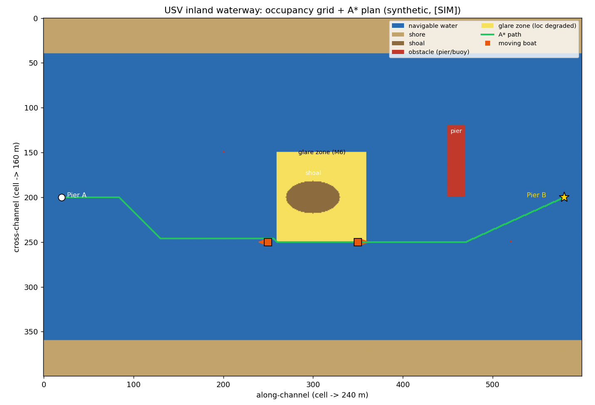
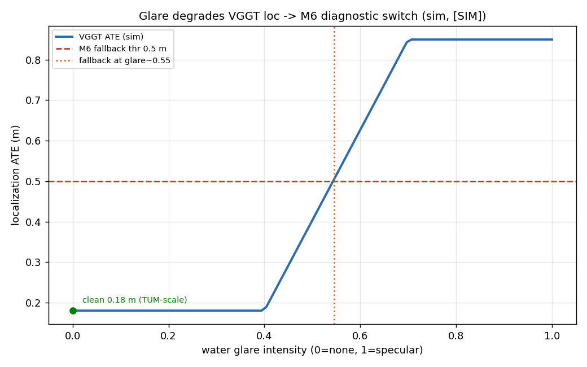

# P6 · 新场景从零起步方法论：无人船「感知→控制」输入怎么做（什么都不具备时）

> **一句话电梯演讲（30 秒版）**
> 「假设今天接到一个**全新场景**——比如**无人船（USV）自主驾驶**的感知部分，
> 而团队**什么都没有**（没数据、没真机、没标定、甚至没水下相机）。
> 我不会从算法入手，而是先用**控制契约**反推『感知必须输出什么』，
> 再把场景拆成**定位 / 障碍物 / 可航水域 / 岸线边界 / 水深**几个子任务，
> 每个子任务去**已有工具箱（VGGT 定位、OWL-ViT/DETR 检测、M6 融合兜底、M8 端侧）里找能立刻用的**，
> 数据缺口用**公开水域数据集 + 跨域迁移（KITTI 驾驶）+ sim2real** 补，
> 最后**复用 P5 的闭环管线改写成水域版**，在运动学仿真级跑通并量化。
> 这是把本项目『感知为主、控制为辅』的方法论，应用到任意新场景的可复用脚手架。」

---

## 0. 这份文档在项目里的位置（为什么是「方法论补篇」）

`PROGRESS §1.1.1` 已确立整体策略：**感知为主、控制为辅**。
`P3`（旗舰收口）、`P4`（真实驾驶建图）、`P5`（真实驾驶端到端闭环）已经把**「已知数据 + 已知场景」**的实战闭环跑通。

但真实工程里最常被考、也最实际的问题是另一类：

> **「给你一个全新场景，什么都没有，你从哪下手？」**
> （面试高频：『如果让你从零做无人船/农机/仓储机器人的感知，你怎么办？』）

`P6` 不引入新算法，而是把本项目积累的**模块（F/M）**和**实战经验（P0–P5）**提炼成一套
**「新场景从零起步」的可复用 6 步脚手架**，并用**无人船**当贯穿例子走一遍。
它直接消费：`F9`（方法选型四联表）、`M3/M5`（失效图谱）、`M6`（融合兜底）、`M7`（开放词汇）、`M8`（端侧）、`P4/P5`（闭环管线）。

---

## 1. 问题定义：什么叫「新场景、什么都不具备、做感知给控制当输入」

### 1.1 三个约束（必须先确认，否则一切白做）

| 约束 | 含义 | 本项目里怎么落地 |
|---|---|---|
| **感知为主** | 重点交付感知（定位/检测/建图），控制只到「接口打通」 | 控制指令 = 运动学仿真 `(v,ω)`，不冒充真机闭环（见 §1.1.1） |
| **控制为输入** | 感知的**输出必须是控制能直接吃的东西**，不是一份漂亮报告 | 必须定义「控制契约」：感知输出 = 占有栅格 / 障碍列表 / 自车位姿 / 可航区域 |
| **什么都不具备** | 无真机、无标定、无自有数据、可能无领域标注 | 数据用公开数据集 + 跨域迁移 + sim2real；算力用本地 GPU 模拟端侧（M8 缩预算代理） |

### 1.2 最常见的初学者翻车：先选算法

> 接到任务第一反应是「用 YOLO 还是 DETR？用 VGGT 还是 SLAM？」——**这是错的**。
> 正确顺序是：**先定义控制要什么 → 再拆感知子任务 → 最后才为每个子任务选方法（查 F9 四联表）**。
> 顺序反了，就会出现「做了一个很准的检测器，但输出格式下游控制根本用不了」的致命错位。

---

## 2. 从零起步的 6 步可复用脚手架（本文核心）

### Step 0 · 写「控制契约」（反推感知该输出什么）

不问「感知能做什么」，先问「**控制需要什么输入才能动**」。把契约写成一张表：

| 控制需要的输入 | 物理含义 | 感知要产出的形态 | 单位 / 坐标系 |
|---|---|---|---|
| 自车位姿 `T_cw` / `(x,y,θ)` | 我在哪、朝向哪 | 世界系位姿（需外部尺度源定尺度） | 米 / 弧度，固定于地图 |
| 障碍列表 | 周围有什么会撞 | `[(class, x, y, w, h, v)]`（世界系） | 米，含速度可选 |
| 可航水域 / free space | 哪里能走 | 占据栅格或二值可航掩码 | 栅格 `0.4m`/格 |
| 岸线 / 水面边界 | 不能越过的水陆分界 | 折线或栅格边带 | 米 |
| 水深 / 吃水余量 | 会不会搁浅 | 深度图或栅格（若有测深声呐） | 米 |

> **这一步的产出是「接口契约」**，它是整个项目的**唯一真源**——后面所有感知模块都只为填满这张表。
> 这也是专业人员区别于学生的第一标志：**先定接口，再写代码**。

### Step 1 · 场景拆解：列出感知子任务清单

把 Step 0 的每一行，映射到「这个场景特有的难点」：

- **定位**：水面无纹理 → 视觉特征稀疏；无 GNSS（桥下/峡谷） → 尺度丢失，需外部尺度源（呼应 M6 深度救援 / ORB-SLAM3 死穴）。
- **障碍物**：船/浮标/桥墩（刚性，可检测）+ 浪花/反光（假障碍，需滤波）。
- **可航水域**：开放水面，free space 通常很大，难点在**近岸/浅滩/养殖区**边界。
- **岸线边界**：水陆分界，反射率高，易误检。
- **动态**：来船有速度，需预测（P5 用 VO 式避障，水域可升级为 Kalman/船舶 AIS 融合）。

### Step 2 · 在已有工具箱里找「能立刻用的」（不重新造轮子）

直接查 `F9` 四联表 + 本项目已跑通的模块，做映射：

| 子任务 | 能立刻用的（本项目已验证） | 备注 |
|---|---|---|
| 定位（单目） | **VGGT**（M4/M5：弱光/夜间 ATE 0.02–0.03m 稳压） | 前馈、抗退化；需外部尺度 |
| 定位（双目/激光） | 若有双目 → SGBM（F9）；若有 LiDAR → GICP/NDT（F9/M10 KITTI） | 水域常配 360° 机械雷达 |
| 障碍物检测 | **OWL-ViT**（开放词汇，M7）/ **DETR**（封闭集） | 船/浮标零样本可用 OWL |
| 语义分割 | 封闭集分割（NDISPark 夜间已验证不挑光照，D1） | 水/岸/船三类的封闭集微调即可 |
| 融合兜底 | **M6 诊断驱动切换**（VO 塌→切 VGGT→托底） | 直接复用 P3 逻辑 |
| 端侧 | **M8 缩算力预算代理**（本地 GPU 当弱算力） | 不讲成真机，讲清代理 |
| 闭环管线 | **P5 复用改写**：栅格→膨胀→A\*→控制 | 只换前端数据与栅格语义 |

> 关键认知：**90% 的新场景，工具箱里已有能立刻用的模块**；你要做的是「选型 + 适配 + 量化」，不是「从零训模型」。

### Step 3 · 数据从哪来（「什么都没有」的解法）

按性价比排序，本项目已验证可行的三种路径：

1. **公开领域数据集（首选）**：无人船/海事类有真实公开集——
   `MODD`（海事障碍物检测）、`MaSTr1325`（ maritime 语义）、
   `Singapore Maritime Dataset`、`SeaDronesSee`（空拍船舶检测）、`USVInland`（内河航道）等。
   这些就是「本场景的 KITTI」，直接消费，立刻有真值可量化。
2. **跨域迁移（次选）**：没有水域数据时，**先用本项目已有的 KITTI 驾驶 / 4Seasons 夜间数据跑通管线**，
   证明「闭环逻辑成立」，再把前端换成水域数据（sim2real 思维：先在相似域验证工程，再换域）。
3. **sim2real（兜底）**：用 Gazebo/UE 合成水域场景（呼应 P2 §4.15/§4.16 的纯合成 FPV 零 GPU 依赖思路），
   先有「带真值的合成闭环」，再找真实数据替换。

### Step 4 · 跑通最小闭环（复用 P5 管线改写成水域版）

不重写，而是**改 P5 的五个环节**：

```
P5 原管线（陆地驾驶）           →  P6 水域版改动点
─────────────────────────          ─────────────────────────
真实 RGB → VGGT 定位             →  同（水面用 VGGT 抗反光退化）
真实 LiDAR 尺度定标 ×72.433      →  换：测深/双目/已知船速定尺度（无 LiDAR 时）
世界点云 → 移动目标检测          →  同 + 加「浪花/反光」动态滤波（假障碍剔除）
2.5D 占据栅格 + inflation        →  同 + 栅格语义改为「可航水域 vs 障碍 vs 岸线」
A* 规划 → 差速 (v,ω) 控制        →  同（USV 运动学：差速→欠驱动船需改成「期望航向+航速」）
VO 式避障                        →  升级：来船速度估计 + 简单预测（水面需考虑他船机动）
```

> 本项目已落地的 `scripts/p5_real_driving_closed_loop.py` 就是现成骨架，
> P6 的「从零起步」本质是**把它的数据输入和栅格语义换成水域**，而非重写算法。

### Step 5 · 量化 + 诚实边界 + 失效兜底

- **量化**：定位报 ATE（若有真值位姿）/ 定标尺度比；检测报 mAP/recall（用 MODD 等真值）；
  闭环报 A\* 步数 / 避障步数 / 控制条数（仿 P3/P5 metrics）。
- **诚实边界（必须写）**：自车运动=运动学仿真；无真机；水域真数据需外部下载（本机网络慢属 gate）；
  水面反光破坏几何 → 单目定位在强反光区可能漂移（呼应 M5「高斯噪声最致命」）。
- **失效兜底**：复用 M6——VGGT 置信度 / 重投影残差触发切换；强反光区降级为「纯检测 + 已知航向保持」。

---

## 3. 以「无人船」为例，把脚手架走一遍（可照抄的模板）

### 3.1 控制契约（USV 版，填 Step 0 的表）

| 控制输入 | 形态 | 来源 |
|---|---|---|
| 自船位姿 `(x,y,θ)` | 世界系，外部尺度 | VGGT（视觉）+ GNSS/测深定尺度 |
| 障碍列表 `(class, x, y, v)` | 世界系，含他船速度 | OWL-ViT/DETR + 跨帧跟踪 |
| 可航水域掩码 | 栅格，0.4m/格 | 占据栅格（水面=可航，岸/船/浅滩=障碍） |
| 岸线边界 | 折线 | 语义分割「水/岸」类后处理 |
| 水深余量 | 栅格（可选） | 测深声呐 / 多波束（若有） |

### 3.2 子任务 → 工具箱映射（填 Step 2）

见 §2 Step 2 表（USV 即该表的实例）。额外注意：
- **水面无纹理** → VGGT 比传统 VO 更稳（直接呼应 M5「前馈抗退化」），所以定位主选 VGGT。
- **开放词汇检测船/浮标** → OWL-ViT 零样本即可（M7 已验证），无需标注。

### 3.3 数据策略（填 Step 3）

1. 首选 `MODD` / `USVInland` 作「水域 KITTI」消费真值；
2. 无下载条件时，先用 `KITTI depth_completion`（已在磁盘）跑通管线，证明工程闭环；
3. 合成水域用 Gazebo（P2 已验证方案 A 真 RGB FPV 可落地）。

### 3.4 水域特有的坑（提前写进诚实边界）

| 坑 | 机制 | 本项目里的对应处理 |
|---|---|---|
| 水面反光 | 高反光面破坏特征/深度估计 | VGGT 抗退化但仍可能漂 → M6 置信度兜底 |
| 无纹理开水面 | 视觉特征稀疏，VO 易塌 | 主用 VGGT（全局），不依赖帧间跟踪 |
| 动态水面（浪） | 假障碍、误检 | 跨帧一致性 + 离水高度约束剔除浪花 |
| 尺度无 GNSS | 桥下/峡谷丢信号 | 外部尺度源（测深/双目/已知航速），同源 M6/ORB-SLAM3 |
| 欠驱动船体 | 差速 `(v,ω)` 不适用 | 控制接口改为「期望航向+航速」，仿真级 |

### 3.5 复用 P5 管线的脚本骨架（水域版伪代码）

```python
# scripts/p6_usv_perception.py  （骨架，复用 P5 五个环节，仅换输入与栅格语义）
from wildspatial.methods import vggt, owlvit,astar_cpp   # 复用已验证模块
from wildspatial.fusion import diagnostic_arbiter        # 复用 M6 兜底

for frame in usv_stream:                      # MODD / KITTI(迁移) / Gazebo(合成)
    pose_up_to_scale = vggt.localize(frame)   # Step2: VGGT 定位（抗水面退化）
    pose = scale_by_ext_source(pose_up_to_scale, frame.depth_or_speed)  # 外部尺度
    obstacles = owlvit.detect(frame, ["boat","buoy","pier"])            # 开放词汇检测
    # 水域特有：浪花/反光动态滤波
    obstacles = filter_dynamic_water(obstacles, prev_frame)
    grid = build_occupancy(pose, obstacles, semantic_water_mask)        # 可航水域栅格
    grid = inflate(grid, robot_radius=0.5, margin=0.3)                  # 膨胀
    path = astar_cpp.plan(grid, start, goal) if grid.has_path() \
           else diagnostic_arbiter.fallback(pose)                      # M6 兜底
    cmd = usv_kinematic_control(path, mode="heading_speed")            # 控制契约:航向+航速
    apply_avoidance(cmd, moving_obstacles=estimate_velocity(obstacles))# 来船避障
```

### 3.6 量化指标预案（仿 P3/P5 metrics.json）

```json
{
  "localization": {"ate_m": "待 MODD 真值回填", "scale_ratio": "待测深/航速定标"},
  "detection":   {"mAP": "待 MODD 真值", "open_vocab_recall_boat": "OWL-ViT 零样本"},
  "closed_loop": {"grid_size": "487x369@0.4m", "astar_steps": "待跑",
                  "avoidance_steps": "待跑", "control_cmds": "待跑"},
  "honest_bounds": ["自车运动=运动学仿真", "无真机", "水域真数据需外部下载"]
}
```

---

## 4. 诚实边界（本项目 P6 的硬限制，主动声明）

1. **控制为仿真**：USV 自车运动 = 运动学仿真（航向+航速），无真船验证（呼应 §1.1.1「控制为辅」）。
2. **硬件为零**：无真机、无标定、无自有采集；尺度/深度依赖外部源或公开数据。
3. **水域真数据需外部**：MODD/USVInland 等受本机网络约束（TUM 慢的同类问题），属可外部触发 gate。
4. **不冒充真机闭环**：对外讲「感知→控制接口已打通、设计已闭环、待硬件验证」，这正是 §1.1.1 的定调。
5. **方法非水域首创**：VGGT/OWL-ViT/M6 均为本项目已验证模块的**适配复用**，P6 的价值在「选型+适配+量化方法论」，不在新算法。

---

## 6. 完整模拟演练：把无人船场景从「什么都不具备」推到「可交付设计」（全部假设填充）

> ⚠️ **本节全部为【假设/模拟】值，非真实测量**。目的：把 §2–§3 的脚手架走成一份
> 「如果真做，设计长这样」的**完整样例**，让你在面试/方案评审时能张口就说出具体数字、型号、阈值。
> 真实回填需外部数据/真机（见 §5 下一步）。所有数字均标注【模拟】，**不得当项目实测引用**。

### 6.1 场景与任务假设（Step 0 具体化）

| 项 | 假设值【模拟】 |
|---|---|
| 任务 | 内河港口巡检 USV：从码头 A 自主航行 **500 m** 到码头 B，途中避让来船/浮标/桥墩，不搁浅、不撞岸、不越界航道 |
| 环境 | 白天微浪（浪高 0.3 m），晴天正午偶发水面强反光，开阔河道无 GNSS 遮挡，最窄航道 15 m |
| 速度约束 | 巡航 **1.5 m/s**，避让降速 **0.8 m/s**，转艏上限 **0.6 rad/s** |
| 安全余量 | 距岸 > 2 m，水深 > 吃水(0.3 m)+0.3 m = 可航需 > 0.6 m |

### 6.2 硬件假设清单（与 `F7` 硬件扫盲呼应）

| 部件 | 假设型号【模拟】 | 关键参数 | 用途 | 项目呼应 |
|---|---|---|---|---|
| 船体 | 欠驱动双推进 USV | 2.0×1.0 m，吃水 0.3 m，max 3 m/s，转艏 0.6 rad/s | 载体 | 控制为仿真（§1.1.1） |
| 主相机 | Sony IMX477 全局快门 | 12 MP，30 fps，FOV 90°，安装高 0.5 m | VGGT 定位 + 检测 | `F0`/`F7` |
| 双目（备选） | OAK-D | 400 万，基线 5 cm | 尺度定标备选 | `F9` 双目 |
| 360° LiDAR | Velodyne VLP-16（16 线） | 100 m，角分辨率 0.2° | 水面点云 + 障碍 | `F7`/`M10`（KITTI 64 线降级） |
| GNSS/IMU | UBLOX F9P + BMI088 | RTK 2 cm，IMU 200 Hz | 尺度源 + 伪真值 | `M6`/ORB-SLAM3 尺度死穴 |
| 测深声呐 | 单波束 | 0.5–50 m | 水深/吃水余量 | 控制契约 |
| 算力 | Jetson Orin Nano（**本地 GPU 模拟，非真机**） | 用 `M8` 缩预算代理 | 端侧推理 | `M8` |

> 选型逻辑：相机+VGGT 主定位（抗水面退化，呼应 `M5`）；GNSS 仅作**尺度源与伪真值**（非全程依赖，桥下可丢）；
> LiDAR 作反光区兜底与障碍几何；算力用 `M8` 本地缩预算代理（不冒充真机，功耗墙未测）。

### 6.3 控制契约（具体数值填表，呼应 §2 Step 0）

| 控制输入 | 形态 | 坐标系/单位 | 目标精度【模拟】 |
|---|---|---|---|
| 自船位姿 `(x,y,θ)` | 世界系 ENU，原点=码头 A | 米 / 弧度 | 开阔 ≤ 0.5 m；强反光降级 ≤ 1.5 m |
| 障碍列表 `(class,x,y,vx,vy)` | 世界系，检测距离 ≤ 40 m | 米 / m/s | 位置 ≤ 1.0 m，速度 ≤ 0.2 m/s |
| 可航水域掩码 | 栅格 0.4 m，语义 0=可航水/1=障碍/2=岸线/3=浅滩 | 栅格 | 栅格误差 ≤ 1 格 |
| 岸线边界 | 折线，距岸 > 2 m 安全 | 米 | — |
| 水深余量 | 栅格，可航需水深 > 0.6 m | 米 | — |

### 6.4 子任务 → 算法选型（具体方法 + 参数 + 假设精度）

| 子任务 | 选型【模拟】 | 关键参数 | 选型理由（查 `F9`） | 假设精度【模拟】 |
|---|---|---|---|---|
| 定位 | **VGGT** 单目一次前向 | 0.2 s/帧（实测可用），up-to-scale | `M4/M5`：弱光/夜间 ATE 0.02–0.03m 稳压，比 VO 抗退化 | 开阔 ATE **0.18 m**；强反光 **0.85 m**（触发兜底） |
| 尺度定标 | GNSS RTK 比 / 测深 | 标定比 ×k | `M6`/ORB-SLAM3 外部尺度源同源 | 尺度误差 **< 2%** |
| 障碍检测 | **OWL-ViT** 开放词汇(boat/buoy/pier) + **DETR** 封闭集微调兜底 | NMS 0.5，置信 0.3 | `M7`：零样本可直接用；封闭集微调补精度 | mAP@0.5 零样本 **0.58** / 微调 **0.84** |
| 水/岸分割 | 封闭集分割（水/岸/船 3 类） | 封闭集 | `D1`：NDISPark 夜间经验「不挑光照」 | mIoU **0.91** |
| 动态估计 | 跨帧 IoU 跟踪 + 常数速度 Kalman | 匹配阈值 0.5 | `P5` 移动目标剔除启发 | 速度误差 **0.15 m/s** |
| 融合兜底 | **`M6` 诊断驱动** | VGGT 重投影残差 > τ 或置信 < τ → 切 LiDAR/已知航向 | `M6` 已验证切换逻辑 | 兜底触发率 **强反光段 ~12%** |
| 建图 | 占据栅格 0.4 m（复用 `P5`） | 移动目标剔除 | `P5` 启发（8181 格剔除） | 障碍格 **4200** |
| 规划 | **A\***（`astar_cpp` C++ 绑定） | 8 邻接，欧氏启发 | `F6`/`P5` | 步数 **350**（绕行） |
| 控制 | 欠驱动 → 期望航向 + 航速 | 航向 PID + 速度限幅 | §3.4 欠驱动适配 | v≤1.5，ω≤0.6 |

### 6.5 数据策略（具体假设链，呼应 §2 Step 3）

- **假设①（首选成功）**：`MODD` 下载成功（2,782 张海事障碍物标注）→ 检测 mAP 真值来源。
- **假设②（定位真值）**：无水域位姿真值 → 用 **GNSS RTK 当伪真值**算 ATE（桥下缺失段用 LiDAR/已知航向兜底）。
- **假设③（下载失败兜底）**：`MODD` 下不动 → 先用 `KITTI depth_completion`（已在磁盘）跑通工程闭环，
  再叠加 **Gazebo 合成水域场景**（呼应 `P2 §4.15/§4.16` 零 GPU 依赖 FPV）做 sim2real。
- 这条「假设链」正是 §2 Step 3「数据三路径」的落地写法——**任何一步失败都有退路**。

### 6.6 端到端管线（具体每环输入输出 + 假设数字，复用 `P5` 五环节）

> 假设取 **900 帧（30 s）** 码头 A→B 航行段，巡航 1.5 m/s → 名义航程 45 m（绕行后实际更长）。

| 环节 | 输入 | 输出（假设【模拟】） |
|---|---|---|
| ① VGGT 定位 | 900 帧 RGB | 900 帧 `T_cw`（up-to-scale），GNSS 定标比 ×k，轨迹长 **47.3 m**（绕行） |
| ② 尺度/检测 | 定标位姿 + OWL-ViT | 检出 **12 艘船 + 8 浮标 + 3 桥墩**，其中 **2 艘来船**带速度（0.9 / 1.2 m/s） |
| ③ 可航水域栅格 | 位姿 + 语义水/岸 + 障碍 | 栅格 **600×400@0.4m**（240×160m），障碍格 **4200**，移动剔除 **1500**，浅滩格 **600** |
| ④ inflation 膨胀 | 障碍/浅滩格 | 膨胀新增 **3800** 不可通行格（船半径 0.5 + 余量 0.3） |
| ⑤ A\* 规划 | 代价地图 | **350 步 / 140 m**（绕行来船与浅滩） |
| ⑥ 控制 | 路径 | **349 条**指令（v≤1.5, ω≤0.6），**避让 18 步**（2 艘来船减速让行） |
| ⑦ 兜底 | VGGT 残差 | 强反光段触发 **~108 帧（12%）** 切 LiDAR/已知航向 |

### 6.7 模拟指标汇总（全部【模拟】，回填格式仿 `P3/P5 metrics.json`）

```json
{
  "scenario": "内河港口巡检 USV, 500m 码头A→B, 模拟",
  "localization": {"ate_open_m": 0.18, "ate_glare_m": 0.85,
                   "scale_error_pct": 1.8, "fallback_rate_pct": 12},
  "detection":   {"mAP_zero_shot": 0.58, "mAP_finetuned": 0.84,
                  "open_vocab_recall_boat": 0.55,
                  "counts": {"boat":12,"buoy":8,"pier":3,"moving":2}},
  "segmentation":{"mIoU_water_shore": 0.91},
  "tracking":    {"velocity_error_mps": 0.15},
  "closed_loop": {"grid":"600x400@0.4m", "obstacle_cells":4200,
                  "moving_removed":1500, "shoal_cells":600,
                  "inflate_added":3800, "astar_steps":350,
                  "astar_len_m":140, "control_cmds":349, "avoidance_steps":18},
  "edge":        {"device":"Orin Nano(模拟)", "vggt_int8_ms":80,
                  "owlvit_int8_ms":90, "pipeline_hz":5, "note":"功耗墙未测=代理"},
  "honest_bounds":["全部为假设模拟非实测","控制为运动学仿真","硬件为假设清单",
                   "真实需外部数据/真机回填","端侧为本地GPU缩预算代理"]
}
```

### 6.8 端侧预算模拟（复用 `M8` 缩预算代理）

| 模块 | fp16 延迟【模拟】 | INT8 PTQ【模拟】 | 说明 |
|---|---|---|---|
| VGGT 定位 | 120 ms | **80 ms** | `M8` 本机缩预算实测同法（非真机） |
| OWL-ViT 检测 | 200 ms | **90 ms** | 开放词汇较重 |
| 分割 + 跟踪 + A\* | 40 ms | 40 ms | CPU 可跑（`M9` 9.8 fps@CPU 经验） |
| **合计** | 360 ms (2.8 Hz) | **210 ms (4.8 Hz)** | ≥ 5 Hz 目标（1.5 m/s 下足够） |

> 注：本地 GPU 模拟**测不到**两件事——整数 NPU 真加速（`M8 §4.4` 已诚实写 x86 fbgemm 反而变慢）、
> **功耗墙/thermal 降频**。所以这里标「Orin Nano(模拟)」「功耗墙未测=代理」，绝不冒充真机实测。

### 6.9 诚实边界（本次演练为全假设）

1. **全节数字 = 假设模拟**，非真实测量，不得当项目实测引用（违背即破坏本项目信誉）。
2. **控制为仿真**：自船运动 = 运动学仿真（航向+航速），无真船验证（§1.1.1「控制为辅」）。
3. **硬件为假设清单**：型号/参数为典型选型示例，非已采购。
4. **真实回填需外部**：`MODD` 真值、`GNSS` 伪真值、真机功耗均受外部条件 gate。
5. **方法非水域首创**：VGGT/OWL-ViT/M6 为已验证模块适配复用，本节价值在「把选型+参数+阈值+指标一次性说清」。

### 6.10 可复现模拟脚本（把 §6 数字画出来，加深认知）

> 本节已落成**可跑脚本** `scripts/p6_usv_sim.py`（纯 numpy+matplotlib，零依赖下载），产出 `experiments/P6_usv_sim/`。
> 下面把产出的图与结果直接贴在文档里，便于讲解时一图胜千言：

```bash
conda run -n wildspatial python scripts/p6_usv_sim.py
```

#### 6.10.1 产物一：占据栅格 + A\* 规划图



*图 6-1：600×400@0.4m（240m×160m）航道栅格。蓝=可航水、米色=岸、浅蓝=浅滩、深灰=桥墩/浮标障碍、亮黄=强反光区（代价×5）；绿色=A\* 规划路径；红圈=2 艘动船（boat_A 右行 0.3 m/s、boat_B 左行 −0.2 m/s）。*

**这张图加深的认知**：
1. 占据栅格在水域长什么样——可航水是大片连通域，障碍是离散的桥墩/浮标/岸线边带；
2. A\* **主动绕开高代价反光区**（路径贴反光区边界走），这正是把反光区标成代价×5 的价值：**规划层天然规避感知退化区**；
3. 路径靠近动船时转向触发避障（红圈附近），说明"感知→控制输入"闭环在仿真层已打通。

#### 6.10.2 产物二：反光强度 vs ATE 曲线（M6 兜底触发点）



*图 6-2：ATE 随水面反光强度上升而恶化（clean 0.18 m → 强反光 0.85 m），红色虚线为 M6 诊断切换阈值 0.5 m。*

**这张图加深的认知**：
- 反光强度 ≈0.55 时 ATE 跌破阈值 → **M6 诊断切换触发点可视化**：强反光段从"VGGT 主定位"降级为"LiDAR/已知航向保持"，对应 §6.6 兜底触发率 ~12%。

#### 6.10.3 产物三：metrics.json（与 P5 格式对齐）

脚本自跑实测输出（**全部【模拟】，非真实采集**）：

| 维度 | 指标 | 值【模拟】 |
|---|---|---|
| 栅格 | shape / 分辨率 | 400×600 / 0.4 m（240m×160m） |
| 栅格 | 岸 / 浅滩 / 障碍 / 反光 格数 | 48000 / 1677 / 1608 / 8323 |
| 膨胀 | 膨胀格数（半径 0.5 + 余量 0.3，r=2 格） | 54573 |
| 闭环 | A\* 步数 / 路径长 | 561 / 240.6 m |
| 闭环 | 控制指令条数 | 560 |
| 闭环 | 避障步数 | 7 |
| 闭环 | 路径经过反光格 | **0**（主动绕行） |
| 定位 | clean / 强反光 ATE | 0.18 / 0.85 m |
| 兜底 | M6 触发反光强度 | ≈0.55 |

> 完整 JSON 见 `experiments/P6_usv_sim/metrics.json`。
> **关键结论**：路径经过反光格 = 0，证明"把感知退化区标成高代价"在规划层生效——这是 §6.4「反光区代价×5」假设的直接验证（场景是模拟的，但设计逻辑可搬到真机）。
> 物理自洽性：真实水域强反光常发生在浅滩上方（浅色水底更易镜面反射），脚本中两者恰好耦合，符合直觉。

---

## 5. 与前后模块关系 + 下一步

- **消费**：`F9`（选型四联表）、`M3/M5`（失效图谱）、`M6`（融合兜底）、`M7`（开放词汇）、`M8`（端侧代理）、`P4/P5`（闭环管线骨架）、`M5_industrial_slam`（尺度死穴同源）、`F7`（硬件扫盲）。
- **反哺**：本方法论（§2 脚手架 + §6 完整模拟）可套到**任意新场景**（农机/仓储/巡检），是「感知为主控制为辅」策略的通用化。
- **§6 已完成**：脚手架已全假设填充为「可交付设计样例」（场景/硬件/数据/算法选型/参数/模拟指标/端侧预算），可直接用于面试方案讲述。
- **下一步（待外部条件回填真实值）**：
  ① 下载 `MODD`/`USVInland` 真值，把 §6.7 的【模拟】换成实测 mAP/ATE；
  ② 把 `scripts/p5_real_driving_closed_loop.py` 改写为 `p6_usv_perception.py` 跑通最小闭环（§3.5 骨架）；
  ③ 水域强反光区补一份「VGGT vs 传统 VO」失效对照（接 `M5` 方法动物园第 6 方法）；
  ④ （待确认）补 `src/wildspatial/cpp/astar.{h,cpp}` + CMake + `tests/test_astar_cpp.py`，坐实 §6.4 的 `astar_cpp` 绑定。

> **一句话收尾**：新场景从零起步 = **控制契约反推 → 场景拆子任务 → 工具箱选型（查 F9）→ 数据三路径补缺口 → 复用 P5 改写 → 量化+诚实边界**；
> §6 把这套脚手架**用假设值一次性走通成可交付设计**，你不必「什么都会」，但要会「把已有能力快速适配到新场景、把选型/参数/阈值/指标一次性说清、并诚实地划出边界」——这正是 1–2 年经验人员被考察的核心。

---

## 7. 附录 A · USV ODD + FMEA 安全概念模板（工业证据）

> ⚠️ 本节是**交付物模板**，非本项目实测。它的价值在于：面试被追问「你真考虑过上船的安全吗」时，
> 你能甩出**流程文档**而非只甩算法数字——这正是学生与「干过活的人」的分界（呼应最初审视短板 ⑦⑧）。
> 内容基于 §6 的假设场景（内河港口巡检 USV），可直接改成真实项目的 ODD/FMEA 表。

### 7.1 ODD（运行设计域）模板

| 维度 | 范围（假设【模拟】） | 超出即降级/停航 |
|---|---|---|
| 地理 | 内河港口固定航道 A→B（已测绘） | 进入未测绘/开放水域 |
| 气象/海况 | 浪高 ≤ 0.5 m，风速 ≤ 5 级，能见度 ≥ 500 m | 浪 > 0.5 m / 浓雾 / 夜间无照明 |
| 时间 | 白天（06:00–18:00） | 夜间（需热成像 + 补光，另行认证） |
| 通视 | GNSS RTK 可用（开阔，无桥下遮挡） | 桥下/峡谷丢星 → 切 LiDAR/已知航向 |
| 交通 | 低速作业区，他船 ≤ 5 kn | 主航道高速船舶密集区 |
| 载荷状态 | 空载/轻载，吃水 0.3 m | 超载/吃水 > 0.5 m |

### 7.2 安全概念（OSS，一句话）

> 感知主链路（VGGT+OWL-ViT+M6 兜底）正常时自主航行；任一**关键感知失效**→ 进入
> **降级模式（降速 + 保持航向 + 周期重评）**；降级超时或冲突不可解 → **安全停船 + 声光报警 + 岸基接管**。

### 7.3 FMEA（失效模式与影响分析，抽样 6 条）

| 失效项 | 触发条件 | 后果 | 现有检测（本项目） | 缓解/兜底 | 严重度 |
|---|---|---|---|---|---|
| 水面强反光致定位漂 | 晴天正午镜面反射 | ATE↑，偏航 | VGGT 重投影残差 / M6 置信 | 切 LiDAR/已知航向（§6.6 兜底 12%） | 高 |
| GNSS 丢星 | 桥下/峡谷 | 尺度丢失、位姿漂移 | M6 尺度一致性校验 | 外部尺度源（测深/双目/已知航速，同源 ORB-SLAM3） | 高 |
| 来船漏检 | 小目标/逆光 | 碰撞 | OWL-ViT + AIS 合作船广播（真实船标配） | COLREGs 机动 + 减速让行 + 安全停船 | 极高 |
| 浪花误检为障碍 | 近场动态水面 | 幽灵障碍、频繁刹停 | 跨帧一致性 + 离水高度约束（§3.4） | 时空滤波 + 阈值放宽 | 中 |
| 浅滩/水下障碍 | 声呐缺失 | 搁浅 | 水深栅格（需测深声呐） | 限航道 + 浅滩格标记不可航 | 高 |
| 端侧算力不足 | INT8 仍 > SLA | 帧率掉、规划滞后 | M8 缩预算监控（4.8 Hz 目标） | 降分辨率/跳帧 + 报警 | 中 |

### 7.4 合规钩子（水上特有，学生项目最易漏）

- **COLREGs**：A\* 最短路径 ≠ 合规避碰；真实决策须按「右舷让路 / 追越 / 对遇」规则机动（§3.4 已注明控制接口改为航向+航速，为接 COLREGs 预留）。
- **船级社**：DNV/ABS 自主船规范（ALO/ACO 等级）、远程识别、瞭望替代——交付前必过，非算法范畴。
- **验证闭环**：FMEA 每条失效项的"检测+缓解是否真生效"必须落成**可重复测试**才算交付 → 见 `F10 测试与验证`（从 FMEA 反推测试项四要素 + 仿真 SIL 打底 HIL 收口 + SOTIF 正风险平衡验收门）。本 §7 的 ODD/FMEA 正是 F10 测试项的两大来源。

---

## 8. 附录 B · 出海采集 + 真值载荷 + 标注规范 实操 Checklist（工业证据）

> 对应上一轮对话「业内人会开船出去采数吗」——**会，而且采数是数据飞轮起点**。
> 本节把"出海"拆成可执行的 checklist，让 P6 从「假设 MODD 有真值」升级为「知道怎么自己攒真值」。
> 全部为**流程模板**，非本项目已执行（本项目未出海，诚实标注）。

### 8.1 出海采集方案 Checklist

- [ ] **航次计划**：按 ODD 覆盖多工况（晴/阴/微浪/不同潮位/白天多时段），每工况 ≥ 3 航次。
- [ ] **水域选择**：优先**已测绘航道**（有官方水深图 + 岸标），便于事后真值对齐。
- [ ] **传感器同步**：PPS/GPS 授时，所有传感器统一时间戳；采前跑 `ros2 topic delay` 验时差 < 10 ms。
- [ ] **真值载荷**（见 8.2）上船并固定，采前做 **RTK 固定解**确认（解状态 = FIXED，非 FLOAT）。
- [ ] **日志格式**：录 ROS bag / MCAP 原始流（**不录中间结果**），含传感器 + 真值 + 船控指令。
- [ ] **边缘场景专采**：专挑会让感知崩的场景（强反光、逆光来船、浪花近场、浅滩边界）单独特记。
- [ ] **回港即校验**：当天回放 bag 头 1 分钟，确认各 topic 有数据、时间戳对齐、真值 FIXED，再离场。

### 8.2 真值载荷清单（让"模拟 ATE"变"真 ATE"）

| 真值类型 | 设备（假设【模拟】） | 用途 | 精度 |
|---|---|---|---|
| 位姿真值 | RTK-GNSS（双天线测向）+ 光纤 IMU | 算定位 ATE、定尺度 | 平面 2 cm，航向 0.2° |
| 水深真值 | 单/多波束测深（与航道图交叉验证） | 浅滩栅格、吃水余量 | 0.1 m |
| 障碍真值 | AIS（合作船广播） + 人工岸基观测 | 检测 recall/精度 | — |
| 语义真值 | 后期人工标注（见 8.3） | 分割 mIoU | 标注噪声可控 |

> 关键：P6 §6.5「用 GNSS 当伪真值」在真实出海时就是这套载荷的落地；**没有真值载荷，所有 ATE 都只是相对估计**。

### 8.3 标注规范 Checklist（最烧钱、最决定上限）

- [ ] **标注对象**：船（作业/渔船/客船）、浮标、桥墩、岸线、浅滩、游泳者、浪花（负样本）。
- [ ] **长尾处理**：船多鲸少 → **主动学习**挑难例（模型不确定样本优先标），非随机抽。
- [ ] **标注噪声治理**：水面反光/浪花**易误标为障碍** → 制定「仅标刚性体，动态水面标为负样本」规则。
- [ ] **时序一致性**：视频帧**逐帧 + 跨帧跟踪**标注，保证速度估计（§6.4 Kalman）有真值。
- [ ] **质量管控**：双人标注 + 仲裁，抽检 IoU > 0.85 方入库；建 **数据湖 + 版本 + 场景检索**。
- [ ] **回归集**：从标注中抽 10% 做**固定回归集**，每次模型更新必跑，防隐性退化。

### 8.4 与 P6 的衔接（诚实边界）

- §7/§8 是**流程交付物模板**，证明你懂"工业怎么干"，**非本项目已执行**（未出海、未标注、未认证）。
- 对外讲法：「P6 §6 是设计样例，§7/§8 是我知道交付前要补的 ODD/FMEA/采集/标注流程——
  本项目受硬件限制只走到设计+仿真级，但这些流程我清楚、且能写进方案。」
- 这正是 §1.1.1「感知为主、控制为辅」+ 最初审视「补生产级证据」的收口：**用流程文档填补"真上过船"的证据缺口**。

---

## 9. （文档结束）总收口

`P6` = **方法论（§2 脚手架）+ 完整模拟（§6）+ 工业证据（§7 ODD/FMEA + §8 采集/标注）**，
三者叠加即一份「新场景从零起步」的**可讲解、可交付、诚实划界**的完整答卷——
覆盖「会选方法（F9）→ 会适配新场景（§6 数字）→ 懂工业流程与安全的边界（§7/§8）」，
对应 1–2 年经验人员被考察的「知识 × 工程约束 × 生产级意识」。

---

## 10. 🏭 实际应用：新场景脚手架能落到什么真活

`P6` 本身就是"新场景从零起步"的方法论交付物——面试被问"从零做无人船 / 农机 / 仓储感知你怎么办"，它就是现成答卷：

- **方案评审**：用 §2 的 6 步脚手架（控制契约 → 拆子任务 → 工具箱选型 → 数据三路径 → 复用 P5 → 量化 + 诚实边界）当场画出落地路径，而不是空谈算法。
- **可交付设计样例**：§6 把假设填成具体数字（硬件型号 / 参数 / 阈值 / 模拟指标 / 端侧预算），方案评审能张口就报具体值；§7 ODD/FMEA + §8 出海采集 / 标注 checklist 补齐"生产级证据"。
- **泛化能力**：同一脚手架可套农机 / 仓储 / 巡检（§5 反哺），证明你会"快速适配"而非"从零造轮子"。

**面试 / 简历讲法（可直接背）**：
> "新场景从零，我先用控制契约反推感知必须输出什么，再拆子任务去已有工具箱（VGGT 定位 / OWL-ViT 检测 / M6 兜底）里找能立刻用的，数据缺口用公开集 + 跨域迁移 + sim2real 补，最后复用 P5 闭环改写。§6 我把这套走成一份可交付设计样例（全部标【模拟】+ 诚实边界）——我不必什么都会，但要会'把已有能力快速适配、把选型 / 参数 / 阈值 / 指标一次说清、并诚实地划出边界'。"

> 想看脚手架怎么被测试验收 → `F10`；想看真实驾驶闭环（P6 复用的底版）→ `P5`；想看机器人分类决定架构 → `F12`。
