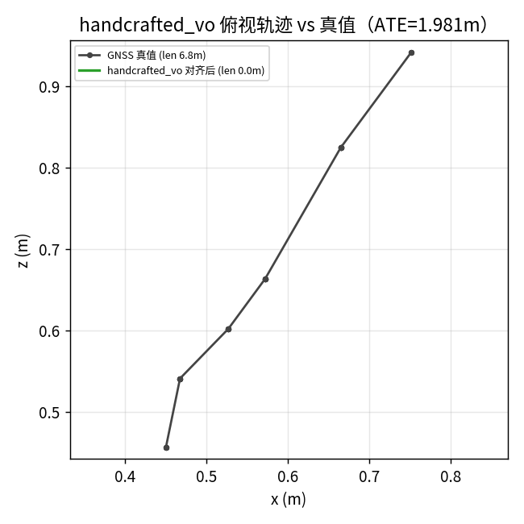
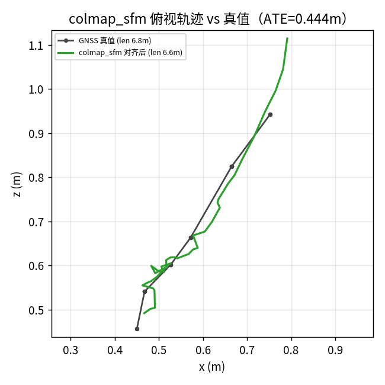
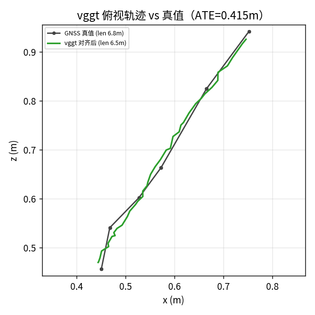
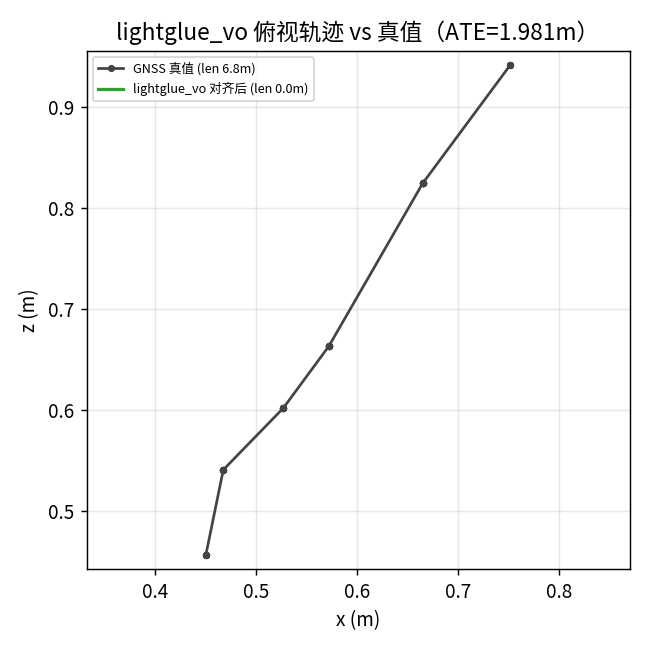

# 4Seasons 真实退化序列 · 方法对比

**序列**：`stereo.zip`（40 帧，cam0 单目）
**内参**：fx=501.48 fy=501.48 cx=421.80 cy=167.66
**GT 整段路径长**：6.8 m

## 目的
把真实恶劣天气序列接入方法动物园，检验 VGGT 是否仍碾压几何法（对照 M5 合成退化结论）。

## 方法原理
各方法输出相机光心轨迹，与 GNSS 真值按时间戳对齐后 Sim3 对齐算 ATE。

## 结果
| 方法 | ATE(m) | 估计路径长(m) | GT对应路径长(m) | 状态 |
|---|---|---|---|---|
| handcrafted_vo | 1.980531223862097 | 0.00 | 6.75 | 跟踪丢失/退化 |
| colmap_sfm | 0.44427709602368676 | 6.58 | 6.75 | OK |
| vggt | 0.4150287341855229 | 6.52 | 6.75 | OK |
| lightglue_vo | 1.980531223862097 | 0.00 | 6.75 | 跟踪丢失/退化 |

**最优（有效）**：vggt（0.415m）

> 注：标记为「跟踪丢失/退化」的方法，其估计轨迹几乎没动（路径长 << GT），ATE 只反映「没动」而非「定位偏差」——这是经典几何法在夜间低纹理上丢失跟踪的典型表现，并非算法算错了位置。

## 俯视轨迹对比（对齐后 vs GNSS 真值）

### handcrafted_vo

### colmap_sfm

### vggt

### lightglue_vo

