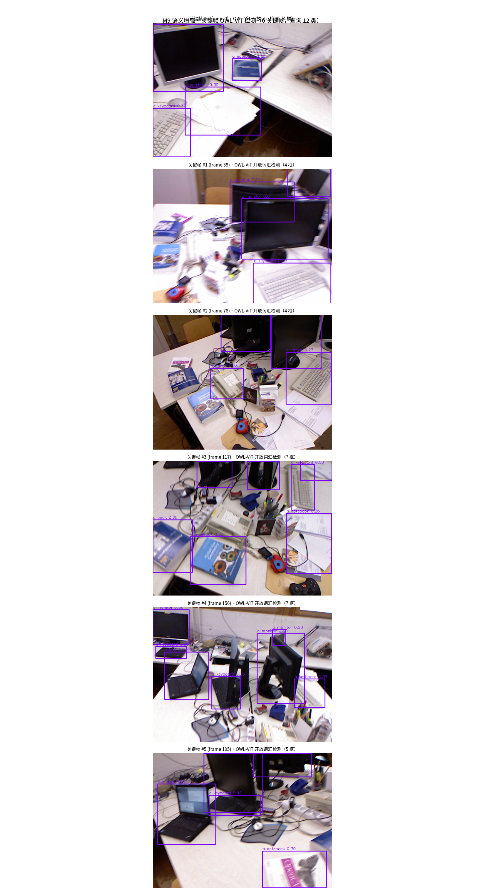

# M9 · 综合闭环：把世界解构成 3D 场景图（带真实语义标签）

## 1. 目的（这个实验回答什么？）

`M0–M8` 各管一段：M1 给位姿、M2/M4 给深度、M6 给多模态救援、M7 给语义、M8 给端侧。
M9 是整条路线的**收口**：把感知结果变成机器能用的结构化表达——
**场景图（Scene Graph）**：一组带 3D 坐标和 class 标签的物体实例 `{class, x, y, z, 出现次数}`。

本实验用 TUM RGB-D `fr1/desk` 验证：
- 朴素版只用深度前景分割得到“未知物体”；
- **语义增强版**接入 M7 的 OWL-ViT，让 2D 开放词汇框反投影成**带真实 class 标签**的 3D 物体，
  实现「几何 × 语义」真闭环。

---

## 2. 方法/运行（怎么复现？）

核心脚本：

```bash
# 朴素版：深度前景分割 → 反投影 → 聚类（class 字段为 unknown）
PYTHONPATH=src python scripts/m9_scene_graph.py --seq fr1/desk --frames 200 --stride 3

# 语义增强版：+ OWL-ViT 开放词汇检测 → 框内深度中位数反投影 → 同类 3D 聚类
PYTHONPATH=src python scripts/m9_scene_graph_semantic.py --seq fr1/desk --frames 200 --stride 3
```

语义增强版流水线：
1. **定位**：M1 `MonocularVO` 跑完序列，输出关键帧位姿 `T_wc`。
2. **语义**：M7 `OWL-ViT` 在关键帧上做开放词汇检测（12 类室内查询：monitor/keyboard/book/laptop/notebook/phone 等）。
3. **解构**：对每个检测框取框内**中位有效深度**，按相机内参反投影 → 相机系 3D → `T_wc` 转到世界系。
4. **聚合**：同类 3D 点按欧氏距离 0.5m 贪心聚类成持久实例。

> 全程离线：OWL-ViT 权重来自 `/tmp/owlvit` 本地缓存。

---

## 3. 结果（实测数字 + 图）

### 朴素版 `m9_scene_graph.py`

| 指标 | 实测 |
|---|---|
| 序列 | `fr1/desk` |
| VO 帧率 | **9.8 fps**（纯 CPU） |
| 关键帧 | 6 |
| 反投影物体候选 | 16 |
| 场景图实例 | 16（class 字段为 unknown） |


### 语义增强版 `m9_scene_graph_semantic.py`

| 指标 | 实测 |
|---|---|
| 序列 | `fr1/desk` |
| VO 帧率 | **9.7 fps**（纯 CPU） |
| 关键帧 | 6 |
| OWL-ViT 查询词 | 12 个 |
| 原始检测 | **31** |
| 聚类实例（全量） | **21** |
| 跨帧稳定实例（n_det≥2） | **6** |

**每类命中**：a monitor=11，a keyboard=7，a notebook=6，a phone=3，a laptop=3，a book=1。

**关键帧 OWL-ViT 开放词汇检测示意**（6 关键帧，粉色框 = 检测框 + 标签）：



**带真实 class 标签的 3D 场景图**（只显示跨帧稳定实例 n_det≥2）：


> 图例颜色：keyboard（蓝）、monitor（橙）、notebook（绿）、phone（红）。
> 每个星号 = 一个 `{class, xyz}` 的 3D 物体，机器可直接用于抓取/导航。

---

## 4. 结论 / 边界 / 下一步

### 结论
1. **几何×语义闭环可跑**：同一条 CPU 流水线上，VO 9.7 fps + OWL-ViT 前向，能把“房间里有 monitor、keyboard、notebook、phone”变成真实 3D 坐标。
2. **场景图是感知到决策的接口**：输出不再是像素，而是 `{class, x, y, z}`——机器人能据此抓取、避障、导航。
3. **开放词汇检测在常规室内场景中可用**：monitor/keyboard 等常见词命中稳定，与 D1 中“域外细粒度失效”形成对照。

### 诚实边界
- **未做跨帧 tracking / 数据关联**：同一显示器在多个关键帧里被反投影到略有不同的 3D 位置，0.5m 聚类可能把它拆成多个实例；
  反之若放宽阈值又可能把邻近的不同物体合并。这正是生产化 M9 的 gap。
- **单帧检测噪声**：book / laptop 等只在 1 帧出现，未达可视化阈值（n_det≥2），但仍在 `scene_graph_semantic.json` 中保留。
- **深度来自框内中位数**：框若覆盖前景和背景，深度会有偏差；真实系统建议用实例分割掩码精确抠前景。

### 下一步
1. 加 **tracking / 多视图一致性**（如 SORT/DeepSORT 或 3D 卡尔曼），把多帧同类检测关联成持久物体。
2. 用 **实例分割**（如 Segment Anything）替换矩形框，让深度采样更准。
3. 接 **M8 端侧引擎**，在 Jetson/昇腾上实测整条闭环的延迟与功耗。

### 相关文件
- 脚本：`scripts/m9_scene_graph.py`、`scripts/m9_scene_graph_semantic.py`
- 文档：`docs/M9_comprehensive_closed_loop.md`
- 产出：`figs/scene_graph.png`、`figs/scene_graph_semantic.png`、`figs/kf_owl_det.png`、
  `metrics.json`、`metrics_semantic.json`、`scene_graph.json`、`scene_graph_semantic.json`
