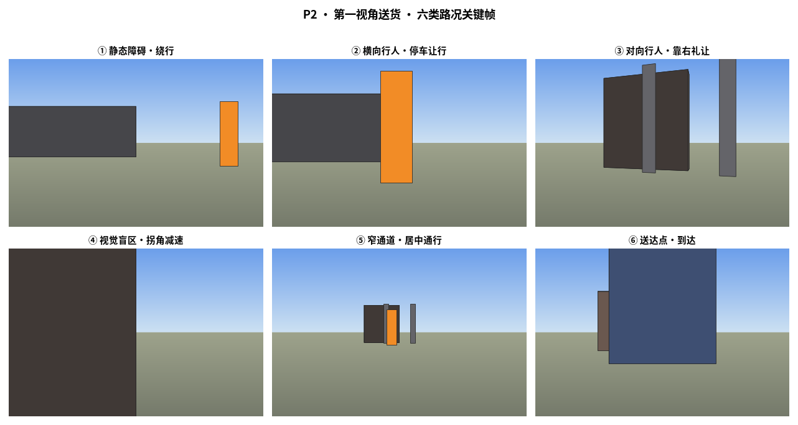
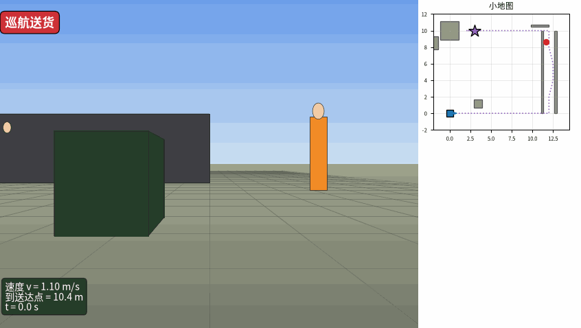

# P2 · 第一视角（FPV）送货演示

> 机器人去**固定地点**送货，一路以**第一人称 3D 视角**看世界，并依次处理 6 类真实路况。

## ① 为什么做这个

上一版 [`experiments/P2_dynamic_obstacle/`](../P2_dynamic_obstacle/) 是**俯视全景动图**，
能看清"谁在哪、怎么动"，但缺乏"机器人自己在走路、自己看世界"的临场感。
这个 demo 把视角切换到**机器人眼睛**：固定目标点、固定送货任务，途中自然遇到
静态障碍、横穿行人、对向行人、盲区拐角、窄通道、送达点——正是园区/酒店配送机器人
每天都在跑的典型场景。

> **回答用户原问题**：路上真实的无人快递/送餐车，原理就是同一套
> 「感知 → 决策 → 控制」闭环；真实系统只是传感器更多、模型更复杂、规则更细。

## ② 六类路况与机器人反应

| 编号 | 路况 | 机器人行为 | 出现位置（约） |
|---|---|---|---|
| ① | 静态障碍（路边快递推车） | 小幅减速 + 绕行 | x≈3.4, y≈0 |
| ② | 横向穿行行人 | **停车让行**（等行人过完再继续） | x≈5, y=0 横断 |
| ③ | 对向行人（窄通道） | **靠右礼让** + 减速错车 | 窄通道 y≈4–8 |
| ④ | 视觉盲区（拐角） | **拐角前减速** | (12,10) 转弯处 |
| ⑤ | 窄通道 | 居中精准通行 | 两面墙夹道 |
| ⑥ | 送达点（固定地点） | 减速停靠在建筑正面 | (3,10) → 目标建筑 |

## ③ 关键技术：纯合成 3D 第一视角

**本机 GPU 渲染受限**：Gazebo `--headless-rendering` 需要 `/dev/dri/renderD128`，
当前用户不在 `render` 组，相机输出灰屏。

因此本 demo 走 **方案 B：纯合成 3D 软件渲染**，零 GPU 依赖：

```
针孔相机模型（位置=机器人位姿，水平视场 75°）
    ↓
透视投影：世界 3D 点 (X,Y,Z) → 像素 (u,v)
    ↓
画家算法：按深度从远到近排序，覆盖绘制
    ↓
地面网格 / 墙 / 障碍 / 行人 billboard / 目标建筑
```

这样得到的是**与真实相机透视一致**的 FPV 画面：近大远小、地平线汇聚、
墙会遮挡后面的东西。

## ④ 关键帧一览



> 从左到右、从上到下：① 静态障碍 · ② 横向行人 · ③ 对向行人 ·
> ④ 视觉盲区 · ⑤ 窄通道 · ⑥ 送达点。

## ⑤ 完整动图



> 右上角小地图显示机器人在全局路线中的位置（蓝方块）、行人（红点）、
> 目标建筑（紫星）；左下角 HUD 实时显示速度 / 到送达点距离 / 当前工况。

## ⑥ 与俯视版的区别

| | 俯视版 `P2_dynamic_obstacle` | 本 FPV 版 |
|---|---|---|
| 视角 | 上帝视角 | **机器人第一人称** |
| 3D 感 | 平面动图 | **透视 3D 画面** |
| 任务 | 沿环线巡逻 | **固定地点送货** |
| 工况 | 动态行人避让 | **静态/动态/盲区/窄道/送达** 6 类 |
| 渲染 | Gazebo 真值位姿 + matplotlib 俯视 | **自研针孔投影 + 画家算法** |

## ⑦ 诚实边界

- **画面是合成渲染**，不是真实相机/Gazebo 相机；但透视、遮挡、尺度与真实相机一致。
- **行人与障碍位置由脚本给定**，真实系统需用 M7 检测 + 跟踪得到。
- 机器人沿**固定航点表**前进，未使用在线 SLAM/Nav2；这是为了突出"看世界的视角"，
  不是完整的自主导航系统。
- Gazebo 真 3D 相机渲染（方案 A）需要把当前用户加入 `render` 组并重新登录，
  本 demo 先绕过该权限问题，让演示可立即运行。

## ⑧ 复现

```bash
cd /home/hmn-cjy/liuliuqiu/WildSpatial
python scripts/p2_delivery_fpv.py
# 产出在 experiments/P2_delivery_fpv/figs/
```
