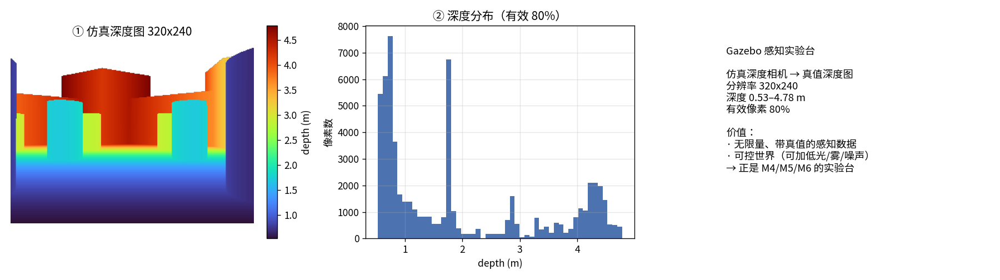

# P2 · Gazebo 感知实验台（仿真相机/深度 → 感知）

> **P2 定位修正**：此前 P2 一度偏到导航/规划（Nav2/costmap）。
> 本项目王牌是**视觉+传感器感知**（M4/M5/M6），故把 Gazebo 重新定位为
> **「感知实验台」**：在可控仿真世界里抓**带真值的相机/深度数据**。

## ① 目的

为感知方法（深度估计/3D 重建/多模态融合）提供**无限量、带真值、可控**的数据源，
与真实数据集（TUM/KITTI/SUN RGB-D）互补。

## ② 关键工程问题

1. **无 DISPLAY** → `gz sim --headless-rendering`（服务器无头渲染）。

2. **相机话题在 gz 侧**（TB3 默认 ROS bridge 没配相机）→ 用 **`gz.transport13` Python 绑定**直接订阅，比改 ROS bridge 简单。

3. 相机 gz 话题路径：
```
/world/default/model/turtlebot3_waffle/link/camera_link/sensor/intel_realsense_r200_depth/depth_image
```

## ③ 实测结果

- 相机分辨率：**320×240**
- 深度范围：**0.53 – 4.78 m**
- 有效像素占比：**79.7%**



## ④ 直白讲解

**仿真世界比真实数据多了一个东西：真值。**
在真实世界里你要花人力标深度；在 Gazebo 里，深度相机输出的**就是真值**。
所以 Gazebo 是个『永不枯竭的带真值数据工厂』——还能随手改成低光/雾天/噪声，
正好用来复现 M5 的『方法 × 环境』失效图谱。

## ⑤ 诚实边界

- 本轮打通「仿真→相机数据→可视化/统计」链路；**VGGT 重建对比为下一步**（需多帧 RGB，脚本骨架已具备）。

## 如何复现

```bash
source ~/miniforge3/etc/profile.d/conda.sh && conda activate ros2jazzy
PYTHONPATH=src python scripts/p2_gz_perception_lab.py
```
