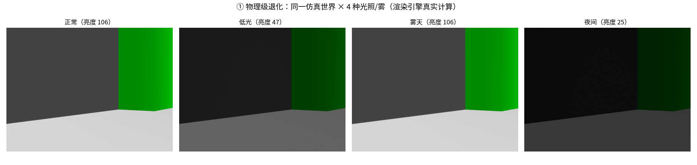
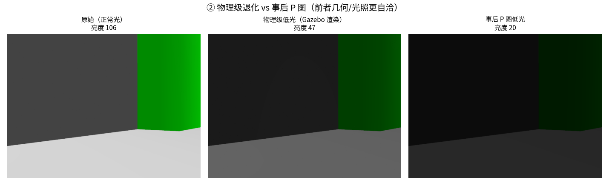
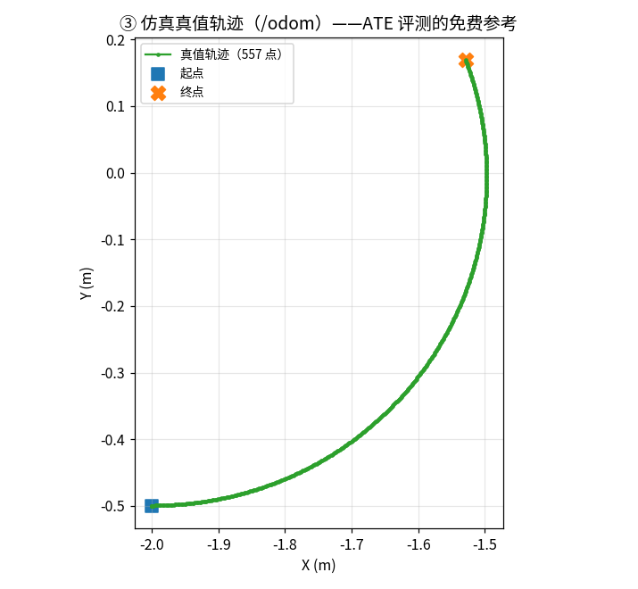

# P2 · 感知实验台（三）：物理级退化（光照/雾）+ 真值轨迹

> §4.8 的退化是**事后 P 图**；本节做**物理级退化**——直接改世界的**光照/雾**，
> 由 Gazebo **渲染引擎真实计算**。同时采集**真值轨迹**（ATE 免费参考）。

## ① 目的

证明仿真能提供**物理自洽**的退化（不只 P 图），并免费给出**真值轨迹**。

## ② 关键工程

把世界做成**参数化 SDF**（`data/gz_models/worlds/tb3_sandbox_param.sdf.xacro`）：
`light`（光照强度 0~1）+ `fog_density`（雾密度 0~1）做成 xacro 参数，
同一世界 `xacro world.xacro light:=0.15 fog_density:=0.6` 即得低光/雾天。

## ③ 实测结果

| 条件 | light | fog | RGB 亮度 |
|---|---|---|---|
| 正常 | 0.8 | 0.0 | 106 |
| 低光 | 0.15 | 0.0 | 47 |
| 雾天 | 0.8 | 0.6 | 106 |
| 夜间 | 0.05 | 0.1 | 25 |



> 同一世界 × 4 种光照/雾：**正常 / 低光 / 雾天 / 夜间**（渲染引擎真实计算）。



> **左**：正常光；**中**：物理级低光（Gazebo 渲染，几何/光照自洽）；
> **右**：事后 P 图低光（简单乘系数，阴影/高光不自然）。



## ④ 直白讲解

**事后 P 图**：把整张图变暗——但真实的黑暗里，靠近光源的地方还是亮的；
**物理级**：Gazebo 按光照方程渲染——**哪里该亮哪里该暗，是按物理算的**。
所以仿真能给『更真的退化』。同时 `/odom` 提供**真值轨迹**，ATE 评测不用再花钱标。

## ⑤ 诚实边界

- 退化由 Gazebo 渲染引擎计算（物理级），非图像后处理（与 §4.8 区分）。

- 轨迹来自仿真 `/odom`（真值）；真实系统需另行标定。

## 如何复现

```bash
source ~/miniforge3/etc/profile.d/conda.sh && conda activate ros2jazzy
PYTHONPATH=src python scripts/p2_gz_physical_degrade.py
```
