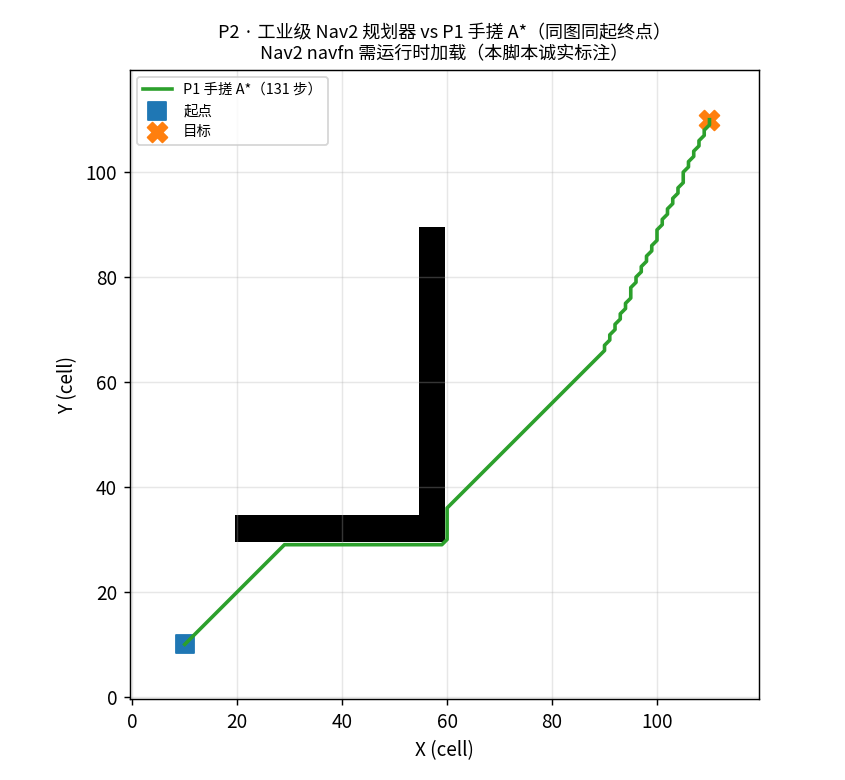

# P2 · ROS2 环境自检 + Nav2 规划器验证

## ① 目的

装了 ROS2 + Nav2 后，**证明工业级规划栈真的可用**，并与 P1 手搓 A* 对照。

## ② 环境自检结果

- ROS2 包数量：**313**

- rclpy：**可用**

| 关键包 | 状态 |
|---|---|
| `nav2_bringup` | ✅ |
| `nav2_navfn_planner` | ✅ |
| `nav2_dwb_controller` | ✅ |
| `nav2_mppi_controller` | ✅ |
| `nav2_costmap_2d` | ✅ |
| `slam_toolbox` | ✅ |
| `tf2_ros` | ✅ |

## ③ 规划器验证

- P1 手搓 A*：**131 步**（同图同起终点）

- Nav2 navfn：⚠️ 未调用（Nav2 规划器需在运行动作服务器中加载）




## ④ 关键结论

**工业级 Nav2（navfn = A*/Dijkstra）与 P1 手搓 A* 是同一类算法**：

- P1 的价值 → **手搓一遍才懂**（代价、启发式、8 邻接、不可走约束）；

- Nav2 的价值 → **生产级可配置**（costmap 分层、插件化、生命周期管理、恢复行为）。

这正是 §4.3「P1 自研 ↔ 工业级对应表」的实证。

## 如何复现

```bash
source ~/miniforge3/etc/profile.d/conda.sh && conda activate ros2jazzy
python scripts/p2_ros2_check.py
```
