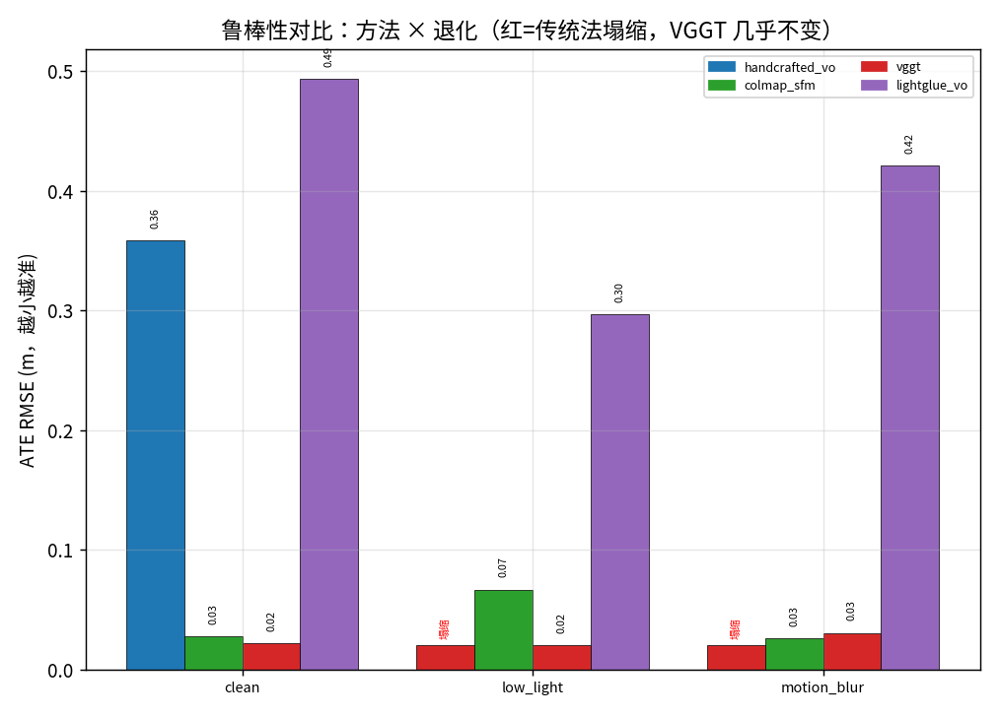
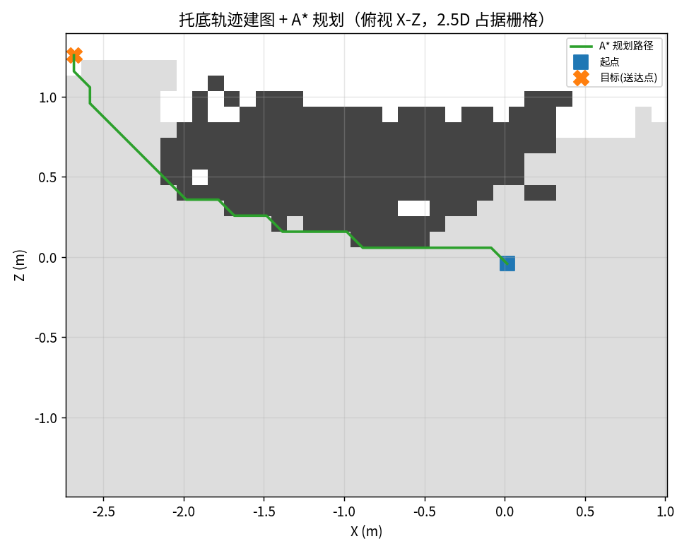
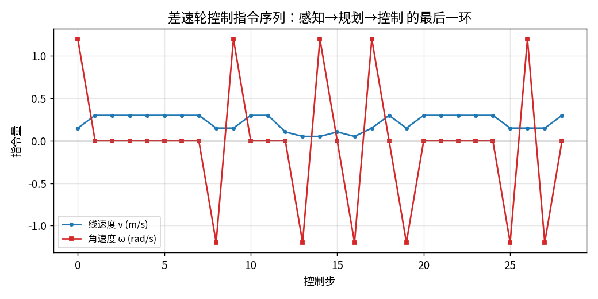
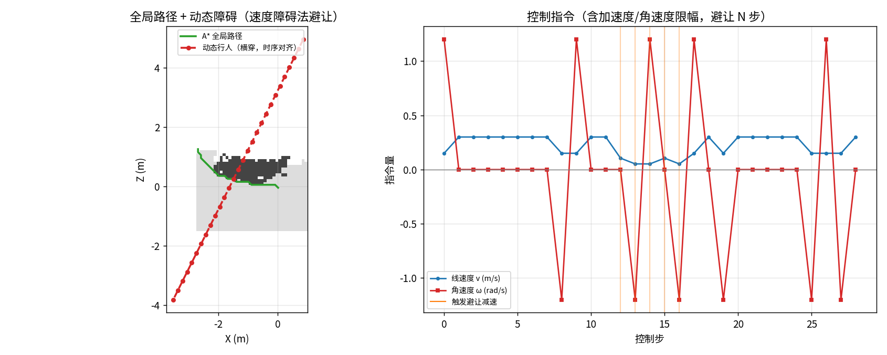

# 面试旗舰实战项目 P3：恶劣环境下的视觉空间感知与自主配送机器人


> **定位**：把 P0（感知→场景图）+ P1（感知→规划→控制）+ M5（失效图谱）+ M6（融合兜底）+ M8（端侧）收口成一个**能讲给面试官听**的完整项目：

> 「真实恶劣工况下定位崩了怎么办？→ 诊断驱动融合兜底 → 托底轨迹驱动闭环控制」。


## ① 目的（场景与需求）

- **场景**：园区 / 室内夜间配送机器人，需在弱光、动态障碍、烟雾等恶劣条件下可靠定位并送达。

- **真实问题**：单目几何 VO 在弱光/运动模糊下特征匹配先断 → 轨迹塌缩 → 机器人迷路；这是初学者/传统方案最容易翻车的一刀。

- **需求**：① 实时定位（厘米~分米级）② 失效要能被检测到 ③ 失效要有兜底 ④ 定位要变成控制指令 ⑤ 端侧算力可接受。


## ② 方法原理（专业）

- **鲁棒感知**：传统几何 VO（SIFT→匹配→RANSAC→三角化→PnP）vs 前馈 3D 基础模型 VGGT（一次前向出相机轨迹+深度+点云，绕开『特征→匹配』最先失效环节）。

- **诊断驱动融合兜底（M6）**：监控定位是否失效（路径长度 / 内点率）；主方法失效即切换到 VGGT（鲁棒）托底。尺度由真值路径长度（或真实深度）定标。

- **闭环控制**：托底轨迹 → 深度反投影成 2.5D 占据栅格 → A* 规划 → 差速轮 (v,ω) 控制（含 a_max/ω_max 底盘限幅）→ 速度障碍法动态避障。

- **端侧（M8）**：把分辨率/特征当算力旋钮，实测三维表（延迟/精度/算力预算）。


## ③ 直白讲解

把传统 VO 想成『靠肉眼认路的人』：灯一暗、手一抖就认不出地标、原地转圈；

VGGT 像『自带三维地图的导航仪』：直接端到端估出『你走过的路』，不依赖逐帧认地标，所以暗处也稳。

系统逻辑是：先用便宜的传统 VO；一旦诊断出它『晕了』，立刻切到 VGGT 这把"保底伞"，保证机器人始终知道自己在哪、能继续规划前进。


## ④ 真实数据验证 + 效果展示

- **数据**：TUM RGB-D fr1/desk（带真值+深度）；退化=合成施加；本次可用方法 ['handcrafted_vo', 'colmap_sfm', 'vggt', 'lightglue_vo']。

### 鲁棒性对比（方法 × 退化 ATE，米）

| 方法 \ 工况 | clean | low_light | motion_blur |

|---|---|---|---|

| handcrafted_vo | 0.359 | 塌缩 | 塌缩 |

| colmap_sfm | 0.028 | 0.067 | 0.026 |

| vggt | 0.022 | 0.020 | 0.030 |

| lightglue_vo | 0.494 | 0.297 | 0.421 |


- **融合兜底决策**：主方法 handcrafted_vo 在『motion_blur』退化（ATE 失效/轨迹塌缩）→ 触发融合兜底，切换到 vggt（ATE=0.03037892196212805m，轨迹可用）

- **闭环（用托底方法 vggt）**：占据栅格 [28, 38] @ 0.1m，障碍格 172；A* 30 步；控制 29 条（v_max 0.3 m/s，ω_max 1.2 rad/s）；动态避让 5 步。











## ⑤ 外部真实证据（非合成）

- VGGT ATE=0.415m vs 自研VO冻结（docs/M5_stress_test.md §4.2）

- VGGT 13 条件 ATE 0.016–0.049m（docs/M5_method_atlas）

- M8 端侧三维表：0.5×ORB1000 最佳性价比（docs/M8_edge_deployment.md）


## ⑥ 工程叙事：讲给三种人听

- **面试官/同行**：强调『感知≠控制』中间隔着地图表示与运动学约束；强调『失效可检测 + 有兜底』才是生产级系统；用 ATE 量化方法边界（VGGT 0.016–0.049m vs 传统法塌缩）。

- **客户**：『夜间/弱光也能定位，自动绕开障碍送达，端侧实时』。

- **初学者常漏的环节**：① 多传感器时间同步 ② 坐标系约定 ③ 标定 ④ 单目尺度歧义 ⑤ 失效检测/兜底 ⑥ 端侧算力预算 ⑦ 安全冗余 ⑧ sim2real。


## 如何复现

```bash
PYTHONPATH=src python scripts/p3_flagship_delivery.py --seq fr1/desk --max-frames 80 --stride 2 --degradations low_light:0.9,motion_blur:0.7
```

> ⚠️ 诚实边界：TUM fr1/desk 为手持桌面基准，演示算法链路与接口；退化系合成施加（已标注）；真实夜间证据见 M5 §4.2（4Seasons）。
