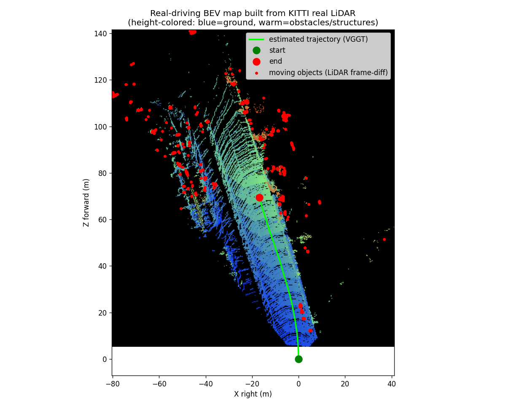
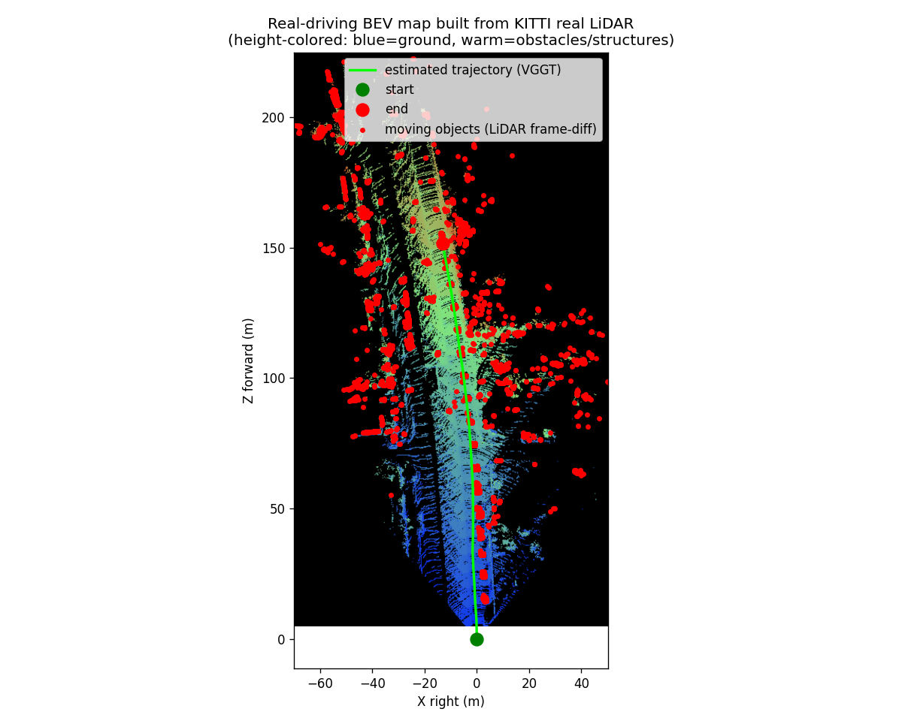
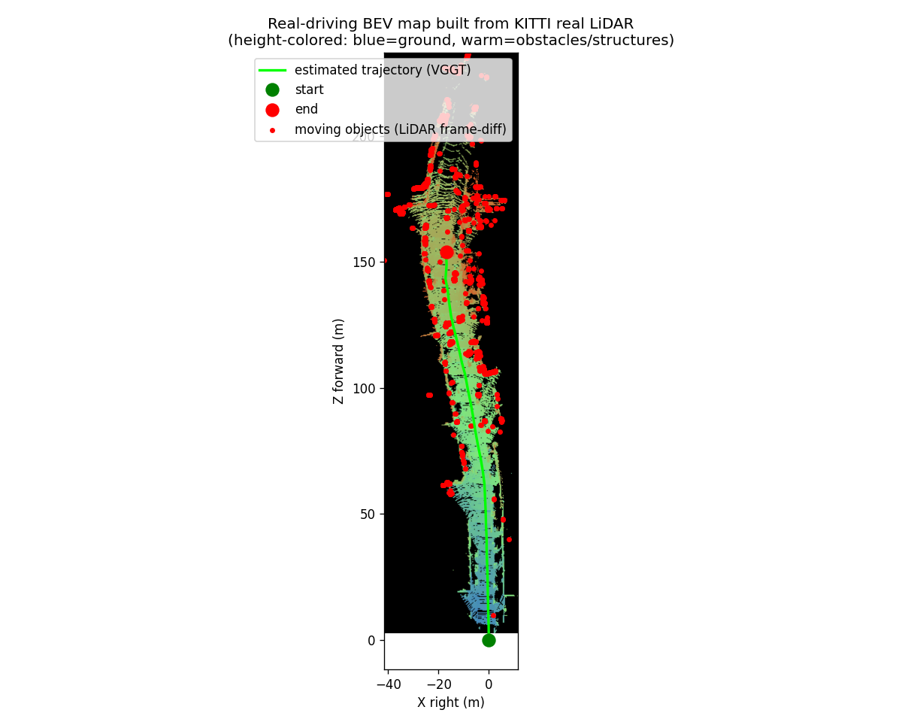

# P4 · 真实驾驶动态建图（真实 RGB + 真实 LiDAR · 双视角回放）

> **定位**：把「真实多传感器数据当实时输入」完整跑一遍
> 【真实 RGB 视觉定位（VGGT）→ 真实 LiDAR 尺度定标 → 逐帧 BEV 增量建图 → 第一视角 + 俯视全景双视角回放】。
> 数据：**KITTI depth_completion 真实街道驾驶**（已在磁盘，零下载），**非仿真、非合成退化**。

## ① 目的（场景与需求）

- **场景**：真实城市街道驾驶（两侧停车、行道树、建筑），车流真实、噪声真实。
- **真实问题**：只有 RGB 看不懂距离、只有 LiDAR 稀疏且无语义；要把「看得懂」（相机）和「量得准」（激光）
  拼成一张**随车增长的俯视全景地图**，并同步回放"车怎么开完这段路"。
- **需求**：① 视觉定位出轨迹 ② 轨迹要有度量尺度 ③ 逐帧真实 LiDAR 反投影累积成 BEV ④ 检测移动车辆/行人并标红 ⑤ 第一视角 + 俯视全景同屏回放全程。

## ② 方法原理（专业）

- **视觉定位**：项目方法动物园 **VGGT** 一次前向处理 30 帧真实 RGB → 相机轨迹 `T_cw`（up-to-scale）。
- **尺度定标**：VGGT 输出深度与真实 LiDAR 深度（`velodyne_raw`，depth = png/256 m）逐帧取 median 比
  → 全局尺度 **72.433** → VGGT 平移乘回度量级。
- **BEV 建图**：每帧真实 LiDAR 深度按内参反投影成相机系 3D 点 → 乘已定标 `T_cw` 变换到世界系
  → 逐帧增量写入 0.4 m 栅格 BEV（按高度着色：蓝=地面，暖=车/树/建筑）。
- **移动目标检测（LiDAR 帧间差分 + 自运动补偿）**：把**前序所有帧的真实 LiDAR 世界点**（同一套 VGGT
  位姿，与当前帧自洽、抗漂移）当作"静态地图"，用 KD-tree 做 **3D 邻近匹配**——当前帧世界点若能在
  静态地图中找到近邻（半径 `1.2 + 0.03·Z` m，随深度放大以容忍位姿角误差）→ 静态被解释；否则若该点
  **离地**（相机系 Y 明显小于相机离地高度 1.65 m）→ 判为**移动车辆/行人**，双视角标红。
  用 3D 邻近而非图像像素匹配，是因为逐像素深度比对会被"前景地面遮挡后方建筑"这类射线混淆。
- **双视角回放**：左=第一视角 RGB 叠真实 LiDAR 扫描（近暖远蓝）+ 移动目标（红）；右=BEV 已建地图 +
  绿色已走轨迹 + 红色车体（沿 heading，forward 朝上）+ 移动目标（红点）。

## ③ 直白讲解

车往前开：眼睛（相机）负责"认路"——VGGT 看连续画面就知道车怎么拐；
激光雷达负责"量距离"——每帧打出一束稀疏但真实的点。
把每帧量到的点按"眼睛报出的位置"拼起来，就长出一张俯视地图。
谁在动？——把之前所有帧见过的世界拼成"静态底账"，这一帧冒出来的、悬在半空的点就是会动的东西
（对面开过来的车、骑行人），视频里标成红色。
视频里左边是司机看到的画面（叠着激光打到的点，会动的东西标红），右边是这张地图随车一点点长出来、
车标沿轨迹往前走、移动目标以红点闪现。

## ④ 真实数据验证 + 效果

- 数据：KITTI depth_completion · val_selection_cropped · drive `2011_09_26_drive_0023_sync`，30 帧连续（帧距 0.6 s ≈ 18 s 行车）。
- 尺度定标因子 **72.433**（真实 LiDAR / VGGT 相对深度 median 比）。
- 轨迹长度 **125.16 m**（≈7 m/s，城市车速合理）；每帧真实 LiDAR **1.7–2.0 万点**，累计 **56.5 万点**。
- BEV 覆盖约 **150 m × 190 m**（0.4 m 栅格），街道走廊、两侧停车、行道树清晰可辨。
- **移动目标检测**：30 帧共检出 **1 743 个移动点**（均值 ≈58 点/帧，逐帧 0–350），
  红色标注出现在对向车道/前方路口等真实来车方向；终图中以红点散布沿行驶走廊。


- 视频：`driving_dualview.mp4`（1946×400 @3 fps，10 s，半速播放）；关键帧 `figs/frame_*.png`（11 张，约每 3 帧一张）；终图 `figs/bev_final_map.png`。

### 多场景 demo（4 条不同街道，同一套管线）

同一条 `p4_real_driving.py` 换 `--drive` 即可跑任意真实驾驶片段；产物按 `--out` 独立成目录，
证明流程**不是为某一条街调参的特例**。全部 30 帧 / 10 s / 半速。

| 场景 | drive | 轨迹 | 真实 LiDAR 点 | 移动目标点（红） | 说明 |
|---|---|---|---|---|---|
| 街道（默认） | `0023` | 125.16 m | 56.5 万 | 1 743 | 城市街道，两侧停车+行道树 |
| 短程居民区 | `0002` | 71.87 m | 22.6 万 | 1 187 | 距离最短 |
| 长程 · 车流多 | `0013` | 152.62 m | 40.4 万 | **4 771** | 移动目标最密（对向车流多） |
| 长程 · 商业区 | `0095` | 155.52 m | 55.3 万 | 2 281 | 轨迹最长 |

| 双视角回放 | BEV 终图 |
|---|---|
|  |  |
|  |  |
|  |  |
|  |  |

每条 drive 的完整产物：`drives/<drive>/`（`driving_dualview.mp4` + `figs/driving_dualview.gif` + 11 张 `frame_*.png` + `figs/bev_final_map.png` + `metrics.json`）。

## 诚实边界

- 轨迹来自 **VGGT 视觉定位**，非 GPS/IMU 真值；该基准**无逐帧真值位姿 → 不报 ATE**（本 demo 定位是"真实数据上的系统构建"，不是"带真值评测"）。
- 尺度由**真实 LiDAR 深度**锚定（median 比），非 IMU/轮速。
- val_selection 为抽帧序列（帧距 0.6 s），非满帧率 10 Hz；LiDAR 为 `velodyne_raw` 真实稀疏扫描（已投影到 image_02 平面）。
- **移动目标检测为启发式**（静态地图差分 + 离地约束），非检测器 benchmark：远处新揭示的静态结构
  （树冠/建筑边缘）与位姿漂移可能被误标为移动；匹配半径随深度放大（1.2+0.03·Z m）是为容忍漂移的折中。
- 「雷达」= 激光雷达 LiDAR（该数据集无毫米波 radar）。

## 复现

```bash
# 默认场景
PYTHONPATH=src python scripts/p4_real_driving.py --drive 2011_09_26_drive_0023_sync --max-frames 30

# 换场景（产物分目录）
PYTHONPATH=src python scripts/p4_real_driving.py --drive 2011_09_26_drive_0095_sync \
    --max-frames 30 --fps 3.0 --out experiments/P4_real_driving/drives/2011_09_26_drive_0095_sync
```

（需 GPU + 本地 VGGT-1B 权重 `~/models/vggt-1b`；数据已在 `data/raw/ms/OmniData__KITTI_depth_completion/`）
