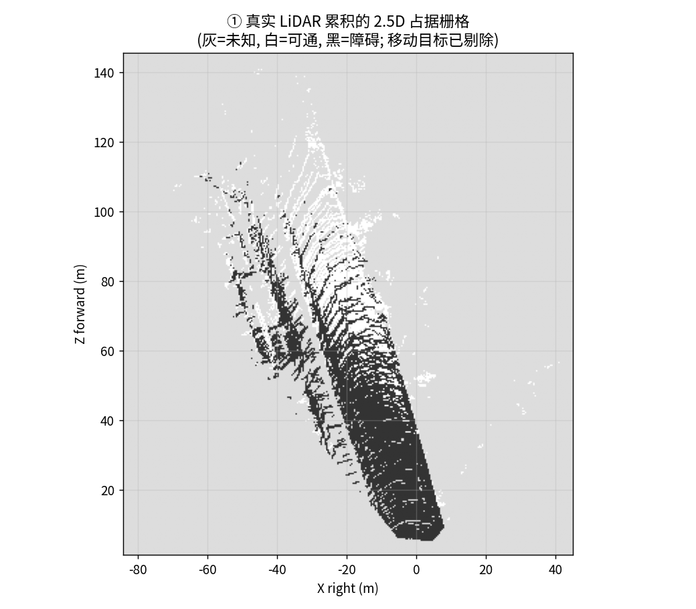
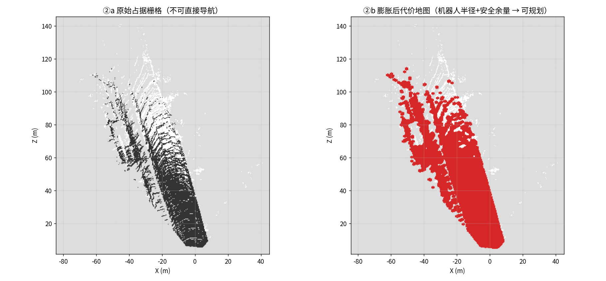
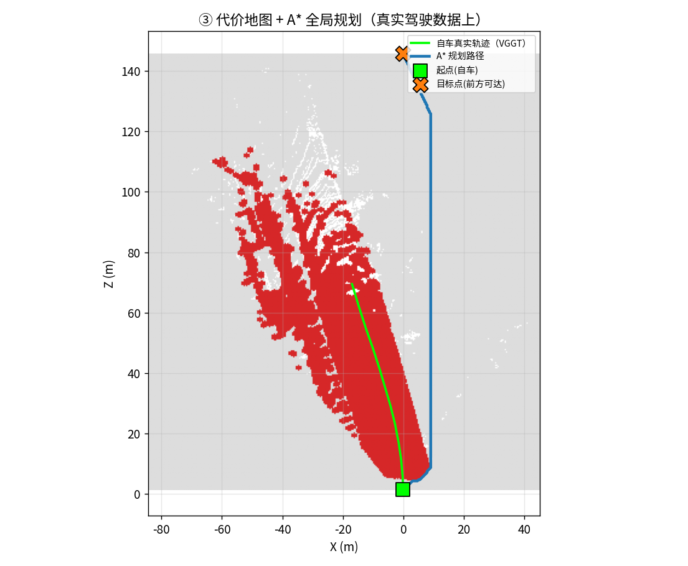
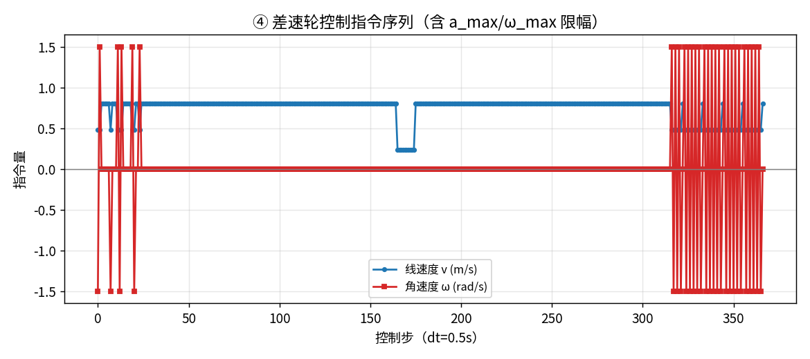
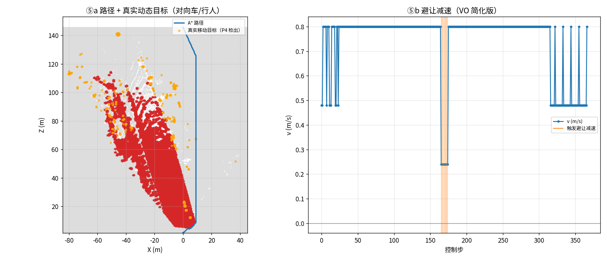

# P5 · 真实驾驶端到端闭环：感知 → 建图 → 规划 → 控制

> **定位**：把 `P4`（真实驾驶 感知→建图，**前半段**）接上 `P3`/`F6`（规划→控制，**后半段**），
> 在**同一份真实驾驶数据**上跑通全链路——补上 P4 明确缺的那一环。

> 数据：KITTI depth_completion (val_selection_cropped, image_02)（drive `2011_09_26_drive_0002_sync`，12 帧真实驾驶，零下载）。


## ① 目的（场景与需求）

- **场景**：真实城市街道驾驶（KITTI），自车需要沿走廊前进并避开对向车/行人。

- **真实问题**：P4 能建出地图，但**地图 ≠ 决策**——原始占据栅格没有膨胀、没有机器人几何约束，
  不能直接规划；中间缺「inflation → 规划 → 控制」这条链。

- **需求**：① 真实 LiDAR 建图 ② 剔除移动目标（否则地图留幽灵）③ 膨胀成规划用代价地图 
 ④ A* 规划 ⑤ 差速轮控制 ⑥ 用真实检出的动态目标做避让。


## ② 方法原理（专业）

- **感知前端（复用 P4）**：真实 RGB → VGGT 位姿；真实 LiDAR 深度定标 → 世界点云；KD-tree 帧间差分检出移动目标。

- **建图（本模块）**：世界点云 → 2.5D 占据栅格（地面=可通/障碍=占据），**移动目标格直接剔除**。

- **inflation**：按 `机器人半径 + 安全余量` 形态学膨胀障碍 → 规划用代价地图（**这是「地图能不能导航」的分水岭**）。

- **规划**：A* 在代价地图上求 8 邻域最短路径（起点=自车，目标=前方最远可达点）。

- **控制**：路径 → 差速轮 `(v, ω)` 序列，含 `a_max`/`ω_max` 限幅与转弯降速。

- **避障**：用 P4 检出的真实移动目标点，沿路径前瞻检测 → 触发 VO 式减速（反应式）。


## ③ 直白讲解

P4 给了你一张「车走出来的俯视图」，但那只是「照片」——车不能照着照片开。

P5 做三件事：**先把障碍物按车宽「撑胖」一圈**（不然算出来的路会贴着墙，真车过不去）；

**再用 A* 找一条从当前位置到前方的可行路线**；**最后把它翻译成左右轮转速**。

路上遇到 P4 标红的那辆对向车，就减速让行。这就从「看得见」走到了「能行动」。


## ④ 真实数据验证 + 效果

- 真实 LiDAR 点：**225904**；
移动目标点：**1187**。

- 占据栅格 **[362, 324] @ 0.4m**：
障碍格 **9147**、可通格 **5398**、
剔除移动格 **2962**。

- 膨胀（半径 **0.5m** + 余量 **0.3m**）：
新增不可通行格 **8029**。

- 闭环：A* **368** 步 / 路径长 **153.44m**；
控制 **367** 条（v_max 0.8 m/s，ω_max 1.5 rad/s）；
避让 **10** 步；动态目标点 **1187**。













## ⑤ 与 P4 的分工

| | P4 | P5（本篇） |
|---|---|---|

| 覆盖 | 感知→定位→建图→可视化（前半段） | 建图→inflation→规划→控制（后半段） |

| 产物 | 地图 + 双视角回放视频 | 代价地图 + A* 路径 + 控制指令 |

| 输入 | 真实 KITTI RGB + LiDAR | **复用 P4 的建图结果** |


## ⑥ 工程叙事：讲给三种人听

- **面试官/同行**：强调「**地图 ≠ 决策**」——原始占据栅格必须经过 inflation（机器人几何约束）才能规划；
  强调「**动态物体不能进静态地图**」（否则留下幽灵障碍）；强调「感知→控制的接口是代价地图 + 运动学约束」。

- **客户**：「真实驾驶数据进去，出来的是一条可执行的路线和轮速指令，还会给对向车让行。」

- **初学者常漏的环节**：① inflation 半径与机器人几何 ② 膨胀后可能「堵死」窄通道 ③ 控制限幅
  （加速度/角速度超限真车会打滑/翻）④ 地图有漂移但规划局部仍可用 ⑤ 位姿估计误差 ≠ 地图误差。


## 如何复现

```bash
PYTHONPATH=src python scripts/p5_real_driving_closed_loop.py \
    --drive 2011_09_26_drive_0002_sync --max-frames 30
```

> ⚠️ 诚实边界：真实 RGB + 真实 LiDAR 输入（P4 前端）；BEV 占据栅格由真实 LiDAR 累积并剔除移动目标；inflation 后 A* 规划 + 差速轮控制 + VO 简化避障。自车运动的『执行』为运动学仿真；地图来自视觉估计（无真值位姿），非带真值闭环评测。
