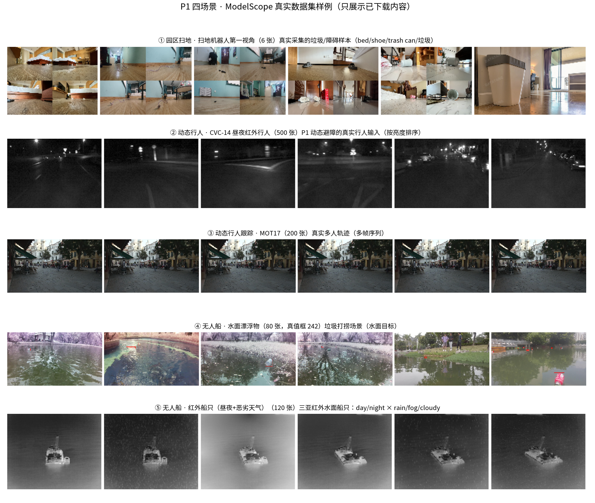

# P1 四场景 · 真实数据集样例

> 把 `docs/P1_field_projects.md` 的四个真实场景，从「讲故事」落到「看得见的真实素材」。

## 各场景数据落地情况

| 场景 | 数据集 | 已下载张数 | 说明 |
|---|---|---|---|
| ① 园区扫地 · 扫地机器人第一视角 | DatatangBeijing/...RobotCleaner... | 6 | 扫地机器人真实视角的垃圾/障碍样本 |
| ② 动态行人 · CVC-14 昼夜红外行人 | OmniData/CVC-14 | 500 | 昼夜/红外行人，园区夜巡真实输入 |
| ③ 动态行人跟踪 · MOT17 | OpenDataLab/MOT17 | 200 | 真实多人多帧序列，可替换 P1 模拟行人 |
| ④ 无人船 · 水面漂浮物 | isLinXu/rf100-vl-floating-waste | 80 | 无人船垃圾打捞场景（公开可下） |
| ⑤ 无人船 · 红外船只（昼夜+恶劣天气） | Flier123/Ship | 120 | 三亚红外船只：昼夜 × 雨雾多云（公开可下） |



## 诚实声明

- 只展示**已实际下载**的数据；未下载的整块标注「未下载」，绝不伪造。

- 样例为**数据集真实图像**，非本项目采集，仅用于说明「每个场景长什么样」。

- 下一步：把 MOT17 的真实行人轨迹接入 P1 的 `dynamic_obstacles`，替代模拟行人。

## 复现

```bash
PYTHONPATH=src python scripts/p1_datasets_showcase.py
```
