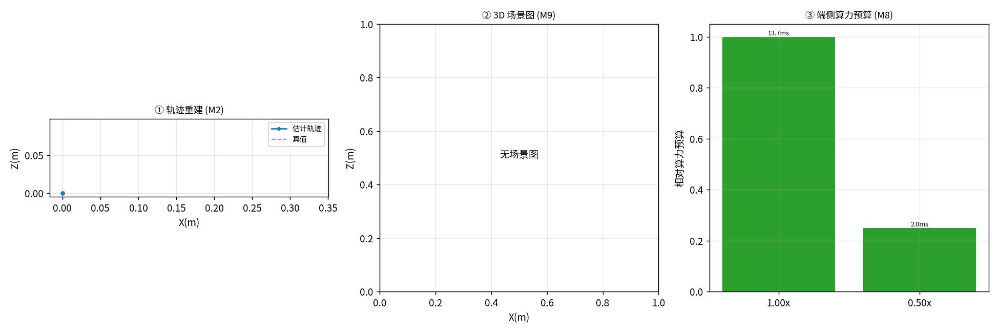

# 实战项目：自动驾驶感知栈（恶劣天气）

> 知识落点（M0–M9 → 实战）：驾驶场景无深度传感器、且夜间退化严重，正对应 M5(失效图谱) 与 M6(融合救援) 的命题：单目 VO 在夜间易退化，项目用 GNSS 真值量化『VO 在真实恶劣天气掉多少』，并演示 M6 思路（需 IMU/多传感器融合补几何）。场景图给出道路物体空间分布，端侧预算呼应车载算力约束。

**数据集**：4Seasons oldtown_night（本地已下，GNSS 真值，夜间退化）  
**序列规模**：180 帧 | 场景标签 `driving` | 深度=无 | 真值=有

## 工序链（因果自洽）

| 工序 | 模块 | 状态 | 关键指标 | 说明 |
|---|---|---|---|---|
| vo | M2 | OK | ATE(自由尺度)=Nonem, 39.2fps | 单目 VO 产出 up-to-scale 轨迹（180 帧有效），ATE 跳过（真值对齐退化，不可信） |
| semantic | M7 | 跳过 | 检测数=None（几何） | 降级：场景图使用几何标签 object |
| scene_graph | M9 | 跳过 | 物体实例=None（原始候选 None） | 单目 VO 在退化/弱纹理场景塌缩，场景图无法构建（对应 M6：需 IMU/深度/多模态融合兜底） |
| edge | M8 | OK | 1.0x→1.0预算/13.7ms/OK; 0.5x→0.25预算/2.0ms/OK | 端侧算力预算曲线（分辨率↓ → 算力预算↓，越过悬崖则 VO 失效） |



## 端侧算力预算曲线（M8）

| 分辨率 | 相对算力预算 | 单帧延迟 | fps | ATE(m) | 状态 |
|---|---|---|---|---|---|
| 1.0x | 1.0 | 13.7ms | 73.2 | 0.0 | OK |
| 0.5x | 0.25 | 2.0ms | 511.1 | 0.0 | OK |

## 如何复现

```bash
PYTHONPATH=src python scripts/run_project.py --project autonomous_driving
```

> 本框架与数据来源解耦：任何新公开数据集只要能归一成 `Sequence(rgbs, K, depths, gt_positions)`，即可接入全部 M0–M9 工序。
