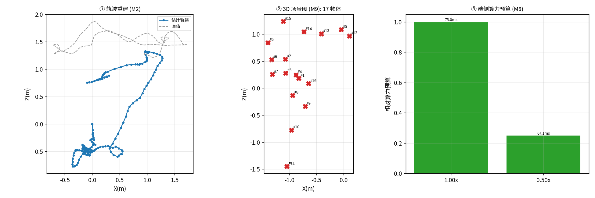

# 实战项目：室内机器人语义建图与导航

> 知识落点（M0–M9 → 实战）：把 M2(VO)→M4(深度定尺度)→M7(开放词汇语义)→M9(场景图)→M8(端侧预算) 串成一条室内机器人『先建图、再理解、最后能上端侧』的链路：VO 给出 up-to-scale 轨迹，深度传感器把尺度锚定到公制，开放词汇检测给物体贴自然语言标签，场景图把世界解构成『N 个物体在该坐标』，端侧预算曲线回答『能不能实时跑在机器人板子上』。

**数据集**：TUM RGB-D fr1/desk（本地已下载，含深度+真值位姿）  
**序列规模**：199 帧 | 场景标签 `indoor` | 深度=有 | 真值=有

## 工序链（因果自洽）

| 工序 | 模块 | 状态 | 关键指标 | 说明 |
|---|---|---|---|---|
| vo | M2 | OK | ATE(自由尺度)=0.6428m, 10.4fps | 单目 VO 产出 up-to-scale 轨迹（199 帧有效），自由尺度 ATE=0.643m |
| depth | M4 | OK | 尺度=0.3467, ATE(公制)=0.6865m | 以度量源标定尺度系数=0.347 → 公制 ATE=0.686m（数据集自带深度可直接提供该尺度） |
| semantic | M7 | 跳过 | 检测数=None（几何） | 降级：场景图使用几何标签 object |
| scene_graph | M9 | OK | 物体实例=17（原始候选 19） | 解构出 17 个 3D 物体实例（几何标签；启用 OWL-ViT 得语义标签） |
| edge | M8 | OK | 1.0x→1.0预算/75.0ms/OK; 0.5x→0.25预算/67.1ms/OK | 端侧算力预算曲线（分辨率↓ → 算力预算↓，越过悬崖则 VO 失效） |



## 端侧算力预算曲线（M8）

| 分辨率 | 相对算力预算 | 单帧延迟 | fps | ATE(m) | 状态 |
|---|---|---|---|---|---|
| 1.0x | 1.0 | 75.0ms | 13.3 | 0.5381 | OK |
| 0.5x | 0.25 | 67.1ms | 14.9 | 0.4502 | OK |

## 解构出的 3D 场景图（M9）

| ID | 标签 | 质心(m) | 跨帧出现次数 |
|---|---|---|---|
| #6 | object | (-1.33,-0.35,+0.53) | 2 |
| #8 | object | (-0.94,-0.21,-0.13) | 2 |
| #0 | object | (-0.04,+0.00,+1.08) | 1 |
| #1 | object | (-0.83,+0.46,+0.18) | 1 |
| #2 | object | (-1.08,-0.01,+0.54) | 1 |
| #3 | object | (-1.07,+0.15,+0.28) | 1 |
| #4 | object | (-0.88,-0.33,+0.25) | 1 |
| #5 | object | (-1.40,-0.64,+0.84) | 1 |
| #7 | object | (-1.32,-0.31,+0.26) | 1 |
| #9 | object | (-0.71,+0.14,-0.34) | 1 |
| #10 | object | (-0.96,+0.01,-0.78) | 1 |
| #11 | object | (-1.04,+0.17,-1.45) | 1 |

## 如何复现

```bash
PYTHONPATH=src python scripts/run_project.py --project indoor_mapping
```

> 本框架与数据来源解耦：任何新公开数据集只要能归一成 `Sequence(rgbs, K, depths, gt_positions)`，即可接入全部 M0–M9 工序。
