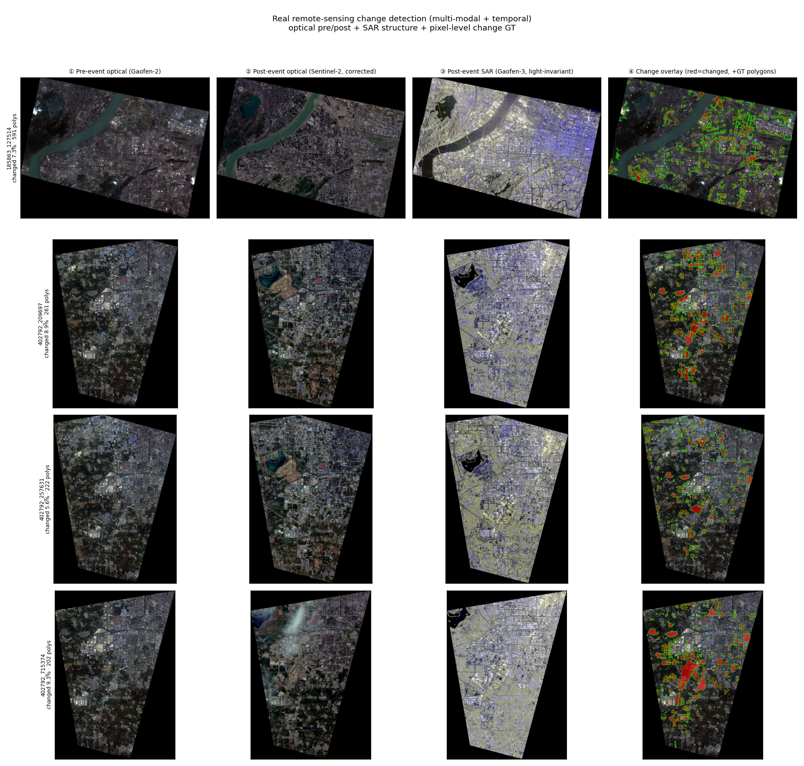

# D-showcase · 真实遥感变化检测（multi-modal + temporal）

## 1. 一句话
用已经下载的真实遥感数据集，把"事前光学 / 事后光学 / 事后 SAR / 二值变化图 / 多边形真值"五路数据对齐可视化，说明：
**变化检测本身就是多模态融合 + 时序 3D 场景理解的前置能力**。

## 2. 复现命令

```bash
conda activate wildspatial
PYTHONPATH=src python scripts/d_showcase_remote_sensing.py
```

## 3. 数据位置

```
data/raw/ms/Mriris__remote-sensing-change-detection/
  A/  高分二号 事前光学（基准）
  B/  高分三号 事后 SAR（光照不变、穿云能力强）
  C/  哨兵二号 原始事后光学
  D/  哨兵二号 相对辐射校正后事后光学
  E/  黑白二值变化图（像素级真值）
  json/  Labelme 多边形变化标注（label=changed）
```

## 4. 结果

**`figs/remote_sensing_cd.png`**：4 组样本 × 4 面板
| ① Pre-event optical | ② Post-event optical | ③ Post-event SAR | ④ Change overlay（red=changed, green=GT polygons）|
|---|---|---|---|



**`metrics.json`**（4 帧统计）：

| 样本 | 变化像素占比 | GT 变化多边形数 |
|---|---|---|
| 185863_127514 | 7.3% | 591 |
| 402792_209697 | 8.9% | 261 |
| 402792_257631 | 5.6% | 222 |
| 402792_715374 | 9.3% | 202 |

> 说明：SAR（B）在原始尺寸上比光学少 1 像素（3137 vs 3138），脚本将其统一缩放到显示分辨率，不影响目视解释。

## 5. 教学意义

- **M6 多模态融合**：光学 + SAR 是典型异构传感器融合——光学有纹理但受云/光照影响；SAR 全天候但纹理不同，二者互补。
- **M9 综合闭环 / 时序**：变化检测把"同一地点不同时间"的观测变成"新增/消失/改变的地物"，是"解构世界"的时序版本。
- **F5 视觉+雷达融合**：这里的 SAR 可类比车载 LiDAR——都是几何/结构传感器，帮助光学在退化条件下补全信息。

## 6. 局限与诚实声明

- 本 showcase 仅做**对齐可视化 + 简单统计**（变化占比、多边形数），未跑变化检测模型；后续可接语义分割/变化检测网络做定量。
- 数据已配准裁剪，但各传感器分辨率/成像几何仍有差异，消费前需统一分辨率与投影坐标系；展示图已缩放到同尺寸，仅作示意。
